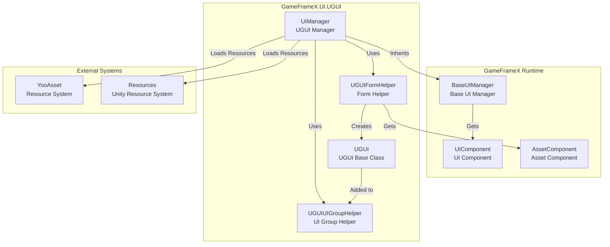
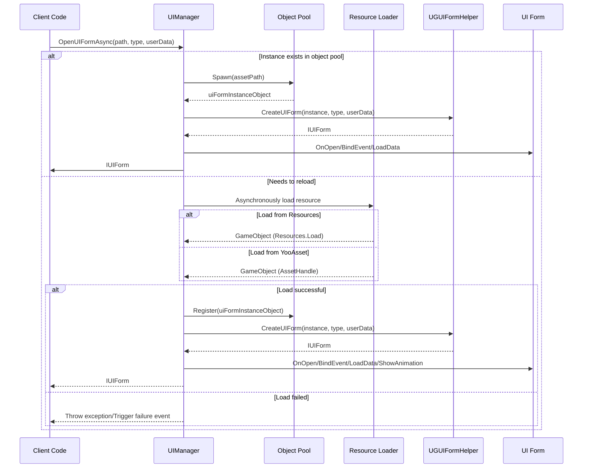
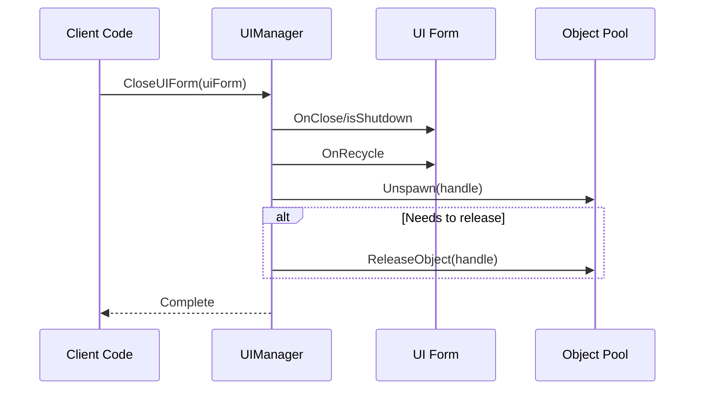

# UI Manager

The UI Manager (UIManager) is the core component of the GameFrameX UGUI plugin, responsible for managing the complete lifecycle of UI forms, including form loading, display, hiding, closing, and recycling.

## Overview

UIManager is the central component of the entire UI system. It inherits from `BaseUIManager` and provides complete UI form management functionality. The manager supports loading UI forms asynchronously from Resources or YooAsset asset packages, and implements an object pooling mechanism to optimize memory usage.

### Core Responsibilities

- **Form Lifecycle Management**: Responsible for UI form lifecycle operations such as opening, closing, showing, and hiding
- **Resource Loading**: Supports asynchronously loading UI forms from Resources and YooAsset asset packages
- **Object Pool Management**: Uses object pooling to cache closed UI form instances, reducing resource loading overhead
- **Event Callbacks**: Provides complete event callback mechanisms for notifying success or failure of form open/close
- **UI Group Management**: Manages hierarchy and display order of multiple UI groups

### Design Intent

UIManager uses an asynchronous loading mode to avoid blocking the main thread, improving user experience. The object pooling mechanism effectively reduces memory fragmentation and performance overhead caused by frequent UI form instantiation. The event-driven design pattern decouples UI logic from business logic, making maintenance and extension easier.

## Architecture



### Component Description

| Component | Namespace | Description |
|------|----------|------|
| UIManager | GameFrameX.UI.UGUI.Runtime | UGUI form manager, responsible for form lifecycle management |
| UGUIFormHelper | GameFrameX.UI.UGUI.Runtime | Form helper, handles UI form instantiation and creation |
| UGUIUIGroupHelper | GameFrameX.UI.UGUI.Runtime | UI group helper, manages UI group depth and hierarchy |
| UGUI | GameFrameX.UI.UGUI.Runtime | UGUI form base class, inherits from UIForm |

## Form Open Flow

One of UIManager's core functions is asynchronously opening UI forms. Here is the complete flow for opening a form:



### Detailed Flow Description

1. **Check Object Pool**: First check if there's a reusable UI instance in the object pool
2. **Resource Loading**: If no instance is available in the pool, asynchronously load the resource
3. **Resource Source Determination**: Determine loading from Resources or YooAsset package based on path
4. **Create UI Form**: Use UGUIFormHelper to create UI form instance
5. **Initialize UI**: Call the form's OnOpen, BindEvent, LoadData, and other methods
6. **Play Animation**: If show animation is enabled, play the animation
7. **Event Callback**: Trigger open success event

> Source: [UIManager.Open.cs](https://github.com/GameFrameX/com.gameframex.unity.ui.ugui/blob/main/Runtime/UIManager.Open.cs#L78-L115)

## Form Close and Recycle

When closing a UI form, UIManager decides whether to recycle the instance or destroy it based on configuration:



> Source: [UIManager.Close.cs](https://github.com/GameFrameX/com.gameframex.unity.ui.ugui/blob/main/Runtime/UIManager.Close.cs#L50-L67)

## Core Methods

### InnerOpenUIFormAsync

The core method for asynchronously opening UI forms.

```csharp
protected override async Task<IUIForm> InnerOpenUIFormAsync(
    string uiFormAssetPath,  // UI resource path
    Type uiFormType,         // UI form type
    bool pauseCoveredUIForm, // Whether to pause covered forms
    object userData,         // User custom data
    bool isFullScreen = false // Whether to display full screen
)
```

> Source: [UIManager.Open.cs](https://github.com/GameFrameX/com.gameframex.unity.ui.ugui/blob/main/Runtime/UIManager.Open.cs#L78-L115)

**Implementation Logic**:

1. Check if an instance already exists in the object pool; if so, use it directly
2. Otherwise, call `InnerLoadUIFormAsync` to asynchronously load resources
3. Determine whether to load from Resources or YooAsset package based on resource path
4. After successful loading, create UI form and initialize
5. Trigger open success event callback

### InnerLoadUIFormAsync

Asynchronously loads UI form resources.

```csharp
private async Task<IUIForm> InnerLoadUIFormAsync(
    string uiFormAssetPath,
    Type uiFormType,
    bool pauseCoveredUIForm,
    object userData,
    bool isFullScreen,
    string uiFormAssetName,
    string assetPath
)
```

> Source: [UIManager.Open.cs](https://github.com/GameFrameX/com.gameframex.unity.ui.ugui/blob/main/Runtime/UIManager.Open.cs#L131-L163)

**Resource Loading Logic**:

```csharp
// Determine if resource path contains "Bundles" directory
if (uiFormAssetPath.IndexOf(Utility.Asset.Path.BundlesDirectoryName, StringComparison.OrdinalIgnoreCase) < 0)
{
    // Load from Resources
    var original = (GameObject)Resources.Load(assetPath);
    var gameObject = UnityEngine.Object.Instantiate(original);
}
else
{
    // Load from YooAsset package
    var assetHandle = await m_AssetManager.LoadAssetAsync<UnityEngine.Object>(assetPath);
    var gameObject = assetHandle.InstantiateSync();
}
```

> Source: [UIManager.Open.cs](https://github.com/GameFrameX/com.gameframex.unity.ui.ugui/blob/main/Runtime/UIManager.Open.cs#L137-L162)

### RecycleUIForm

Recycles UI form instance objects.

```csharp
protected override void RecycleUIForm(IUIForm uiForm, bool isDispose = false)
{
    uiForm.OnRecycle();
    var formHandle = uiForm.Handle as GameObject;

    m_InstancePool.Unspawn(uiForm.Handle);

    if (isDispose)
    {
        m_InstancePool.ReleaseObject(uiForm.Handle);
    }
}
```

> Source: [UIManager.Close.cs](https://github.com/GameFrameX/com.gameframex.unity.ui.ugui/blob/main/Runtime/UIManager.Close.cs#L52-L67)

## Form Helper

UGUIFormHelper is responsible for UI form instantiation, creation, and release.

### Creating UI Forms

```csharp
public override IUIForm CreateUIForm(object uiFormInstance, Type uiFormType, object userData)
{
    var uiGameObject = uiFormInstance as GameObject;

    // Add UI form script component
    var componentType = uiGameObject.GetOrAddComponent(uiFormType);

    // Call OnAwake for initialization
    if (uiForm.IsAwake == false)
    {
        uiForm.OnAwake();
    }

    // Get UI group based on attribute
    var attribute = uiFormType.GetCustomAttribute(typeof(OptionUIGroupAttribute));
    if (attribute is OptionUIGroupAttribute optionUIGroup)
    {
        uiGroup = m_UIComponent.GetUIGroup(optionUIGroup.GroupName);
    }

    // Set parent object
    uiTransform.SetParent(helper.transform);
    uiTransform.localScale = Vector3.one;

    return uiForm;
}
```

> Source: [UGUIFormHelper.cs](https://github.com/GameFrameX/com.gameframex.unity.ui.ugui/blob/main/Runtime/UGUIFormHelper.cs#L92-L164)

### Releasing UI Forms

```csharp
public override void ReleaseUIForm(
    object uiFormAsset,
    object uiFormInstance,
    object assetHandle,
    string uiFormAssetPath,
    string uiFormAssetName)
{
    if (!m_UIComponent.EnableAutoReleaseUIForm)
    {
        return;
    }

    // Determine resource type based on path and unload
    if (uiFormAssetPath.IndexOf(Utility.Asset.Path.BundlesDirectoryName, StringComparison.OrdinalIgnoreCase) >= 0)
    {
        m_AssetComponent.UnloadAsset(uiFormAssetPath);
    }
    else
    {
        UnityEngine.Resources.UnloadAsset((Object)uiFormInstance);
    }

    Destroy((Object)uiFormInstance);
}
```

> Source: [UGUIFormHelper.cs](https://github.com/GameFrameX/com.gameframex.unity.ui.ugui/blob/main/Runtime/UGUIFormHelper.cs#L177-L195)

## UI Group Helper

UGUIUIGroupHelper is responsible for managing UI group hierarchy and depth.

```csharp
public override void SetDepth(int depth)
{
    Depth = depth;
    // Depth control through Z-axis position adjustment
    transform.localPosition = new Vector3(0, 0, depth * 1000);
}

public override IUIGroupHelper Handler(
    Transform root,
    string groupName,
    string uiGroupHelperTypeName,
    IUIGroupHelper customUIGroupHelper,
    int depth = 0)
{
    SetDepth(depth);

    // Create UI group container
    GameObject component = new GameObject();
    component.name = groupName;
    component.transform.SetParent(root, false);

    // Set UI layer
    var uiLayer = LayerMask.NameToLayer("UI");
    component.SetLayerRecursively(uiLayer);

    // Create full-screen RectTransform
    RectTransform rectTransform = component.GetOrAddComponent<RectTransform>();
    rectTransform.MakeFullScreen();

    return uiGroupHelper;
}
```

> Source: [UGUIUIGroupHelper.cs](https://github.com/GameFrameX/com.gameframex.unity.ui.ugui/blob/main/Runtime/UGUIUIGroupHelper.cs#L64-L105)

## Usage Examples

### Opening a UI Form

```csharp
// Get UI component
var uiComponent = GameEntry.GetComponent<UIComponent>();

// Asynchronously open UI form
var uiForm = await uiComponent.OpenUIFormAsync("UI/MainMenu", typeof(MainMenuUI), false, null);
```

### Closing a UI Form

```csharp
// Close the specified UI form
uiComponent.CloseUIForm(uiForm);
```

### Using UI Group Attribute

```csharp
// Assign UI form to a UI group
[OptionUIGroup("DialogGroup")]
public class DialogUI : UGUI
{
    // UI form logic
}
```

> Source: [UGUIFormHelper.cs](https://github.com/GameFrameX/com.gameframex.unity.ui.ugui/blob/main/Runtime/UGUIFormHelper.cs#L117-L124)

### Using Show Animation Attribute

```csharp
// Assign show animation to UI form
[OptionUIShowAnimation(true, "FadeIn")]
[OptionUIHideAnimation(true, "FadeOut")]
public class MainMenuUI : UGUI
{
    // UI form logic
}
```

> Source: [UGUIFormHelper.cs](https://github.com/GameFrameX/com.gameframex.unity.ui.ugui/blob/main/Runtime/UGUIFormHelper.cs#L126-L146)

## Related Links

- [UGUI Base Class](./06.ugui-base.md) - Detailed documentation for UGUI form base class
- [Form Helper](./08.form-helper.md) - Detailed documentation for form helper
- [UIImage Component](./09.uiimage.md) - Enhanced image component
- [Extension Methods](./12.extensions.md) - UGUI component extension methods
- [Official Documentation](https://gameframex.doc.alianblank.com)
- [GitHub Repository](https://github.com/GameFrameX/com.gameframex.unity.ui.ugui)
