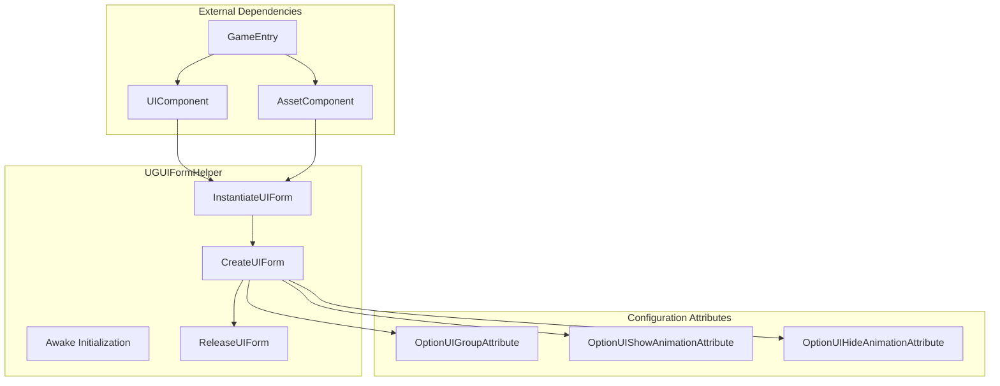
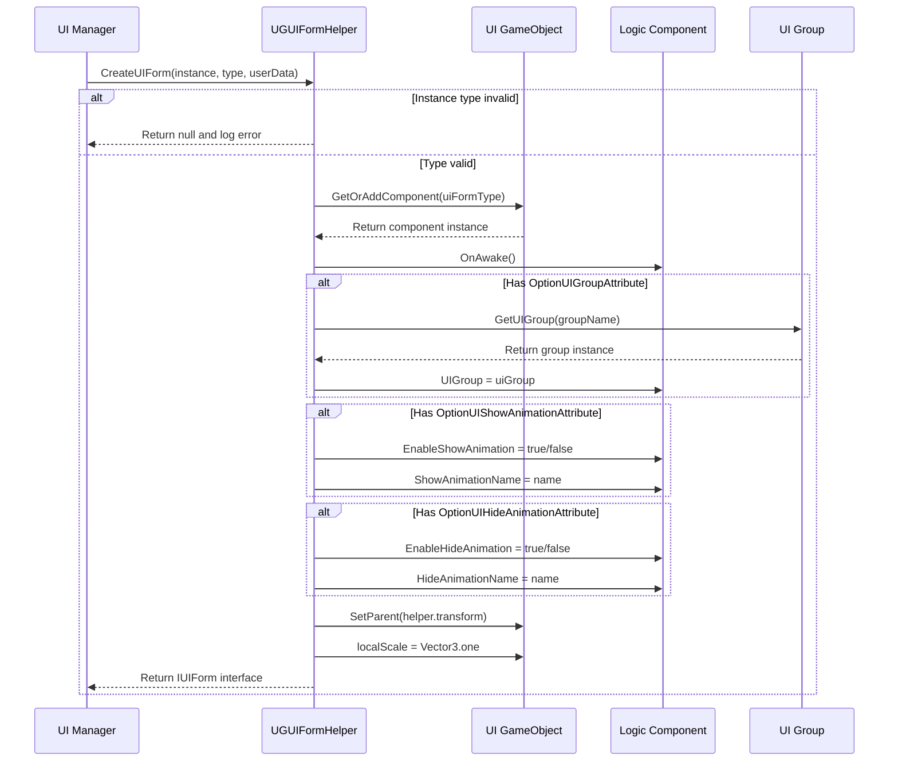

# Form Helper

The Form Helper is the core component in the GameFrameX UGUI system responsible for UI form instantiation, creation, and release. It acts as a bridge between the UI manager and actual UI resources, encapsulating all low-level logic for form creation.

## Overview

`UGUIFormHelper` is the default form helper for UGUI forms, inheriting from the `UIFormHelperBase` abstract class. It assumes three core responsibilities:

1. **Instantiate Forms**: Load UI resources into usable GameObject instances
2. **Create Forms**: Add logic components to instances, set groups, configure animations, etc.
3. **Release Forms**: Unload resources and destroy instances

By using the form helper, the UI management system can decouple UI resource loading methods from business logic, allowing the system to support different resource loading methods (such as AssetBundle, Resources, etc.).

> Note: The `UIFormHelperBase` abstract class is defined in the `GameFrameX.UI.Runtime` package and belongs to the framework's base UI component. This document primarily introduces the specific implementation of `UGUIFormHelper`.

## Architecture



**Architecture Description:**
- `UGUIFormHelper` depends on `UIComponent` and `AssetComponent`, obtaining component instances through `GameEntry`
- Three configuration attributes are used to specify form group and animation behavior at the code level
- The core flow executes in the order: instantiate → create → release

## Core Functions

### Instantiate UI Form

```csharp
public override object InstantiateUIForm(object uiFormAsset)
{
    return (Object)uiFormAsset;
}
```

> Source: [UGUIFormHelper.cs](https://github.com/GameFrameX/com.gameframex.unity.ui.ugui/blob/main/Runtime/UGUIFormHelper.cs#L77-L80)

The instantiation process is relatively simple, directly returning the loaded resource object. In the UGUI system, loaded resources themselves are usable Unity Objects.

### Create UI Form

Creating UI forms is the core function of the form helper, which completes the following work:

1. **Type Validation**: Ensure the passed instance is a valid GameObject
2. **Component Addition**: Add form logic component to the GameObject
3. **Initialization Call**: Call the form's `OnAwake` method
4. **Group Setting**: Get and set UI group based on `OptionUIGroupAttribute`
5. **Animation Configuration**: Configure show/hide animations based on `OptionUIShowAnimationAttribute` and `OptionUIHideAnimationAttribute`
6. **Hierarchy Setting**: Set the correct parent-child relationship and scale for the form

```csharp
public override IUIForm CreateUIForm(object uiFormInstance, Type uiFormType, object userData)
{
    var uiGameObject = uiFormInstance as GameObject;
    if (uiGameObject == null)
    {
        Log.Error($"UI form instance type {uiFormType} is invalid.");
        return null;
    }

    var componentType = uiGameObject.GetOrAddComponent(uiFormType);
    if (!(componentType is IUIForm uiForm))
    {
        Log.Error($"UI form instance type {uiFormType} is invalid.");
        return null;
    }

    if (uiForm.IsAwake == false)
    {
        uiForm.OnAwake();
    }
    // ... Group and animation configuration
}
```

> Source: [UGUIFormHelper.cs](https://github.com/GameFrameX/com.gameframex.unity.ui.ugui/blob/main/Runtime/UGUIFormHelper.cs#L93-L164)

### Release UI Form

When releasing a UI form, the helper decides whether to automatically release resources based on configuration:

```csharp
public override void ReleaseUIForm(object uiFormAsset, object uiFormInstance, object assetHandle, string uiFormAssetPath, string uiFormAssetName)
{
    if (!m_UIComponent.EnableAutoReleaseUIForm)
    {
        return;
    }

    if (uiFormAssetPath.IndexOf(Utility.Asset.Path.BundlesDirectoryName, StringComparison.OrdinalIgnoreCase) >= 0)
    {
        m_AssetComponent.UnloadAsset(uiFormAssetPath);
    }
    else
    {
        UnityEngine.Resources.UnloadAsset((Object)uiFormInstance);
    }

    Destroy((Object)uiFormInstance);
}
```

> Source: [UGUIFormHelper.cs](https://github.com/GameFrameX/com.gameframex.unity.ui.ugui/blob/main/Runtime/UGUIFormHelper.cs#L178-L195)

**Release Strategy:**
- If `EnableAutoReleaseUIForm` is false, release is not executed
- If the resource path contains the bundles directory, use AssetComponent to unload
- Otherwise, use Resources.UnloadAsset to unload
- Finally, destroy the GameObject instance

## Form Creation Flow



## Using Configuration Attributes

### OptionUIGroupAttribute

Used to specify the UI group that a form belongs to:

```csharp
[OptionUIGroup("MainPanel")]
public class MainMenuUI : UGUI
{
    // ...
}
```

### OptionUIShowAnimationAttribute

Used to configure form show animation:

```csharp
[OptionUIShowAnimation(true, "FadeIn")]
public class MainMenuUI : UGUI
{
    // ...
}
```

### OptionUIHideAnimationAttribute

Used to configure form hide animation:

```csharp
[OptionUIHideAnimation(true, "FadeOut")]
public class MainMenuUI : UGUI
{
    // ...
}
```

## Configuration Options

| Configuration Item | Type | Default Value | Description |
|--------|------|--------|------|
| EnableAutoReleaseUIForm | bool | true | Whether to automatically release resources when form is closed |

> Note: UIComponent configuration items are defined in the `GameFrameX.UI.Runtime` package. For details, refer to the [UI Manager](./07.ui-manager.md) documentation.

## API Reference

### `InstantiateUIForm(uiFormAsset: object): object`

Instantiates a UI form resource.

**Parameters:**
- `uiFormAsset` (object): The form resource to instantiate

**Returns:** The instantiated Unity Object

---

### `CreateUIForm(uiFormInstance: object, uiFormType: Type, userData: object): IUIForm`

Creates a UI form, completing component addition and initialization.

**Parameters:**
- `uiFormInstance` (object): The form instance (GameObject)
- `uiFormType` (Type): The form logic class type
- `userData` (object): User custom data

**Returns:** IUIForm interface instance

**Possible null return cases:**
- uiFormInstance is not a valid GameObject
- Added component does not implement IUIForm interface
- UI group is invalid

---

### `ReleaseUIForm(uiFormAsset: object, uiFormInstance: object, assetHandle: object, uiFormAssetPath: string, uiFormAssetName: string): void`

Releases UI form resources.

**Parameters:**
- `uiFormAsset` (object): Form resource
- `uiFormInstance` (object): Form instance
- `assetHandle` (object): Resource handle
- `uiFormAssetPath` (string): Form resource path
- `uiFormAssetName` (string): Form resource name

---

## Related Links

- [UGUI Base Class](./06.ugui-base.md) - UGUI form base class implementation
- [UI Manager](./07.ui-manager.md) - Complete UI manager functionality
- [Code Generator](./10.code-generator.md) - Automatic UI code generation
- [Official Documentation](https://gameframex.doc.alianblank.com)
