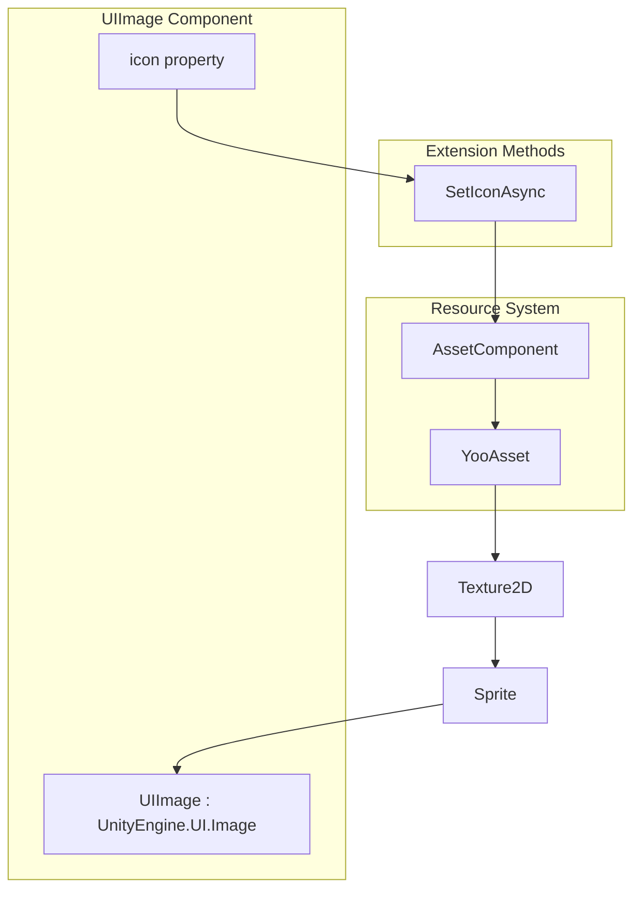
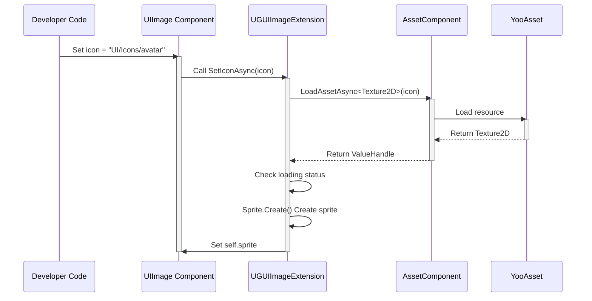

# UIImage Component

The UIImage component is an enhanced image component in the GameFrameX UGUI system, inheriting from Unity's native `UnityEngine.UI.Image` with added asynchronous icon loading functionality. It can automatically load and display images via resource paths, greatly simplifying UI image management.

## Overview

The UIImage component aims to solve common pain points in Unity UGUI image management. In traditional approaches, developers need to manually handle Sprite loading, memory management, and coroutine code for async loading. The UIImage component integrates with the resource system, providing a simple API that automatically completes asynchronous image loading and display by simply setting the resource path.

The component inherits from Unity's `Image` class, so it is fully compatible with the existing UGUI system, including all properties (such as Type, FillAmount, Color, etc.) and functionality of Image. Developers can use UIImage like a normal Image component while gaining the additional capability of async loading.

### Core Features

The core feature of the UIImage component revolves around asynchronous icon loading. When the `icon` property is set, the component automatically loads the corresponding Texture2D from the resource system and converts it to a Sprite displayed on the Image. The entire process is asynchronous and does not block the main thread, which is especially important for UI forms that need to load many images.

The component internally uses GameFrameX's resource management system (AssetComponent) to load resources, ensuring unified and traceable resource loading. When loading fails, it logs errors but does not throw exceptions. This gentle error handling approach is suitable for UI scenarios, ensuring interface stability.

## Architecture Design



### Component Hierarchy

The UIImage component's position in the UGUI system is shown in the diagram above. It is located in the UI presentation layer, directly inheriting from Unity's Image component. Inside the component, when the icon property is set, it calls the extension method SetIconAsync to interact with the resource system. The resource system uses YooAsset for actual resource loading at the bottom layer. This layered design makes each component's responsibilities clear, facilitating maintenance and extension.

The extension method UGUIImageExtension serves as a bridge between UIImage and the resource system. It is responsible for converting resource paths to Texture2D, then converting Texture2D to Sprite and setting it to the Image. This conversion process is asynchronous and uses the async/await pattern, ensuring UI smoothness.

## Core Flow

### Icon Loading Flow

When a developer sets the UIImage's icon property, the following asynchronous loading flow is triggered:



As shown in the sequence diagram, the entire loading flow is asynchronous and does not block the calling thread. The developer can immediately return to continue other operations after setting the property. The image will automatically display once loading is complete. If loading fails, the error is logged through the logging system but does not interrupt program execution.

### Editor Replace Flow

UIImageReplaceHandler provides editor functionality to convert standard Image to UIImage:

```mermaid
flowchart TD
    A[Developer right-clicks Image] --> B[Select menu item<br/>"Replace To UIImage"]
    B --> C[Get all original Image properties]
    C --> D[Destroy original Image component]
    D --> E[Add UIImage component]
    E --> F[Restore all properties]
    F --> G[Conversion complete]
```

This conversion process preserves all original Image settings, including type, material, Sprite, color, raycast settings, etc., ensuring the conversion is lossless.

## Usage Examples

### Basic Usage

Create a UIImage component in a Unity scene and set the icon resource path:

```csharp
using GameFrameX.UI.UGUI.Runtime;
using UnityEngine;

public class IconDisplayExample : MonoBehaviour
{
    [SerializeField]
    private UIImage iconImage;

    void Start()
    {
        // Set icon, just pass the resource path
        iconImage.icon = "UI/Icons/PlayerAvatar";
    }
}
```
> Source: [UIImage.cs](https://github.com/GameFrameX/com.gameframex.unity.ui.ugui/blob/main/Runtime/UIImage.cs#L58-L71)

### Direct Use of Extension Methods

In addition to using through the UIImage component, you can also directly call extension methods on normal Image:

```csharp
using GameFrameX.UI.UGUI.Runtime;
using UnityEngine.UI;

public class ImageExtensionExample : MonoBehaviour
{
    [SerializeField]
    private Image normalImage;

    async void Start()
    {
        // Use extension method to asynchronously load icon
        await normalImage.SetIconAsync("UI/Icons/StartButton");
    }
}
```
> Source: [UGUIImageExtension.cs](https://github.com/GameFrameX/com.gameframex.unity.ui.ugui/blob/main/Runtime/UGUIImageExtension.cs#L56-L74)

### Replacing in Editor

In the Unity Editor, you can replace an existing Image component with UIImage through the context menu:

1. Select the GameObject with the Image component in Hierarchy
2. Right-click on the object
3. Select "CONTEXT/Image/Replace To UIImage"

This operation will completely migrate all properties (type, material, Sprite, color, etc.) of the Image component to UIImage.
> Source: [UIImageReplaceHandler.cs](https://github.com/GameFrameX/com.gameframex.unity.ui.ugui/blob/main/Editor/UIImageReplaceHandler.cs#L42-L76)

## API Reference

### UIImage Class

Inherits from `UnityEngine.UI.Image`, adding an icon property for asynchronous icon loading.

```csharp
[DisallowMultipleComponent]
public class UIImage : UnityEngine.UI.Image
```

#### Properties

**icon** (string)

Gets or sets the icon resource path. When this property is set, the corresponding image is automatically loaded from the resource system and displayed.

```csharp
public string icon
{
    get { return m_icon; }
    set
    {
        if (m_icon != value)
        {
            m_icon = value;
            _ = this.SetIconAsync(m_icon);
        }
    }
}
```

**Parameter Description:**

| Parameter | Type | Description |
|------|------|------|
| value | string | Icon resource path, relative to resource root directory |

**Design Intent:** The benefit of using a property instead of a method is that you can directly drag or enter resource paths in the Unity Editor, as well as support data binding scenarios. Loading is only triggered when the value changes, avoiding repeated loading of the same resource.

### UGUIImageExtension Extension Method Class

Provides extension methods for UnityEngine.UI.Image.

```csharp
public static class UGUIImageExtension
```

#### SetIconAsync

Asynchronously sets the image icon, loading the texture through the resource system and creating a Sprite.

```csharp
public static async Task SetIconAsync(this UnityEngine.UI.Image self, string icon)
```

**Parameters:**

- `self` (UnityEngine.UI.Image): Target image component
- `icon` (string): Icon resource address

**Return Value:** Task async task

**Implementation Logic:**

1. Get AssetComponent instance
2. Asynchronously load Texture2D resource
3. Check if loading status is successful
4. Use Sprite.Create to create sprite and set to Image

**Error Handling:** When loading fails, exceptions are caught and error logs are output, but exceptions are not thrown.

```csharp
public static async Task SetIconAsync(this UnityEngine.UI.Image self, string icon)
{
    try
    {
        var assetComponent = GameEntry.GetComponent<AssetComponent>();
        using (var valueHandle = await assetComponent.LoadAssetAsync<Texture2D>(icon))
        {
            if (valueHandle.IsDone && valueHandle.Status == EOperationStatus.Succeed)
            {
                var texture2D = valueHandle.GetAssetObject<Texture2D>();
                self.sprite = Sprite.Create(
                    texture2D,
                    new Rect(0, 0, texture2D.width, texture2D.height),
                    new Vector2(0.5f, 0.5f)
                );
            }
        }
    }
    catch (System.Exception e)
    {
        Log.Error($"Failed to load icon '{icon}': {e.Message}");
    }
}
```
> Source: [UGUIImageExtension.cs](https://github.com/GameFrameX/com.gameframex.unity.ui.ugui/blob/main/Runtime/UGUIImageExtension.cs#L56-L74)

### UIImageReplaceHandler Editor Class

Provides Image to UIImage conversion functionality in the editor.

```csharp
[CustomEditor(typeof(UnityEngine.UI.Image))]
public class UIImageReplaceHandler : UnityEditor.Editor
```

#### Menu Item

**CONTEXT/Image/Replace To UIImage**

Replaces the selected Image component with UIImage, preserving all original property settings.

> Source: [UIImageReplaceHandler.cs](https://github.com/GameFrameX/com.gameframex.unity.ui.ugui/blob/main/Editor/UIImageReplaceHandler.cs#L42-L76)

## Related Links

- [Extension Methods](./12.extensions.md) - View more UGUI extension methods
- [UGUI Base Class](./06.ugui-base.md) - Learn about UGUI form base class
- [UI Manager](./07.ui-manager.md) - Learn about UI management system
- [Code Generator](./10.code-generator.md) - Learn about automatic code generation tool
- [Component Inspector](./11.inspector.md) - Learn about editor inspector tool
