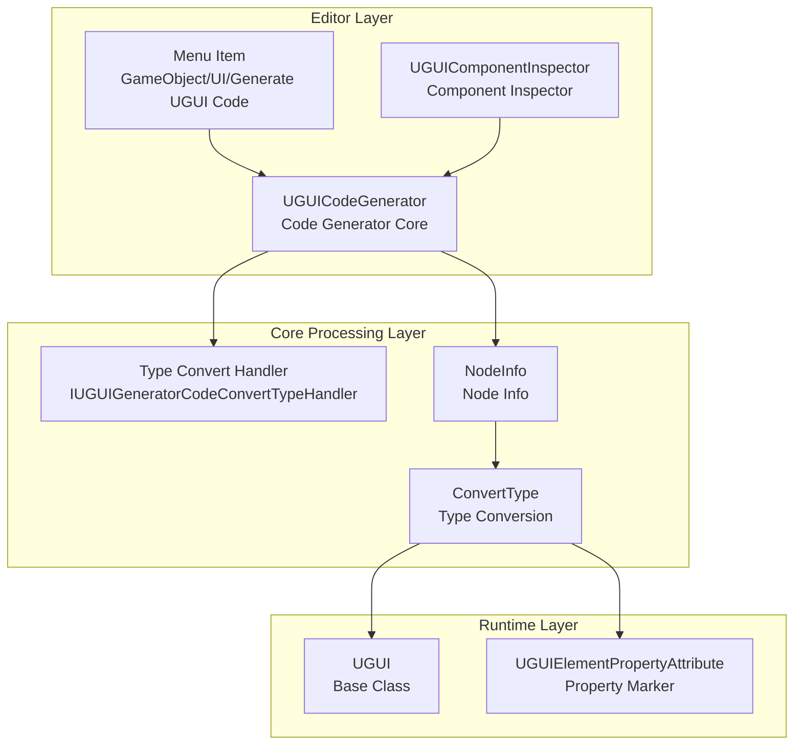
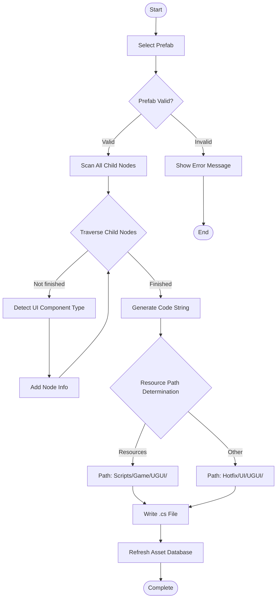

# Code Generator

The Code Generator is one of the core editor tools in the GameFrameX UGUI plugin. It can automatically generate corresponding C# code from Unity UGUI prefabs, greatly improving UI development efficiency.

## Overview

The Code Generator (UGUICodeGenerator) is a Unity editor tool for automatically converting UGUI prefabs into usable C# code. It can:

- **Auto-traverse UI Hierarchy**: Recursively scan all child objects in the prefab
- **Smart Type Recognition**: Automatically identify UI component types such as Button, Text, Image, Toggle, etc.
- **Extensible Conversion Mechanism**: Support custom UI component type recognition through interfaces
- **One-click Code Generation**: Trigger code generation from menu or inspector

### Use Cases

When you need to create a new UI form, instead of manually writing a large amount of repetitive UI reference code, you only need to:
1. Create or select a UGUI prefab in the Unity Editor
2. Right-click and select the generate code menu
3. The system automatically generates a code file containing all UI references

## Architecture

The code generator uses a modular design, primarily consisting of the following components:



### Component Description

| Component | File Path | Responsibility |
|------|----------|------|
| UGUICodeGenerator | `Editor/UGUICodeGenerator.cs` | Main code generator, handles prefab traversal and code generation |
| IUGUIGeneratorCodeConvertTypeHandler | `Editor/IUGUIGeneratorCodeConvertTypeHandler.cs` | Type conversion handler interface, supports extension |
| UGUIComponentInspector | `Editor/UGUIComponentInspector.cs` | Unity Inspector, provides regenerate and rebind functionality |
| UGUIElementPropertyAttribute | `Runtime/UGUIElementPropertyAttribute.cs` | Property marker, identifies UI element paths |

## Core Functions

### Menu Trigger Methods

The code generator provides two trigger methods through Unity menu items:

```csharp
/// <summary>
/// Menu item for generating UI code
/// </summary>
[MenuItem("GameObject/UI/Generate UGUI Code(生成UGUI代码)", false, 1)]
static void Code()
```

> Source: [UGUICodeGenerator.cs](https://github.com/GameFrameX/com.gameframex.unity.ui.ugui/blob/main/Editor/UGUICodeGenerator.cs#L56-L73)

### Code Generation Flow



### UI Component Type Detection

The code generator checks the following UI component types in order of priority:

```csharp
// Check for various UI components in sequence
UIBehaviour component = transform.GetComponent<Button>();
if (component != null) { return typeof(Button).FullName; }

component = transform.GetComponent<Text>();
if (component != null) { return typeof(Text).FullName; }

component = transform.GetComponent<Toggle>();
if (component != null) { return typeof(Toggle).FullName; }

// ... More component types
```

> Source: [UGUICodeGenerator.cs](https://github.com/GameFrameX/com.gameframex.unity.ui.ugui/blob/main/Editor/UGUICodeGenerator.cs#L400-L497)

**Supported UI Component Types Include:**

- UnityEngine.UI.Button
- UnityEngine.UI.Text
- UnityEngine.UI.Image
- UnityEngine.UI.RawImage
- UnityEngine.UI.Toggle
- UnityEngine.UI.ToggleGroup
- UnityEngine.UI.InputField
- UnityEngine.UI.ScrollRect
- UnityEngine.UI.Dropdown
- UnityEngine.UI.Scrollbar
- UnityEngine.UI.Slider
- UnityEngine.UI.RectTransform
- UnityEngine.Transform
- GameFrameX.UI.UGUI.Runtime.UIImage (Extended Component)
- TMPro.TextMeshProUGUI (Conditional Compilation)

### Type Convert Handler Extension

By implementing the `IUGUIGeneratorCodeConvertTypeHandler` interface, you can add custom UI component type recognition logic:

```csharp
/// <summary>
/// UI control type conversion interface
/// </summary>
public interface IUGUIGeneratorCodeConvertTypeHandler
{
    /// <summary>
    /// Handler priority, smaller values have higher priority
    /// </summary>
    int Priority { get; }

    /// <summary>
    /// Execute type conversion
    /// </summary>
    /// <param name="transform">Transform to convert</param>
    /// <returns>Converted type name</returns>
    string Run(Transform transform);
}
```

> Source: [IUGUIGeneratorCodeConvertTypeHandler.cs](https://github.com/GameFrameX/com.gameframex.unity.ui.ugui/blob/main/Editor/IUGUIGeneratorCodeConvertTypeHandler.cs#L39-L52)

Handlers are sorted by priority and executed in sequence. Once a handler returns a non-null type, that type is adopted:

```csharp
// First use custom handlers for processing
if (_handler != null)
{
    foreach (var handler in _handler)
    {
        var type = handler.Run(transform);
        if (type != null)
        {
            return type;
        }
    }
}
```

> Source: [UGUICodeGenerator.cs](https://github.com/GameFrameX/com.gameframex.unity.ui.ugui/blob/main/Editor/UGUICodeGenerator.cs#L387-L398)

## Usage Examples

### Basic Usage Flow

1. **Select UGUI Prefab**: Select the UGUI prefab that needs code generation in the Unity Editor Hierarchy or Project window

2. **Trigger Code Generation**:
   - Method 1: Right-click on the prefab → `GameObject/UI/Generate UGUI Code(生成UGUI代码)`
   - Method 2: Click the "Regenerate Code" button in the prefab's Inspector

3. **View Generated Code**: The code is automatically generated to the specified directory

### Generated Code Example

The generated code structure is as follows:

```csharp
/** This is an automatically generated class by UGUI. Please do not modify it. **/

#if ENABLE_UI_UGUI
using Cysharp.Threading.Tasks;
using GameFrameX.Entity.Runtime;
using GameFrameX.UI.Runtime;
using GameFrameX.Runtime;
using GameFrameX.UI.UGUI.Runtime;
using UnityEngine;

namespace Hotfix.UI
{
    /// <summary>
    /// Auto-generated UI code MainMenu
    /// </summary>
    [DisallowMultipleComponent]
    [OptionUIConfig(null, "UI/Forms/MainMenu")]
    public sealed partial class MainMenu : UGUI
    {
        public GameObject self { get; private set; }

        #region Properties

        [SerializeField] [UGUIElementProperty("Background")]
        private UnityEngine.UI.Image m_Background;

        public UnityEngine.UI.Image m_Background
        {
            get { return m_Background;}
        }

        [SerializeField] [UGUIElementProperty("Title")]
        private UnityEngine.UI.Text m_Title;

        public UnityEngine.UI.Text m_Title
        {
            get { return m_Title;}
        }

        [SerializeField] [UGUIElementProperty("StartButton")]
        private UnityEngine.UI.Button m_StartButton;

        public UnityEngine.UI.Button m_StartButton
        {
            get { return m_StartButton;}
        }

        #endregion

        private bool _isInitView = false;

        protected override void InitView()
        {
            if (_isInitView)
            {
                return;
            }

            _isInitView = true;
            this.self = this.gameObject;
            m_Background = gameObject.transform.FindChildName("Background").GetComponent<UnityEngine.UI.Image>();
            m_Title = gameObject.transform.FindChildName("Title").GetComponent<UnityEngine.UI.Text>();
            m_StartButton = gameObject.transform.FindChildName("StartButton").GetComponent<UnityEngine.UI.Button>();
        }
    }
}
#endif
```

> Source: [UGUICodeGenerator.cs](https://github.com/GameFrameX/com.gameframex.unity.ui.ugui/blob/main/Editor/UGUICodeGenerator.cs#L147-L230)

### Rebind Function

In the prefab's Inspector panel, you can click the "Rebind List" button to rebind all UI references:

```csharp
bool buttonClicked = EditorGUILayout.DropdownButton(_reBind, FocusType.Passive, CustomButtonStyle);
if (buttonClicked && !EditorApplication.isPlaying)
{
    // Rebind
    Dictionary<string, string> fieldMap = new Dictionary<string, string>();
    foreach (var fieldInfo in fieldInfos)
    {
        var serializeFieldAttributes = fieldInfo.GetCustomAttribute(typeof(SerializeField));
        if (serializeFieldAttributes == null) { continue; }

        var uguiElementPropertyAttribute = fieldInfo.GetCustomAttribute(typeof(UGUIElementPropertyAttribute));
        if (uguiElementPropertyAttribute == null) { continue; }

        var elementPropertyAttribute = (UGUIElementPropertyAttribute)uguiElementPropertyAttribute;
        fieldMap[fieldInfo.Name] = elementPropertyAttribute.Path;
    }
    // ... Binding logic
}
```

> Source: [UGUIComponentInspector.cs](https://github.com/GameFrameX/com.gameframex.unity.ui.ugui/blob/main/Editor/UGUIComponentInspector.cs#L96-L132)

## Configuration Description

### Code Generation Path Rules

The code generator automatically selects the generation path based on the prefab location:

| Prefab Location | Generation Path |
|------------|----------|
| Contains "Resources" directory | `Assets/Scripts/Game/UGUI/{Prefab Name}/` |
| Other locations | `Assets/Hotfix/UI/UGUI/{Prefab Name}/` |

```csharp
if (assetPath.Contains(nameof(Resources)))
{
    savePath = System.IO.Path.Combine(Application.dataPath, "Scripts", "Game", "UGUI", className);
}
else
{
    savePath = System.IO.Path.Combine(Application.dataPath, "Hotfix", "UI", "UGUI", className);
}
```

> Source: [UGUICodeGenerator.cs](https://github.com/GameFrameX/com.gameframex.unity.ui.ugui/blob/main/Editor/UGUICodeGenerator.cs#L117-L127)

### Namespace Rules

Generated code automatically sets namespaces based on path:

- Prefabs in Resources directory: `namespace Unity.Startup`
- Other locations: `namespace Hotfix.UI`

> Source: [UGUICodeGenerator.cs](https://github.com/GameFrameX/com.gameframex.unity.ui.ugui/blob/main/Editor/UGUICodeGenerator.cs#L169-L177)

## Extension Development

### Creating Custom Type Convert Handler

You can add custom UI component recognition logic by implementing the `IUGUIGeneratorCodeConvertTypeHandler` interface:

```csharp
using UnityEngine;
using GameFrameX.UI.UGUI.Editor;

public class CustomTypeHandler : IUGUIGeneratorCodeConvertTypeHandler
{
    public int Priority => 0; // Priority, smaller values execute first

    public string Run(Transform transform)
    {
        // Custom type detection logic
        var customComponent = transform.GetComponent<CustomUIComponent>();
        if (customComponent != null)
        {
            return typeof(CustomUIComponent).FullName;
        }
        return null; // Return null to skip, continue using other handlers
    }
}
```

This handler will execute before built-in type detection and can be used for:
- Supporting third-party UI component libraries
- Custom component type mapping
- Auto-recognition of special naming conventions

## Related Links

- [UGUI Base Class](./06.ugui-base.md)
- [UI Manager](./07.ui-manager.md)
- [UIImage Component](./09.uiimage.md)
- [Component Inspector](./11.inspector.md)
- [Image Replace Handler](./15.image-replace.md)
- [Official Documentation](https://gameframex.doc.alianblank.com)
