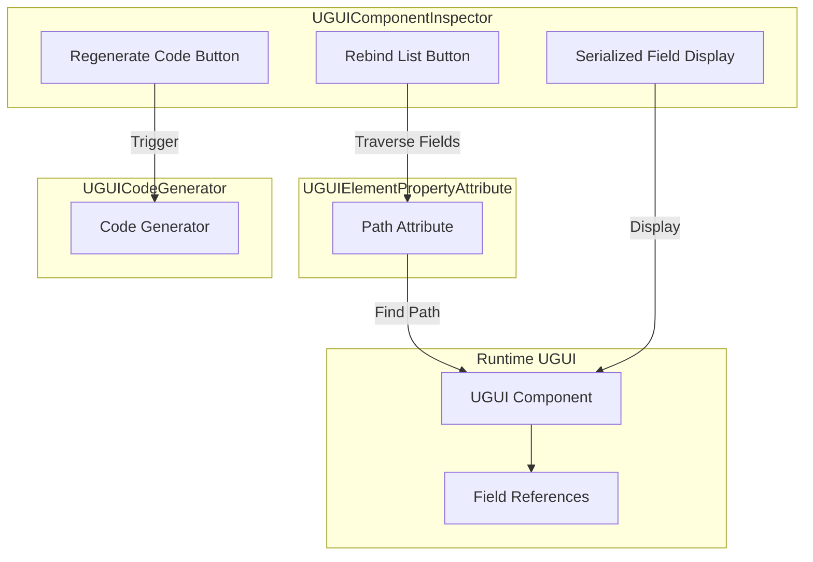
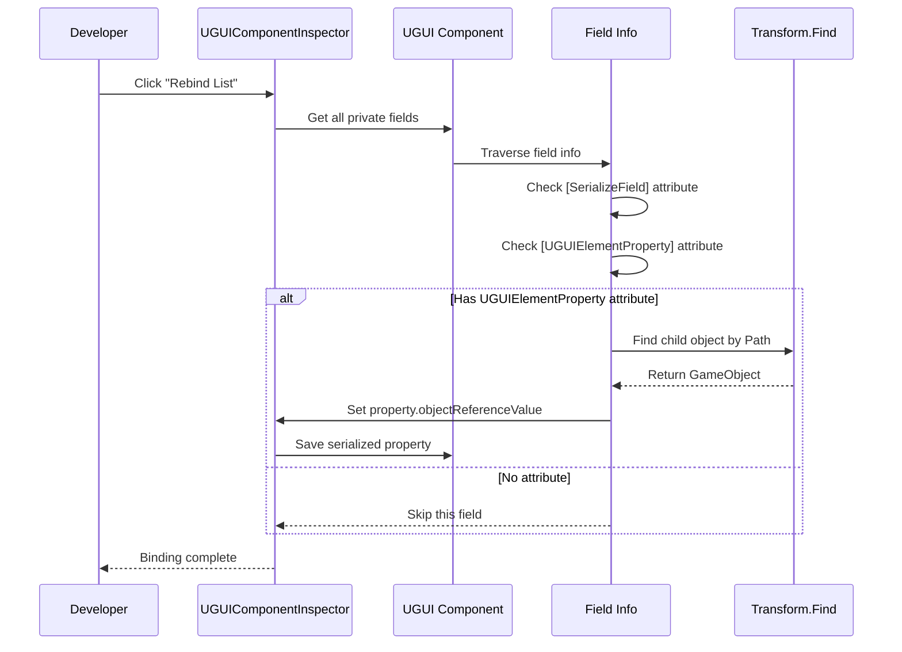

# Component Inspector

The Component Inspector is one of the core editor tools of the UGUI plugin. It is used to customize the Inspector panel for UGUI components in the Unity Editor. This inspector provides developers with convenient code generation and reference binding functionality, greatly improving UI development efficiency.

## Overview

The Component Inspector (`UGUIComponentInspector`) is a custom Unity Editor Inspector specifically designed for `UGUI` base class components. It inherits from the `GameFrameworkInspector` base class and provides two core function buttons for automating repetitive work in the UI development process.

### Design Purpose

In traditional UGUI development patterns, developers need to manually create UI prefabs, write code to reference various UI elements, and manually drag and bind references in the Inspector one by one. This approach is not only inefficient but also requires manually updating many references when UI structure changes.

The Component Inspector solves these problems through the following design:

1. **Automatic Code Generation**: Through the code generator, automatically traverse UI prefab structure and generate property code with `[UGUIElementProperty]` attribute
2. **Automatic Reference Binding**: Through inspector buttons, one-click rebind all UI element references without manual dragging

### Core Functions

- **Regenerate Code**: Regenerate UI code files based on current prefab structure
- **Rebind List**: Automatically find and bind UI element references according to path information in attributes

> Source: [UGUIComponentInspector.cs](https://github.com/GameFrameX/com.gameframex.unity.ui.ugui/blob/main/Editor/UGUIComponentInspector.cs#L44-L153)

## Architecture Design

The Component Inspector's architecture follows Unity Editor extension development patterns, enhancing Editor functionality through custom Inspector.



### Component Description

| Component | File Location | Responsibility |
|------|----------|------|
| UGUIComponentInspector | Editor/UGUIComponentInspector.cs | Custom Inspector panel, provides button interaction |
| UGUIElementPropertyAttribute | Runtime/UGUIElementPropertyAttribute.cs | Attribute class, marks UI element paths |
| UGUICodeGenerator | Editor/UGUICodeGenerator.cs | Code generator, generates UI code |
| UGUI | Runtime/UGUI.cs | UGUI base class, extended by Inspector |

> Source: [UGUIElementPropertyAttribute.cs](https://github.com/GameFrameX/com.gameframex.unity.ui.ugui/blob/main/Runtime/UGUIElementPropertyAttribute.cs#L40-L64)

## Core Implementation

### Inspector Class Definition

The Inspector uses the `[CustomEditor]` attribute to declare a custom editor, inheriting from the `GameFrameworkInspector` base class:

```csharp
[CustomEditor(typeof(runtime.UGUI), true)]
internal sealed class UGUIComponentInspector : GameFrameworkInspector
{
    private GUIStyle _customButtonStyle;

    private readonly GUIContent _reBind = new GUIContent("Rebind List");
    private readonly GUIContent _reGenerate = new GUIContent("Regenerate Code");

    public override void OnInspectorGUI()
    {
        // Inspector GUI implementation
    }
}
```

> Source: [UGUIComponentInspector.cs](https://github.com/GameFrameX/com.gameframex.unity.ui.ugui/blob/main/Editor/UGUIComponentInspector.cs#L43-L80)

### Custom Button Style

The Inspector provides a custom button style, using large font and colored text design to make it easy for developers to identify operation buttons:

```csharp
private GUIStyle CustomButtonStyle
{
    get
    {
        if (_customButtonStyle == null)
        {
            _customButtonStyle = new GUIStyle(GUI.skin.button)
            {
                fontSize = 32,
                normal = { textColor = Color.green },
                hover = { textColor = Color.yellow },
                active = { textColor = Color.green },
                alignment = TextAnchor.MiddleCenter,
            };
        }
        return _customButtonStyle;
    }
}
```

> Source: [UGUIComponentInspector.cs](https://github.com/github.com/GameFrameX/com.gameframex.unity.ui.ugui/blob/main/Editor/UGUIComponentInspector.cs#L48-L75)

## Core Flow

### Rebind Flow

When a developer clicks the "Rebind List" button, the Inspector executes the following flow:



### Rebind Implementation Code

```csharp
bool buttonClicked = EditorGUILayout.DropdownButton(_reBind, FocusType.Passive, CustomButtonStyle);
if (buttonClicked && !EditorApplication.isPlaying)
{
    // Rebind
    Dictionary<string, string> fieldMap = new Dictionary<string, string>();
    foreach (var fieldInfo in fieldInfos)
    {
        var serializeFieldAttributes = fieldInfo.GetCustomAttribute(typeof(SerializeField));
        if (serializeFieldAttributes == null)
        {
            continue;
        }

        var uguiElementPropertyAttribute = fieldInfo.GetCustomAttribute(typeof(UGUIElementPropertyAttribute));
        if (uguiElementPropertyAttribute == null)
        {
            continue;
        }

        var elementPropertyAttribute = (UGUIElementPropertyAttribute)uguiElementPropertyAttribute;
        fieldMap[fieldInfo.Name] = elementPropertyAttribute.Path;
    }

    foreach (var kv in fieldMap)
    {
        var property = serializedObject.FindProperty(kv.Key);
        if (property != null)
        {
            var targetFind = targetGameObject.transform.Find(kv.Value);
            if (targetFind != null)
            {
                property.objectReferenceValue = targetFind.gameObject;
            }
        }
    }
}
```

> Source: [UGUIComponentInspector.cs](https://github.com/GameFrameX/com.gameframex.unity.ui.ugui/blob/main/Editor/UGUIComponentInspector.cs#L96-L131)

### Field Display (Read-Only Mode)

The Inspector also displays all serialized fields but sets them to read-only mode to prevent accidental modification in the Editor:

```csharp
// Do not allow modification in Editor
GUI.enabled = false;
foreach (var fieldInfo in fieldInfos)
{
    var attributes = fieldInfo.GetCustomAttributes(typeof(SerializeField));
    if (!attributes.Any())
    {
        continue;
    }

    EditorGUILayout.ObjectField(fieldInfo.Name, fieldInfo.GetValue(targetUGUI) as Object, fieldInfo.FieldType, true);
}

GUI.enabled = true;
```

> Source: [UGUIComponentInspector.cs](https://github.com/GameFrameX/com.gameframex.unity.ui.ugui/blob/main/Editor/UGUIComponentInspector.cs#L134-L147)

## UGUIElementProperty Attribute

`UGUIElementPropertyAttribute` is the core attribute that the Component Inspector works with, used to mark the path of UI controls in prefabs.

### Attribute Definition

```csharp
/// <summary>
/// UGUI control property attribute, used to mark the path of UI controls in prefabs.
/// </summary>
public sealed class UGUIElementPropertyAttribute : Attribute
{
    /// <summary>
    /// Gets the control path.
    /// </summary>
    [UnityEngine.Scripting.Preserve]
    public string Path { get; }

    /// <summary>
    /// Initializes a new instance of the <see cref="UGUIElementPropertyAttribute"/> class.
    /// </summary>
    /// <param name="path">Control path</param>
    [UnityEngine.Scripting.Preserve]
    public UGUIElementPropertyAttribute(string path)
    {
        Path = path;
    }
}
```

> Source: [UGUIElementPropertyAttribute.cs](https://github.com/GameFrameX/com.gameframex.unity.ui.ugui/blob/main/Runtime/UGUIElementPropertyAttribute.cs#L34-L64)

### Usage Example

The code generator automatically generates property code with this attribute:

```csharp
[SerializeField]
[UGUIElementProperty("Panel/Button_Start")]
private Button m_Button_Start;

public Button m_Button_Start
{
    get { return m_Button_Start; }
}
```

> Source: [UGUICodeGenerator.cs](https://github.com/GameFrameX/com.gameframex.unity.ui.ugui/blob/main/Editor/UGUICodeGenerator.cs#L259-L269)

## Use Cases

### Scenario 1: Rebind After UI Structure Changes

When the UI prefab structure changes (such as renaming or adjusting hierarchy), existing references will become invalid. At this point, you only need to:

1. Regenerate code (or manually update paths)
2. Click the "Rebind List" button
3. The Inspector will automatically find and bind UI elements based on new paths

### Scenario 2: Reference Update After Code Refactoring

During code refactoring, field names may be modified or prefab structure adjusted. The rebind feature can quickly restore all references without manually dragging each one.

### Scenario 3: Multi-Platform Resource Path Adjustment

When you need to adjust the organization structure of UI resources, you can quickly adapt to the new resource organization method through code regeneration and rebinding.

## Related Links

- [Code Generator](./10.code-generator.md) - Learn about automatic code generation functionality
- [UGUI Base Class](./06.ugui-base.md) - Learn about UGUI base class implementation
- [Image Replace Handler](./15.image-replace.md) - Learn about UI image replacement functionality
- [Getting Started - Using Code Generator](./13.create-ui.md) - Quick start guide
