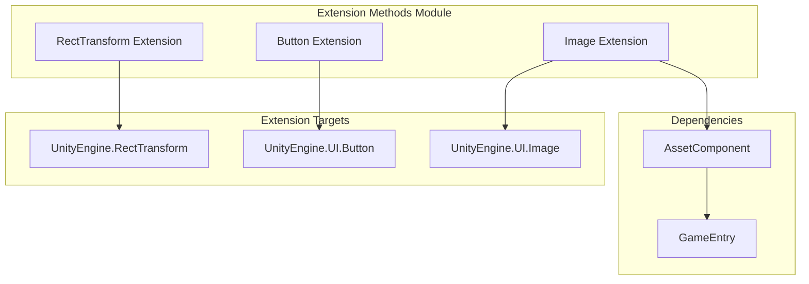

# Extension Methods

Provides convenient extension methods to enhance UGUI component functionality and simplify common UI operation code writing.

## Overview

Extension methods are a set of static extension methods provided by the GameFrameX UGUI plugin. Using C# extension method syntax, they add convenient functionality to Unity's built-in UGUI components. These extension methods cover common scenarios such as UI layout, button event handling, and asynchronous image loading, significantly reducing boilerplate code and improving development efficiency.

All extension methods are in the `GameFrameX.UI.UGUI.Runtime` namespace and are marked with the `[Preserve]` attribute to ensure they are not stripped in code stripping environments like IL2CPP.

## Architecture

Extension methods are categorized by target component, primarily divided into three categories:



### Extension Method Categories

| Extension Class | Target Component | Main Functions |
|--------|----------|----------|
| `RectTransformExtension` | `RectTransform` | Quickly set full-screen layout |
| `UGUIButtonExtension` | `Button.ButtonClickedEvent` | Simplify button event binding |
| `UGUIImageExtension` | `UnityEngine.UI.Image` | Asynchronously load icon resources |

## RectTransform Extension

The `RectTransformExtension` class provides layout-related extension methods for `RectTransform` components.

### MakeFullScreen

Sets the current UI object to full-screen display.

```csharp
public static void MakeFullScreen(this RectTransform rectTransform)
```

**Implementation Principle:**

This method achieves full-screen effect by setting four key properties of RectTransform:

1. `anchorMin = Vector2.zero` - Set minimum anchor point to (0,0), i.e., lower-left corner of parent container
2. `anchorMax = Vector2.one` - Set maximum anchor point to (1,1), i.e., upper-right corner of parent container
3. `anchoredPosition = Vector2.zero` - Reset anchor position to zero
4. `sizeDelta = Vector2.zero` - Set size delta to zero, making the element fully fill the parent container

> Source: [RectTransformExtension.cs](https://github.com/GameFrameX/com.gameframex.unity.ui.ugui/blob/main/Runtime/RectTransformExtension.cs#L56-L62)

**Usage Example:**

```csharp
using GameFrameX.UI.UGUI.Runtime;

// Assume there's a RectTransform reference
RectTransform fullScreenPanel = someUIObject.GetComponent<RectTransform>();

// One line of code to set full screen
fullScreenPanel.MakeFullScreen();
```

## Button Extension

The `UGUIButtonExtension` class provides event handling-related extension methods for `Button.ButtonClickedEvent`, simplifying button click event binding and management.

### Method List

| Method | Function Description |
|------|----------|
| `Add` | Add button click event listener |
| `Remove` | Remove button click event listener |
| `Clear` | Clear all button click event listeners |
| `Set` | Set button click event (replace existing event) |
| `Set(action, userData)` | Set click event with user data |

### Add

Adds a button click event listener.

```csharp
public static void Add(this Button.ButtonClickedEvent self, UnityAction action)
```

**Parameters:**
- `self`: Button's click event collection
- `action`: Callback to execute on click

> Source: [UGUIButtonExtension.cs](https://github.com/GameFrameX/com.gameframex.unity.ui.ugui/blob/main/Runtime/UGUIButtonExtension.cs#L52-L57)

### Remove

Removes a specified button click event listener.

```csharp
public static void Remove(this Button.ButtonClickedEvent self, UnityAction action)
```

> Source: [UGUIButtonExtension.cs](https://github.com/GameFrameX/com.gameframex.unity.ui.ugui/blob/main/Runtime/UGUIButtonExtension.cs#L67-L72)

### Clear

Clears all button click event listeners.

```csharp
public static void Clear(this Button.ButtonClickedEvent self)
```

> Source: [UGUIButtonExtension.cs](https://github.com/GameFrameX/com.gameframex.unity.ui.ugui/blob/main/Runtime/UGUIButtonExtension.cs#L81-L85)

### Set

Sets a button click event, replacing all existing events with new ones.

```csharp
public static void Set(this Button.ButtonClickedEvent self, UnityAction action)
```

> Source: [UGUIButtonExtension.cs](https://github.com/GameFrameX/com.gameframex.unity.ui.ugui/blob/main/Runtime/UGUIButtonExtension.cs#L95-L101)

### Set (With User Data)

Sets a button click event with user data.

```csharp
public static void Set(this Button.ButtonClickedEvent self, UnityAction<object> action, object userData)
```

**Parameters:**
- `self`: Button's click event collection
- `action`: Callback function with user data parameter
- `userData`: User custom data passed to the callback

> Source: [UGUIButtonExtension.cs](https://github.com/GameFrameX/com.gameframex.unity.ui.ugui/blob/main/Runtime/UGUIButtonExtension.cs#L112-L124)

**Usage Example:**

```csharp
using GameFrameX.UI.UGUI.Runtime;
using UnityEngine.UI;
using UnityEngine;

// Get button component
Button button = GetComponent<Button>();

// Add click event
button.onClick.Add(() => {
    Debug.Log("Button clicked");
});

// Use event with parameter
button.onClick.Set((userData) => {
    Debug.Log($"Button clicked, user data: {userData}");
}, "Custom data");

// Clear all events
button.onClick.Clear();
```

## Image Extension

The `UGUIImageExtension` class provides asynchronous icon loading functionality for `UnityEngine.UI.Image`.

### SetIconAsync

Asynchronously sets the image icon.

```csharp
public static async Task SetIconAsync(this UnityEngine.UI.Image self, string icon)
```

**Parameters:**
- `self`: Target image component
- `icon`: Icon resource path (relative to resource directory)

**Return Value:**
- Returns `Task` async task

**Implementation Principle:**

1. Get AssetComponent instance through `GameEntry.GetComponent<AssetComponent>()`
2. Use `LoadAssetAsync<Texture2D>` to asynchronously load texture resource
3. Convert loaded `Texture2D` to `Sprite` object
4. Assign the generated Sprite to the Image component's sprite property

> Source: [UGUIImageExtension.cs](https://github.com/GameFrameX/com.gameframex.unity.ui.ugui/blob/main/Runtime/UGUIImageExtension.cs#L55-L74)

**Exception Handling:**

This method has built-in try-catch exception handling. When loading fails, it outputs error logs but does not throw exceptions, ensuring the UI does not crash due to resource loading failure.

**Usage Example:**

```csharp
using GameFrameX.UI.UGUI.Runtime;
using UnityEngine.UI;

// Get Image component
Image iconImage = GetComponent<Image>();

// Asynchronously load and set icon
await iconImage.SetIconAsync("icons/player_avatar");

// Can be used with UIFormHelper
await iconImage.SetIconAsync(formHelper.GetIconPath("item_001"));
```

## Common Use Scenarios

### Scenario 1: Create Full-Screen Popup

```csharp
// Create full-screen semi-transparent background
GameObject bgObj = new GameObject("PopupBackground");
bgObj.transform.SetParent(canvas.transform);
RectTransform bgRT = bgObj.AddComponent<RectTransform>();
Image bgImage = bgObj.AddComponent<Image>();
bgImage.color = new Color(0, 0, 0, 0.5f);

// Set to full screen
bgRT.MakeFullScreen();
```

### Scenario 2: Batch Set Button Events

```csharp
// Batch bind button events
Button[] buttons = GetComponentsInChildren<Button>();
foreach (var btn in buttons)
{
    btn.onClick.Set(() => OnButtonClick(btn.name));
}
```

### Scenario 3: Asynchronously Load Item Icons

```csharp
// Asynchronously set icon in UIForm loading flow
public async void LoadItemIcon(Image iconImage, string itemId)
{
    await iconImage.SetIconAsync($"icons/items/{itemId}");
}
```

## Related Links

- [UIImage Component](./09.uiimage.md) - UIImage component documentation
- [UGUI Base Class](./06.ugui-base.md) - UGUI base class introduction
- [UI Manager](./07.ui-manager.md) - UI manager documentation
- [Form Helper](./08.form-helper.md) - Form helper documentation
