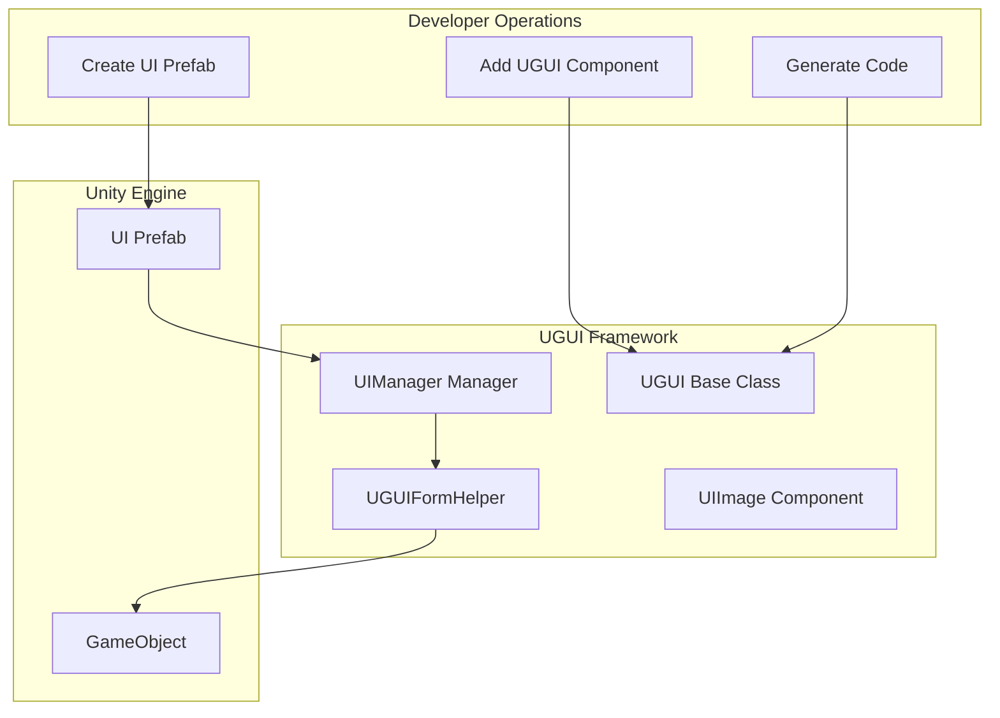
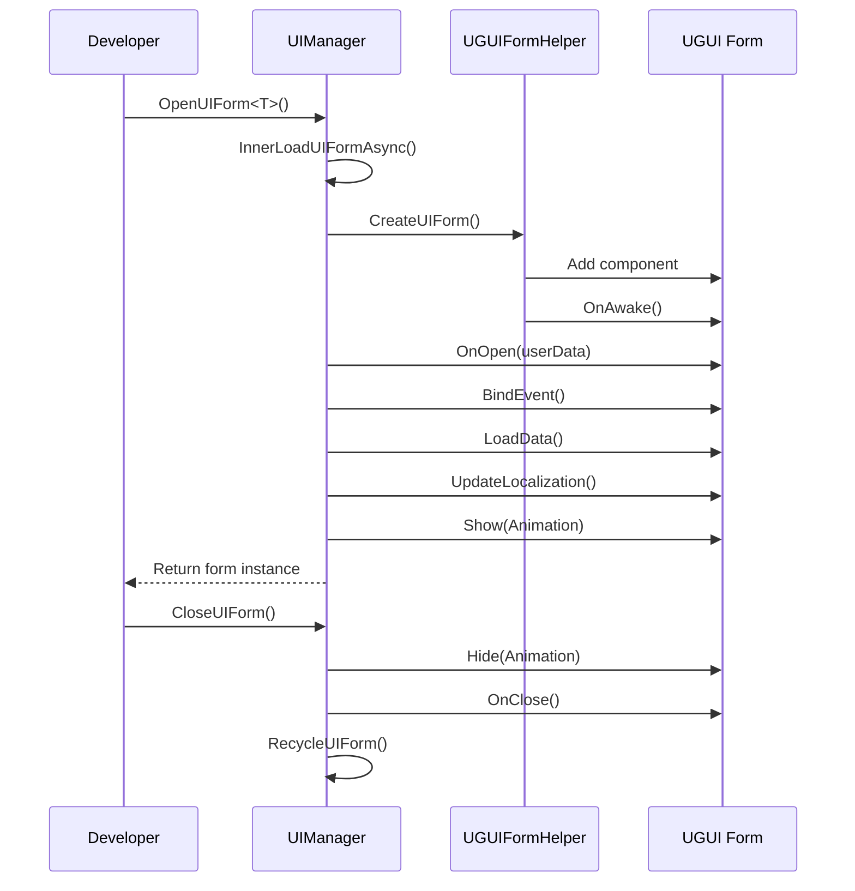

# Creating UI Forms

This document introduces how to create and manage UI forms in the GameFrameX UGUI plugin.

## Overview

The GameFrameX UGUI plugin provides a complete UI form creation and management system. By inheriting the `UGUI` base class, developers can quickly create UI forms and use the code generator to automatically generate UI component reference code. UI forms are centrally managed by `UIManager`, supporting features such as asynchronous loading, object pool caching, and show/hide animations.

> Learn more about core concepts: [UGUI Base Class](./06.ugui-base.md), [UI Manager](./07.ui-manager.md), [Form Helper](./08.form-helper.md)

## Core Architecture

UI form creation and management involves the following core components:



## Creation Flow

### Step 1: Create UI Prefab

Create a UI form prefab (Prefab) in your Unity project, typically containing the following structure:

```
Canvas
├── UGUI (Root node, add UGUI component)
│   ├── Panel_xxx (Background panel)
│   │   ├── Image_xxx (Image)
│   │   ├── Text_xxx (Text)
│   │   └── Button_xxx (Button)
│   └── ...
```

> Source: [Runtime/UGUI.cs](https://github.com/GameFrameX/com.gameframex.unity.ui.ugui/blob/main/Runtime/UGUI.cs#L44-L50)

### Step 2: Add UGUI Component

Add the `UGUI` component to the root GameObject of the prefab:

1. Select the root node of the prefab
2. In the Inspector panel, click "Add Component"
3. Search and add `GameFrameX.UI.UGUI.Runtime.UGUI`

The `UGUI` component inherits from `UIForm` and provides the following features:
- Form show and hide (with animation support)
- Visibility state management
- Full-screen mode setting

```csharp
// UGUI base class definition
namespace GameFrameX.UI.UGUI.Runtime
{
    [Preserve]
    [DisallowMultipleComponent]
    public class UGUI : UIForm
    {
        // Show form
        public override void Show(IUIFormShowHandler handler, Action complete)

        // Hide form
        public override void Hide(IUIFormHideHandler handler, Action complete)

        // Set visibility
        protected override void InternalSetVisible(bool value)

        // Get/Set visibility
        public override bool Visible { get; protected set; }

        // Set full screen
        protected override void MakeFullScreen()
    }
}
```

> Source: [Runtime/UGUI.cs](https://github.com/GameFrameX/com.gameframex.unity.ui.ugui/blob/main/Runtime/UGUI.cs#L36-L179)

### Step 3: Generate UI Code

Use the code generator to automatically generate UI component reference code:

1. Select **GameObject -> UI -> Generate UGUI Code** from Unity menu
2. Select the UGUI prefab for code generation
3. The code generator will automatically traverse all child nodes in the prefab and generate corresponding property code

The generated code has the following structure:

```csharp
#if ENABLE_UI_UGUI
using Cysharp.Threading.Tasks;
using GameFrameX.Entity.Runtime;
using GameFrameX.UI.Runtime;
using GameFrameX.Runtime;
using GameFrameX.UI.UGUI.Runtime;
using UnityEngine;

namespace Hotfix.UI
{
    /// <summary>
    /// Auto-generated UI code for LoginPanel
    /// </summary>
    [DisallowMultipleComponent]
    [OptionUIConfig(null, "Assets/Prefabs/UI/Login")]
    public sealed partial class LoginPanel : UGUI
    {
        public GameObject self { get; private set; }

        #region Properties

        [SerializeField] [UGUIElementProperty("Panel_Bg/Image_Logo")]
        private UnityEngine.UI.Image m_Image_Logo;

        public UnityEngine.UI.Image m_Image_Logo => m_Image_Logo;

        [SerializeField] [UGUIElementProperty("Panel_Bg/Button_Login")]
        private UnityEngine.UI.Button m_Button_Login;

        public UnityEngine.UI.Button m_Button_Login => m_Button_Login;

        #endregion

        private bool _isInitView = false;

        protected override void InitView()
        {
            if (_isInitView)
            {
                return;
            }

            _isInitView = true;
            this.self = this.gameObject;
            m_Image_Logo = gameObject.transform.FindChildName("Panel_Bg/Image_Logo").GetComponent<UnityEngine.UI.Image>();
            m_Button_Login = gameObject.transform.FindChildName("Panel_Bg/Button_Login").GetComponent<UnityEngine.UI.Button>();
        }
    }
}
#endif
```

> Source: [Editor/UGUICodeGenerator.cs](https://github.com/GameFrameX/com.gameframex.unity.ui.ugui/blob/main/Editor/UGUICodeGenerator.cs#L84-L230)

### Step 4: Attach Generated Code

After generating the code, attach it to the prefab:

1. Attach the generated `.UI.cs` file to the root node of the prefab
2. In the Inspector, click the **"Rebind List"** button to bind child nodes in the prefab to code properties

> Learn more about the code generator: [Using Code Generator](./10.code-generator.md)

## Opening and Closing UI Forms

### Opening a UI Form

Asynchronously open a UI form through `UIManager`:

```csharp
// Open UI form
var uiForm = await GameEntry.UI.OpenUIForm<LoginPanel>();
```

The `OpenUIForm` method will:
1. Check if there's a reusable instance in the object pool
2. If not, asynchronously load from Resources or AssetBundle
3. Call `UGUIFormHelper` to create the form
4. Trigger `OnOpen` callback
5. Execute show animation (if enabled)

```csharp
// Core flow for opening forms
protected override async Task<IUIForm> InnerOpenUIFormAsync(
    string uiFormAssetPath,
    Type uiFormType,
    bool pauseCoveredUIForm,
    object userData,
    bool isFullScreen = false)
{
    // 1. Check object pool
    var uiFormInstanceObject = m_InstancePool.Spawn(assetPath);
    if (uiFormInstanceObject != null)
    {
        return InternalOpenUIForm(...);
    }

    // 2. Asynchronously load resource
    var uiForm = InnerLoadUIFormAsync(...);
    return await uiForm;
}
```

> Source: [Runtime/UIManager.Open.cs](https://github.com/GameFrameX/com.gameframex.unity.ui.ugui/blob/main/Runtime/UIManager.Open.cs#L79-L115)

### Closing a UI Form

```csharp
// Close UI form
GameEntry.UI.CloseUIForm(loginPanel);
```

### UIForm Lifecycle



## UI Component References

The code generator automatically generates reference properties for each UI control in the prefab. Use the `[UGUIElementProperty]` attribute to mark control paths:

```csharp
[SerializeField]
[UGUIElementProperty("Panel_Bg/Button_Start")]
private UnityEngine.UI.Button m_Button_Start;

public UnityEngine.UI.Button m_Button_Start => m_Button_Start;
```

> Learn more about UI components: [UIImage Component](./09.uiimage.md), [Extension Methods](./12.extensions.md)

## UI Form Configuration

You can configure UI form behavior through attributes:

### OptionUIConfig Attribute

Configure the form's resource loading method:

```csharp
[OptionUIConfig(true)]  // Load from Resources
[OptionUIConfig(null, "Assets/Prefabs/UI/Login")]  // Load from AssetBundle
```

### OptionUIGroupAttribute Attribute

Configure the UI group the form belongs to:

```csharp
[OptionUIGroup("MainUI")]
```

### OptionUIShowAnimationAttribute Attribute

Configure show animation:

```csharp
[OptionUIShowAnimation(true, "FadeIn")]
```

### OptionUIHideAnimationAttribute Attribute

Configure hide animation:

```csharp
[OptionUIHideAnimation(true, "FadeOut")]
```

## Complete Example

Here is a complete UI form creation example:

```csharp
using GameFrameX.UI.UGUI.Runtime;
using UnityEngine;
using UnityEngine.UI;

namespace Hotfix.UI
{
    /// <summary>
    /// Login form
    /// </summary>
    [DisallowMultipleComponent]
    [OptionUIConfig(null, "Assets/Prefabs/UI/Login")]
    public sealed partial class LoginPanel : UGUI
    {
        public GameObject self { get; private set; }

        #region Properties

        [SerializeField]
        [UGUIElementProperty("Background")]
        private Image m_Background;

        public Image m_Background => m_Background;

        [SerializeField]
        [UGUIElementProperty("Button_Login")]
        private Button m_Button_Login;

        public Button m_Button_Login => m_Button_Login;

        [SerializeField]
        [UGUIElementProperty("InputField_Username")]
        private InputField m_InputField_Username;

        public InputField m_InputField_Username => m_InputField_Username;

        #endregion

        private bool _isInitView = false;

        protected override void InitView()
        {
            if (_isInitView)
            {
                return;
            }

            _isInitView = true;
            this.self = this.gameObject;

            m_Background = gameObject.transform.FindChildName("Background").GetComponent<Image>();
            m_Button_Login = gameObject.transform.FindChildName("Button_Login").GetComponent<Button>();
            m_InputField_Username = gameObject.transform.FindChildName("InputField_Username").GetComponent<InputField>();

            // Bind button click event
            m_Button_Login.onClick.AddListener(OnLoginClick);
        }

        private void OnLoginClick()
        {
            Debug.Log("Login button clicked, username: " + m_InputField_Username.text);
            // Handle login logic
        }

        protected override void OnClose(bool isShutdown, bool pauseCovered)
        {
            base.OnClose(isShutdown, pauseCovered);
            // Cleanup resources
        }
    }
}
```

## Related Links

- [Using Code Generator](./10.code-generator.md) - Learn more about code generator usage
- [UGUI Base Class](./06.ugui-base.md) - Detailed UGUI base class description
- [UI Manager](./07.ui-manager.md) - Detailed UI manager description
- [Form Helper](./08.form-helper.md) - Form helper description
- [UIImage Component](./09.uiimage.md) - UIImage component description
- [Extension Methods](./12.extensions.md) - UGUI extension methods
- [Code Generator](./10.code-generator.md) - Editor code generator tool
- [Component Inspector](./11.inspector.md) - UGUI component inspector
