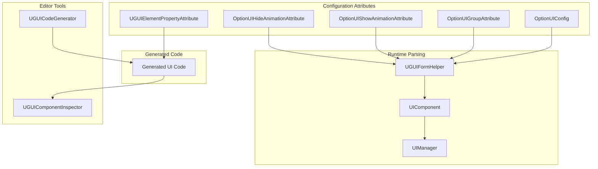
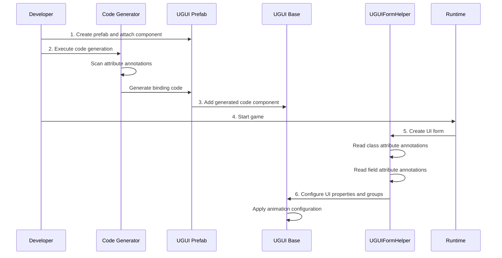

# Configuration

This document provides detailed instructions on the configuration system of the GameFrameX UGUI plugin, including attribute configuration, property binding, code generator settings, etc.

## Overview

The GameFrameX UGUI plugin uses an **Attribute-Driven** configuration mode, declaratively defining various behaviors and properties of UI forms through C# attributes. This approach has the following advantages:

- **Declarative Configuration**: Configure UI behavior with attribute markers without writing tedious initialization code
- **Type Safety**: Configuration is checked at compile time, reducing runtime errors
- **Code Generation Integration**: Attributes are deeply integrated with the code generator to automatically generate binding code
- **Runtime Parsing**: Attributes are automatically parsed and applied when UI forms are created

The configuration system mainly includes the following dimensions:

1. **UI Form Configuration**: Define form's resource path, assigned group, animation, etc.
2. **UI Element Binding**: Declaratively bind control references in prefabs
3. **Code Generator Configuration**: Customize code generation behavior and output paths
4. **UI Group Configuration**: Manage form hierarchy and depth relationships

## Architecture



### Configuration Flow



## UI Form Configuration

### OptionUIConfig Attribute

The `OptionUIConfig` attribute configures basic information for UI forms, including resource loading method and resource path.

```csharp
[OptionUIConfig(null, "Assets/Resources/UI/Prefabs")]
public partial class MainMenuUI : UGUI
{
    // UI form logic
}
```

> Source: [UGUICodeGenerator.cs#L188](https://github.com/GameFrameX/com.gameframex.unity.ui.ugui/blob/main/Editor/UGUICodeGenerator.cs#L188)

**Parameter Description:**

| Parameter | Type | Default Value | Description |
|------|------|--------|------|
| isResources | bool? | null | Whether to load from Resources, true means from Resources, false means from AB package, null means use default configuration |
| assetPath | string | null | Resource path, specifies AB package relative path when isResources is false |

**Use Cases:**

- **Load from Resources**: `[OptionUIConfig(true)]` - Resource must be placed in `Resources` directory
- **Load from AB Package**: `[OptionUIConfig(false, "Assets/UI/Prefabs")]` - Resource managed through AB package
- **Use Default Configuration**: `[OptionUIConfig(null, "Assets/UI/Prefabs")]` - Use UIComponent's default settings

### OptionUIGroupAttribute Attribute

The `OptionUIGroupAttribute` attribute specifies the UI group (UIGroup) that a UI form belongs to.

```csharp
[OptionUIGroup("MainUI")]
public partial class MainMenuUI : UGUI
{
    // UI form logic
}
```

> Source: [UGUIFormHelper.cs#L117-L121](https://github.com/GameFrameX/com.gameframex.unity.ui.ugui/blob/main/Runtime/UGUIFormHelper.cs#L117-L121)

**Parameter Description:**

| Parameter | Type | Description |
|------|------|------|
| GroupName | string | Name of the UI group, used to assign forms to a specific group |

**UI Group Functions:**

- Manage display hierarchy (Depth) of forms in the same group
- Control display/hide strategy for forms in the same group
- Unified resource release management for forms in the same group

### OptionUIShowAnimationAttribute Attribute

The `OptionUIShowAnimationAttribute` attribute configures the animation effect when a UI form opens.

```csharp
[OptionUIShowAnimation(true, "MainMenuEnter")]
public partial class MainMenuUI : UGUI
{
    // UI form logic
}
```

> Source: [UGUIFormHelper.cs#L126-L131](https://github.com/GameFrameX/com.gameframex.unity.ui.ugui/blob/main/Runtime/UGUIFormHelper.cs#L126-L131)

**Parameter Description:**

| Parameter | Type | Default Value | Description |
|------|------|--------|------|
| Enable | bool | false | Whether to enable show animation |
| AnimationName | string | "" | Animation name, corresponds to animation identifier in the animation system |

### OptionUIHideAnimationAttribute Attribute

The `OptionUIHideAnimationAttribute` attribute configures the animation effect when a UI form closes.

```csharp
[OptionUIHideAnimation(true, "MainMenuExit")]
public partial class MainMenuUI : UGUI
{
    // UI form logic
}
```

> Source: [UGUIFormHelper.cs#L137-L142](https://github.com/GameFrameX/com.gameframex.unity.ui.ugui/blob/main/Runtime/UGUIFormHelper.cs#L137-L142)

**Parameter Description:**

| Parameter | Type | Default Value | Description |
|------|------|--------|------|
| Enable | bool | false | Whether to enable hide animation |
| AnimationName | string | "" | Animation name, corresponds to animation identifier in the animation system |

### Combined Configuration Example

You can use multiple attributes together for combined configuration:

```csharp
[OptionUIConfig(false, "Assets/UI/Prefabs/MainMenu")]
[OptionUIGroup("MainUI")]
[OptionUIShowAnimation(true, "MainMenuEnter")]
[OptionUIHideAnimation(true, "MainMenuExit")]
public partial class MainMenuUI : UGUI
{
    // Form logic
}
```

## UI Element Binding

### UGUIElementPropertyAttribute Attribute

The `UGUIElementPropertyAttribute` attribute marks the path of UI controls in prefabs, allowing the code generator to automatically generate property binding code.

```csharp
public partial class MainMenuUI : UGUI
{
    [SerializeField]
    [UGUIElementProperty("StartButton")]
    private Button m_StartButton;

    [SerializeField]
    [UGUIElementProperty("Panel/Title")]
    private Text m_Title;

    public Button m_StartButton => m_StartButton;
    public Text m_Title => m_Title;
}
```

> Source: [UGUIElementPropertyAttribute.cs#L40-L64](https://github.com/GameFrameX/com.gameframex.unity.ui.ugui/blob/main/Runtime/UGUIElementPropertyAttribute.cs#L40-L64)

**Parameter Description:**

| Parameter | Type | Description |
|------|------|------|
| Path | string | Path of the control in the prefab, using "/" to separate hierarchy |

**Path Rules:**

- Relative to the root node of the current UI prefab
- Use "/" to represent child node hierarchy
- For example: `"Panel/Content/Button"` means from the root node, sequentially enter Panel -> Content -> Button

**How It Works:**

1. Code generator scans fields with `[UGUIElementProperty]` attribute
2. Finds corresponding Transform in prefab based on Path
3. Automatically gets the component of the corresponding type and assigns it

### Generated Code Structure

The code generator generates the following code structure for each UI control:

```csharp
[SerializeField]
[UGUIElementProperty("StartButton")]
private Button m_StartButton;

public Button m_StartButton => m_StartButton;
```

The advantages of this pattern:

- `[SerializeField]` ensures the field can be serialized in the editor
- `[UGUIElementProperty]` provides path information for the code generator
- Property encapsulation provides read-only access

## Code Generator Configuration

### Code Generation Path

The code generator automatically selects the generation path based on the prefab's location:

```csharp
if (assetPath.Contains(nameof(Resources)))
{
    // Prefabs in Resources directory
    savePath = System.IO.Path.Combine(Application.dataPath, "Scripts", "Game", "UGUI", className);
}
else
{
    // Prefabs in other locations (hotfix code)
    savePath = System.IO.Path.Combine(Application.dataPath, "Hotfix", "UI", "UGUI", className);
}
```

> Source: [UGUICodeGenerator.cs#L120-L127](https://github.com/GameFrameX/com.gameframex.unity.ui.ugui/blob/main/Editor/UGUICodeGenerator.cs#L120-L127)

**Generation Path Rules:**

| Prefab Location | Generation Path |
|------------|----------|
| `Resources/` directory | `Assets/Scripts/Game/UGUI/<Prefab Name>/` |
| Other directories | `Assets/Hotfix/UI/UGUI/<Prefab Name>/` |

### Custom Type Convert Handler

The code generator supports extending supported UI control types by implementing the `IUGUIGeneratorCodeConvertTypeHandler` interface.

```csharp
public interface IUGUIGeneratorCodeConvertTypeHandler
{
    /// <summary>
    /// Handler priority, smaller values have higher priority
    /// </summary>
    int Priority { get; }

    /// <summary>
    /// Execute type conversion
    /// </summary>
    /// <param name="transform">Target Transform</param>
    /// <returns>Converted type name, return null to skip</returns>
    string Run(Transform transform);
}
```

> Source: [UGUICodeGenerator.cs#L78-L115](https://github.com/GameFrameX/com.gameframex.unity.ui.ugui/blob/main/Editor/UGUICodeGenerator.cs#L78-L115)

The code generator automatically scans all types that implement this interface and executes them in order of priority.

### Built-in Type Support

The code generator has built-in support for the following UI control types:

| Component Type | Priority | Description |
|----------|--------|------|
| Button | Built-in | Button component |
| Text | Built-in | Text component |
| Toggle | Built-in | Toggle component |
| ToggleGroup | Built-in | Toggle group component |
| InputField | Built-in | Input field component |
| ScrollRect | Built-in | Scroll view component |
| Dropdown | Built-in | Dropdown component |
| Scrollbar | Built-in | Scrollbar component |
| Slider | Built-in | Slider component |
| RawImage | Built-in | Raw image component |
| UIImage | Built-in | Extended image component |
| Image | Built-in | Image component |
| RectTransform | Built-in | Rect transform component |
| TextMeshProUGUI | Conditional | TMP text component |
| TMP_InputField | Conditional | TMP input field component |
| TMP_Dropdown | Conditional | TMP dropdown component |

## UI Group Configuration

### UGUIUIGroupHelper

`UGUIUIGroupHelper` is the UI group helper for UGUI, responsible for managing UI group depth and hierarchy relationships.

```csharp
public sealed class UGUIUIGroupHelper : UIGroupHelperBase
{
    /// <summary>
    /// Set form group depth
    /// </summary>
    public override void SetDepth(int depth)
    {
        Depth = depth;
        // Use Z-axis position to differentiate UI groups with different depths
        transform.localPosition = new Vector3(0, 0, depth * 1000);
    }
}
```

> Source: [UGUIUIGroupHelper.cs#L44-L68](https://github.com/GameFrameX/com.gameframex.unity.ui.ugui/blob/main/Runtime/UGUIUIGroupHelper.cs#L44-L68)

**UI Group Depth Mechanism:**

- Each UI group has a unique depth value (Depth)
- Depth value determines UI's position on the Z-axis: `z = depth * 1000`
- Larger depth values mean UI displays more in front
- The engine renders UIs drawn later on top of those drawn first

### Creating UI Groups

UI groups are created through the `Handler` method:

```csharp
public override IUIGroupHelper Handler(
    Transform root,           // Root node
    string groupName,         // Group name
    string uiGroupHelperTypeName,  // Helper type name
    IUIGroupHelper customUIGroupHelper,  // Custom helper
    int depth = 0             // Depth value
)
```

> Source: [UGUIUIGroupHelper.cs#L84-L105](https://github.com/GameFrameX/com.gameframex.unity.ui.ugui/blob/main/Runtime/UGUIUIGroupHelper.cs#L84-L105)

**Creation Flow:**

1. Create empty GameObject with group name
2. Set parent to root
3. Set Layer to "UI"
4. Add RectTransform and set to full screen
5. Create helper component

## Editor Configuration

### UGUIComponentInspector

`UGUIComponentInspector` is the custom Inspector for the UGUI base class, providing configuration functionality within the editor.

```csharp
[CustomEditor(typeof(Runtime.UGUI), true)]
internal sealed class UGUIComponentInspector : GameFrameworkInspector
{
    // Rebind List button
    private readonly GUIContent _reBind = new GUIContent("Rebind List");

    // Regenerate Code button
    private readonly GUIContent _reGenerate = new GUIContent("Regenerate Code");
}
```

> Source: [UGUIComponentInspector.cs#L43-L78](https://github.com/GameFrameX/com.gameframex.unity.ui.ugui/blob/main/Editor/UGUIComponentInspector.cs#L43-L78)

**Function Description:**

| Function | Description |
|------|------|
| Rebind List | Rescan prefab and bind all fields with `[UGUIElementProperty]` attribute |
| Regenerate Code | Regenerate UI code files |
| View Bound Fields | Display all bound UI elements (read-only) |

### Image Replace Handler

`UIImageReplaceHandler` provides functionality to replace standard Image components with UIImage components.

```csharp
[MenuItem("CONTEXT/Image/Replace To UIImage", false, 10)]
static void Run()
{
    // Preserve all original Image properties
    var imageType = image.type;
    var material = image.material;
    var sprite = image.sprite;
    // ... Other properties

    // Destroy original Image component
    DestroyImmediate(image);

    // Add UIImage component and restore properties
    var uiImage = Selection.activeGameObject.GetOrAddComponent<UIImage>();
    // ... Restore all properties
}
```

> Source: [UIImageReplaceHandler.cs#L42-L76](https://github.com/GameFrameX/com.gameframex.unity.ui.ugui/blob/main/Editor/UIImageReplaceHandler.cs#L42-L76)

## Runtime Configuration Parsing

### UGUIFormHelper Configuration Parsing

`UGUIFormHelper` automatically parses attribute configuration when creating UI forms:

```csharp
public override IUIForm CreateUIForm(object uiFormInstance, Type uiFormType, object userData)
{
    // 1. Parse UI group configuration
    var attribute = uiFormType.GetCustomAttribute(typeof(OptionUIGroupAttribute));
    if (attribute is OptionUIGroupAttribute optionUIGroup)
    {
        uiGroup = m_UIComponent.GetUIGroup(optionUIGroup.GroupName);
    }

    // 2. Parse show animation configuration
    var showAnimationAttribute = uiFormType.GetCustomAttribute(typeof(OptionUIShowAnimationAttribute));
    if (showAnimationAttribute is OptionUIShowAnimationAttribute optionShowAnimation)
    {
        uiForm.EnableShowAnimation = optionShowAnimation.Enable;
        uiForm.ShowAnimationName = optionShowAnimation.AnimationName;
    }
    else
    {
        // Use UIComponent's global default settings
        uiForm.EnableShowAnimation = m_UIComponent.IsEnableUIShowAnimation;
    }

    // 3. Parse hide animation configuration
    var hideAnimationAttribute = uiFormType.GetCustomAttribute(typeof(OptionUIHideAnimationAttribute));
    if (hideAnimationAttribute is OptionUIHideAnimationAttribute optionHideAnimation)
    {
        uiForm.EnableHideAnimation = optionHideAnimation.Enable;
        uiForm.HideAnimationName = optionHideAnimation.AnimationName;
    }
    else
    {
        // Use UIComponent's global default settings
        uiForm.EnableHideAnimation = m_UIComponent.IsEnableUIHideAnimation;
    }
}
```

> Source: [UGUIFormHelper.cs#L93-L164](https://github.com/GameFrameX/com.gameframex.unity.ui.ugui/blob/main/Runtime/UGUIFormHelper.cs#L93-L164)

**Parsing Priority:**

1. **Class-level attributes** > **UIComponent global settings**
2. If no attribute is configured on the class, use UIComponent's global default values
3. If an attribute is configured on the class, use the value specified by the attribute

## Configuration Best Practices

### 1. Reasonable UI Group Division

It is recommended to divide UI groups by function or scene:

```csharp
// Main interface group
[OptionUIGroup("MainUI")]
public class MainMenuUI : UGUI { }

// Popup dialog group
[OptionUIGroup("Dialog")]
public class ConfirmDialogUI : UGUI { }

// HUD group (highest priority)
[OptionUIGroup("HUD")]
public class ScoreDisplayUI : UGUI { }
```

### 2. Animation Configuration Suggestions

- Commonly used simple forms can use global default animation configuration
- Forms requiring special animation effects should use attributes for individual configuration
- Ensure animation names are consistent with the animation system in the project

### 3. Post Code Generation Maintenance

- Remember to regenerate code after modifying prefab structure
- Do not delete `[UGUIElementProperty]` attribute from manually added binding fields
- Use "Rebind List" function to quickly update binding relationships

## Related Links

- [UI Manager](./07.ui-manager.md)
- [UGUI Base Class](./06.ugui-base.md)
- [Form Helper](./08.form-helper.md)
- [Code Generator](./10.code-generator.md)
- [Component Inspector](./11.inspector.md)
- [Getting Started - Using Code Generator](./13.create-ui.md)
