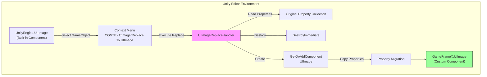
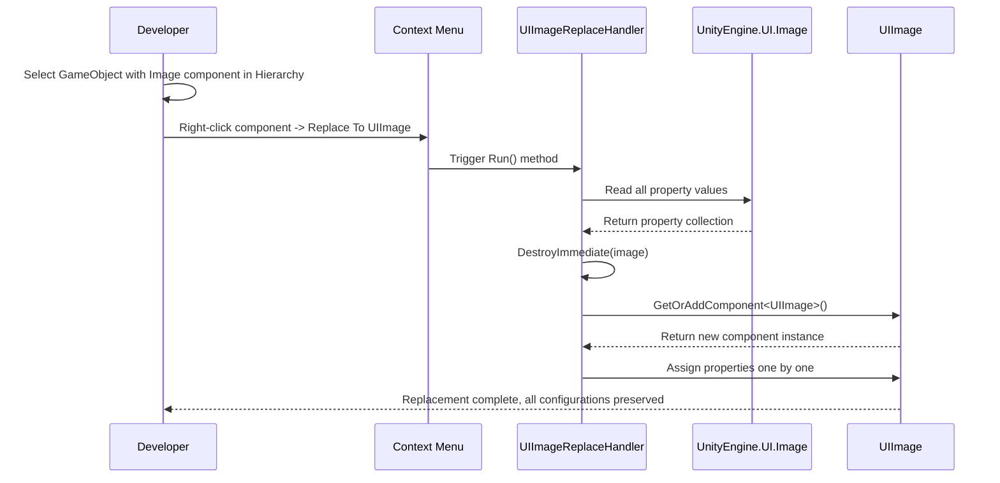

# Image Replace Handler

The Image Replace Handler is a core component in the GameFrameX UGUI editor tools, used to one-click replace Unity's built-in `Image` component with the custom `UIImage` component while preserving all original property configurations.

## Overview

When developing Unity UGUI projects, we often need to migrate existing UI interfaces to the GameFrameX framework. Manually replacing each Image component with UIImage is not only time-consuming but also prone to missing property configurations. The Image Replace Handler provides a fast, safe component replacement function through the context menu approach.

The tool automatically preserves the following properties during replacement:
- Image type (Simple, Sliced, Tiled, Filled)
- Material
- Sprite
- Fill Center
- Fill Method
- Fill Amount
- Alpha Hit Test Minimum Threshold
- Use Sprite Mesh
- Override Sprite
- Color
- Raycast Target
- Maskable

## How It Works

The Image Replace Handler is implemented based on Unity Editor's extension mechanism, adding context menu entry points for the built-in Image component through `CustomEditor` and `MenuItem` attributes.



### Replace Flow



## Usage

### Triggering Replacement

1. In Unity Editor's Hierarchy panel, select the GameObject containing the `Image` component
2. In the Inspector panel, right-click on the `Image` component title
3. In the context menu that appears, select **Replace To UIImage**

```csharp
// Usage: Trigger through context menu in Unity Editor
// Menu path: CONTEXT/Image/Replace To UIImage
```
> Source: [UIImageReplaceHandler.cs](https://github.com/GameFrameX/com.gameframex.unity.ui.ugui/blob/main/Editor/UIImageReplaceHandler.cs#L42-L43)

### Execution Logic

When the user clicks the menu item, the replace handler executes the following steps:

```csharp
[MenuItem("CONTEXT/Image/Replace To UIImage", false, 10)]
static void Run()
{
    // 1. Get selected Image component
    var image = Selection.activeGameObject.GetComponent<UnityEngine.UI.Image>();

    // 2. Read all property values
    var imageType = image.type;
    var material = image.material;
    var sprite = image.sprite;
    var color = image.color;
    var raycastTarget = image.raycastTarget;
    // ... Other properties

    // 3. Destroy original Image component
    DestroyImmediate(image);

    // 4. Add UIImage component
    var uiImage = Selection.activeGameObject.GetOrAddComponent<UIImage>();

    // 5. Copy all properties to new component
    uiImage.type = imageType;
    uiImage.material = material;
    uiImage.sprite = sprite;
    uiImage.color = color;
    // ... Assign all properties
}
```
> Source: [UIImageReplaceHandler.cs](https://github.com/GameFrameX/com.gameframex.unity.ui.ugui/blob/main/Editor/UIImageReplaceHandler.cs#L43-L76)

## Core Implementation

### CustomEditor Registration

The tool registers with the Unity Editor through the `CustomEditor` attribute, making it a custom inspector for `UnityEngine.UI.Image`:

```csharp
[CustomEditor(typeof(UnityEngine.UI.Image))]
public class UIImageReplaceHandler : UnityEditor.Editor
{
    // ...
}
```
> Source: [UIImageReplaceHandler.cs](https://github.com/GameFrameX/com.gameframex.unity.ui.ugui/blob/main/Editor/UIImageReplaceHandler.cs#L39-L40)

### MenuItem Menu Item

Uses the `MenuItem` attribute to add an entry point in the Image component's context menu:

```csharp
[MenuItem("CONTEXT/Image/Replace To UIImage", false, 10)]
static void Run()
```
> Source: [UIImageReplaceHandler.cs](https://github.com/GameFrameX/com.gameframex.unity.ui.ugui/blob/main/Editor/UIImageReplaceHandler.cs#L42-L43)

## UIImage Component Description

The generated `UIImage` component after replacement inherits from `UnityEngine.UI.Image` and additionally provides icon resource path setting functionality:

```csharp
public class UIImage : UnityEngine.UI.Image
{
    /// <summary>
    /// Gets or sets the icon resource path.
    /// Automatically loads the icon from the resource system after setting.
    /// </summary>
    public string icon
    {
        get { return m_icon; }
        set
        {
            if (m_icon != value)
            {
                m_icon = value;
                _ = this.SetIconAsync(m_icon);
            }
        }
    }
}
```
> Source: [UIImage.cs](https://github.com/GameFrameX/com.gameframex.unity.ui.ugui/blob/main/Runtime/UIImage.cs#L41-L72)

## Applicable Scenarios

| Scenario | Description |
|------|------|
| Project Initialization Migration | Migrate existing Unity UGUI projects to the GameFrameX framework |
| Batch Replace Testing | Replace a single component first to test UIImage functionality, then batch migrate |
| Component Upgrade | Add icon path loading functionality to existing Image components |

## Precautions

1. **Replacement is Irreversible**: The original Image component will be immediately destroyed after replacement. It is recommended to back up the scene before replacement.
2. **Dependency Retention**: Ensure GameFrameX.Runtime dependencies are correctly configured in the project because the `GetOrAddComponent` extension method is used.
3. **Multi-component Scenarios**: If there are multiple components on the GameObject that depend on the Image component (such as references from other scripts), ensure these references are updated before replacement.

## Related Links

- [UIImage Component](./09.uiimage.md)
- [Component Inspector](./11.inspector.md)
- [Code Generator](./10.code-generator.md)
- [UGUI Base Class](./06.ugui-base.md)
