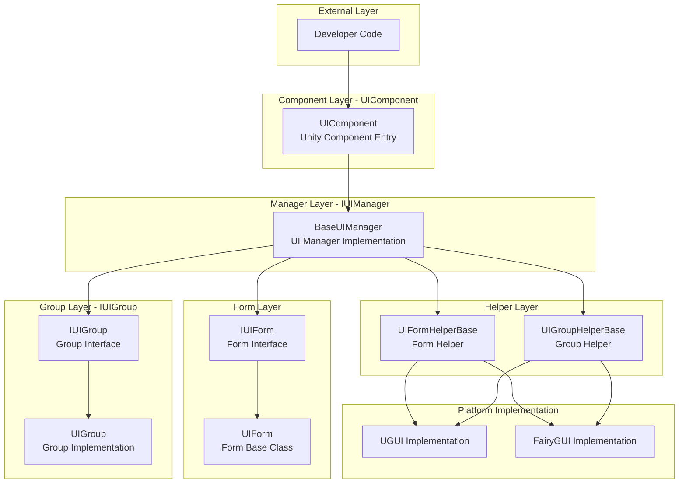
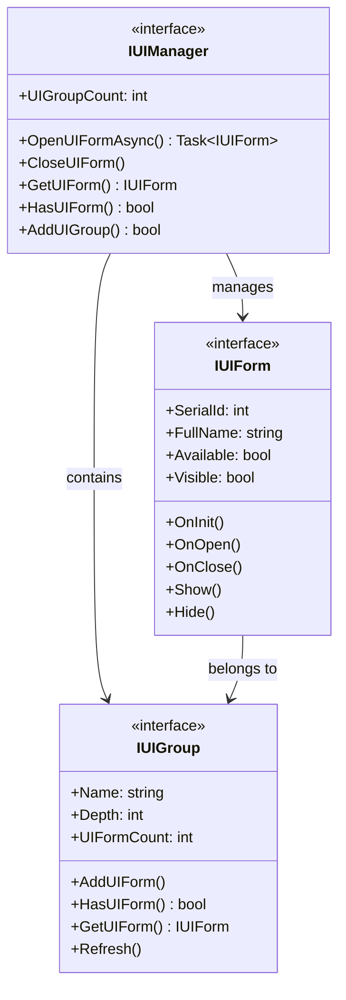
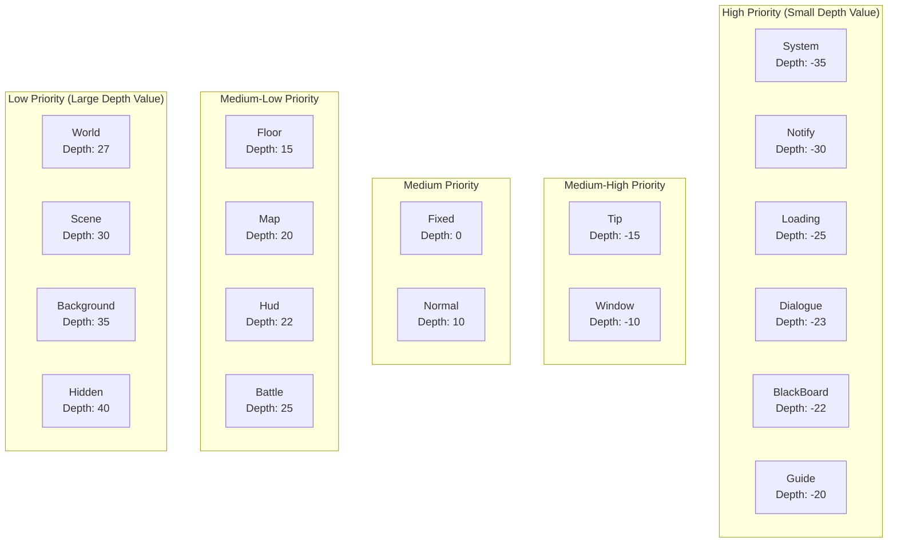
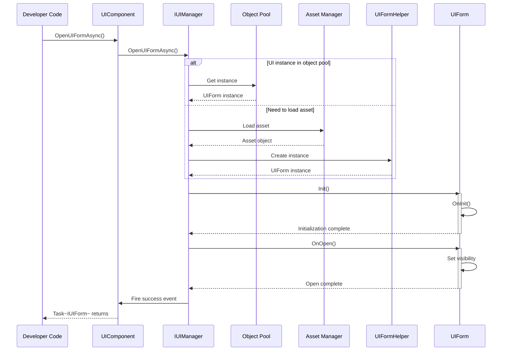
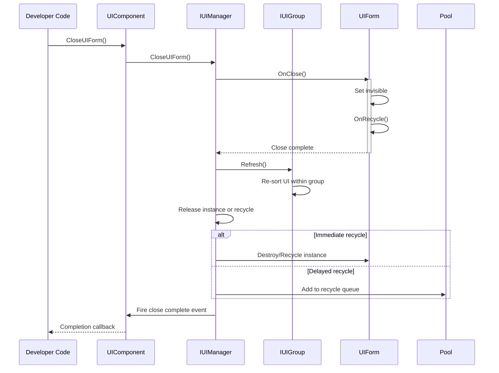

# Overview

Game Frame X UI is the UI component of the GameFrameX framework, providing a complete Unity UI management solution. The system supports both UGUI and FairyGUI, two mainstream UI systems, and offers a unified interface design, layered management, object pool reuse, and a complete event-driven mechanism.

## Overview

Game Frame X UI is the core UI management system of the GameFrameX game framework, designed specifically for Unity game development. The system features a modern architecture that supports both UGUI and FairyGUI rendering systems, allowing developers to choose flexibly based on project requirements. The UI system provides complete lifecycle management, from UI loading, displaying, and hiding to closing and recycling. Each step has well-defined event callbacks, enabling developers to precisely control UI behavior.

The core design philosophy of the system is "unified interface, flexible configuration." Regardless of which underlying UI system is used, developers interact with the UI through the unified `IUIManager` interface for operations such as opening, closing, and querying. At the same time, the system supports extensive customization, allowing developers to configure different UI group helpers and UI form helpers to meet specific functional requirements. This design ensures both code simplicity and sufficient flexibility to handle various complex game UI scenarios.

Game Frame X UI also deeply integrates with other core components of the GameFrameX framework, including the asset management system, object pool system, and event system. This deep integration enables the UI system to efficiently manage the loading and recycling of UI resources while achieving loosely coupled communication between modules through the event system. Developers can subscribe to UI events to achieve cross-system logic coordination without directly depending on specific UI implementation classes.

## Architecture Design

Game Frame X UI adopts a layered architecture design, consisting of the interface layer, implementation layer, component layer, and editor layer from bottom to top. Each layer has clearly defined responsibilities, and layers communicate through interfaces. This design greatly improves code maintainability and extensibility.



**Architecture Description:**

- **Component Layer (UIComponent)**: Acts as a Unity GameObject component and serves as the entry point for the entire UI system, responsible for initializing and managing the IUIManager implementation
- **Manager Layer (IUIManager)**: Core interface that defines all operations for UI forms and UI groups, including open, close, query, and other methods
- **Form Layer (IUIForm/UIForm)**: Interface definition and base class implementation for UI forms, providing complete lifecycle methods
- **Group Layer (IUIGroup)**: UI group interface for managing UI forms at the same level, controlling display depth and priority
- **Helper Layer**: Platform-specific implementation helper classes that handle the underlying differences between UGUI and FairyGUI
- **Platform Implementation Layer**: Concrete UGUI or FairyGUI implementations that encapsulate respective platform API calls

### Core Interface Relationships

The core interfaces of the UI system include IUIManager, IUIForm, and IUIGroup, which together form the foundation of UI management. IUIManager is responsible for overall UI management, including creating and destroying UI forms, managing UI groups, and dispatching events. IUIForm defines the behavioral contract for individual UI forms, including lifecycle methods such as initialization, opening, closing, showing, and hiding. IUIGroup is responsible for managing a group of related UI forms, controlling their depth and display order.



This interface design follows the Dependency Inversion Principle, where upper-level modules depend on abstract interfaces rather than concrete implementations, giving the system good testability and replaceability. Developers can replace the default UGUI or FairyGUI implementations by implementing custom helpers without modifying upper-level business logic code.

## Core Concepts

### UI Form (UIForm)

A UI form is the most basic operational unit in the UI system. Each visible UI interface corresponds to a UIForm instance. UIForm inherits from Unity's MonoBehaviour and can be directly attached to a Prefab for use. As a base class, it provides complete lifecycle hooks that developers override to handle specific UI logic.

```csharp
using GameFrameX.UI.Runtime;
using UnityEngine;

public class MainMenuUI : UIForm
{
    protected override void OnInit(object userData)
    {
        base.OnInit(userData);
        // Initialize UI element references
        // Bind button events, etc.
    }

    protected override void OnOpen(object userData)
    {
        base.OnOpen(userData);
        // Logic when UI opens
        // Play entrance animation
        // Refresh interface data
    }

    protected override void OnClose(bool isShutdown, object userData)
    {
        base.OnClose(isShutdown, userData);
        // Cleanup when UI closes
    }
}
```
> Source: [UIForm.cs](https://github.com/GameFrameX/com.gameframex.unity.ui/blob/main/Runtime/UIForm.cs#L39-L100)

The UIForm lifecycle includes the following key methods: OnAwake is called immediately after the UI instance is created, suitable for event subscription and other initialization operations; OnInit is called when the UI is first initialized, used to set up UI elements and bind event handlers; OnOpen is called when the UI is displayed, can receive and process incoming user data; OnClose is called when the UI is closed, used for resource cleanup and state saving; OnPause and OnResume are called when the UI is obscured and restored, respectively.

### UI Component (UIComponent)

UIComponent is the core component in the Unity game scene, inheriting from GameFrameworkComponent. It is the main entry point for developers to interact with the UI system, providing static method wrappers for all UI operations. In practice, developers typically obtain an instance via `GameEntry.GetComponent<UIComponent>()` and then call its methods to manage the UI.

```csharp
// Get UI component instance
var uiComponent = GameEntry.GetComponent<UIComponent>();

// Open UI synchronously
uiComponent.OpenUIForm("MainMenuUI", "Normal");

// Open UI asynchronously
var mainMenu = await uiComponent.OpenUIFormAsync("MainMenuUI", "Normal");

// Close UI
uiComponent.CloseUIForm("MainMenuUI");

// Check if UI exists
if (uiComponent.HasUIForm("MainMenuUI"))
{
    // UI is open
}
```
> Source: [UIComponent.cs](https://github.com/GameFrameX/com.gameframex.unity.ui/blob/main/Runtime/UIComponent.cs#L48-L114)

UIComponent encapsulates all functionality of IUIManager and adds convenience methods. It also manages object pool configuration, including instance capacity, expiration time, and automatic recycling interval. By configuring these parameters, developers can optimize memory usage and performance.

### UI Group System

UI groups are containers for organizing and managing UI forms. Each UI group has a name and a depth value. The depth value determines the display priority of the UI; the smaller the depth value, the higher the UI layer. When opening a new UI form, you need to specify its UI group, and the system determines the final display layer based on the group's depth value and the form's position within the group.

```csharp
// Add custom UI group
uiComponent.AddUIGroup("CustomGroup", -5);

// Get UI group
var group = uiComponent.GetUIGroup("Window");
```
> Source: [UIComponent.cs](https://github.com/GameFrameX/com.gameframex.unity.ui/blob/main/Runtime/BaseUIManager.cs#L200-L230)

The system predefines 18 standard UI groups, covering common game UI scenarios, from system announcements to battle interfaces, each with a corresponding layer. Developers can use these predefined groups directly or create custom groups as needed.

## UI Group Hierarchy

Game Frame X UI predefines 18 UI groups, each with a specific depth value. Smaller depth values indicate higher display layers. This means the System group with a depth value of -35 will be displayed above the Hidden group with a depth value of 40.



### Predefined UI Groups

| Group Name | Depth Value | Typical Usage |
|------------|-------------|---------------|
| System | -35 | System announcements, VIP alerts, and other top-level interfaces |
| Notify | -30 | Notification popups, marquees |
| Loading | -25 | Loading screens |
| Dialogue | -23 | Dialogue and story interfaces |
| BlackBoard | -22 | Blackboard/quest panels |
| Guide | -20 | Tutorial guide overlays |
| Tip | -15 | Tip popups, Toast messages |
| Window | -10 | Window-style interfaces |
| Fixed | 0 | Fixed UI at the bottom |
| Normal | 10 | Standard interfaces |
| Floor | 15 | Base layer UI |
| Map | 20 | Map interfaces |
| Hud | 22 | Overhead information, BUFF displays |
| Battle | 25 | Battle-related UI |
| World | 27 | World map UI |
| Scene | 30 | Scene transition interfaces |
| Background | 35 | Background UI |
| Hidden | 40 | Hidden UI (not visible) |

> Source: [UIGroupConstants.cs](https://github.com/GameFrameX/com.gameframex.unity.ui/blob/main/Runtime/UIGroupConstants.cs#L38-L202)

The depth value design follows these principles: negative depth is used for UI displayed above the game scene, such as dialogs and tips; zero and positive depth is used for in-game HUD elements; larger positive depth is used for background and low-priority UI. This design ensures that important UI is always displayed on top.

## Core Flows

### UI Opening Flow

Opening a UI form is one of the most common operations in the UI system. The entire process involves multiple steps including resource loading, instance creation, initialization, and display. Below is the complete asynchronous opening flow:



### UI Closing Flow

Closing a UI form also involves multiple steps, including hiding, recycling, and event triggering. The system supports both immediate recycling and delayed recycling modes.



## Event System

Game Frame X UI provides a complete event system for notifying UI state changes. Developers can subscribe to these events to respond to various UI state changes, achieving a loosely coupled code architecture.

### Event Types

| Event Class | Event ID | Description |
|-------------|----------|-------------|
| OpenUIFormSuccessEventArgs | UI open success event | Fired when a UI is successfully opened |
| OpenUIFormFailureEventArgs | UI open failure event | Fired when a UI fails to open |
| CloseUIFormCompleteEventArgs | UI close complete event | Fired when a UI is fully closed |
| UIFormVisibleChangedEventArgs | UI visibility changed event | Fired when a UI display state changes |

> Source: [Runtime/EventArgs/](https://github.com/GameFrameX/com.gameframex.unity.ui/blob/main/Runtime/EventArgs/)

### Event Subscription Example

```csharp
using GameFrameX.UI.Runtime;
using GameFrameX.Event.Runtime;

// Subscribe to events during game initialization
var eventComponent = GameEntry.GetComponent<EventComponent>();
eventComponent.Subscribe(OpenUIFormSuccessEventArgs.EventId, OnOpenUIFormSuccess);
eventComponent.Subscribe(OpenUIFormFailureEventArgs.EventId, OnOpenUIFormFailure);
eventComponent.Subscribe(CloseUIFormCompleteEventArgs.EventId, OnCloseUIFormComplete);

private void OnOpenUIFormSuccess(object sender, GameEventArgs e)
{
    var args = (OpenUIFormSuccessEventArgs)e;
    Debug.Log($"UI opened successfully: {args.UIForm.UIFormAssetName}");
}

private void OnOpenUIFormFailure(object sender, GameEventArgs e)
{
    var args = (OpenUIFormFailureEventArgs)e;
    Debug.LogError($"UI failed to open: {args.UIFormAssetName}, Error: {args.ErrorMessage}");
}

private void OnCloseUIFormComplete(object sender, GameEventArgs e)
{
    var args = (CloseUIFormCompleteEventArgs)e;
    Debug.Log($"UI closed: {args.UIFormAssetName}");
}
```
> Source: [UIComponent.cs](https://github.com/GameFrameX/com.gameframex.unity.ui/blob/main/Runtime/UIComponent.cs#L436-L465)

## Platform Support

Game Frame X UI supports both Unity's UGUI system and the FairyGUI plugin. This dual-track support is achieved through conditional compilation and the helper pattern. Developers can choose the appropriate rendering backend based on project requirements without modifying any business code.

### UGUI Support

UGUI is Unity's built-in UI system with good compatibility, making it the preferred choice for most Unity projects. The system provides a complete UGUI implementation, including Canvas management, event handling, and resource loading.

### FairyGUI Support

FairyGUI is a powerful third-party UI editor that provides a visual UI editing experience and efficient resource management. For projects that require complex UI interactions and rapid iteration, FairyGUI is an excellent choice.

Switching UI systems is straightforward -- simply add the corresponding compilation symbol (`ENABLE_UI_UGUI` or `ENABLE_UI_FAIRYGUI`) in Unity's Scripting Define Symbols. UIComponent automatically loads the corresponding helper implementation based on the compilation symbol.

## Dependencies

Game Frame X UI depends on other core components of the GameFrameX framework:

| Dependency | Minimum Version | Description |
|------------|-----------------|-------------|
| com.gameframex.unity | >= 1.1.1 | Core framework |
| com.gameframex.unity.asset | >= 1.0.6 | Asset management |
| com.gameframex.unity.event | >= 1.0.0 | Event system |
| com.gameframex.unity.localization | >= 1.0.0 | Localization support |

> Source: [package.json](https://github.com/GameFrameX/com.gameframex.unity.ui/blob/main/package.json)

## Related Links

- [Installation Guide](./2-installation)
- [Getting Started](./3-getting-started)
- [UI Component Details](./4-core-concepts.ui-component)
- [UI Form Details](./4-core-concepts.ui-form)
- [UI Group System](./4-core-concepts.ui-group)
- [Object Pool Management](./4-core-concepts.object-pool)
- [API Reference - IUIManager](./5-api-reference.iuimanager)
- [API Reference - UIComponent](./5-api-reference.ui-component)
- [API Reference - UIForm](./5-api-reference.ui-form)
- [API Reference - IUIGroup](./5-api-reference.iuigroup)
- [Event System Details](./6-event-system)
- [UI Group Hierarchy Details](./7-ui-group-hierarchy)
- [Editor Configuration](./8-configuration.editor)
- [UI Attributes Configuration](./8-configuration.attributes)
- [Platform Support](./9-platforms)
- [Troubleshooting](./10-troubleshooting)
- Official Documentation: https://gameframex.doc.alianblank.com/
- GitHub Repository: https://github.com/GameFrameX/com.gameframex.unity.ui
