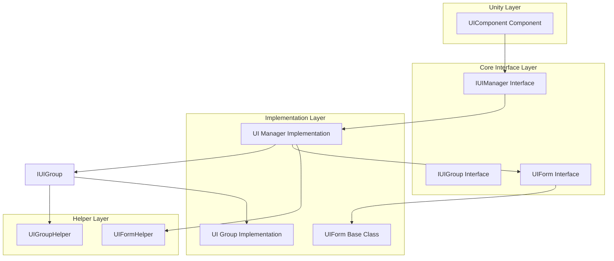
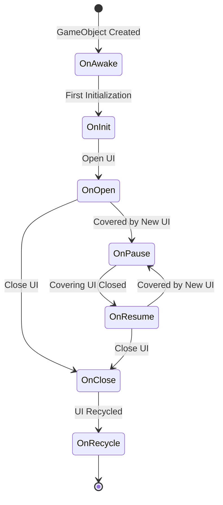
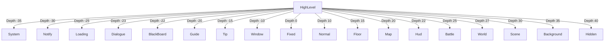

# Getting Started

This guide will help you get started quickly with the GameFrameX Unity UI system. Through this guide, you will learn how to configure UI components, create UI forms, and perform basic UI operations.

## Overview

GameFrameX Unity UI is a complete UI management solution that supports both UGUI and FairyGUI UI systems. The system provides a unified UI management interface, layered UI system, object pool management, event-driven mechanism, and asynchronous loading functionality.

**Prerequisites:**
- Unity 2019.4 or higher
- GameFrameX core framework installed

## System Architecture

The GameFrameX UI system adopts a component-based architecture design, consisting of the following core parts:



**Architecture Description:**
- **UIComponent**: Unity component, provides the developer-facing API entry point
- **IUIManager**: UI manager interface, defines core UI form operations
- **IUIGroup**: UI group interface, manages UI layer relationships
- **UIForm**: UI form base class, all custom UI forms should inherit from this class

## Configuring the UI Component

### Step 1: Add UIComponent

Create an empty GameObject in the Unity scene and add the `UIComponent` component:

1. Right-click in the Hierarchy panel and select **Create Empty**
2. Name the GameObject "UI"
3. In the Inspector panel, click **Add Component**
4. Search for and add the **GameFrameX/UI** component

> Source: [UIComponent.cs](https://github.com/GameFrameX/com.gameframex.unity.ui/blob/main/Runtime/UIComponent.cs#L48-L50)

### Step 2: Configure Component Properties

Configure the UIComponent properties in the Inspector panel:

| Property | Type | Default | Description |
|----------|------|---------|-------------|
| Enable Open UI Form Success Event | bool | true | Whether to enable UI open success event |
| Enable Open UI Form Failure Event | bool | true | Whether to enable UI open failure event |
| Enable Auto Release UI Form | bool | true | Whether to automatically recycle UI |
| Enable Close UI Form Complete Event | bool | true | Whether to fire completion event when closing UI |
| Is Enable UI Show Animation | bool | false | Whether to enable UI show animation |
| Is Enable UI Hide Animation | bool | false | Whether to enable UI hide animation |
| Instance Auto Release Interval | float | 60f | UI instance auto-release interval (seconds) |
| Instance Capacity | int | 16 | UI instance object pool capacity |
| Instance Expire Time | float | 60f | UI instance expiration time (seconds) |
| Recycle Interval | int | 60 | UI recycle interval (seconds) |

### Step 3: Set UI Root Node

Configure the appropriate root node based on the UI system you are using:

- **UGUI Root**: If using UGUI, set the Transform where the UGUI Canvas is located
- **FairyGUI Root**: If using FairyGUI, set the Transform where the FairyGUI root container is located

> Source: [UIComponent.cs](https://github.com/GameFrameX/com.gameframex.unity.ui/blob/main/Runtime/UIComponent.cs#L145-L161)

## Creating UI Forms

### Create Custom UI by Inheriting UIForm

All custom UI forms need to inherit from the `UIForm` base class. Here is a complete main menu UI example:

```csharp
using GameFrameX.UI.Runtime;
using UnityEngine;
using UnityEngine.UI;

public class MainMenuUI : UIForm
{
    [SerializeField] private Button startButton;
    [SerializeField] private Button settingsButton;
    [SerializeField] private Button exitButton;

    protected override void OnInit(object userData)
    {
        base.OnInit(userData);
        
        // Bind button events
        startButton.onClick.AddListener(OnStartButtonClick);
        settingsButton.onClick.AddListener(OnSettingsButtonClick);
        exitButton.onClick.AddListener(OnExitButtonClick);
    }

    protected override void OnOpen(object userData)
    {
        base.OnOpen(userData);
        
        // Logic when UI opens
        Debug.Log("Main menu opened");
    }

    protected override void OnClose(bool isShutdown, object userData)
    {
        base.OnClose(isShutdown, userData);
        
        // Cleanup resources
    }

    private void OnStartButtonClick()
    {
        // Close current UI and open game UI
        UIComponent.CloseUIForm(this);
        GameEntry.GetComponent<UIComponent>().OpenUIFormAsync<GameUI>("UI/Game");
    }

    private void OnSettingsButtonClick()
    {
        // Open settings UI
        GameEntry.GetComponent<UIComponent>().OpenUIFormAsync<SettingsUI>("UI/Settings");
    }

    private void OnExitButtonClick()
    {
        // Exit game
        Application.Quit();
    }
}
```

> Source: [UIForm.cs](https://github.com/GameFrameX/com.gameframex.unity.ui/blob/main/Runtime/UIForm.cs#L47-L100)

### UIForm Lifecycle Methods

`UIForm` provides complete lifecycle hooks:



| Lifecycle Method | When Called | Purpose |
|-----------------|------------|---------|
| OnAwake | During Unity Awake | Initialize event subscribers |
| OnInit | When UI is first initialized | Bind UI elements, initialize data |
| OnOpen | Each time UI is opened | Refresh UI data, play animations |
| OnClose | When UI is closed | Clean up temporary data, save state |
| OnRecycle | When UI is recycled | Reset UI state |
| OnPause | When UI is covered | Pause UI-related logic |
| OnResume | When UI resumes display | Resume UI logic |
| OnUpdate | Every frame update | Polling logic processing |

> Source: [UIForm.cs](https://github.com/GameFrameX/com.gameframex.unity.ui/blob/main/Runtime/UIForm.cs#L530-L610)

## Basic Operations

### Get UIComponent Instance

```csharp
// Get UIComponent through GameEntry
var uiComponent = GameEntry.GetComponent<UIComponent>();
```

> Source: [UIComponent.cs](https://github.com/GameFrameX/com.gameframex.unity.ui/blob/main/Runtime/UIComponent.cs#L48-L50)

### Open UI Form

**Asynchronous Method (Recommended):**

```csharp
var uiComponent = GameEntry.GetComponent<UIComponent>();

// Method 1: Use generic method to auto-resolve path
var mainMenu = await uiComponent.OpenUIFormAsync<MainMenuUI>();

// Method 2: Specify asset path
var mainMenu = await uiComponent.OpenUIFormAsync<MainMenuUI>("UI/MainMenu");

// Method 3: Pass user data
var userData = new { playerName = "Player1", level = 10 };
var mainMenu = await uiComponent.OpenUIFormAsync<MainMenuUI>("UI/MainMenu", userData);

// Method 4: Specify whether to pause covered UI
var mainMenu = await uiComponent.OpenUIFormAsync<MainMenuUI>("UI/MainMenu", false); // false = do not pause
```

> Source: [UIComponent.Open.cs](https://github.com/GameFrameX/com.gameframex.unity.ui/blob/main/Runtime/UIComponent.Open.cs#L115-L155)

### Close UI Form

```csharp
var uiComponent = GameEntry.GetComponent<UIComponent>();

// Method 1: Close current UI (from within UIForm)
UIComponent.CloseUIForm(this);

// Method 2: Close by type
uiComponent.CloseUIForm<MainMenuUI>();

// Method 3: Close by instance
uiComponent.CloseUIForm(mainMenuUI);

// Method 4: Close by serial ID
uiComponent.CloseUIForm(serialId);

// Method 5: Close all loaded UI
uiComponent.CloseAllLoadedUIForms();

// Method 6: Immediate recycle (skip object pool)
uiComponent.CloseUIForm(mainMenuUI, true); // isNowRecycle = true
```

> Source: [IUIManager.cs](https://github.com/GameFrameX/com.gameframex.unity.ui/blob/main/Runtime/UI/IUIManager.cs#L385-L455)

### Get UI Form

```csharp
var uiComponent = GameEntry.GetComponent<UIComponent>();

// Get by serial ID
var uiForm = uiComponent.GetUIForm(serialId);

// Get by asset name
var uiForm = uiComponent.GetUIForm("MainMenuUI");

// Check if UI exists
if (uiComponent.HasUIForm("MainMenuUI"))
{
    // UI is open
}
```

> Source: [IUIManager.cs](https://github.com/GameFrameX/com.gameframex.unity.ui/blob/main/Runtime/UI/IUIManager.cs#L252-L290)

## UI Group System

### What Are UI Groups

UI groups are used to manage the layering of UI. The framework predefines 18 UI groups, each with a specific depth value.

### UI Group Hierarchy



**Depth Value Description:** Smaller depth values indicate higher display layers (closer to the front). For example, the System group (-35) will be displayed above all other UI.

> Source: [UIGroupConstants.cs](https://github.com/GameFrameX/com.gameframex.unity.ui/blob/main/Runtime/UIGroupConstants.cs#L38-L202)

### Using UI Groups

You can specify the UI group when opening a UI:

```csharp
var uiComponent = GameEntry.GetComponent<UIComponent>();

// Open normal UI (uses default Normal group)
await uiComponent.OpenUIFormAsync<MainMenuUI>("UI/MainMenu");

// Open dialog (uses Dialogue group)
await uiComponent.OpenUIFormAsync<DialogueUI>("UI/Dialogue");

// Open tip (uses Tip group)
await uiComponent.OpenUIFormAsync<TipUI>("UI/Tip");
```

### Predefined UI Group Constants

| Group Name | Depth Value | Typical Usage |
|-----------|-------------|---------------|
| System | -35 | System announcements, version info |
| Notify | -30 | Notifications, marquees |
| Loading | -25 | Loading screens |
| Dialogue | -23 | Dialogs |
| BlackBoard | -22 | Blackboard interfaces |
| Guide | -20 | Tutorials |
| Tip | -15 | Tips |
| Window | -10 | Window interfaces |
| Fixed | 0 | Fixed UI (e.g., bottom navigation) |
| Normal | 10 | Standard interfaces |
| Floor | 15 | Base layer interfaces |
| Map | 20 | Map interfaces |
| Hud | 22 | Overhead info |
| Battle | 25 | Battle UI |
| World | 27 | World UI |
| Scene | 30 | Scene UI |
| Background | 35 | Background UI |
| Hidden | 40 | Hidden UI |

> Source: [UIGroupConstants.cs](https://github.com/GameFrameX/com.gameframex.unity.ui/blob/main/Runtime/UIGroupConstants.cs#L38-L202)

## Event System

### Subscribing to UI Events

The GameFrameX UI system provides a complete event notification mechanism:

```csharp
using GameFrameX.UI.Runtime;
using GameFrameX.Event.Runtime;

public class UIManagerExample : MonoBehaviour
{
    private void Start()
    {
        var eventComponent = GameEntry.GetComponent<EventComponent>();
        
        // Subscribe to UI open success event
        eventComponent.Subscribe(OpenUIFormSuccessEventArgs.EventId, OnOpenUIFormSuccess);
        
        // Subscribe to UI open failure event
        eventComponent.Subscribe(OpenUIFormFailureEventArgs.EventId, OnOpenUIFormFailure);
        
        // Subscribe to UI close complete event
        eventComponent.Subscribe(CloseUIFormCompleteEventArgs.EventId, OnCloseUIFormComplete);
    }

    private void OnOpenUIFormSuccess(object sender, GameEventArgs e)
    {
        var args = (OpenUIFormSuccessEventArgs)e;
        Debug.Log($"UI opened successfully: {args.UIForm.UIFormAssetName}");
    }

    private void OnOpenUIFormFailure(object sender, GameEventArgs e)
    {
        var args = (OpenUIFormFailureEventArgs)e;
        Debug.LogError($"UI failed to open: {args.UIFormAssetName}, Error: {args.ErrorMessage}");
    }

    private void OnCloseUIFormComplete(object sender, GameEventArgs e)
    {
        var args = (CloseUIFormCompleteEventArgs)e;
        Debug.Log($"UI closed: {args.UIFormAssetName}");
    }
}
```

> Source: [IUIManager.cs](https://github.com/GameFrameX/com.gameframex.unity.ui/blob/main/Runtime/UI/IUIManager.cs#L109-L142)

### Available Event Types

| Event Type | Description | When Triggered |
|-----------|-------------|----------------|
| OpenUIFormSuccessEventArgs | UI opened successfully | After UI successfully opens |
| OpenUIFormFailureEventArgs | UI failed to open | When UI fails to open |
| CloseUIFormCompleteEventArgs | UI close completed | After UI is fully closed |
| UIFormVisibleChangedEventArgs | UI visibility changed | When UI is shown/hidden |

## Data Passing

### Passing Data When Opening UI

```csharp
// Create data class
public class ShopUIData
{
    public int PlayerId { get; set; }
    public List<Item> Items { get; set; }
    public string CurrencyType { get; set; }
}

// Open UI and pass data
var shopData = new ShopUIData 
{ 
    PlayerId = 123, 
    Items = itemList,
    CurrencyType = "Gold"
};
await uiComponent.OpenUIFormAsync<ShopUI>("UI/Shop", shopData);
```

### Receiving Data in UI

```csharp
public class ShopUI : UIForm
{
    private ShopUIData _shopData;

    protected override void OnOpen(object userData)
    {
        base.OnOpen(userData);
        
        // Receive passed data
        _shopData = userData as ShopUIData;
        if (_shopData != null)
        {
            // Initialize UI with data
            Debug.Log($"Shop data: Player ID = {_shopData.PlayerId}");
            RefreshShopItems(_shopData.Items);
        }
    }
}
```

> Source: [IUIManager.cs](https://github.com/GameFrameX/com.gameframex.unity.ui/blob/main/Runtime/UI/IUIManager.cs#L358-L383)

## Performance Optimization

### Object Pool Configuration

You can optimize memory usage by configuring object pool parameters:

```csharp
var uiComponent = GameEntry.GetComponent<UIComponent>();

// Set object pool capacity
uiComponent.InstanceCapacity = 20;

// Set instance expiration time (seconds)
uiComponent.InstanceExpireTime = 120f;

// Set auto-release interval (seconds)
uiComponent.InstanceAutoReleaseInterval = 60f;

// Set recycle interval (seconds)
uiComponent.RecycleInterval = 60;
```

> Source: [UIComponent.cs](https://github.com/GameFrameX/com.gameframex.unity.ui/blob/main/Runtime/UIComponent.cs#L320-L351)

### Performance Best Practices

1. **Use UI groups appropriately**: Place frequently switched UI in the same group to reduce depth adjustment overhead
2. **Enable object pool**: Keep default object pool configuration to avoid frequent creation and destruction
3. **Asynchronous loading**: Use async APIs to open UI to avoid blocking the main thread
4. **Close unused UI**: Close UI that is no longer needed in a timely manner to release resources
5. **Disable unnecessary animations**: If show/hide animations are not needed, disable them to improve performance

## Complete Example

Here is a complete game entry example demonstrating how to initialize and use the UI system:

```csharp
using GameFrameX.UI.Runtime;
using GameFrameX.Event.Runtime;
using UnityEngine;

public class GameEntryExample : MonoBehaviour
{
    private UIComponent _uiComponent;
    private EventComponent _eventComponent;

    private void Start()
    {
        // Get components
        _uiComponent = GetComponent<UIComponent>();
        _eventComponent = GetComponent<EventComponent>();
        
        // Configure UI component
        ConfigureUIComponent();
        
        // Subscribe to events
        SubscribeEvents();
        
        // Open main menu
        OpenMainMenu();
    }

    private void ConfigureUIComponent()
    {
        _uiComponent.InstanceCapacity = 16;
        _uiComponent.InstanceExpireTime = 60f;
        _uiComponent.RecycleInterval = 60;
    }

    private void SubscribeEvents()
    {
        _eventComponent.Subscribe(OpenUIFormSuccessEventArgs.EventId, OnOpenUIFormSuccess);
        _eventComponent.Subscribe(OpenUIFormFailureEventArgs.EventId, OnOpenUIFormFailure);
    }

    private async void OpenMainMenu()
    {
        try
        {
            var mainMenuUI = await _uiComponent.OpenUIFormAsync<MainMenuUI>("UI/MainMenu");
            Debug.Log("Main menu opened successfully");
        }
        catch (System.Exception ex)
        {
            Debug.LogError($"Failed to open main menu: {ex.Message}");
        }
    }

    private void OnOpenUIFormSuccess(object sender, GameEventArgs e)
    {
        var args = (OpenUIFormSuccessEventArgs)e;
        Debug.Log($"UI opened successfully: {args.UIForm.UIFormAssetName}");
    }

    private void OnOpenUIFormFailure(object sender, GameEventArgs e)
    {
        var args = (OpenUIFormFailureEventArgs)e;
        Debug.LogError($"UI failed to open: {args.UIFormAssetName}, Error: {args.ErrorMessage}");
    }
}
```

## Related Links

- [Overview](./1-overview) - Learn more about UI system features and architecture
- [Installation](./2-installation) - Detailed installation guide
- [UI Component](./4-core-concepts.ui-component) - UIComponent detailed documentation
- [UI Form](./4-core-concepts.ui-form) - UIForm detailed documentation
- [UI Group System](./4-core-concepts.ui-group) - UI group system detailed documentation
- [API Reference](./5-api-reference.ui-component) - Complete API documentation
- [Event System](./6-event-system) - Event system detailed description
- [UI Group Hierarchy](./7-ui-group-hierarchy) - UI group hierarchy detailed description
