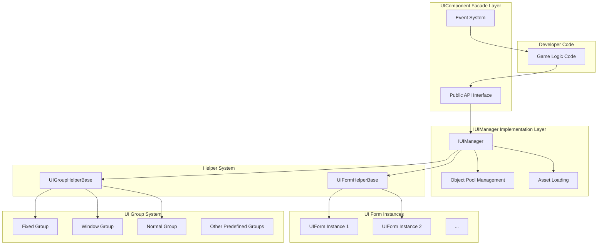
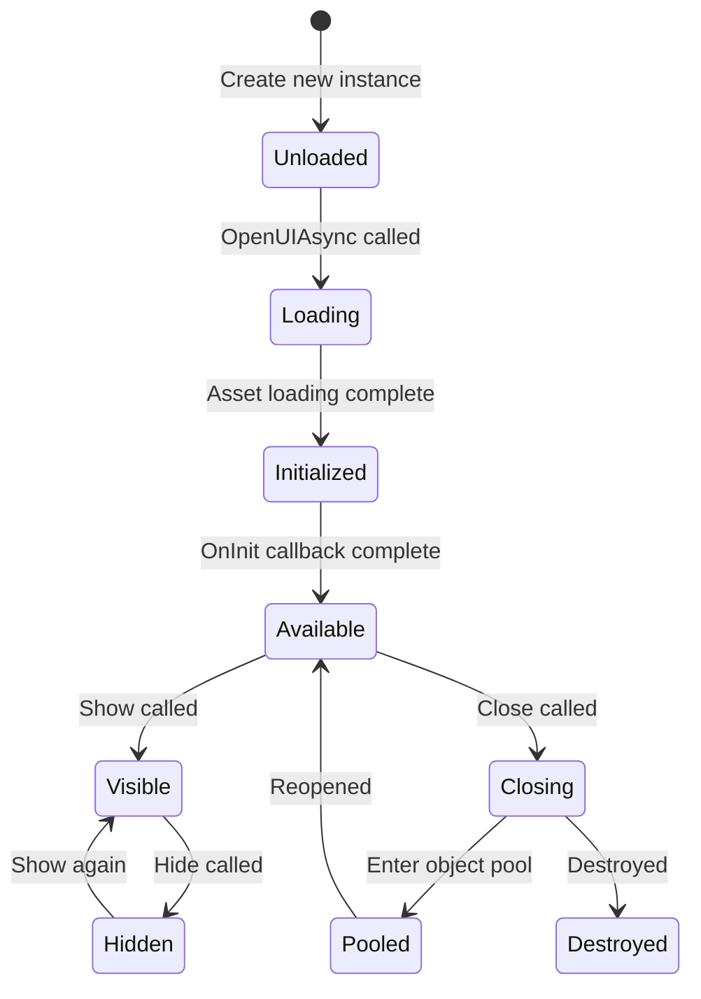
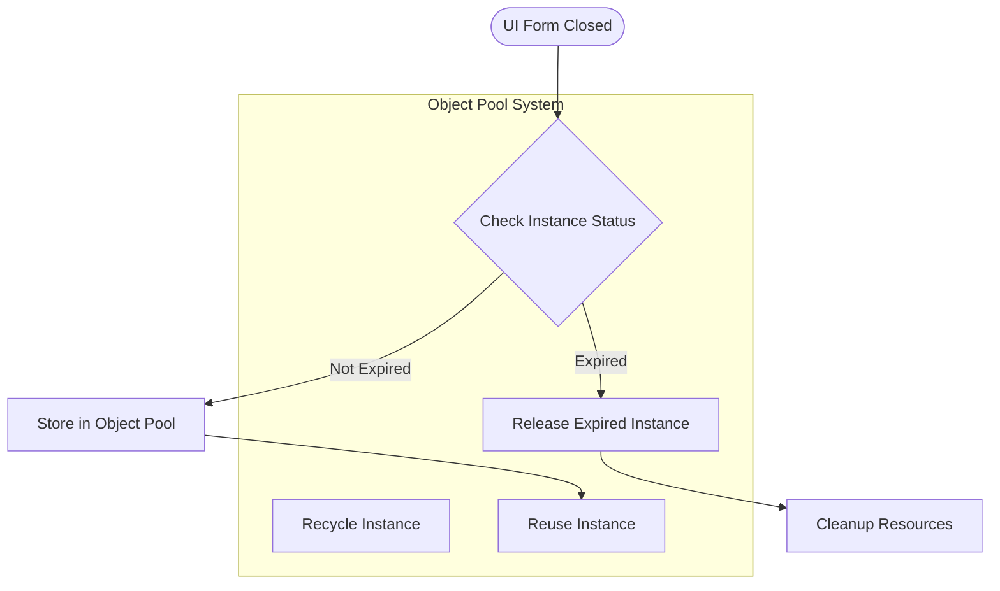
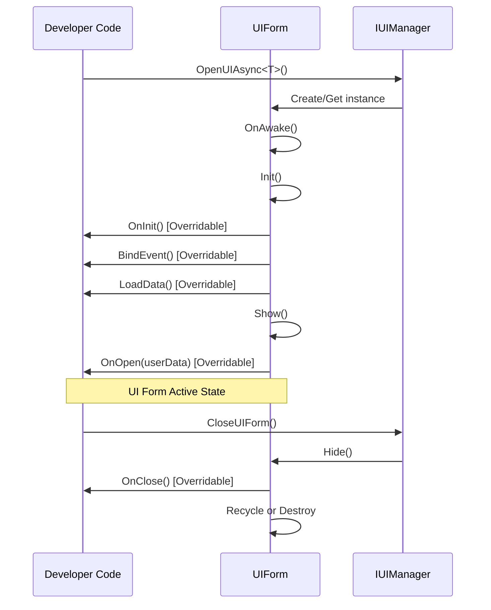

# UI Component

The UI Component (UIComponent) is the core component in the GameFrameX framework responsible for managing and operating UI forms. It serves as the facade of the UI system, encapsulating the complex implementation of the underlying `IUIManager` and providing developers with a simple and easy-to-use API interface.

## Overview

UIComponent is a Unity component (inheriting from GameFrameworkComponent) that manages the entire lifecycle of UI forms throughout the game, including loading, displaying, hiding, closing, and recycling. It uses the object pool pattern to manage UI form instances, effectively reducing the performance overhead of frequent creation and destruction.

UIComponent supports multiple UI rendering solutions, including Unity's native UGUI and the third-party UI framework FairyGUI. Through 18 predefined UI groups (UIGroup), it achieves precise layer control and occlusion management.

**Core Features:**
- Asynchronous loading and opening of UI forms
- Multiple ways to close UI forms (direct close, delayed close, group close)
- UI form object pool management
- UI group layer control
- Show/hide animation support
- Complete event system

> UIComponent is the core entry point of the UI system. For detailed API method descriptions, please refer to the [UIComponent API Reference](./5-api-reference.ui-component).

## Architecture

UIComponent uses the Facade Pattern design, encapsulating complex UI management logic internally while exposing only a simple API for developers to use.



**Architecture Description:**

1. **Facade Layer (UIComponent)**: Provides a unified public API, including methods for opening, closing, and retrieving UI forms, as well as managing UI groups. Also responsible for event dispatching.

2. **Implementation Layer (IUIManager)**: Handles specific business logic, including UI form loading, caching, and show/hide state management.

3. **Object Pool Management**: Uses IObjectPoolManager to manage the reuse of UI form instances, supporting automatic recycling and expiration-based release.

4. **Helper Layer**: Includes UIFormHelperBase (responsible for UI form instance creation and destruction) and UIGroupHelperBase (responsible for UI group creation and management).

5. **UI Form Layer**: Actual UI form instances that inherit from the UIForm base class.

6. **UI Group Layer**: Used to organize and manage UI forms with the same layer properties.

## Core Concepts

### UI Form (UIForm)

A UI form is the smallest unit managed by the UI system. Each UI form inherits from the `UIForm` base class and implements the `IUIForm` interface. UI forms have the following states:

- **Available**: The form has completed initialization and can be displayed
- **Visible**: The form is currently being displayed
- **FromPool**: Whether the form instance was obtained from the object pool



### UI Group System

UI groups (UIGroup) are used to organize UI forms with similar display level characteristics. Each UI group has a depth value; the larger the depth value, the higher the level (displayed more in front).

**18 Predefined UI Groups:**

| UI Group Name | Depth Value | Usage |
|--------------|-------------|-------|
| Hidden | 40 | Hidden layer, for temporary storage |
| Background | 35 | Background layer |
| Scene | 30 | Scene layer |
| World | 27 | World layer (e.g., UI in 3D scenes) |
| Battle | 25 | Battle layer |
| Hud | 22 | Overhead info layer |
| Map | 20 | Map layer |
| Floor | 15 | Base layer |
| Normal | 10 | Standard layer |
| Fixed | 0 | Fixed layer |
| Window | -10 | Window layer |
| Tip | -15 | Tip layer |
| Guide | -20 | Guide layer |
| BlackBoard | -22 | Blackboard layer |
| Dialogue | -23 | Dialogue layer |
| Loading | -25 | Loading layer |
| Notify | -30 | Notification layer |
| System | -35 | System layer (highest priority) |

> For more details about UI groups, please refer to the [UI Group Hierarchy](./7-ui-group-hierarchy) documentation.

### Object Pool Management

UIComponent has a built-in powerful object pool management system with the following key parameters:

- **InstanceCapacity**: Object pool capacity, default 16
- **InstanceExpireTime**: Object expiration time (seconds), default 60 seconds
- **InstanceAutoReleaseInterval**: Auto-release interval (seconds), default 60 seconds
- **RecycleInterval**: Recycle interval (seconds), default 60 seconds
- **EnableAutoReleaseUIForm**: Whether to enable auto-release, default on



## Opening UI Forms

### Basic Usage

Use the `OpenAsync<T>()` method to asynchronously open a UI form:

```csharp
// Open fullscreen UI
var mainMenuForm = await UIComponent.Instance.OpenFullScreenAsync<MainMenuForm>();

// Open non-fullscreen UI
var settingsForm = await UIComponent.Instance.OpenAsync<SettingsForm>(false);

// Open with user data
var dialogData = new DialogData { Title = "Confirm", Message = "Are you sure?" };
var confirmForm = await UIComponent.Instance.OpenAsync<ConfirmForm>(false, dialogData);
```

> For more UI opening API methods, please refer to [UIComponent API Reference - Open Methods](./5-api-reference.ui-component#open-methods).

### Using UI Group Attributes

You can specify the UI group for a UI form using the `[OptionUIGroup]` attribute:

```csharp
[OptionUIGroup(UIGroupNameConstants.Window)]
public class MyWindowForm : UIForm
{
    // Window content
}
```

## Closing UI Forms

### Closing a Single UI

```csharp
// Close by instance
var form = UIComponent.Instance.GetLoaded<SettingsForm>();
UIComponent.Instance.CloseUIForm(form);

// Close by type (closes the first match)
UIComponent.Instance.CloseUIForm<SettingsForm>();

// Close by serial ID
UIComponent.Instance.CloseUIForm(serialId);
```

### Closing Multiple UIs

```csharp
// Close all loaded UIs
UIComponent.Instance.CloseAllLoadedUIForms();

// Close all UIs in a specified group
UIComponent.Instance.CloseUIGroup(UIGroupNameConstants.Window);

// Close all loading UIs
UIComponent.Instance.CloseAllLoadingUIForms();
```

## Getting UI Forms

### Querying Loaded UIs

```csharp
// Get a single UI (by type)
var form = UIComponent.Instance.GetLoaded<MainMenuForm>();

// Get all UIs matching a type
var forms = UIComponent.Instance.GetLoadedList<DialogForm>();

// Get loaded and currently showing UI
var visibleForm = UIComponent.Instance.GetLoadedAndShowing<AlertForm>();

// Check if a specific UI is currently showing
bool isShowing = UIComponent.Instance.HasLoadedAndShowing("AlertForm");
```

### Getting All UIs

```csharp
// Get all loaded UIs
var allForms = UIComponent.Instance.GetAllLoadedUIForms();

// Get serial IDs of all loading UIs
var loadingIds = UIComponent.Instance.GetAllLoadingUIFormSerialIds();
```

## Managing UI Groups

### Adding Custom UI Groups

```csharp
// Add a new UI group
bool success = UIComponent.Instance.AddUIGroup("CustomGroup", 5);
```

### Querying UI Groups

```csharp
// Check if a UI group exists
bool exists = UIComponent.Instance.HasUIGroup("Window");

// Get a UI group
var group = UIComponent.Instance.GetUIGroup("Window");

// Get all UI groups
var allGroups = UIComponent.Instance.GetAllUIGroups();

// Get UI group count
int count = UIComponent.Instance.UIGroupCount;
```

## Configuration Options

UIComponent provides rich configuration options that can be set through the Inspector panel or code:

| Configuration Item | Type | Default | Description |
|-------------------|------|---------|-------------|
| EnableAutoReleaseUIForm | bool | true | Whether to enable automatic UI release |
| EnableCloseUIFormCompleteEvent | bool | true | Whether to fire completion event when closing UI |
| IsEnableUIShowAnimation | bool | false | Whether to enable UI show animation |
| IsEnableUIHideAnimation | bool | false | Whether to enable UI hide animation |
| InstanceAutoReleaseInterval | float | 60f | UI instance auto-release interval (seconds) |
| InstanceCapacity | int | 16 | UI instance object pool capacity |
| InstanceExpireTime | float | 60f | UI instance expiration time (seconds) |
| RecycleInterval | int | 60 | UI recycle interval (seconds) |
| UGUIRoot | Transform | null | UGUI root node |
| FairyGUIRoot | Transform | null | FairyGUI root node |

### Code Configuration Example

```csharp
// Disable auto-release
UIComponent.Instance.EnableAutoReleaseUIForm = false;

// Set object pool capacity
UIComponent.Instance.InstanceCapacity = 32;

// Set instance expiration time
UIComponent.Instance.InstanceExpireTime = 120f;

// Set recycle interval
UIComponent.Instance.RecycleInterval = 30;
```

## UI Form Lifecycle

UI forms have a complete lifecycle. Developers can override corresponding methods to respond to state changes:



### Overridable Methods

In a custom UIForm, you can override the following methods to handle lifecycle events:

| Method | When Called | Purpose |
|--------|-----------|---------|
| `OnAwake()` | After instance creation, before initialization | Execute Awake logic |
| `OnInit()` | When UI form is first initialized | Initialize UI components |
| `BindEvent()` | During initialization | Bind event listeners |
| `LoadData()` | During initialization | Load data |
| `OnOpen(object userData)` | When UI form opens | Handle open logic |
| `OnClose(bool isShutdown, object userData)` | When UI form closes | Handle close logic |
| `OnPause()` | When UI is covered | Handle pause logic |
| `OnResume()` | When UI resumes display | Handle resume logic |
| `OnUpdate(float elapseSeconds, float realElapseSeconds)` | Every frame update | Execute update logic |
| `UpdateLocalization()` | When language changes | Update localized text |

## Event System

UIComponent provides a comprehensive event system for monitoring UI form state changes:

### Subscribable Events

| Event Name | Description | Event Arguments |
|-----------|-------------|----------------|
| `OpenUIFormSuccess` | UI form opened successfully | OpenUIFormSuccessEventArgs |
| `OpenUIFormFailure` | UI form failed to open | OpenUIFormFailureEventArgs |
| `CloseUIFormComplete` | UI form closed | CloseUIFormCompleteEventArgs |

### Event Usage Example

```csharp
// Subscribe to open success event
UIComponent.Instance.OpenUIFormSuccess += OnOpenSuccess;

private void OnOpenSuccess(object sender, OpenUIFormSuccessEventArgs e)
{
    Debug.Log($"UI opened successfully: {e.UIFormAssetName}");
}

// Subscribe to close complete event
UIComponent.Instance.CloseUIFormComplete += OnCloseComplete;

private void OnCloseComplete(object sender, CloseUIFormCompleteEventArgs e)
{
    Debug.Log($"UI closed: {e.UIFormSerialId}");
}
```

> For detailed description of the event system, please refer to the [Event System](./6-event-system) documentation.

## Related Links

- [UIComponent API Reference](./5-api-reference.ui-component) - Complete API method descriptions
- [UI Form](./4-core-concepts.ui-form) - UIForm base class details
- [UI Group System](./4-core-concepts.ui-group) - UI group management details
- [Object Pool Management](./4-core-concepts.object-pool) - Object pool mechanism details
- [UI Group Hierarchy](./7-ui-group-hierarchy) - UI group hierarchy detailed description
- [UI Attributes](./8-configuration.attributes) - UI-related attribute descriptions
