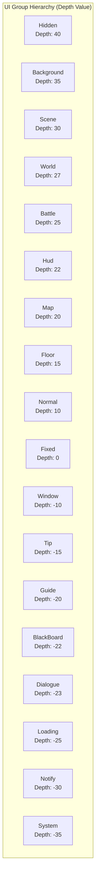

# UI Attributes

This document introduces the various attributes and serialized properties used to configure UI forms and components in the GameFrameX UI system.

## Overview

The GameFrameX UI system provides a rich attribute configuration mechanism that allows developers to configure UI form behavior through attributes and serialized fields. The main configuration areas include:

1. **UI Configuration Attributes** - Define the location and loading method of UI resources
2. **UI Group Attributes** - Assign UI to different layer groups
3. **Animation Attributes** - Configure show and hide animations for UI
4. **UIComponent Global Properties** - Control the overall behavior of the UI system
5. **UIForm Form Properties** - Control the behavior of individual forms

## UI Configuration Attributes

### OptionUIConfigAttribute

An attribute class used to mark UI configuration, supporting both FairyGUI and UGUI frameworks. By specifying a package name or path, it enables automatic location and loading of UI resources.

```csharp
[OptionUIConfigAttribute(packageName: "MainPackage", path: "UI/Prefabs/MainForm")]
public class MainForm : UIForm
{
    // ...
}
```

> Source: [OptionUIConfigAttribute.cs](https://github.com/GameFrameX/com.gameframex.unity.ui/blob/main/Runtime/Attribute/OptionUIConfigAttribute.cs#L42-L108)

**Property Description:**

| Property | Type | Description |
|----------|------|-------------|
| `PackageName` | string | Package name used by FairyGUI for locating the FairyGUI UI resource package |
| `Path` | string | Resource path used by UGUI for locating UGUI UI prefabs or resources |
| `IsResource` | bool | Whether it is a resource path. If true, Path is a resource path; if false, Path is a UI prefab path |

**Constructors:**

```csharp
// Method 1: Specify package name and path
public OptionUIConfigAttribute(string packageName = null, string path = null)

// Method 2: Specify whether it is a resource path
public OptionUIConfigAttribute(bool isResource = false)
```

---

### OptionUIGroupAttribute

An attribute used to specify a UI option group for a class. Can only be applied to classes, and the group name cannot be empty.

```csharp
[OptionUIGroupAttribute("Dialog")]
public class DialogForm : UIForm
{
    // ...
}
```

> Source: [OptionUIGroupAttribute.cs](https://github.com/GameFrameX/com.gameframex.unity.ui/blob/main/Runtime/Attribute/OptionUIGroupAttribute.cs#L42-L73)

**Property Description:**

| Property | Type | Description |
|----------|------|-------------|
| `GroupName` | string | Group name, used to assign UI to a specific UI group |

---

### OptionUIShowAnimationAttribute

An attribute used to specify the animation to play when a UI opens. Can be applied to classes to specify the animation name and whether the animation is enabled.

```csharp
// Enable show animation named "FadeIn"
[OptionUIShowAnimationAttribute("FadeIn")]
public class MainForm : UIForm
{
    // ...
}

// Disable show animation
[OptionUIShowAnimationAttribute(false)]
public class TipForm : UIForm
{
    // ...
}
```

> Source: [OptionUIShowAnimationAttribute.cs](https://github.com/GameFrameX/com.gameframex.unity.ui/blob/main/Runtime/Attribute/OptionUIShowAnimationAttribute.cs#L42-L94)

**Property Description:**

| Property | Type | Description |
|----------|------|-------------|
| `AnimationName` | string | Animation name, specifies the name of the animation to play |
| `Enable` | bool | Whether to enable the animation, default is true |

**Constructors:**

```csharp
public OptionUIShowAnimationAttribute(string animationName, bool enable = true)
public OptionUIShowAnimationAttribute(bool enable = true)
```

---

### OptionUIHideAnimationAttribute

An attribute used to specify the animation to play when a UI closes. Can be applied to classes to specify the animation name and whether the animation is enabled.

```csharp
// Enable hide animation named "FadeOut"
[OptionUIHideAnimationAttribute("FadeOut")]
public class MainForm : UIForm
{
    // ...
}

// Disable hide animation
[OptionUIHideAnimationAttribute(false)]
public class TipForm : UIForm
{
    // ...
}
```

> Source: [OptionUIHideAnimationAttribute.cs](https://github.com/GameFrameX/com.gameframex.unity.ui/blob/main/Runtime/Attribute/OptionUIHideAnimationAttribute.cs#L42-L94)

**Property Description:**

| Property | Type | Description |
|----------|------|-------------|
| `AnimationName` | string | Animation name, specifies the name of the animation to play |
| `Enable` | bool | Whether to enable the animation, default is true |

---

## UIComponent Global Properties

UIComponent is the core component of the UI system, providing global UI configuration options. These properties are visible and configurable through the Inspector panel via Unity's SerializeField attribute.

> Source: [UIComponent.cs](https://github.com/GameFrameX/com.gameframex.unity.ui/blob/main/Runtime/UIComponent.cs#L48-L226)

### Event Control Properties

| Property | Type | Default | Description |
|----------|------|---------|-------------|
| `EnableOpenUIFormSuccessEvent` | bool | true | Whether to enable the UI open success event. When enabled, the corresponding event is fired when a UI opens successfully |
| `EnableOpenUIFormFailureEvent` | bool | true | Whether to enable the UI open failure event. When enabled, the corresponding event is fired when a UI fails to open |
| `EnableCloseUIFormCompleteEvent` | bool | true | Whether to enable the UI close complete event. When enabled, the corresponding event is fired when a UI is fully closed |

### Object Pool Properties

| Property | Type | Default | Description |
|----------|------|---------|-------------|
| `EnableAutoReleaseUIForm` | bool | true | Whether to enable automatic UI recycling. When disabled, resources are not automatically released when UI is closed |
| `InstanceAutoReleaseInterval` | float | 60f | Interval in seconds for the UI instance object pool to automatically release releasable objects |
| `InstanceCapacity` | int | 16 | Capacity of the UI instance object pool, the maximum number of UI instances that can be cached |
| `InstanceExpireTime` | float | 60f | Expiration time in seconds for UI instance object pool objects; instances can be reused within this time after closing |
| `RecycleInterval` | int | 60 | UI recycle interval time (seconds) |

### Animation Properties

| Property | Type | Default | Description |
|----------|------|---------|-------------|
| `IsEnableUIShowAnimation` | bool | false | Whether to enable UI show animation |
| `IsEnableUIHideAnimation` | bool | false | Whether to enable UI hide animation |

### Root Node Properties

| Property | Type | Description |
|----------|------|-------------|
| `UGUIRoot` | Transform | UGUI root node |
| `FairyGUIRoot` | Transform | FairyGUI root node |

### Helper Properties

| Property | Type | Description |
|----------|------|-------------|
| `UIFormHelperTypeName` | string | UI form helper type name |
| `CustomUIFormHelper` | UIFormHelperBase | Custom UI form helper |
| `UIGroupHelperTypeName` | string | UI group helper type name |
| `CustomUIGroupHelper` | UIGroupHelperBase | Custom UI group helper |

### UI Group Configuration

| Property | Type | Description |
|----------|------|-------------|
| `UIGroups` | UIGroup[] | UI group array, default includes 18 predefined groups |

---

## UIForm Form Properties

UIForm is the base class for all UI forms, containing various runtime state properties.

> Source: [UIForm.cs](https://github.com/GameFrameX/com.gameframex.unity.ui/blob/main/Runtime/UIForm.cs#L47-L856)

### State Properties (Runtime)

| Property | Type | Description |
|----------|------|-------------|
| `Available` | bool | Whether the form is available |
| `Visible` | bool | Whether the form is visible |
| `SerialId` | int | Form serial ID |
| `Name` | string | Form name |
| `FullName` | string | Form full name (including namespace) |
| `UIFormAssetName` | string | Form asset name |
| `AssetPath` | string | Form asset path |
| `IsAwake` | bool | Whether the form has been awakened |
| `IsFromPool` | bool | Whether the form is from the object pool |
| `IsDisposed` | bool | Whether the form has been disposed |

### Behavior Control Properties

| Property | Type | Default | Description |
|----------|------|---------|-------------|
| `IsDisableRecycling` | bool | false | Whether to disable recycling; forms with disabled recycling will not be recycled |
| `IsDisableClosing` | bool | false | Whether to disable closing; forms with disabled closing cannot be closed |
| `IsCenter` | bool | false | Whether to enable component centering; components are centered relative to their parent by default after creation |
| `PauseCoveredUIForm` | bool | true | Whether to pause covered forms |
| `RecycleInterval` | int | - | Form recycle interval, in seconds |

### Animation Properties

| Property | Type | Description |
|----------|------|-------------|
| `EnableShowAnimation` | bool | Whether to enable show animation |
| `ShowAnimationName` | string | Show animation name |
| `EnableHideAnimation` | bool | Whether to enable hide animation |
| `HideAnimationName` | string | Hide animation name |

### Layer Properties

| Property | Type | Description |
|----------|------|-------------|
| `DepthInUIGroup` | int | Depth of the form within the UI group |
| `UIGroup` | IUIGroup | The UI group the form belongs to |

---

## UI Group Hierarchy Constants

The GameFrameX UI system predefines 18 UI groups, each with a corresponding depth value (Depth) and name (Name).



> Source: [UIGroupConstants.cs](https://github.com/GameFrameX/com.gameframex.unity.ui/blob/main/Runtime/UIGroupConstants.cs#L38-L202)

**UI Group Depth Description:**
- The larger the depth value, the more forward the UI is displayed (occlusion relationship)
- Predefined groups have depths ranging from 40 to -35, covering various game UI scenarios
- Larger Depth values indicate closer to the outside of the screen (topmost layer), negative values indicate closer to the inside of the screen (bottommost layer)

---

## Usage Examples

### Complete Configuration Example

The following example demonstrates how to use various attributes on a custom UI form class:

```csharp
using GameFrameX.UI.Runtime;

// UI configuration attribute: specify FairyGUI package name and UGUI path
// UI group attribute: assign this form to the Window group
[OptionUIConfigAttribute(packageName: "GameUI", path = "UI/Forms/MainMenu")]
[OptionUIGroupAttribute("Window")]
// Show animation attribute: use "FadeIn" animation, enabled
[OptionUIShowAnimationAttribute("FadeIn", true)]
// Hide animation attribute: use "FadeOut" animation, enabled
[OptionUIHideAnimationAttribute("FadeOut", true)]
public class MainMenuForm : UIForm
{
    protected override void OnOpen(object userData)
    {
        base.OnOpen(userData);
        // Form open logic
    }
    
    protected override void OnClose(bool isShutdown, object userData)
    {
        // Form close logic
        base.OnClose(isShutdown, userData);
    }
}
```

### Dynamically Setting Properties via Code

In addition to using attributes, you can also dynamically set UI form properties at runtime:

```csharp
// Pass user data when opening UI, handle in UIForm's OnOpen
GameEntry.UI.OpenUIForm<MainMenuForm>(userData: new MainMenuData 
{ 
    EnableShowAnimation = true,
    ShowAnimationName = "CustomFadeIn"
});

// Dynamically set animation in UIForm
public class CustomForm : UIForm
{
    public override void OnOpen(object userData)
    {
        if (userData is MainMenuData data)
        {
            EnableShowAnimation = data.EnableShowAnimation;
            ShowAnimationName = data.ShowAnimationName;
        }
    }
}
```

---

## Related Links

- [Editor Configuration](./8-configuration.editor) - UI system configuration in the Unity editor
- [UI Component](./4-core-concepts.ui-component) - UIComponent component detailed description
- [UI Form](./4-core-concepts.ui-form) - UIForm form detailed description
- [UI Group System](./4-core-concepts.ui-group) - UI group system detailed description
- [Event System](./6-event-system) - UI event system
