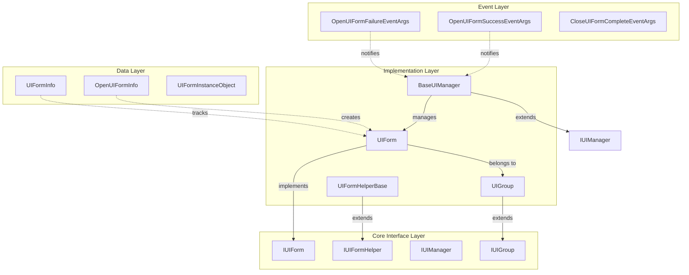
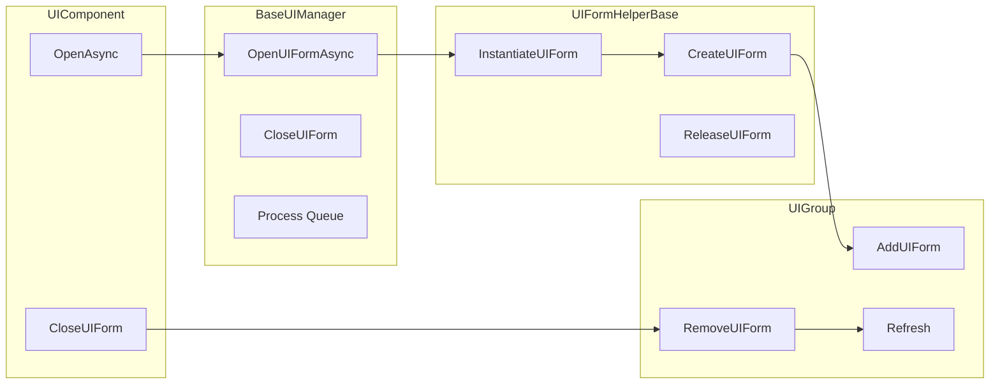
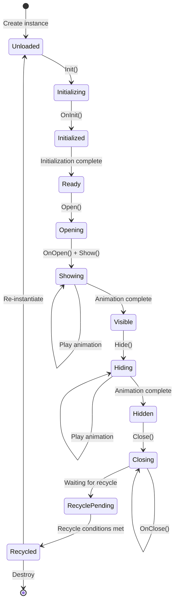
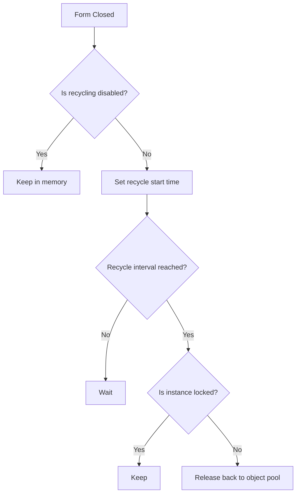

# UI Form

A UI Form is the core basic unit of the GameFrameX UI system, representing an independent UI interface (screen, window, panel) in a game or application. Each UI form is a manageable entity with complete lifecycle management, show/hide animation support, object pool recycling, and other features.

## Overview

A UI Form (UI Form) is the most fundamental interface management unit in the GameFrameX UI framework. It inherits from Unity's `MonoBehaviour` and implements the `IUIForm` interface, providing complete interface lifecycle management capabilities.

**Core Features:**
- Asynchronous loading and instantiation
- Show/hide animation support
- Object pool recycling mechanism
- UI Group (UIGroup) management
- Depth (Z-order) control
- Event subscription mechanism

**Design Intent:** UI Forms use the Template Method pattern, allowing developers to implement custom logic by overriding base class methods while maintaining framework extensibility. The object pool mechanism can significantly improve performance in scenarios with frequent UI opening and closing.

## Architecture



**Architecture Description:**
- **Core Interface Layer**: Defines abstract contracts for UI forms, including `IUIForm`, `IUIFormHelper`, `IUIManager`, `IUIGroup`
- **Implementation Layer**: Provides concrete functional implementations, including `UIForm`, `UIFormHelperBase`, `BaseUIManager`, `UIGroup`
- **Data Layer**: Information classes for storing and managing UI form-related data
- **Event Layer**: Event-based notification system for decoupled inter-module communication

### UI Form and Related Components Relationship



## Core Concepts

### Form Lifecycle

UI forms have a complete lifecycle. Understanding each stage is crucial for using the framework correctly:



**Lifecycle Stage Description:**

| Stage | Method | Description |
|-------|--------|-------------|
| Initialization | `Init()` | Called first after form instantiation, initializes basic properties |
| Awake | `OnAwake()` | Unity Awake callback, initializes event subscribers |
| View Initialization | `InitView()` | Initializes UI view components |
| Open | `OnOpen()` | Called when the form is opened, can be used for data loading |
| Show | `Show()` | Shows the form and plays animation |
| Hide | `Hide()` | Hides the form and plays animation |
| Close | `OnClose()` | Called when the form is closed |
| Recycle | `OnRecycle()` | Called before the form enters the recycle pool |
| Destroy | `Dispose()` | Called before the form is completely destroyed |

### Form States

UI forms have multiple state properties that control their behavior:

| State | Property | Description |
|-------|----------|-------------|
| Available | `Available` | Whether the form is initialized and available |
| Visible | `Visible` | Whether the form is currently displayed |
| Recycling Disabled | `IsDisableRecycling` | When disabled, the form will not be recycled |
| Closing Disabled | `IsDisableClosing` | When disabled, the form cannot be closed |
| Recyclable | `IsCanRecycle` | Whether it can currently be recycled |

### Show/Hide Animations

UI forms support show and hide animations:

```csharp
// Enable show animation
uiForm.EnableShowAnimation = true;
uiForm.ShowAnimationName = "FadeIn";

// Enable hide animation
uiForm.EnableHideAnimation = true;
uiForm.HideAnimationName = "FadeOut";
```

> Source: [UIForm.cs](https://github.com/GameFrameX/com.gameframex.unity.ui/blob/main/Runtime/UIForm.cs#L195-L240)

### Object Pool Recycling Mechanism

GameFrameX implements an object pool mechanism to optimize UI form performance:



Key configurations for the recycling mechanism:
- `RecycleInterval`: Recycle interval (seconds), default 60 seconds
- `IsDisableRecycling`: Whether to disable recycling
- `InstanceCapacity`: Object pool capacity

> Source: [BaseUIManager.cs](https://github.com/GameFrameX/com.gameframex.unity.ui/blob/main/Runtime/BaseUIManager.cs#L64-L83)

## Usage Examples

### Creating a Custom UI Form

Create a custom UI form by inheriting the `UIForm` base class:

```csharp
using GameFrameX.UI.Runtime;
using UnityEngine;
using UnityEngine.UI;

public class MainMenuForm : UIForm
{
    [SerializeField] private Button _startButton;
    [SerializeField] private Button _settingsButton;
    [SerializeField] private Button _quitButton;

    protected override void InitView()
    {
        base.InitView();
        
        // Initialize view components
        _startButton.onClick.AddListener(OnStartButtonClick);
        _settingsButton.onClick.AddListener(OnSettingsButtonClick);
        _quitButton.onClick.AddListener(OnQuitButtonClick);
    }

    public override void OnOpen(object userData)
    {
        base.OnOpen(userData);
        
        // Receive data passed when opening
        if (userData is MainMenuData data)
        {
            Debug.Log($"Main menu opened: {data.PlayerName}");
        }
    }

    public override void OnClose(bool isShutdown, object userData)
    {
        // Cleanup resources
        _startButton.onClick.RemoveAllListeners();
        base.OnClose(isShutdown, userData);
    }

    private void OnStartButtonClick()
    {
        Debug.Log("Start button clicked");
    }

    private void OnSettingsButtonClick()
    {
        Debug.Log("Settings button clicked");
    }

    private void OnQuitButtonClick()
    {
        Debug.Log("Quit button clicked");
        Application.Quit();
    }
}
```

> Source: [UIForm.cs](https://github.com/GameFrameX/com.gameframex.unity.ui/blob/main/Runtime/UIForm.cs#L47-L855)

### Opening a UI Form

Open UI forms through UIComponent:

```csharp
// Open form asynchronously
var mainMenu = await UIComponent.Instance.OpenAsync<MainMenuForm>();

// Pass user data
var menuData = new MainMenuData { PlayerName = "Player1" };
var mainMenu = await UIComponent.Instance.OpenAsync<MainMenuForm>(menuData);

// Open fullscreen form
var fullScreenForm = await UIComponent.Instance.OpenFullScreenAsync<FullScreenForm>();

// Open and pause covered forms
var pausedForm = await UIComponent.Instance.OpenUIFormAsync<DialogForm>(true, userData);
```

> Source: [UIComponent.Open.cs](https://github.com/GameFrameX/com.gameframex.unity.ui/blob/main/Runtime/UIComponent.Open.cs#L135-L191)

### Closing a UI Form

```csharp
// Close by form instance
UIComponent.Instance.CloseUIForm(mainMenuForm);

// Close by serial ID
UIComponent.Instance.CloseUIForm(serialId: 1);

// Close and pass data
UIComponent.Instance.CloseUIForm(mainMenuForm, closeData);

// Immediate recycle (skip recycle queue)
UIComponent.Instance.CloseUIForm(mainMenuForm, isNowRecycle: true);

// Close all forms of a specified type
UIComponent.Instance.CloseUIForm<MainMenuForm>(userData: null);
```

> Source: [BaseUIManager.Close.cs](https://github.com/GameFrameX/com.gameframex.unity.ui/blob/main/Runtime/BaseUIManager.Close.cs#L161-L223)

### Form Event Handling

```csharp
// Subscribe to form open success event
UIComponent.Instance.OpenUIFormSuccess += OnOpenSuccess;

// Subscribe to form open failure event
UIComponent.Instance.OpenUIFormFailure += OnOpenFailure;

// Subscribe to form close complete event
UIComponent.Instance.CloseUIFormComplete += OnCloseComplete;

private void OnOpenSuccess(object sender, OpenUIFormSuccessEventArgs e)
{
    Debug.Log($"Form opened successfully: {e.UIForm.SerialId}, {e.UIForm.UIFormAssetName}");
}

private void OnOpenFailure(object sender, OpenUIFormFailureEventArgs e)
{
    Debug.LogError($"Form failed to open: {e.UIFormAssetName}, Error: {e.ErrorMessage}");
}

private void OnCloseComplete(object sender, CloseUIFormCompleteEventArgs e)
{
    Debug.Log($"Form closed: {e.UIFormSerialId}");
}
```

> Source: [BaseUIManager.Open.cs](https://github.com/GameFrameX/com.gameframex.unity.ui/blob/main/Runtime/BaseUIManager.Open.cs#L50-L68)

### Event Subscription and Unsubscription

UIForm provides an automatic event subscription management mechanism:

```csharp
public class MyUIForm : UIForm
{
    // Subscribe to events when form is enabled
    protected override void OnEventSubscribe()
    {
        // Subscribe to game events
        GameEntry.Event.Subscribe(PlayerDeadEventArgs.EventId, OnPlayerDead);
        GameEntry.Event.Subscribe(LevelCompleteEventArgs.EventId, OnLevelComplete);
    }

    // Unsubscribe when form is disabled
    protected override void OnEventUnSubscribe()
    {
        // Unsubscribe from game events
        GameEntry.Event.Unsubscribe(PlayerDeadEventArgs.EventId, OnPlayerDead);
        GameEntry.Event.Unsubscribe(LevelCompleteEventArgs.EventId, OnLevelComplete);
    }

    private void OnPlayerDead(object sender, GameEventArgs e)
    {
        Debug.Log("Player died");
    }

    private void OnLevelComplete(object sender, GameEventArgs e)
    {
        Debug.Log("Level completed");
    }
}
```

> Source: [UIForm.cs](https://github.com/GameFrameX/com.gameframex.unity.ui/blob/main/Runtime/UIForm.cs#L507-L525)

### Form Activation (Refocus)

Bring a form back to the front:

```csharp
// Activate form (refocus)
UIComponent.Instance.RefocusUIForm(uiForm);

// Activate and pass data
UIComponent.Instance.RefocusUIForm(uiForm, userData);
```

> Source: [BaseUIManager.Open.cs](https://github.com/GameFrameX/com.gameframex.unity.ui/blob/main/Runtime/BaseUIManager.Open.cs#L137-L156)

### Getting Loaded Forms

```csharp
// Get by type
var form = UIComponent.Instance.GetLoaded<MainMenuForm>();

// Get all loaded forms of a specified type
var forms = UIComponent.Instance.GetLoadedList<DialogForm>();

// Get loaded and currently showing form
var showingForm = UIComponent.Instance.GetLoadedAndShowing<MainMenuForm>();

// Get all loaded forms
var allForms = UIComponent.Instance.GetAllLoadedUIForms();
```

> Source: [UIComponent.Get.cs](https://github.com/GameFrameX/com.gameframex.unity.ui/blob/main/Runtime/UIComponent.Get.cs)

## API Reference

### IUIForm Interface

> See [IUIForm API Reference](./5-api-reference.iuiform) for full details

### UIForm Base Class

> See [UIForm API Reference](./5-api-reference.ui-form) for full details

### IUIManager Interface

> See [IUIManager API Reference](./5-api-reference.iuimanager) for full details

## Configuration Options

In the Unity editor, you can configure UI form properties through the Inspector panel:

| Property | Type | Default | Description |
|----------|------|---------|-------------|
| IsDisableRecycling | bool | false | Whether to disable recycling |
| IsDisableClosing | bool | false | Whether to disable closing |
| IsCenter | bool | false | Whether to center display |
| EnableShowAnimation | bool | false | Whether to enable show animation |
| ShowAnimationName | string | (empty) | Show animation name |
| EnableHideAnimation | bool | false | Whether to enable hide animation |
| HideAnimationName | string | (empty) | Hide animation name |

> Source: [UIFormInspector.cs](https://github.com/GameFrameX/com.gameframex.unity.ui/blob/main/Editor/UIFormInspector.cs#L61-L89)

## Related Links

- [UI Component](./4-core-concepts.ui-component) - Complete overview of the UI component
- [UI Group System](./4-core-concepts.ui-group) - UI group organization and management
- [Object Pool Management](./4-core-concepts.object-pool) - Object pool mechanism details
- [UI Component API](./5-api-reference.ui-component) - UIComponent complete API
- [IUIManager API](./5-api-reference.iuimanager) - UI manager API
- [IUIGroup API](./5-api-reference.iuigroup) - UI group API
- [Event System](./6-event-system) - Event system details
- [UI Group Hierarchy](./7-ui-group-hierarchy) - UI group hierarchy management
