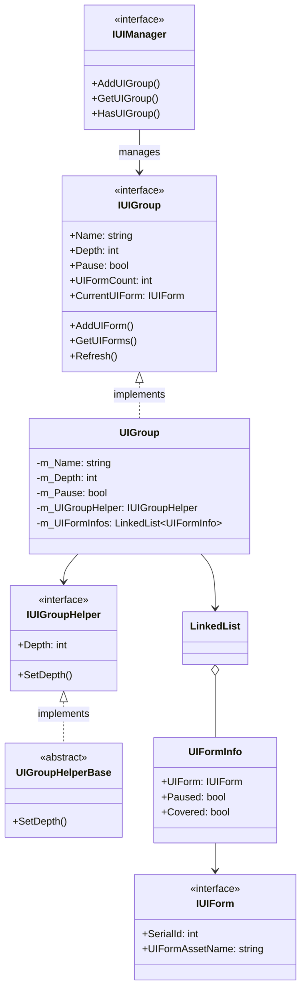
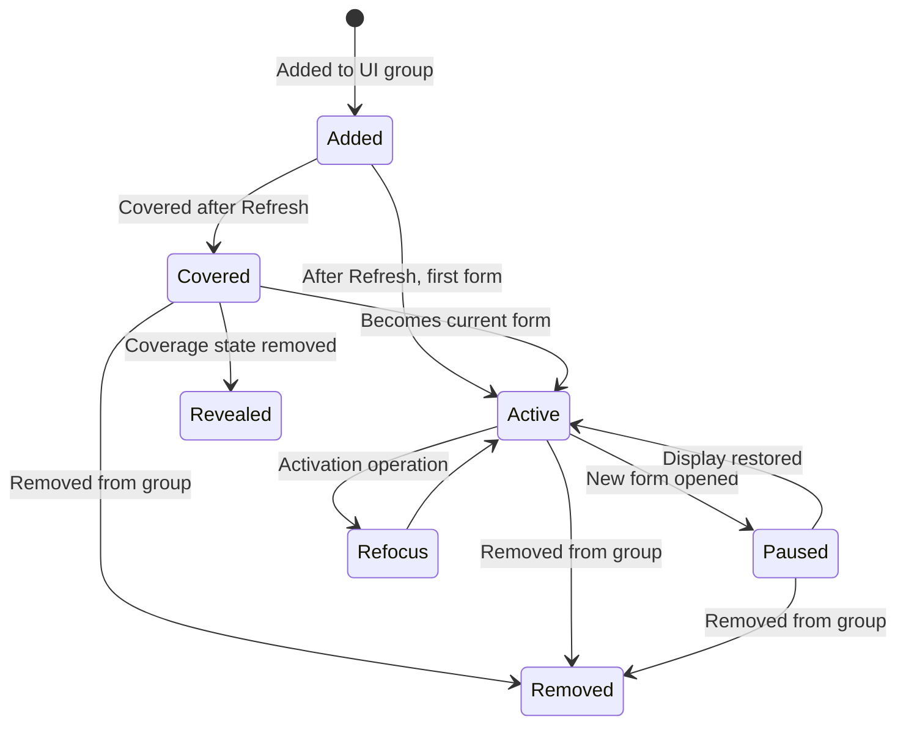
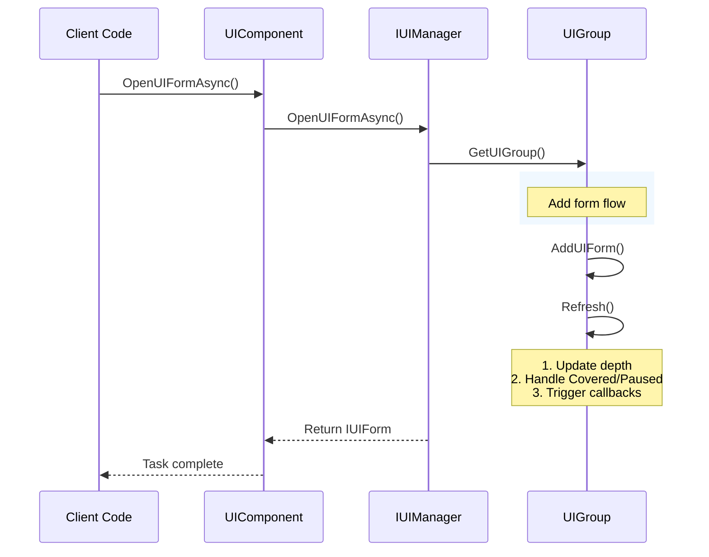

# UI Group System

The UI Group System is a core component of the GameFrameX UI framework, used to manage and organize the display hierarchy of UI forms. Through the UI group system, developers can easily implement priority management, coverage control, pause/resume, and other features for UI forms.

## Overview

The UI Group System is used to manage collections of UI forms with the same display priority. Each UI group has the following core characteristics:

- **Depth Management**: Each group has a unique depth value (Depth); the larger the depth, the more forward the display
- **Pause Control**: Can pause updates for all UI forms in a group
- **Coverage Mechanism**: Automatically handles coverage relationships between UI forms
- **Activation Management**: Supports bringing a specified form to the front (activation)

This design borrows from the common layer management approach in game engines. Group management enables clear organization of different types and priorities of UI interfaces, such as background layers, scene layers, battle UI, popup windows, tip messages, etc.

> The UI Group System is tightly integrated with the UI Form System. IUIManager manages all UI groups, and each UI group manages the UI forms within it.

## Architecture Design



The UI Group System architecture adopts a layered design:

- **IUIManager Layer**: Manages all UI groups, provides group CRUD interfaces
- **IUIGroup Layer**: Defines the core interface for UI groups, including group name, depth, pause state, and other properties
- **UIGroup Implementation Layer**: Uses a LinkedList data structure to efficiently manage UI form collections
- **IUIGroupHelper Layer**: Handles the visual presentation of UI groups, such as Transform depth settings

## Core Concepts

### Depth

Depth is a core property of UI groups that determines the display priority of the group. The larger the depth value, the more forward the UI group is displayed. The system predefines a series of standard group depth values, and developers can also customize new groups and depths.

Depth value design follows these principles:
- Background UI uses higher depth (40-30)
- Scene and battle UI uses medium depth (30-20)
- Regular and fixed UI uses base depth (10-0)
- Popup windows and tips use negative depth (-10 and below)

### Pause

When a UI group is set to paused state, the `OnUpdate` method of all UI forms in the group will no longer be called, but the forms remain visible. This is a practical feature; for example, when displaying a loading screen, you can pause updates for other UI to save performance resources.

### Covered

When a new form is opened, the old form is automatically marked as "covered." The system automatically manages this state through the `Refresh()` method, ensuring that users always see the most recently opened form. The covered state triggers the UI form's `OnCover` callback, where developers can handle related visual effects.

### Refocus

The refocus operation moves a specified UI form to the front of the group, making it the current form. This is useful when you need to bring a previously opened form to the top, such as restoring a settings panel from the background.

## Predefined UI Groups

The framework provides a series of predefined UI group constants that developers can use directly:

```csharp
// Predefined UI group constants
UIGroupConstants.Hidden       // Hidden layer (depth: 40)
UIGroupConstants.Background   // Background layer (depth: 35)
UIGroupConstants.Scene        // Scene layer (depth: 30)
UIGroupConstants.World        // World layer (depth: 27)
UIGroupConstants.Battle       // Battle layer (depth: 25)
UIGroupConstants.Hud          // HUD layer (depth: 22)
UIGroupConstants.Map          // Map layer (depth: 20)
UIGroupConstants.Floor        // Floor layer (depth: 15)
UIGroupConstants.Normal       // Normal layer (depth: 10)
UIGroupConstants.Fixed        // Fixed layer (depth: 0)
UIGroupConstants.Window       // Window layer (depth: -10)
UIGroupConstants.Tip          // Tip layer (depth: -15)
UIGroupConstants.Guide        // Guide layer (depth: -20)
UIGroupConstants.BlackBoard   // Blackboard layer (depth: -22)
UIGroupConstants.Dialogue     // Dialogue layer (depth: -23)
UIGroupConstants.Loading      // Loading layer (depth: -25)
UIGroupConstants.Notify       // Notification layer (depth: -30)
UIGroupConstants.System       // System layer (depth: -35)
```

> Source: [UIGroupConstants.cs](https://github.com/GameFrameX/com.gameframex.unity.ui/blob/main/Runtime/UIGroupConstants.cs#L38-L202)

```csharp
// Predefined UI group name constants
UIGroupNameConstants.Hidden       // "Hidden"
UIGroupNameConstants.Background  // "Background"
UIGroupNameConstants.Scene        // "Scene"
// ... more constants
```

> Source: [UIGroupNameConstants.cs](https://github.com/GameFrameX/com.gameframex.unity.ui/blob/main/Runtime/UIGroupNameConstants.cs#L38-L202)

## Form State Transitions

UI forms go through different state transitions within a group. Understanding these states is important for correctly using the UI group system:



### State Description

| State | Description | Triggered Callback |
|-------|-------------|-------------------|
| **Active** | Active state, the currently displayed form | OnResume, OnRefocus |
| **Covered** | Covered by another form | OnCover |
| **Paused** | Paused state, not updated but visible | OnPause |
| **Removed** | Removed from the group | OnClose |

## Core Flows

### Opening a UI Form and Adding to a Group



### UI Group Refresh Flow

Refresh is the core mechanism of the UI group, maintaining the correct state of all forms within the group:

```mermaid
flowchart TD
    Start[Start Refresh] --> CheckPause{Is group paused?}
    
    CheckPause -->|Yes| PauseMode[Enter pause mode]
    CheckPause -->|No| NormalMode[Enter normal mode]
    
    subgraph PauseMode["Pause Mode"]
        PM1[Iterate form list] --> PM2{More forms?}
        PM2 -->|Yes| PM3[Mark current form as Covered]
        PM3 --> PM4[Mark current form as Paused]
        PM4 --> PM2
        PM2 -->|No| End[Refresh complete]
    end
    
    subgraph NormalMode["Normal Mode"]
        NM1[Iterate form list] --> NM2{More forms?}
        NM2 -->|Yes| NM3[Reset pause state]
        NM3 --> NM4{Need to pause subsequent?}
        NM4 -->|Yes| NM5[Set pause flag]
        NM5 --> NM6{Already covered?}
        NM4 -->|No| NM6
        NM6 -->|Yes| NM7[Mark as Covered]
        NM6 -->|No| NM8[Uncover (Reveal)]
        NM7 --> NM2
        NM8 --> NM9[Set cover flag]
        NM9 --> NM2
        NM2 -->|No| End
    end
    
    Start -.->|Set Depth| NormalMode
    Start -.->|Set Depth| PauseMode
```

## Usage Examples

### Creating a Custom UI Group

Create custom UI groups using UIComponent:

```csharp
public class GameEntry : MonoBehaviour
{
    public UIComponent UIComp;
    
    void Start()
    {
        // Create custom UI group with depth 5
        UIComp.AddUIGroup("CustomGroup", 5);
        
        // Or use predefined groups
        UIComp.AddUIGroup(UIGroupNameConstants.Window, -10);
    }
}
```

> Source: [UIComponent.IUIGroup.cs](https://github.com/GameFrameX/com.gameframex.unity.ui/blob/main/Runtime/UIComponent.IUIGroup.cs#L100-L147)

### Accessing UI Groups

Access and manage UI groups through UIComponent:

```csharp
public class UIManagerExample : MonoBehaviour
{
    public UIComponent UIComp;
    
    public void ManageGroups()
    {
        // Check if group exists
        if (UIComp.HasUIGroup("Window"))
        {
            // Get group
            IUIGroup group = UIComp.GetUIGroup("Window");
            
            // Get currently displayed form
            IUIForm currentForm = group.CurrentUIForm;
            
            // Get form count in group
            int count = group.UIFormCount;
            
            // Get all forms
            IUIForm[] allForms = group.GetAllUIForms();
            
            // Set group depth
            group.Depth = 10;
            
            // Pause/resume group
            group.Pause = false;
            
            // Activate specified form
            group.RefocusUIForm(someUIForm, null);
        }
    }
}
```

### Opening Forms Using Predefined Group Constants

```csharp
public class UIFormOpener : MonoBehaviour
{
    public UIComponent UIComp;
    
    public async void OpenDialog()
    {
        // Open dialog to dialogue layer
        IUIForm dialog = await UIComp.OpenUIFormAsync<DialogForm>(
            "Assets/Prefabs/UI/Dialog.prefab",
            UIGroupNameConstants.Dialogue,
            true,  // Pause covered forms
            null   // User data
        );
    }
    
    public async void OpenTip()
    {
        // Open tip to tip layer (don't pause other forms)
        IUIForm tip = await UIComp.OpenUIFormAsync<TipForm>(
            "Assets/Prefs/UI/Tip.prefab",
            UIGroupNameConstants.Tip,
            false,
            "This is a tip"
        );
    }
}
```

### Closing an Entire UI Group

Close all UI forms in a specified group:

```csharp
public class UIGroupCloser : MonoBehaviour
{
    public UIComponent UIComp;
    
    public void CloseAllDialogs()
    {
        // Close all forms in dialogue group
        UIComp.CloseUIGroup(UIGroupNameConstants.Dialogue, null);
    }
    
    public void CloseAllWindows()
    {
        // Close window group
        if (UIComp.HasUIGroup(UIGroupNameConstants.Window))
        {
            UIComp.GetUIGroup(UIGroupNameConstants.Window);
            UIComp.CloseUIGroup(UIGroupNameConstants.Window, "user_close_all");
        }
    }
}
```

> Source: [BaseUIManager.UIGroup.cs](https://github.com/GameFrameX/com.gameframex.unity.ui/blob/main/Runtime/BaseUIManager.UIGroup.cs#L150-L176)

## IUIGroup Interface Reference

Complete method signatures and descriptions:

### Properties

| Property | Type | Description |
|----------|------|-------------|
| Name | string | Get UI group name |
| Depth | int | Get or set UI group depth |
| Pause | bool | Get or set whether the UI group is paused |
| UIFormCount | int | Get number of forms in the UI group |
| CurrentUIForm | IUIForm | Get the currently displayed form |
| Helper | IUIGroupHelper | Get UI group helper |

### Methods

#### `HasUIForm(int serialId): bool`

Check if a form with the specified serial ID exists in the group.

**Parameters:**
- `serialId` (int): Serial ID of the UI form

**Returns:** Whether it exists

---

#### `HasUIForm(string uiFormAssetName): bool`

Check if a form with the specified asset name exists in the group.

**Parameters:**
- `uiFormAssetName` (string): Asset name of the UI form

**Returns:** Whether it exists

---

#### `GetUIForm(int serialId): IUIForm`

Get a form by serial ID.

**Parameters:**
- `serialId` (int): Serial ID of the UI form

**Returns:** UI form instance, or null if not found

---

#### `GetUIForms(string uiFormAssetName): IUIForm[]`

Get all matching forms by asset name.

**Parameters:**
- `uiFormAssetName` (string): Asset name of the UI form

**Returns:** Array of UI forms

---

#### `GetAllUIForms(): IUIForm[]`

Get all forms in the group.

**Returns:** Array of all UI forms

---

#### `AddUIForm(IUIForm uiForm): void`

Add a form to the group.

**Parameters:**
- `uiForm` (IUIForm): UI form to add

---

#### `Refresh(): void`

Refresh the UI group state, updating coverage and pause states for all forms.

---

## UI Group Methods in IUIManager

IUIManager provides a complete UI group management interface:

| Method | Description |
|--------|-------------|
| `HasUIGroup(string)` | Check if a group exists |
| `GetUIGroup(string)` | Get a specified group |
| `GetAllUIGroups()` | Get all groups |
| `AddUIGroup(string, IUIGroupHelper)` | Add a new group |
| `AddUIGroup(string, int, IUIGroupHelper)` | Add a group with specified depth |
| `CloseUIGroup(string, object)` | Close all forms in a group |

> For the complete IUIManager interface definition, please refer to the [API Reference Documentation](./5-api-reference.iuimanager)

## Related Links

- [UI Component](./4-core-concepts.ui-component) - UI component basics
- [UI Form](./4-core-concepts.ui-form) - UI form system
- [API Reference - IUIGroup](./5-api-reference.iuigroup) - IUIGroup complete interface documentation
- [API Reference - IUIManager](./5-api-reference.iuimanager) - IUIManager complete interface documentation
- [UI Group Hierarchy](./7-ui-group-hierarchy) - UI group hierarchy detailed description
