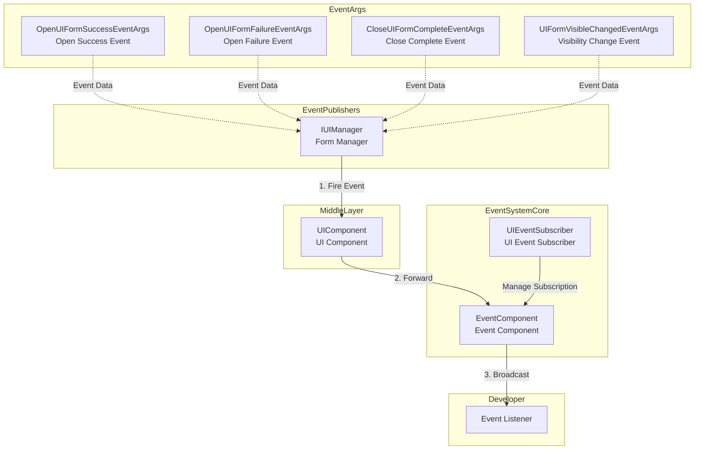
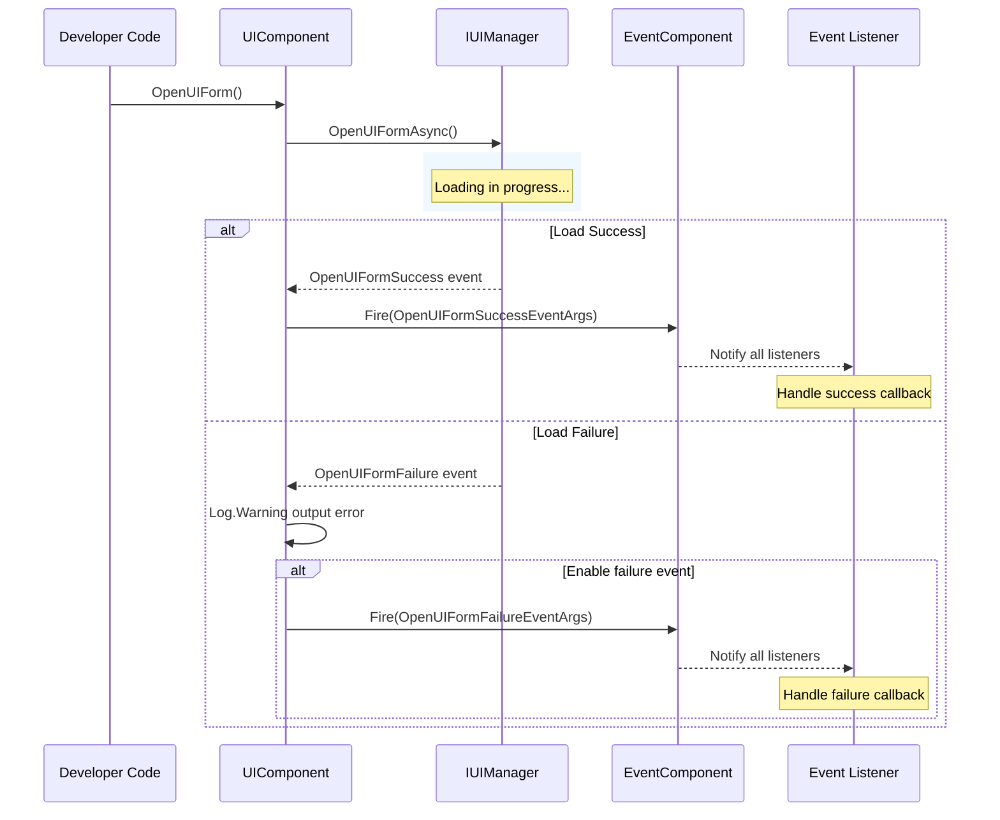
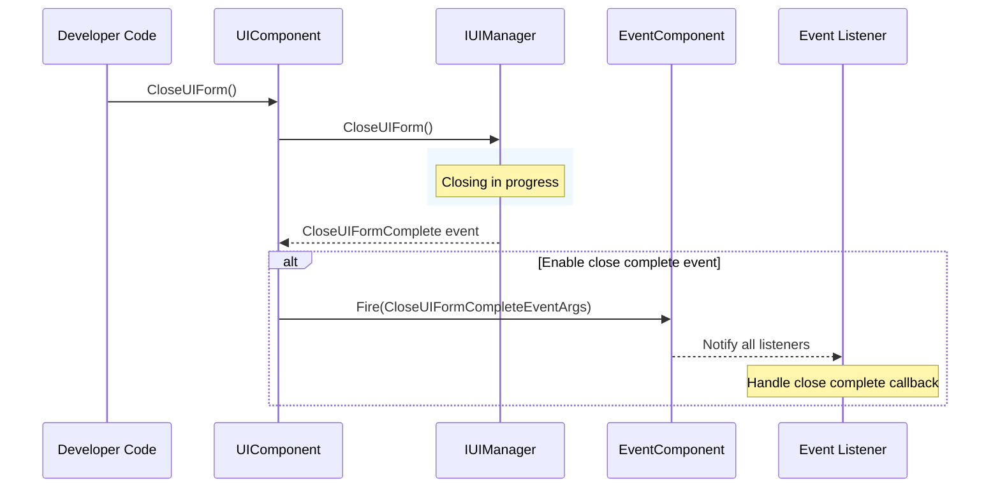

# Event System

The GameFrameX.UI module provides a comprehensive event system for monitoring various state changes in UI forms. This document details the UI module's event mechanism, event types, and how to use these events.

## Overview

The UI module's event system is designed using the Observer pattern, allowing developers to subscribe to key state changes in UI forms. It primarily includes:

- **Form Open Event**: Monitor form open success or failure
- **Form Close Event**: Monitor form close completion
- **Form Visibility Change**: Monitor form show/hide state changes
- **Unified Event Subscription**: Unified event subscription management through UIEventSubscriber

The event system integrates with GameFrameX's core event component (EventComponent), supporting global event broadcasting.

> For detailed EventComponent API reference, see [EventComponent](https://github.com/GameFrameX/com.gameframex.unity.event/blob/main/Runtime/EventComponent.cs).

## Architecture



**Architecture Description:**

1. **IUIManager** is the core interface of the UI manager, responsible for UI form loading, display, hiding, and other operations, firing corresponding events after operations complete
2. **UIComponent** is the Unity-level UI component that subscribes to IUIManager events and optionally forwards them to the global EventComponent
3. **EventComponent** is GameFrameX's core event component, responsible for global event registration and dispatch
4. **UIEventSubscriber** is a utility class that helps developers manage UI event subscriptions more conveniently, supporting batch unsubscription by owner
5. **EventArgs** are various event parameter classes that encapsulate event-related business data

## Core Event Types

The UI module defines the following core event types; all event parameter classes inherit from `GameEventArgs`:

### 1. OpenUIFormSuccessEventArgs - Form Open Success Event

Fired when a UI form opens successfully.

```csharp
> Source: [Runtime/EventArgs/OpenUIFormSuccessEventArgs.cs](https://github.com/GameFrameX/com.gameframex.unity.ui/blob/main/Runtime/EventArgs/OpenUIFormSuccessEventArgs.cs#L42-L143)

public sealed class OpenUIFormSuccessEventArgs : GameEventArgs
{
    // Event ID
    public static readonly string EventId = typeof(OpenUIFormSuccessEventArgs).FullName;
    
    // Get the form that opened successfully
    public UIForm UIForm { get; private set; }
    
    // Get load duration (seconds)
    public float Duration { get; private set; }
    
    // Get user custom data
    public object UserData { get; private set; }
    
    // Create event instance
    public static OpenUIFormSuccessEventArgs Create(IUIForm uiForm, float duration, object userData);
}
```

### 2. OpenUIFormFailureEventArgs - Form Open Failure Event

Fired when a UI form fails to open.

```csharp
> Source: [Runtime/EventArgs/OpenUIFormFailureEventArgs.cs](https://github.com/GameFrameX/com.gameframex.unity.ui/blob/main/Runtime/EventArgs/OpenUIFormFailureEventArgs.cs#L42-L172)

public sealed class OpenUIFormFailureEventArgs : GameEventArgs
{
    // Event ID
    public static readonly string EventId = typeof(OpenUIFormFailureEventArgs).FullName;
    
    // Get form serial ID
    public int SerialId { get; private set; }
    
    // Get form asset name
    public string UIFormAssetName { get; private set; }
    
    // Get whether to pause covered forms
    public bool PauseCoveredUIForm { get; private set; }
    
    // Get error message
    public string ErrorMessage { get; private set; }
    
    // Get user custom data
    public object UserData { get; private set; }
    
    // Create event instance
    public static OpenUIFormFailureEventArgs Create(int serialId, string uiFormAssetName, bool pauseCoveredUIForm, string errorMessage, object userData);
}
```

### 3. CloseUIFormCompleteEventArgs - Form Close Complete Event

Fired when a UI form closes completely.

```csharp
> Source: [Runtime/EventArgs/CloseUIFormCompleteEventArgs.cs](https://github.com/GameFrameX/com.gameframex.unity.ui/blob/main/Runtime/EventArgs/CloseUIFormCompleteEventArgs.cs#L43-L158)

public sealed class CloseUIFormCompleteEventArgs : GameEventArgs
{
    // Event ID
    public static readonly string EventId = typeof(CloseUIFormCompleteEventArgs).FullName;
    
    // Get form serial ID
    public int SerialId { get; private set; }
    
    // Get form asset name
    public string UIFormAssetName { get; private set; }
    
    // Get the UI group this form belongs to
    public IUIGroup UIGroup { get; private set; }
    
    // Get user custom data
    public object UserData { get; private set; }
    
    // Create event instance
    public static CloseUIFormCompleteEventArgs Create(int serialId, string uiFormAssetName, IUIGroup uiGroup, object userData);
}
```

### 4. UIFormVisibleChangedEventArgs - Form Visibility Changed Event

Fired when a UI form's visibility state changes.

```csharp
> Source: [Runtime/EventArgs/UIFormVisibleChangedEventArgs.cs](https://github.com/GameFrameX/com.gameframex.unity.ui/blob/main/Runtime/EventArgs/UIFormVisibleChangedEventArgs.cs#L42-L143)

public sealed class UIFormVisibleChangedEventArgs : GameEventArgs
{
    // Event ID
    public static readonly string EventId = typeof(UIFormVisibleChangedEventArgs).FullName;
    
    // Get the form whose active state changed
    public IUIForm UIForm { get; private set; }
    
    // Get whether the form is visible
    public bool Visible { get; private set; }
    
    // Get user custom data
    public object UserData { get; private set; }
    
    // Create event instance
    public static UIFormVisibleChangedEventArgs Create(IUIForm uiForm, bool visible, object userData = null);
}
```

## IUIManager Event Definitions

The IUIManager interface defines the following events; UIComponent subscribes to these events:

```csharp
> Source: [Runtime/UI/IUIManager.cs](https://github.com/GameFrameX/com.gameframex.unity.ui/blob/main/Runtime/UI/IUIManager.cs#L109-L142)

public interface IUIManager
{
    /// <summary>
    /// Form open success event
    /// </summary>
    event EventHandler<OpenUIFormSuccessEventArgs> OpenUIFormSuccess;

    /// <summary>
    /// Form open failure event
    /// </summary>
    event EventHandler<OpenUIFormFailureEventArgs> OpenUIFormFailure;

    /// <summary>
    /// Form close complete event
    /// </summary>
    event EventHandler<CloseUIFormCompleteEventArgs> CloseUIFormComplete;
}
```

## Event Subscription Methods

### Method 1: Subscribe via UIComponent

UIComponent subscribes to IUIManager events during initialization and decides whether to forward to the global EventComponent based on configuration:

```csharp
> Source: [Runtime/UIComponent.cs](https://github.com/GameFrameX/com.gameframex.unity.ui/blob/main/Runtime/UIComponent.cs#L430-L460)

private void OnAwake(object sender)
{
    m_UIManager = GameFrameworkEntry.GetModule<IUIManager>();
    
    if (m_EnableOpenUIFormSuccessEvent)
    {
        m_UIManager.OpenUIFormSuccess += OnOpenUIFormSuccess;
    }
    
    m_UIManager.OpenUIFormFailure += OnOpenUIFormFailure;
    
    if (m_EnableCloseUIFormCompleteEvent)
    {
        m_UIManager.CloseUIFormComplete += OnCloseUIFormComplete;
    }
}

private void OnOpenUIFormSuccess(object sender, OpenUIFormSuccessEventArgs e)
{
    m_EventComponent.Fire(this, e);
}

private void OnOpenUIFormFailure(object sender, OpenUIFormFailureEventArgs e)
{
    Log.Warning("Open UI form failure, asset name '{0}', pause covered UI form '{1}', error message '{2}'.", 
        e.UIFormAssetName, e.PauseCoveredUIForm, e.ErrorMessage);
    if (m_EnableOpenUIFormFailureEvent)
    {
        m_EventComponent.Fire(this, e);
    }
}

private void OnCloseUIFormComplete(object sender, CloseUIFormCompleteEventArgs e)
{
    m_EventComponent.Fire(this, e);
}
```

### Method 2: Subscribe via UIEventSubscriber

UIEventSubscriber is a convenient event subscription management class that supports batch management by owner:

```csharp
> Source: [Runtime/UIEventSubscriber.cs](https://github.com/GameFrameX/com.gameframex.unity.ui/blob/main/Runtime/UIEventSubscriber.cs#L44-L218)

public sealed class UIEventSubscriber : IReference
{
    // Get or set owner
    public object Owner { get; private set; }
    
    // Check and subscribe to event
    public void CheckSubscribe(string id, EventHandler<GameEventArgs> handler);
    
    // Unsubscribe from event
    public void UnSubscribe(string id, EventHandler<GameEventArgs> handler);
    
    // Fire event
    public void Fire(string id, GameEventArgs e);
    
    // Unsubscribe all
    public void UnSubscribeAll(List<string> ignoreList = null);
    
    // Create event subscriber
    public static UIEventSubscriber Create(object owner);
    
    // Clear event subscriber
    public void Clear();
}
```

## Usage Examples

### Example 1: Listen for Form Open Success Event

```csharp
using GameFrameX.UI.Runtime;
using GameFrameX.Event.Runtime;
using GameFrameX.Runtime;

public class UIMainMenuForm : MonoBehaviour
{
    private void Start()
    {
        // Subscribe to open success event
        var eventComponent = GameEntry.GetComponent<EventComponent>();
        eventComponent.Subscribe(OpenUIFormSuccessEventArgs.EventId, OnOpenUIFormSuccess);
    }
    
    private void OnOpenUIFormSuccess(object sender, GameEventArgs e)
    {
        var args = (OpenUIFormSuccessEventArgs)e;
        Debug.Log($"Form opened successfully: {args.UIForm.Name}, Load duration: {args.Duration}s");
    }
    
    private void OnDestroy()
    {
        // Unsubscribe
        var eventComponent = GameEntry.GetComponent<EventComponent>();
        eventComponent.Unsubscribe(OpenUIFormSuccessEventArgs.EventId, OnOpenUIFormSuccess);
    }
}
```

### Example 2: Listen for Form Open Failure Event

```csharp
using GameFrameX.UI.Runtime;
using GameFrameX.Event.Runtime;
using GameFrameX.Runtime;

public class UILoadFailedHandler : MonoBehaviour
{
    private void Start()
    {
        var eventComponent = GameEntry.GetComponent<EventComponent>();
        eventComponent.Subscribe(OpenUIFormFailureEventArgs.EventId, OnOpenUIFormFailure);
    }
    
    private void OnOpenUIFormFailure(object sender, GameEventArgs e)
    {
        var args = (OpenUIFormFailureEventArgs)e;
        Debug.LogError($"Form open failed: {args.UIFormAssetName}, Error: {args.ErrorMessage}");
    }
    
    private void OnDestroy()
    {
        var eventComponent = GameEntry.GetComponent<EventComponent>();
        eventComponent.Unsubscribe(OpenUIFormFailureEventArgs.EventId, OnOpenUIFormFailure);
    }
}
```

### Example 3: Use UIEventSubscriber to Manage Subscriptions

```csharp
using GameFrameX.UI.Runtime;
using GameFrameX.Event.Runtime;
using GameFrameX.Runtime;
using GameFrameX.ObjectPool;

public class UIGamePanel : MonoBehaviour
{
    private UIEventSubscriber _eventSubscriber;
    
    private void Awake()
    {
        // Create event subscriber, pass this as owner
        _eventSubscriber = UIEventSubscriber.Create(this);
        
        // Subscribe to multiple events
        _eventSubscriber.CheckSubscribe(OpenUIFormSuccessEventArgs.EventId, OnOpenUIFormSuccess);
        _eventSubscriber.CheckSubscribe(CloseUIFormCompleteEventArgs.EventId, OnCloseUIFormComplete);
    }
    
    private void OnOpenUIFormSuccess(object sender, GameEventArgs e)
    {
        var args = (OpenUIFormSuccessEventArgs)e;
        Debug.Log($"Form opened: {args.UIForm.Name}");
    }
    
    private void OnCloseUIFormComplete(object sender, GameEventArgs e)
    {
        var args = (CloseUIFormCompleteEventArgs)e;
        Debug.Log($"Form closed: {args.UIFormAssetName}");
    }
    
    private void OnDestroy()
    {
        // Batch unsubscribe all
        if (_eventSubscriber != null)
        {
            _eventSubscriber.UnSubscribeAll();
            ReferencePool.Release(_eventSubscriber);
        }
    }
}
```

### Example 4: Use UIEventSubscriber to Unsubscribe from Specific Events

```csharp
using GameFrameX.UI.Runtime;
using GameFrameX.Event.Runtime;
using GameFrameX.Runtime;
using GameFrameX.ObjectPool;
using System.Collections.Generic;

public class UIPermanentPanel : MonoBehaviour
{
    private UIEventSubscriber _eventSubscriber;
    private List<string> _ignoredEvents = new List<string> { CloseUIFormCompleteEventArgs.EventId };
    
    private void Awake()
    {
        _eventSubscriber = UIEventSubscriber.Create(this);
        _eventSubscriber.CheckSubscribe(OpenUIFormSuccessEventArgs.EventId, OnOpenUIFormSuccess);
        _eventSubscriber.CheckSubscribe(OpenUIFormFailureEventArgs.EventId, OnOpenUIFormFailure);
        _eventSubscriber.CheckSubscribe(CloseUIFormCompleteEventArgs.EventId, OnCloseUIFormComplete);
    }
    
    private void OnOpenUIFormSuccess(object sender, GameEventArgs e) { /* ... */ }
    private void OnOpenUIFormFailure(object sender, GameEventArgs e) { /* ... */ }
    private void OnCloseUIFormComplete(object sender, GameEventArgs e) { /* ... */ }
    
    private void OnDestroy()
    {
        // Unsubscribe all except CloseUIFormComplete
        _eventSubscriber.UnSubscribeAll(_ignoredEvents);
        ReferencePool.Release(_eventSubscriber);
    }
}
```

## Event Flow

### Form Open Event Flow



### Form Close Event Flow



## Event Configuration

UIComponent provides the following serialized fields for controlling event behavior:

```csharp
> Source: [Runtime/UIComponent.cs](https://github.com/GameFrameX/com.gameframex.unity.ui/blob/main/Runtime/UIComponent.cs#L62-L86)

[SerializeField] private bool m_EnableOpenUIFormSuccessEvent = true;    // Enable open success event
[SerializeField] private bool m_EnableOpenUIFormFailureEvent = true;     // Enable open failure event
[SerializeField] private bool m_EnableCloseUIFormCompleteEvent = true;   // Enable close complete event

[SerializeField] private bool m_IsEnableUIShowAnimation = false;          // Enable show animation
[SerializeField] private bool m_IsEnableUIHideAnimation = false;          // Enable hide animation
```

| Configuration | Type | Default | Description |
|---------------|------|---------|-------------|
| m_EnableOpenUIFormSuccessEvent | bool | true | Whether to fire open success event |
| m_EnableOpenUIFormFailureEvent | bool | true | Whether to fire open failure event |
| m_EnableCloseUIFormCompleteEvent | bool | true | Whether to fire close complete event |
| m_IsEnableUIShowAnimation | bool | false | Whether to enable form show animation |
| m_IsEnableUIHideAnimation | bool | false | Whether to enable form hide animation |

## Notes

1. **Event Subscription Memory Management**: Always unsubscribe from events in MonoBehaviour's `OnDestroy` method to avoid memory leaks and null reference exceptions
2. **Event Args Reuse**: All EventArgs classes use ReferencePool for object pooling management; after creation and use, they are automatically recycled without manual release
3. **Event Order**: Event firing order is: OpenUIFormFailure/OpenUIFormSuccess -> other business logic; developers should choose appropriate subscription points based on needs
4. **Cross-Scene Events**: Events subscribed through EventComponent are global; even after forms close, manual unsubscription is still required

## Related Links

- [UI Component](./4-core-concepts.ui-component) - Core functionality of UI component
- [UI Form](./4-core-concepts.ui-form) - Basic concepts of UI form
- [UI Group System](./4-core-concepts.ui-group) - UI group management
- [IUIManager Interface](./5-api-reference.iuimanager) - Complete IUIManager API reference
- [GameFrameX Event Module](https://github.com/GameFrameX/com.gameframex.unity.event) - Core event component