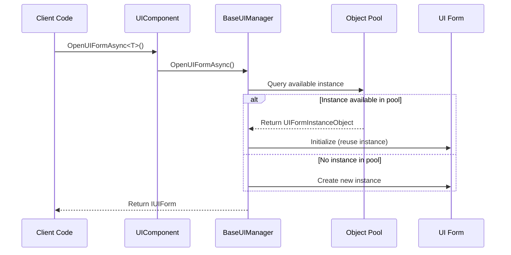
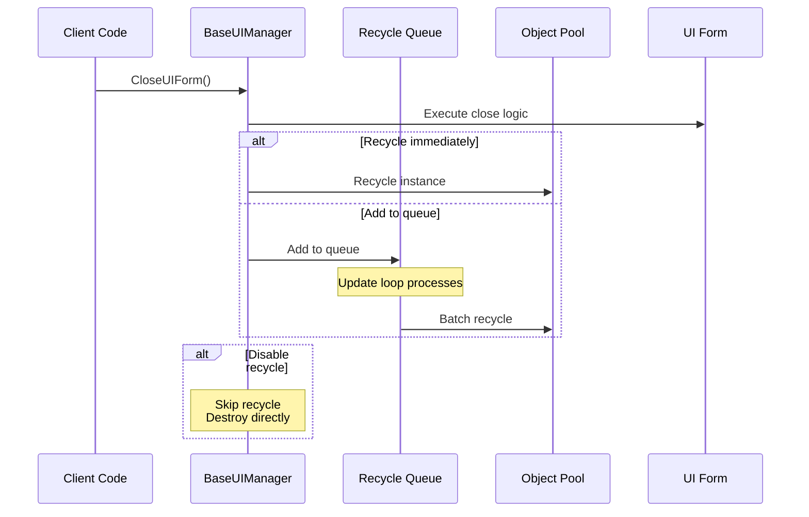
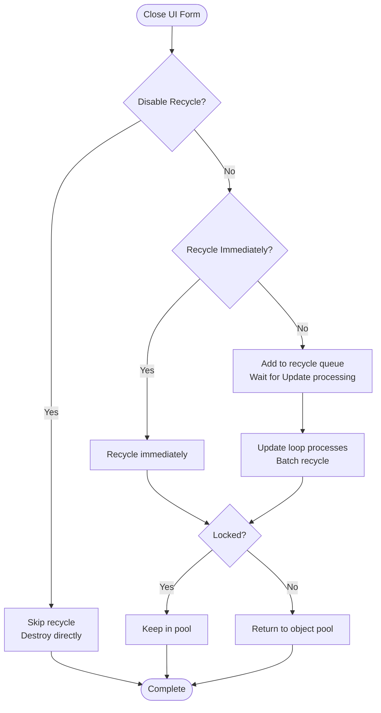

# Object Pool Management

Object pool management is the core mechanism in GameFrameX UI system for optimizing UI form instance creation and destruction. Through object pooling, the system can reuse UI form instances that have been closed, avoiding performance overhead from frequent instantiation.

## Overview

In games or applications, opening and closing UI forms is a very frequent operation. The traditional approach is to create a new instance each time a form is opened and destroy it when closed, which leads to:

- **Memory Fragmentation**: Frequent object creation and destruction causes memory fragmentation
- **GC Pressure**: A large number of temporary objects increases garbage collection frequency
- **Loading Delay**: Instantiating UI prefabs takes time, affecting user experience

Object pooling solves these problems through:

- **Instance Reuse**: Closed UI forms are not destroyed but recycled and stored in the pool
- **On-Demand Allocation**: When getting an instance from the pool, if an available instance exists, it is reused directly; only if none exists is a new instance created
- **Automatic Management**: Object pools support automatic release of expired instances and capacity management

### Core Concepts

| Concept | Description |
|---------|-------------|
| **Object Pool** | Container storing reusable UI form instances |
| **Recycle** | Return closed UI form instances to the object pool |
| **Release** | Completely remove expired or excess instances from the pool |
| **Locked** | Locked instances will not be automatically released by the pool |
| **Priority** | Used to determine which instances to retain first when capacity is insufficient |

## Architecture

```mermaid
flowchart TD
    subgraph UIComponent["UIComponent"]
        A1[UIComponent] --> A2[IUIManager]
    end

    subgraph BaseUIManager["BaseUIManager"]
        B1[IObjectPoolManager] --> B2[IObjectPool&lt;UIFormInstanceObject&gt;]
        B2 --> B3[UIFormInstanceObject Pool<br/>"UI Instance Pool"]
    end

    subgraph PoolObjects["Pool Objects"]
        C1[UIFormInstanceObject 1]
        C2[UIFormInstanceObject 2]
        C3[UIFormInstanceObject N]
    end

    subgraph UIForms["UI Forms"]
        D1[UI Form Instance 1]
        D2[UI Form Instance 2]
        D3[UI Form Instance N]
    end

    A2 --> B1
    B2 --- C1
    B2 --- C2
    B2 --- C3
    C1 --- D1
    C2 --- D2
    C3 --- D3
```

### Component Description

| Component | Responsibility |
|-----------|----------------|
| **UIComponent** | UI component entry, responsible for initializing object pool manager configuration |
| **BaseUIManager** | Core UI manager, manages object pool creation and operations |
| **IObjectPoolManager** | External object pool manager interface (from GameFrameX.ObjectPool package) |
| **IObjectPool\<UIFormInstanceObject\>** | Object pool dedicated to UI form instances |
| **UIFormInstanceObject** | Wrapper class encapsulating UI form instances, contains resource handles and other information |

### Object Pool Type

The system uses `CreateMultiSpawnObjectPool` method to create multi-spawn object pools, which means:

- Multiple instances of the same type of UI form can exist simultaneously
- Each instance independently manages its own lifecycle
- Supports setting instance-level lock and priority

> Source: [BaseUIManager.cs#L268](https://github.com/GameFrameX/com.gameframex.unity.ui/blob/main/Runtime/BaseUIManager.cs#L268)

## Core Flows

### UI Form Open Flow



### UI Form Recycle Flow



### Recycle Decision Flow



## Configuration Options

Object pool parameters can be configured in UIComponent; these settings are applied to the UI manager in the `Start()` method.

| Configuration | Type | Default | Description |
|---------------|------|---------|-------------|
| `InstanceAutoReleaseInterval` | float | 60f | Object pool auto-release interval in seconds |
| `InstanceCapacity` | int | 16 | Object pool capacity, maximum number of instances to cache |
| `InstanceExpireTime` | float | 60f | Instance expiration time (seconds); unused instances exceeding this time will be released |
| `RecycleInterval` | int | 60 | Recycle interval in seconds; controls the processing speed of the recycle queue |
| `EnableAutoReleaseUIForm` | bool | true | Whether to enable automatic UI form release |

> Source: [UIComponent.cs#L113-L141](https://github.com/GameFrameX/com.gameframex.unity.ui/blob/main/Runtime/UIComponent.cs#L113-L141)

### Configure via IUIManager Interface

```csharp
// Get UI component
var uiComponent = GameEntry.GetComponent<UIComponent>();

// Configure object pool parameters
uiComponent.InstanceAutoReleaseInterval = 30f;  // 30 second auto-release
uiComponent.InstanceCapacity = 32;               // Capacity changed to 32
uiComponent.InstanceExpireTime = 30f;             // 30 second expiration
uiComponent.RecycleInterval = 30;                // 30 second recycle interval
```

### Runtime Dynamic Configuration

```csharp
// Get UI form
IUIForm uiForm = await uiComponent.OpenUIFormAsync<MainForm>("UI/MainForm");

// Set instance lock (prevent release)
uiComponent.SetUIFormInstanceLocked(uiForm.Handle, true);

// Set instance priority (higher values are retained first)
uiComponent.SetUIFormInstancePriority(uiForm.Handle, 100);
```

> Source: [BaseUIManager.Open.cs#L164-L182](https://github.com/GameFrameX/com.gameframex.unity.ui/blob/main/Runtime/BaseUIManager.Open.cs#L164-L182)

## UI Form Recycle Control

Each UI form can independently control whether to allow recycling.

### UIForm Properties

| Property | Type | Description |
|----------|------|-------------|
| `IsDisableRecycling` | bool | Whether to disable recycling. UI forms with recycling disabled are destroyed directly when closed, not stored in the object pool |
| `IsDisableClosing` | bool | Whether to disable closing. UI forms with closing disabled cannot be closed |
| `IsCanRecycle` | bool | Whether can recycle (read-only), calculated from other properties |
| `ReleaseStartTime` | DateTime | Recycle start time, used to determine if recycle conditions are met |
| `RecycleInterval` | int | This UI form's recycle interval (seconds) |

> Source: [IUIForm.cs#L84-L114](https://github.com/GameFrameX/com.gameframex.unity.ui/blob/main/Runtime/UI/IUIForm.cs#L84-L114)

### Usage Example

Control recycle behavior in UI form script:

```csharp
public class MyUIForm : UIForm
{
    protected override void OnInit()
    {
        // Disable this form's recycle function
        // After closing, will be destroyed directly, not stored in object pool
        IsDisableRecycling = true;
        
        // Or disable close function
        // IsDisableClosing = true;
    }
    
    protected override void OnRecycle()
    {
        // Logic executed when form is recycled
        // Can save state or clean up resources here
        base.OnRecycle();
    }
}
```

> Source: [UIForm.cs#L56](https://github.com/GameFrameX/com.gameframex.unity.ui/blob/main/Runtime/UIForm.cs#L56)
> Source: [UIForm.cs#L625-L629](https://github.com/GameFrameX/com.gameframex.unity.ui/blob/main/Runtime/UIForm.cs#L625-L629)

## UIFormInstanceObject

`UIFormInstanceObject` is the wrapper object stored in the object pool, encapsulating UI form instances and their related resources.

```csharp
public sealed class UIFormInstanceObject : ObjectBase
{
    private object m_UIFormAsset = null;           // UI asset object
    private string m_UIFormAssetPath = null;        // UI asset path
    private string m_UIFormAssetName = null;        // UI asset name
    private IUIFormHelper m_UIFormHelper = null;    // UI helper
    private object m_AssetHandle = null;           // Asset handle
    
    protected override void Release(bool isShutdown)
    {
        // When releasing, call helper to recycle UI resources
        m_UIFormHelper.ReleaseUIForm(m_UIFormAsset, Target, m_AssetHandle, 
            m_UIFormAssetPath, m_UIFormAssetName);
    }
}
```

> Source: [BaseUIManager.UIFormInstanceObject.cs#L41-L104](https://github.com/GameFrameX/com.gameframex.unity.ui/blob/main/Runtime/BaseUIManager.UIFormInstanceObject.cs#L41-L104)

## Best Practices

### 1. Set Capacity Appropriately

Set capacity based on the number of UI forms displayed simultaneously:

```csharp
// If displaying at most 10 different types of UI forms simultaneously
uiComponent.InstanceCapacity = 20; // Leave some margin
```

### 2. Adjust Auto-Release Interval

Adjust based on UI usage frequency:

```csharp
// Frequently switched UI: shorter interval
uiComponent.InstanceAutoReleaseInterval = 30f;
uiComponent.InstanceExpireTime = 30f;

// Less frequently switched UI: longer interval
uiComponent.InstanceAutoReleaseInterval = 300f;
uiComponent.InstanceExpireTime = 300f;
```

### 3. Lock Important Instances

Lock UI forms that need to stay resident in memory:

```csharp
// Open settings form and lock it
var settingsForm = await uiComponent.OpenUIFormAsync<SettingsForm>("UI/Settings");
uiComponent.SetUIFormInstanceLocked(settingsForm.Handle, true);
```

### 4. Disable Recycle for Frequently Destroyed UI

For some UI that is frequently opened and closed but doesn't need reuse, disable recycling:

```csharp
public class PopupTipForm : UIForm
{
    protected override void OnInit()
    {
        // Popup-style UI has new content each time, disable recycling
        IsDisableRecycling = true;
    }
}
```

## Related Links

- [UI Component](./4-core-concepts.ui-component)
- [UI Form](./4-core-concepts.ui-form)
- [UI Group System](./4-core-concepts.ui-group)
- [IUIManager API Reference](./5-api-reference.iuimanager)
- [UIForm API Reference](./5-api-reference.ui-form)
- [Event System](./6-event-system)