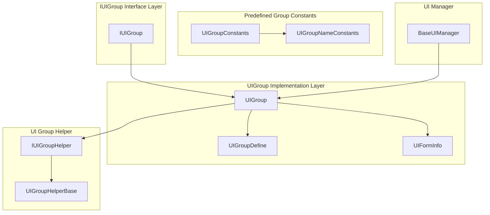
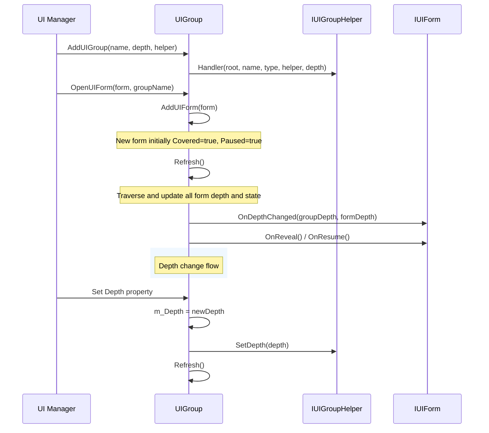
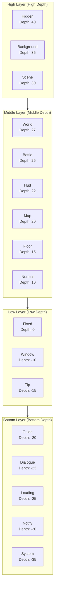

# UI Group Hierarchy

UI Group Hierarchy is the core mechanism in GameFrameX UI system for managing the display layer relationships of different UI forms. Through depth (Depth) value configuration, the system can precisely control the front-to-back occlusion relationships of various UI groups and forms within groups, ensuring UI forms are rendered and interactive in the expected layer order.

## Overview

In complex games or applications, UI forms often need layered management. For example, background forms should be at the bottom layer, while pop-up tips or system announcements should be displayed on the top layer. GameFrameX UI system achieves fine-grained control of UI form layers by introducing the concept of "groups" combined with the depth property.

The UI group hierarchy system includes two levels of depth control:

- **Group-Level Depth**: Controls the display order between different UI groups; groups with larger depth values are displayed in front
- **Form Depth in Group**: Controls the display order of various forms within the same group

This dual-layer design ensures both the overall layer relationship of different UI types and allows flexible adjustment of specific form display order within the same type of UI.

### Core Design Philosophy

1. **Depth Value Layering**: Uses integer depth values for layers, supporting negative depths for more flexible space allocation
2. **Predefined Group Types**: Provides common UI group types covering a complete layer system from background to system popups
3. **Dynamic Adjustment**: Supports dynamic modification of group depth at runtime, updating all associated form display layers in real time
4. **Auto Refresh**: Automatically triggers refresh mechanism after depth changes to ensure all forms respond correctly

## Architecture Design

### Core Component Relationships



### Layer Data Flow



### Depth Value Layer Schematic



## Predefined UI Groups

GameFrameX UI system provides 18 predefined UI group types covering common UI scenarios in game development. These predefined groups are arranged from high to low by depth value:

| Group Name | Depth Value | Usage Description |
|-----------|-------------|-------------------|
| Hidden | 40 | Hidden forms, used for temporarily storing non-displaying forms |
| Background | 35 | Background forms, such as game main menu background, scene background, etc. |
| Scene | 30 | Scene forms, UI related to game scenes |
| World | 27 | World forms, UI elements within world space |
| Battle | 25 | Battle forms, battle-related HUD and information display |
| Hud | 22 | Overhead display, character overhead info like health bars, names, etc. |
| Map | 20 | Map forms, minimap, large map, etc. |
| Floor | 15 | Floor forms, decorative UI on the bottom layer |
| Normal | 10 | Normal forms, standard in-game UI |
| Fixed | 0 | Fixed forms, UI fixed on screen |
| Window | -10 | Window forms, pop-up windows, dialogs, etc. |
| Tip | -15 | Tip forms, lightweight tip information |
| Guide | -20 | Guide forms, new user guide-related UI |
| BlackBoard | -22 | Blackboard forms, teaching, explanation-type UI |
| Dialogue | -23 | Dialogue forms, dialogue trees, NPC dialogue, etc. |
| Loading | -25 | Loading forms, loading screens |
| Notify | -30 | Notification forms, system notifications, announcements |
| System | -35 | System forms, highest priority system-level popups |

> Source: [UIGroupConstants.cs](https://github.com/GameFrameX/com.gameframex.unity.ui/blob/main/Runtime/UIGroupConstants.cs#L41-L201)

### Using Predefined Groups

```csharp
// Create UI group using predefined group constants
var uiGroupHelper = new DefaultUIGroupHelper();
uiManager.AddUIGroup(UIGroupConstants.Normal.Name, UIGroupConstants.Normal.Depth, uiGroupHelper);

// Or use group name constants
uiManager.AddUIGroup(UIGroupNameConstants.Normal, 10, uiGroupHelper);
```

> Source: [BaseUIManager.UIGroup.cs](https://github.com/GameFrameX/com.gameframex.unity.ui/blob/main/Runtime/BaseUIManager.UIGroup.cs#L136-L148)

## Core Mechanisms

### Group Depth Management

Each UI group maintains an integer-type `Depth` property indicating its position in the overall UI layer. When the depth value changes, the system automatically performs the following:

1. Calls `IUIGroupHelper.SetDepth()` method to notify the helper to update rendering layer
2. Calls `Refresh()` method to refresh all form depths within the group
3. Triggers each form's `OnDepthChanged` callback, notifying that the form depth has changed

```csharp
// Depth property implementation in UIGroup.cs
public int Depth
{
    get { return m_Depth; }
    set
    {
        if (m_Depth == value)
        {
            return;
        }

        m_Depth = value;
        m_UIGroupHelper.SetDepth(m_Depth);  // Notify helper
        Refresh();  // Refresh forms in group
    }
}
```

> Source: [UIGroup.cs](https://github.com/GameFrameX/com.gameframex.unity.ui/blob/main/Runtime/UI/UIGroup.cs#L106-L120)

### Form Depth in Group

Within the same UI group, newly opened forms are added to the list head (`AddFirst`) by default, meaning the last opened form is displayed at the front. Each form's depth within the group is determined by its position in the linked list; forms at the list head have the largest depth value, decreasing in order.

```csharp
// Add new form to group
public void AddUIForm(IUIForm uiForm)
{
    m_UIFormInfos.AddFirst(UIFormInfo.Create(uiForm));
}
```

> Source: [UIGroup.cs](https://github.com/GameFrameX/com.gameframex.unity.ui/blob/main/Runtime/UI/UIGroup.cs#L439-L442)

### Refresh Mechanism

The `Refresh()` method is the core of UI group layer management, responsible for:

1. **Update Form Depth**: Iterate through all forms in the group, calculate and update each form's `DepthInUIGroup`
2. **Handle Covered State**: Based on form display order, set `Covered` state and trigger corresponding callbacks
3. **Handle Paused State**: Based on the group's `Pause` property and the form's `PauseCoveredUIForm` property, manage form pause state

```csharp
public void Refresh()
{
    LinkedListNode<UIFormInfo> current = m_UIFormInfos.First;
    bool pause = m_Pause;
    bool cover = false;
    int depth = UIFormCount;

    while (current != null)
    {
        // Update depth
        info.UIForm.OnDepthChanged(Depth, depth--);

        // Handle covered and pause logic
        // ...
    }
}
```

> Source: [UIGroup.cs](https://github.com/GameFrameX/com.gameframex.unity.ui/blob/main/Runtime/UI/UIGroup.cs#L520-L577)

### Form State Changes

Forms within a UI group have the following states:

| State | Description | Triggered Callback |
|-------|-------------|-------------------|
| Active | Active state, fully visible and interactive | - |
| Covered | Covered state, occluded by other forms | `OnCover()` / `OnReveal()` |
| Paused | Paused state, no longer receives input | `OnPause()` / `OnResume()` |

When a new form opens, the original top form becomes covered (Covered) and may be paused (Paused, depending on the `PauseCoveredUIForm` property).

## Usage Examples

### Create UI Group with Custom Depth

```csharp
// Create UI group with custom depth
public class GameUIInitializer
{
    private IUIManager uiManager;

    public void Initialize()
    {
        // Create high-priority group (displayed at front)
        var dialogHelper = new DialogUIGroupHelper();
        uiManager.AddUIGroup("Dialog", 100, dialogHelper);

        // Create normal group
        var normalHelper = new NormalUIGroupHelper();
        uiManager.AddUIGroup("Normal", 50, normalHelper);

        // Create background group
        var bgHelper = new BackgroundUIGroupHelper();
        uiManager.AddUIGroup("Background", 10, bgHelper);
    }
}
```

> Source: [BaseUIManager.UIGroup.cs](https://github.com/GameFrameX/com.gameframex.unity.ui/blob/main/Runtime/BaseUIManager.UIGroup.cs#L136-L148)

### Dynamically Adjust Group Depth

```csharp
// Adjust UI group depth at runtime
public class UIGroupDepthChanger
{
    private IUIManager uiManager;

    public void PromoteGroup(string groupName)
    {
        var group = uiManager.GetUIGroup(groupName);
        if (group != null)
        {
            // Increase group depth to display more in front
            group.Depth += 10;
        }
    }

    public void DemoteGroup(string groupName)
    {
        var group = uiManager.GetUIGroup(groupName);
        if (group != null)
        {
            // Decrease group depth to display more behind
            group.Depth -= 10;
        }
    }
}
```

### Implement Custom UI Group Helper

```csharp
// Custom UI group helper
public class CustomUIGroupHelper : UIGroupHelperBase
{
    private Canvas m_Canvas;
    private int m_Depth;

    public override int Depth
    {
        get => m_Depth;
        protected set => m_Depth = value;
    }

    public override void SetDepth(int depth)
    {
        m_Depth = depth;
        if (m_Canvas != null)
        {
            // Set Canvas render order based on group depth
            m_Canvas.sortingOrder = depth;
        }
    }

    public override IUIGroupHelper Handler(Transform root, string groupName, 
        string uiGroupHelperTypeName, IUIGroupHelper customUIGroupHelper, int depth = 0)
    {
        base.Handler(root, groupName, uiGroupHelperTypeName, customUIGroupHelper, depth);
        
        m_Canvas = root.GetComponent<Canvas>();
        if (m_Canvas == null)
        {
            m_Canvas = root.gameObject.AddComponent<Canvas>();
        }
        m_Canvas.renderMode = RenderMode.ScreenSpaceCamera;
        m_Canvas.sortingOrder = depth;
        
        return this;
    }
}
```

> Source: [UIGroupHelperBase.cs](https://github.com/GameFrameX/com.gameframex.unity.ui/blob/main/Runtime/UIGroupHelperBase.cs#L41-L77)

## Best Practices

### 1. Plan Depth Ranges Reasonably

It is recommended to plan custom group depths according to the predefined group depth distribution:

- **High Priority Area (30+)**: For scene backgrounds, fullscreen UI
- **Medium Priority Area (10-25)**: For game HUD, information panels
- **Normal Area (-5 to 10)**: For normal pop-up windows
- **Low Priority Area (-30 to -10)**: For tips, guide-type UI

### 2. Avoid Depth Conflicts

Although the system allows arbitrary integer depth values, it is recommended to use depth values with some interval (e.g., interval of 10) to reserve space for future feature expansion.

### 3. Use PauseCoveredUIForm Property Appropriately

For UI that needs to keep updating (such as countdowns, real-time data), set `PauseCoveredUIForm = false` to ensure it continues to update even when covered:

```csharp
// Set when opening form
uiManager.OpenUIForm<MyForm>("MyForm", "Dialog", userData: null, pauseCoveredUIForm: false);
```

### 4. Use Predefined Groups Correctly

Try to use predefined groups defined in `UIGroupConstants`; this maintains consistent layer conventions with other modules and reduces the number of custom groups.

## API Reference

### IUIGroup Interface

```csharp
public interface IUIGroup
{
    // Get form group name
    string Name { get; }

    // Get or set form group depth
    int Depth { get; set; }

    // Get or set whether form group is paused
    bool Pause { get; set; }

    // Get number of forms in form group
    int UIFormCount { get; }

    // Get current form (frontmost form in group)
    IUIForm CurrentUIForm { get; }

    // Get form group helper
    IUIGroupHelper Helper { get; }

    // Check if form exists
    bool HasUIForm(int serialId);
    bool HasUIForm(string uiFormAssetName);

    // Get form
    IUIForm GetUIForm(int serialId);
    IUIForm GetUIForm(string uiFormAssetName);
    IUIForm[] GetUIForms(string uiFormAssetName);
    IUIForm[] GetAllUIForms();

    // Refresh form group
    void Refresh();
}
```

> Source: [IUIGroup.cs](https://github.com/GameFrameX/com.gameframex.unity.ui/blob/main/Runtime/UI/IUIGroup.cs#L42-L197)

### IUIGroupHelper Interface

```csharp
public interface IUIGroupHelper
{
    // Get or set form group depth
    int Depth { get; }

    // Set form group depth
    void SetDepth(int depth);

    // Create form group
    IUIGroupHelper Handler(Transform root, string groupName, 
        string uiGroupHelperTypeName, IUIGroupHelper customUIGroupHelper, int depth = 0);
}
```

> Source: [IUIGroupHelper.cs](https://github.com/GameFrameX/com.gameframex.unity.ui/blob/main/Runtime/UI/IUIGroupHelper.cs#L40-L72)

### UIGroupDefine Class

```csharp
public sealed class UIGroupDefine
{
    // Form group depth
    public readonly int Depth;

    // Form group name
    public readonly string Name;

    public UIGroupDefine(int depth, string name);
}
```

> Source: [UIGroupDefine.cs](https://github.com/GameFrameX/com.gameframex.unity.ui/blob/main/Runtime/UIGroupDefine.cs#L39-L75)

## Related Links

- [UI Component](./4-core-concepts.ui-component) - UI component basic concepts
- [UI Form](./4-core-concepts.ui-form) - UI form detailed description
- [UI Group System](./4-core-concepts.ui-group) - UI group system core concepts
- [IUIManager API](./5-api-reference.iuimanager) - UI manager interface documentation
- [IUIGroup API](./5-api-reference.iuigroup) - UI group interface documentation
- [Event System](./6-event-system) - UI event system