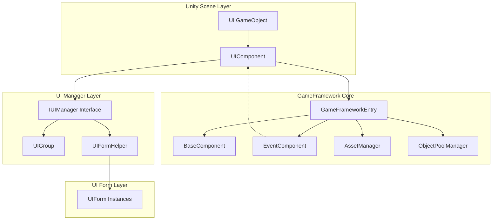
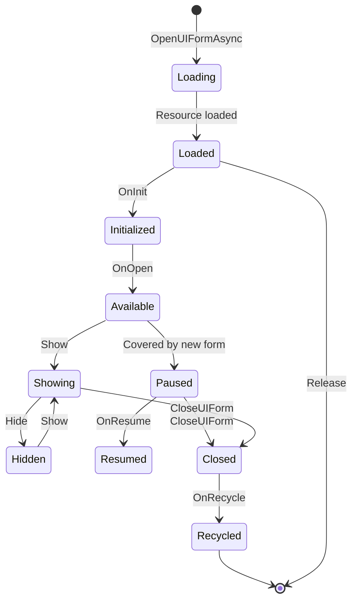

# UIComponent

UIComponent is the core UI component in the GameFrameX framework, inheriting from GameFrameworkComponent, used to manage all UI forms in the game. It serves as a facade class for the IUIManager interface, providing a simple API for UI open, close, get, and other operations, while supporting both UGUI and FairyGUI UI systems.

## Overview

UIComponent is the core component in Unity game scenes, responsible for managing and coordinating the entire UI system. As one of the core components of the game framework, it encapsulates the underlying IUIManager implementation and provides a more user-friendly API interface.

**Main Features:**
- Async open and close of UI forms
- UI form query and retrieval
- UI Group (UIGroup) management
- UI object pool configuration
- UI event system
- UI show/hide animation control

## Architecture

UIComponent plays the role of a Facade in the overall architecture, encapsulating the underlying IUIManager implementation.



## Properties

### Root Node Properties

| Property | Type | Description |
|----------|------|-------------|
| `UGUIRoot` | Transform | Gets the UGUI root node Transform component |
| `FairyGUIRoot` | Transform | Gets the FairyGUI root node Transform component |

### Auto-Recycle Configuration

| Property | Type | Default | Description |
|----------|------|---------|-------------|
| `EnableAutoReleaseUIForm` | bool | true | Whether to enable auto-recycle form |
| `InstanceAutoReleaseInterval` | float | 60f | Auto-release interval in seconds for form instance object pool |
| `InstanceCapacity` | int | 16 | Form instance object pool capacity |
| `InstanceExpireTime` | float | 60f | Form instance object pool object expiration seconds |
| `RecycleInterval` | int | 60 | Form recycle interval in seconds |

### Animation Configuration

| Property | Type | Default | Description |
|----------|------|---------|-------------|
| `IsEnableUIShowAnimation` | bool | false | Whether to enable UI show animation |
| `IsEnableUIHideAnimation` | bool | false | Whether to enable UI hide animation |

### UI Group Count

| Property | Type | Description |
|----------|------|-------------|
| `UIGroupCount` | int | Gets the number of form groups |

## API Reference

### Open Forms

#### `OpenAsync<T>(object userData = null, bool isFullScreen = false): Task<T>`

Asynchronously opens a form, automatically resolving UI asset path based on generic type.

**Source File:** [Runtime/UIComponent.Open.cs](https://github.com/GameFrameX/com.gameframex.unity.ui/blob/main/Runtime/UIComponent.Open.cs#L167-L191)

```csharp
// Usage example
var mainMenuForm = await this.OpenAsync<MainMenuUIForm>();
var settingsForm = await this.OpenAsync<SettingsUIForm>(userData, true);
```

**Generic Parameters:**
- `T`: The specific type of UI, must implement IUIForm interface

**Parameters:**
- `userData` (object): User data to pass to UI
- `isFullScreen` (bool): Whether to display fullscreen

**Returns:** `Task<T>` - The opened UI form instance

---

#### `OpenAsync<T>(string uiFormAssetPath, bool pauseCoveredUIForm, object userData = null, bool isFullScreen = false): Task<T>`

Asynchronously opens a form, specifying asset path and whether to pause covered forms.

**Source File:** [Runtime/UIComponent.Open.cs](https://github.com/GameFrameX/com.gameframex.unity.ui/blob/main/Runtime/UIComponent.Open.cs#L152-L155)

```csharp
// Usage example
var form = await this.OpenAsync<MainMenuUIForm>("Assets/UI/MainMenu.prefab", true);
```

**Parameters:**
- `uiFormAssetPath` (string): UI asset path
- `pauseCoveredUIForm` (bool): Whether to pause covered forms
- `userData` (object): User data to pass to UI
- `isFullScreen` (bool): Whether to display fullscreen

---

#### `OpenFullScreenAsync<T>(object userData = null): Task<T>`

Asynchronously opens fullscreen UI.

**Source File:** [Runtime/UIComponent.Open.cs](https://github.com/GameFrameX/com.gameframex.unity.ui/blob/main/Runtime/UIComponent.Open.cs#L63-L68)

```csharp
var dialog = await this.OpenFullScreenAsync<DialogUIForm>(userData);
```

---

#### `OpenUIAsync(string uiFormAssetPath, Type uiFormType, bool pauseCoveredUIForm, object userData = null, bool isFullScreen = false): Task<IUIForm>`

Opens UI asynchronously using Type parameter.

**Source File:** [Runtime/UIComponent.Open.cs](https://github.com/GameFrameX/com.gameframex.unity.ui/blob/main/Runtime/UIComponent.Open.cs#L83-L86)

---

### Close Forms

#### `CloseUIForm(int serialId, bool isNowRecycle = false): void`

Closes a form by serial ID.

**Source File:** [Runtime/UIComponent.Close.cs](https://github.com/GameFrameX/com.gameframex.unity.ui/blob/main/Runtime/UIComponent.Close.cs#L43-L46)

```csharp
// Usage example
this.CloseUIForm(serialId);
this.CloseUIForm(serialId, true); // Recycle immediately
```

**Parameters:**
- `serialId` (int): Serial ID of the form to close
- `isNowRecycle` (bool): Whether to recycle the form immediately, default is false

---

#### `CloseUIForm(IUIForm uiForm, bool isNowRecycle = false): void`

Closes a form by UI instance.

**Source File:** [Runtime/UIComponent.Close.cs](https://github.com/GameFrameX/com.gameframex.unity.ui/blob/main/Runtime/UIComponent.Close.cs#L72-L75)

---

#### `CloseUIForm<T>(object userData = null, bool isNowRecycle = false): void where T : IUIForm`

Closes a form by type.

**Source File:** [Runtime/UIComponent.Close.cs](https://github.com/GameFrameX/com.gameframex.unity.ui/blob/main/Runtime/UIComponent.Close.cs#L89-L92)

---

#### `CloseAllLoadedUIForms(bool isNowRecycle = false): void`

Closes all loaded forms.

**Source File:** [Runtime/UIComponent.Close.cs](https://github.com/GameFrameX/com.gameframex.unity.ui/blob/main/Runtime/UIComponent.Close.cs#L131-L134)

---

#### `CloseAllLoadingUIForms(): void`

Closes all loading forms.

**Source File:** [Runtime/UIComponent.Close.cs](https://github.com/GameFrameX/com.gameframex.unity.ui/blob/main/Runtime/UIComponent.Close.cs#L171-L174)

---

#### `ReleaseAllLoadedUIForms(bool isNowRecycle = false, object userData = null): void`

Releases all loaded forms.

**Source File:** [Runtime/UIComponent.Close.cs](https://github.com/GameFrameX/com.gameframex.unity.ui/blob/main/Runtime/UIComponent.Close.cs#L145-L148)

---

#### `CloseUIGroup(string uiGroupName, object userData = null): void`

Closes all forms in the specified UI group.

**Source File:** [Runtime/UIComponent.Close.cs](https://github.com/GameFrameX/com.gameframex.unity.ui/blob/main/Runtime/UIComponent.Close.cs#L118-L121)

---

### Get Forms

#### `GetUIForm(int serialId): IUIForm`

Gets a form by serial ID.

**Source File:** [Runtime/UIComponent.Get.cs](https://github.com/GameFrameX/com.gameframex.unity.ui/blob/main/Runtime/UIComponent.Get.cs#L47-L50)

```csharp
var form = this.GetUIForm(serialId);
```

---

#### `GetUIForm(string uiFormAssetName): IUIForm`

Gets a form by asset name.

**Source File:** [Runtime/UIComponent.Get.cs](https://github.com/GameFrameX/com.gameframex.unity.ui/blob/main/Runtime/UIComponent.Get.cs#L61-L64)

---

#### `GetUIForms(string uiFormAssetName): IUIForm[]`

Gets all forms with the specified asset name as an array.

**Source File:** [Runtime/UIComponent.Get.cs](https://github.com/GameFrameX/com.gameframex.unity.ui/blob/main/Runtime/UIComponent.Get.cs#L75-L85)

---

#### `GetLoaded<T>(): T where T : class, IUIForm`

Gets a loaded form by type, returning the first matching instance.

**Source File:** [Runtime/UIComponent.Get.cs](https://github.com/GameFrameX/com.gameframex.unity.ui/blob/main/Runtime/UIComponent.Get.cs#L238-L251)

```csharp
var mainMenu = this.GetLoaded<MainMenuUIForm>();
```

---

#### `GetLoadedList<T>(): List<T> where T : class, IUIForm`

Gets a list of all loaded forms of the specified type.

**Source File:** [Runtime/UIComponent.Get.cs](https://github.com/GameFrameX/com.gameframex.unity.ui/blob/main/Runtime/UIComponent.Get.cs#L120-L134)

---

#### `GetLoadedAndShowing<T>(): T where T : class, IUIForm`

Gets a loaded and currently showing UI.

**Source File:** [Runtime/UIComponent.Get.cs](https://github.com/GameFrameX/com.gameframex.unity.ui/blob/main/Runtime/UIComponent.Get.cs#L168-L181)

---

#### `GetAllLoadedUIForms(): IUIForm[]`

Gets all loaded forms.

**Source File:** [Runtime/UIComponent.Get.cs](https://github.com/GameFrameX/com.gameframex.unity.ui/blob/main/Runtime/UIComponent.Get.cs#L261-L271)

---

#### `GetAllLoadingUIFormSerialIds(): int[]`

Gets all serial IDs of loading forms.

**Source File:** [Runtime/UIComponent.Get.cs](https://github.com/GameFrameX/com.gameframex.unity.ui/blob/main/Runtime/UIComponent.Get.cs#L305-L308)

---

### Query States

#### `HasUIForm(int serialId): bool`

Checks if a form with the specified serial ID exists.

**Source File:** [Runtime/UIComponent.cs](https://github.com/GameFrameX/com.gameframex.unity.ui/blob/main/Runtime/UIComponent.cs#L542-L545)

---

#### `HasUIForm(string uiFormAssetName): bool`

Checks if a form with the specified asset name exists.

**Source File:** [Runtime/UIComponent.cs](https://github.com/GameFrameX/com.gameframex.unity.ui/blob/main/Runtime/UIComponent.cs#L556-L559)

---

#### `IsLoadingUIForm(int serialId): bool`

Checks if a form is loading (by serial ID).

**Source File:** [Runtime/UIComponent.cs](https://github.com/GameFrameX/com.gameframex.unity.ui/blob/main/Runtime/UIComponent.cs#L570-L573)

---

#### `IsLoadingUIForm(string uiFormAssetName): bool`

Checks if a form is loading (by asset name).

**Source File:** [Runtime/UIComponent.cs](https://github.com/GameFrameX/com.gameframex.unity.ui/blob/main/Runtime/UIComponent.cs#L584-L587)

---

#### `IsValidUIForm(IUIForm uiForm): bool`

Checks if a form is valid.

**Source File:** [Runtime/UIComponent.cs](https://github.com/GameFrameX/com.gameframex.unity.ui/blob/main/Runtime/UIComponent.cs#L598-L601)

---

#### `HasLoadedAndShowing(string uiFormAssetName): bool`

Checks if a loaded and showing UI exists.

**Source File:** [Runtime/UIComponent.Get.cs](https://github.com/GameFrameX/com.gameframex.unity.ui/blob/main/Runtime/UIComponent.Get.cs#L192-L204)

---

### UI Group Management

#### `HasUIGroup(string uiGroupName): bool`

Checks if the specified UI group exists.

**Source File:** [Runtime/UIComponent.IUIGroup.cs](https://github.com/GameFrameX/com.gameframex.unity.ui/blob/main/Runtime/UIComponent.IUIGroup.cs#L46-L49)

---

#### `GetUIGroup(string uiGroupName): IUIGroup`

Gets the UI group with the specified name.

**Source File:** [Runtime/UIComponent.IUIGroup.cs](https://github.com/GameFrameX/com.gameframex.unity.ui/blob/main/Runtime/UIComponent.IUIGroup.cs#L60-L63)

---

#### `GetAllUIGroups(): IUIGroup[]`

Gets all UI groups.

**Source File:** [Runtime/UIComponent.IUIGroup.cs](https://github.com/GameFrameX/com.gameframex.unity.ui/blob/main/Runtime/UIComponent.IUIGroup.cs#L73-L76)

---

#### `AddUIGroup(string uiGroupName): bool`

Adds a UI group (default depth is 0).

**Source File:** [Runtime/UIComponent.IUIGroup.cs](https://github.com/GameFrameX/com.gameframex.unity.ui/blob/main/Runtime/UIComponent.IUIGroup.cs#L100-L103)

---

#### `AddUIGroup(string uiGroupName, int depth): bool`

Adds a UI group with specified depth.

**Source File:** [Runtime/UIComponent.IUIGroup.cs](https://github.com/GameFrameX/com.gameframex.unity.ui/blob/main/Runtime/UIComponent.IUIGroup.cs#L115-L147)

---

### Form Activation

#### `RefocusUIForm(UIForm uiForm): void`

Activates the specified form.

**Source File:** [Runtime/UIComponent.cs](https://github.com/GameFrameX/com.gameframex.unity.ui/blob/main/Runtime/UIComponent.cs#L612-L615)

```csharp
this.RefocusUIForm(mainMenuForm);
```

---

#### `RefocusUIForm(UIForm uiForm, object userData): void`

Activates the specified form with user data.

**Source File:** [Runtime/UIComponent.cs](https://github.com/GameFrameX/com.gameframex.unity.ui/blob/main/Runtime/UIComponent.cs#L626-L629)

---

### Instance Lock

#### `SetUIFormInstanceLocked(UIForm uiForm, bool locked): void`

Sets whether the form instance is locked.

**Source File:** [Runtime/UIComponent.cs](https://github.com/GameFrameX/com.gameframex.unity.ui/blob/main/Runtime/UIComponent.cs#L640-L649)

---

### Animation Handling

#### `SetShowUIFormHandler(IUIFormShowHandler uiFormShowHandler): void`

Sets the UI show animation handler interface.

**Source File:** [Runtime/UIComponent.cs](https://github.com/GameFrameX/com.gameframex.unity.ui/blob/main/Runtime/UIComponent.cs#L668-L671)

---

#### `SetHideUIFormHandler(IUIFormHideHandler uiFormHideHandler): void`

Sets the UI hide animation handler interface.

**Source File:** [Runtime/UIComponent.cs](https://github.com/GameFrameX/com.gameframex.unity.ui/blob/main/Runtime/UIComponent.cs#L673-L677)

---

## UI Form Lifecycle

UI forms have a complete lifecycle in the system. Below are the transition relationships between states:



### Lifecycle Callbacks

| Callback Method | When Called | Description |
|-----------------|-------------|-------------|
| `OnAwake()` | On Unity Awake | Form awake, can be used for event subscription initialization |
| `OnInit()` | On form first initialization | Called only once, can be used to initialize view |
| `OnOpen(object userData)` | On form open | Called each time form opens, can receive userData |
| `BindEvent()` | On event binding | Bind events required by the form |
| `LoadData()` | On data loading | Load data required by the form |
| `OnUpdate()` | On each frame update | Form polling |
| `OnClose(bool isShutdown, object userData)` | On form close | Clean up resources on close |
| `OnRecycle()` | On form recycle | Reset state before recycle |
| `UpdateLocalization()` | On language change | Update localized text |

## Configuration Options

| Configuration | Type | Default | Description |
|---------------|------|---------|-------------|
| `EnableOpenUIFormSuccessEvent` | bool | true | Whether to enable open form success event |
| `EnableOpenUIFormFailureEvent` | bool | true | Whether to enable open form failure event |
| `EnableCloseUIFormCompleteEvent` | bool | true | Whether to enable close form complete event |
| `EnableAutoReleaseUIForm` | bool | true | Whether to enable auto-recycle form |
| `IsEnableUIShowAnimation` | bool | false | Whether to enable UI show animation |
| `IsEnableUIHideAnimation` | bool | false | Whether to enable UI hide animation |
| `InstanceAutoReleaseInterval` | float | 60f | Auto-release interval (seconds) |
| `InstanceCapacity` | int | 16 | Object pool capacity |
| `InstanceExpireTime` | float | 60f | Object expiration time (seconds) |
| `RecycleInterval` | int | 60 | Recycle interval (seconds) |
| `m_UIFormHelperTypeName` | string | FairyGUIFormHelper | UI form helper type name |
| `m_UIGroupHelperTypeName` | string | FairyGUIUIGroupHelper | UI group helper type name |

## Related Links

- [UIForm](./5-api-reference.ui-form) - UI form base class
- [IUIManager](./5-api-reference.iuimanager) - UI manager interface
- [IUIGroup](./5-api-reference.iuigroup) - UI group interface
- [Core Concepts - UI Component](./4-core-concepts.ui-component) - UI component core concepts
- [Core Concepts - UI Form](./4-core-concepts.ui-form) - UI form core concepts
- [Core Concepts - UI Group System](./4-core-concepts.ui-group) - UI group system core concepts
- [Event System](./6-event-system) - UI event system