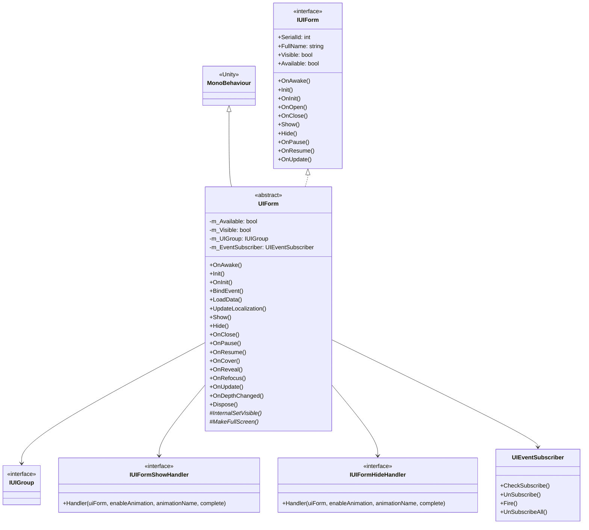
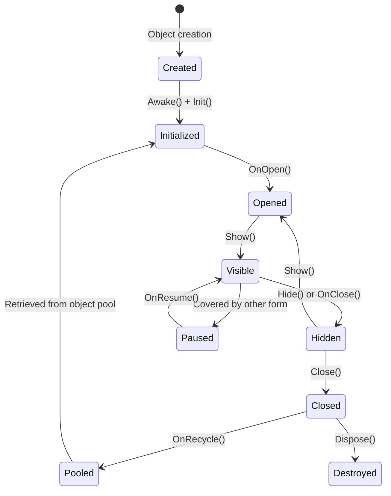

# UIForm

UIForm is the base class for all UI forms in the GameFrameX framework, providing form lifecycle management, visibility control, event subscription, and UI group integration.

## Overview

UIForm is the core class of the UI system, inheriting from Unity's `MonoBehaviour` and implementing the `IUIForm` interface. It provides complete lifecycle management for UI forms, including initialization, display, hiding, closing, pause, resume, and other state transitions.

**Main Features:**
- Complete lifecycle callback mechanism
- Built-in event subscription system
- Show/hide animation support
- Object pool recycling mechanism
- UI group depth management
- Automatic localization language update

## Class Relationship Diagram



## Lifecycle Flow



## Core Properties

| Property | Type | Description |
|----------|------|-------------|
| SerialId | int | Unique serial ID of the form |
| FullName | string | Full class name of the form |
| Name | string | Form name (corresponds to GameObject name) |
| Available | bool | Whether the form is available |
| Visible | bool | Whether the form is visible |
| UIGroup | IUIGroup | The UI group this form belongs to |
| DepthInUIGroup | int | Depth within the UI group |
| PauseCoveredUIForm | bool | Whether to pause covered forms |
| IsAwake | bool | Whether Awake has been executed |
| IsDisableRecycling | bool | Whether recycling is disabled |
| IsDisableClosing | bool | Whether closing is disabled |
| IsCanRecycle | bool | Whether it can be recycled |
| EnableShowAnimation | bool | Whether show animation is enabled |
| EnableHideAnimation | bool | Whether hide animation is enabled |
| UserData | object | User custom data |

## Core Methods

### Initialization Flow

#### `OnAwake()` - Awake Callback

Unity lifecycle method, called when the object is created. Used to initialize the event subscriber and subscribe to localization language change events.

```csharp
public override void OnAwake()
{
    IsAwake = true;
}
```
> Source: [UIForm.cs](https://github.com/GameFrameX/com.gameframex.unity.ui/blob/main/Runtime/UIForm.cs#L433-L436)

#### `Init(...)` - Initialization Method

Initializes the UI form, called by the UI manager.

**Parameters:**
- `serialId` (int): Form serial ID
- `uiFormAssetPath` (string): Form asset path
- `uiFormAssetName` (string): Form asset name
- `uiGroup` (IUIGroup): The UI group this form belongs to
- `onInitAction` (Action~IUIForm~): Delegate to execute before initialization
- `pauseCoveredUIForm` (bool): Whether to pause covered forms
- `isNewInstance` (bool): Whether it's a new instance
- `userData` (object): User custom data
- `recycleInterval` (int): Recycle interval (seconds)
- `isFullScreen` (bool): Whether fullscreen

```csharp
public void Init(int serialId, string uiFormAssetPath, string uiFormAssetName, IUIGroup uiGroup, 
    Action<IUIForm> onInitAction, bool pauseCoveredUIForm, bool isNewInstance, 
    object userData, int recycleInterval, bool isFullScreen = false)
```
> Source: [UIForm.cs](https://github.com/GameFrameX/com.gameframex.unity.ui/blob/main/Runtime/UIForm.cs#L555-L599)

#### `OnInit()` - Initialization Complete Callback

Callback after initialization is complete; subclasses can override this method for initialization logic.

```csharp
public virtual void OnInit()
{
}
```
> Source: [UIForm.cs](https://github.com/GameFrameX/com.gameframex.unity.ui/blob/main/Runtime/UIForm.cs#L608-L610)

### Display and Hide

#### `OnOpen(object userData)` - Open Callback

Called when the form opens.

```csharp
public virtual void OnOpen(object userData)
{
    m_Available = true;
    Visible = true;
    m_UserData = userData;
}
```
> Source: [UIForm.cs](https://github.com/GameFrameX/com.gameframex.unity.ui/blob/main/Runtime/UIForm.cs#L639-L644)

#### `Show(IUIFormShowHandler handler, Action complete)` - Show Method

Shows the form, the system calls the show animation.

**Parameters:**
- `handler` (IUIFormShowHandler): Show handler interface
- `complete` (Action): Complete callback

```csharp
public abstract void Show(IUIFormShowHandler handler, Action complete);
```
> Source: [UIForm.cs](https://github.com/GameFrameX/com.gameframex.unity.ui/blob/main/Runtime/UIForm.cs#L689)

#### `Hide(IUIFormHideHandler handler, Action complete)` - Hide Method

Hides the form, the system calls the hide animation.

**Parameters:**
- `handler` (IUIFormHideHandler): Hide handler interface
- `complete` (Action): Complete callback

```csharp
public abstract void Hide(IUIFormHideHandler handler, Action complete);
```
> Source: [UIForm.cs](https://github.com/GameFrameX/com.gameframex.unity.ui/blob/main/Runtime/UIForm.cs#L724)

#### `OnClose(bool isShutdown, object userData)` - Close Callback

Called when the form closes.

**Parameters:**
- `isShutdown` (bool): Whether triggered when closing the UI manager
- `userData` (object): User custom data

```csharp
public virtual void OnClose(bool isShutdown, object userData)
{
    gameObject?.SetLayerRecursively(m_OriginalLayer);
    m_Available = false;
    Visible = false;
    if (m_IsDisableRecycling)
    {
        return;
    }
    ReleaseStartTime = DateTime.Now;
}
```
> Source: [UIForm.cs](https://github.com/GameFrameX/com.gameframex.unity.ui/blob/main/Runtime/UIForm.cs#L700-L712)

### Pause and Resume

#### `OnPause()` - Pause Callback

Called when the form is covered by another form.

```csharp
public virtual void OnPause()
{
    m_Available = false;
    Visible = false;
}
```
> Source: [UIForm.cs](https://github.com/GameFrameX/com.gameframex.unity.ui/blob/main/Runtime/UIForm.cs#L733-L737)

#### `OnResume()` - Resume Callback

Called when the form recovers from paused state.

```csharp
public virtual void OnResume()
{
    m_Available = true;
    Visible = true;
}
```
> Source: [UIForm.cs](https://github.com/GameFrameX/com.gameframex.unity.ui/blob/main/Runtime/UIForm.cs#L746-L750)

### Cover Handling

#### `OnCover()` - Cover Callback

Called when the form is covered by another form.

```csharp
public virtual void OnCover()
{
}
```
> Source: [UIForm.cs](https://github.com/GameFrameX/com.gameframex.unity.ui/blob/main/Runtime/UIForm.cs#L759-L761)

#### `OnReveal()` - Reveal Callback

Called when the form recovers from covered state.

```csharp
public virtual void OnReveal()
{
}
```
> Source: [UIForm.cs](https://github.com/GameFrameX/com.gameframex.unity.ui/blob/main/Runtime/UIForm.cs#L770-L772)

### Other Callbacks

#### `OnRefocus(object userData)` - Refocus Callback

Called when the form is activated, used to bring the form back to top.

```csharp
public virtual void OnRefocus(object userData)
{
}
```
> Source: [UIForm.cs](https://github.com/GameFrameX/com.gameframex.unity.ui/blob/main/Runtime/UIForm.cs#L782-L784)

#### `OnUpdate(float elapseSeconds, float realElapseSeconds)` - Polling Callback

Polling method called every frame.

**Parameters:**
- `elapseSeconds` (float): Logical elapsed time (seconds)
- `realElapseSeconds` (float): Real elapsed time (seconds)

```csharp
public virtual void OnUpdate(float elapseSeconds, float realElapseSeconds)
{
}
```
> Source: [UIForm.cs](https://github.com/GameFrameX/com.gameframex.unity.ui/blob/main/Runtime/UIForm.cs#L795-L797)

#### `OnDepthChanged(int uiGroupDepth, int depthInUIGroup)` - Depth Changed Callback

Called when the form depth changes.

**Parameters:**
- `uiGroupDepth` (int): UI group depth
- `depthInUIGroup` (int): Form depth within the UI group

```csharp
public void OnDepthChanged(int uiGroupDepth, int depthInUIGroup)
{
    m_DepthInUIGroup = depthInUIGroup;
}
```
> Source: [UIForm.cs](https://github.com/GameFrameX/com.gameframex.unity.ui/blob/main/Runtime/UIForm.cs#L808-L811)

### Event System

#### `OnEventSubscribe()` - Event Subscribe Callback

Called during `OnEnable`, used to subscribe to events. Subclasses can override this method to register required events.

```csharp
protected virtual void OnEventSubscribe()
{
}
```
> Source: [UIForm.cs](https://github.com/GameFrameX/com.gameframex.unity.ui/blob/main/Runtime/UIForm.cs#L508-L510)

#### `OnEventUnSubscribe()` - Event Unsubscribe Callback

Called during `OnDisable`, used to unsubscribe from events.

```csharp
protected virtual void OnEventUnSubscribe()
{
}
```
> Source: [UIForm.cs](https://github.com/GameFrameX/com.gameframex.unity.ui/blob/main/Runtime/UIForm.cs#L523-L525)

### Recycle and Destroy

#### `OnRecycle()` - Recycle Callback

Called when the form is recycled, resets the form state.

```csharp
public virtual void OnRecycle()
{
    m_DepthInUIGroup = 0;
    m_PauseCoveredUIForm = true;
}
```
> Source: [UIForm.cs](https://github.com/GameFrameX/com.gameframex.unity.ui/blob/main/Runtime/UIForm.cs#L625-L629)

#### `Dispose()` - Destroy Method

Destroys the form, releasing all resources.

```csharp
public virtual void Dispose()
{
    if (IsDisposed)
    {
        return;
    }
    if (m_EventSubscriber != null)
    {
        m_EventSubscriber.UnSubscribeAll();
        ReferencePool.Release(m_EventSubscriber);
    }
    m_EventSubscriber = null;
    IsDisposed = true;
}
```
> Source: [UIForm.cs](https://github.com/GameFrameX/com.gameframex.unity.ui/blob/main/Runtime/UIForm.cs#L820-L835)

### Methods Subclasses Must Implement

#### `InternalSetVisible(bool visible)` - Set Visibility

Subclasses must implement this method to handle actual visibility setting.

```csharp
protected abstract void InternalSetVisible(bool visible);
```
> Source: [UIForm.cs](https://github.com/GameFrameX/com.gameframex.unity.ui/blob/main/Runtime/UIForm.cs#L845)

#### `MakeFullScreen()` - Set Fullscreen

Subclasses must implement this method to handle fullscreen setting.

```csharp
protected internal abstract void MakeFullScreen();
```
> Source: [UIForm.cs](https://github.com/GameFrameX/com.gameframex.unity.ui/blob/main/Runtime/UIForm.cs#L854)

## Usage Examples

### Create Custom UIForm

```csharp
using GameFrameX.UI.Runtime;
using UnityEngine;

public class MainMenuForm : UIForm
{
    [SerializeField] private Text titleText;
    [SerializeField] private Button startButton;
    [SerializeField] private Button settingsButton;

    protected override void InternalSetVisible(bool visible)
    {
        gameObject.SetActive(visible);
    }

    protected internal override void MakeFullScreen()
    {
        // Implement fullscreen logic
    }

    public override void OnInit()
    {
        base.OnInit();
        Debug.Log("MainMenuForm initialization complete");
    }

    public override void BindEvent()
    {
        startButton.onClick.AddListener(OnStartButtonClick);
        settingsButton.onClick.AddListener(OnSettingsButtonClick);
    }

    public override void LoadData()
    {
        // Load data
        titleText.text = GetLocalizedString("MainMenu_Title");
    }

    private void OnStartButtonClick()
    {
        // Handle start button click
    }

    private void OnSettingsButtonClick()
    {
        // Handle settings button click
    }

    public override void UpdateLocalization()
    {
        base.UpdateLocalization();
        titleText.text = GetLocalizedString("MainMenu_Title");
    }
}
```
> Source: [UIForm.cs](https://github.com/GameFrameX/com.gameframex.unity.ui/blob/main/Runtime/UIForm.cs#L37-L855)

### Event Subscription Example

```csharp
public override void OnEventSubscribe()
{
    // Subscribe to game events
    EventSubscriber.CheckSubscribe(PlayerHealthChangedEventArgs.EventId, OnPlayerHealthChanged);
}

private void OnPlayerHealthChanged(object sender, GameEventArgs e)
{
    var args = (PlayerHealthChangedEventArgs)e;
    UpdateHealthBar(args.CurrentHealth, args.MaxHealth);
}

protected override void OnEventUnSubscribe()
{
    // Unsubscribe
    EventSubscriber.UnSubscribe(PlayerHealthChangedEventArgs.EventId, OnPlayerHealthChanged);
}
```
> Source: [UIForm.cs](https://github.com/GameFrameX/com.gameframex.unity.ui/blob/main/Runtime/UIForm.cs#L507-L525)

## Abstract Method Description

The following methods need to be implemented in subclasses:

| Method | Description |
|--------|-------------|
| `Show(IUIFormShowHandler, Action)` | Show form and execute animation |
| `Hide(IUIFormHideHandler, Action)` | Hide form and execute animation |
| `InternalSetVisible(bool)` | Set form actual visibility |
| `MakeFullScreen()` | Set form to fullscreen mode |

## IUIForm Interface

`UIForm` implements the `IUIForm` interface, which defines all properties and methods that all UI forms must have. The interface definition includes:

- Properties: `SerialId`, `FullName`, `Visible`, `Available`, `UIGroup`, `DepthInUIGroup`, etc.
- Methods: `Init()`, `OnInit()`, `OnOpen()`, `OnClose()`, `Show()`, `Hide()`, `OnPause()`, `OnResume()`, `OnUpdate()`, etc.

> For detailed interface definition, see [IUIForm.cs](https://github.com/GameFrameX/com.gameframex.unity.ui/blob/main/Runtime/UI/IUIForm.cs)

## Related Links

- [UIComponent](./5-api-reference.ui-component) - UI component reference
- [IUIManager](./5-api-reference.iuimanager) - UI manager interface
- [IUIGroup](./5-api-reference.iuigroup) - UI group interface
- [UI Form Core Concepts](./4-core-concepts.ui-form) - UI form core concepts
- [UI Group System](./4-core-concepts.ui-group) - UI group system
- [Event System](./6-event-system) - Event system