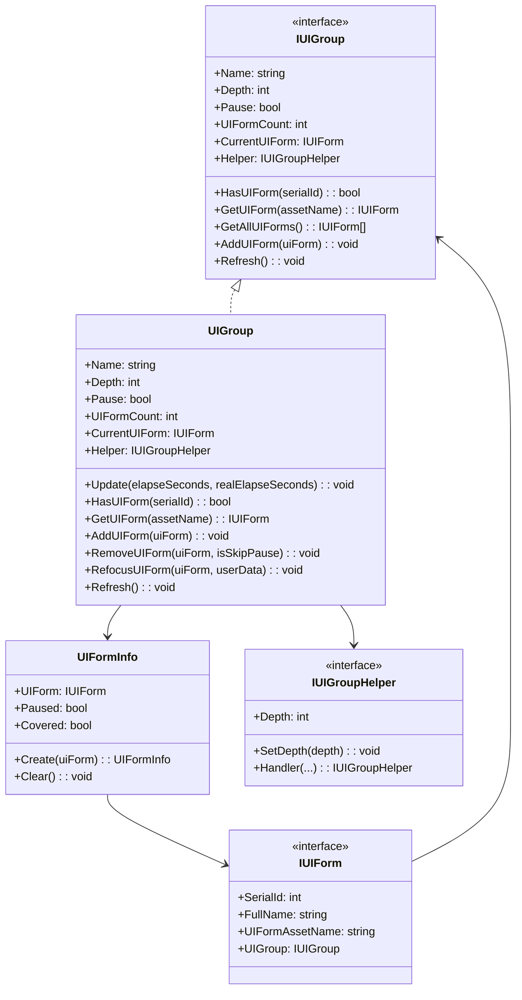
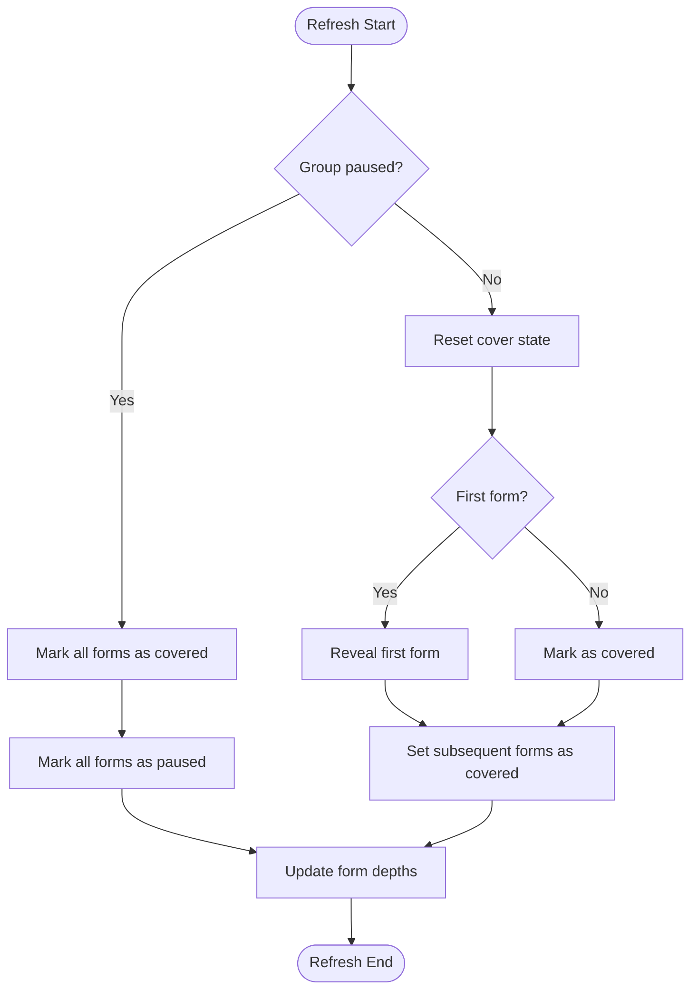
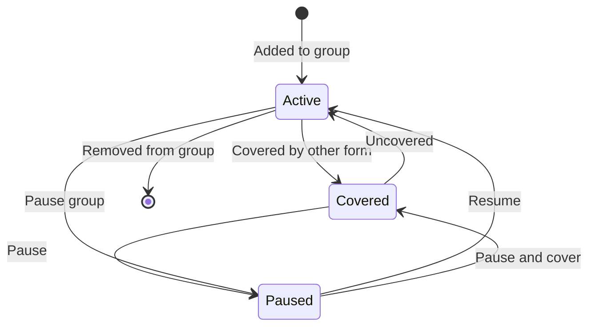

# IUIGroup

UI group interface, defines basic operations for UI group management.

## Overview

`IUIGroup` is one of the core interfaces in the GameFrameX UI system, used to manage a group of related UI forms. It provides operations such as querying, adding, removing, refreshing UI forms, while supporting depth management and pause/resume functionality.

**Design Intent**: The UI group system allows developers to logically group UI forms. Each group can independently control depth, pause state, and display order. For example, "Main Menu UI", "In-Game UI", and "Popup UI" can be placed in different groups for easier management and control.

## Architecture



**Architecture Description:**
- `IUIGroup` defines the abstract interface for UI groups
- `UIGroup` is the concrete implementation of the interface, internally using `GameFrameworkLinkedList<UIFormInfo>` to maintain UI form lists
- `UIFormInfo` stores state information (pause/cover state) for each UI form
- `IUIGroupHelper` handles platform-specific UI group rendering logic

## Core Flows

### UI Group Refresh Flow

When UI group properties (depth, pause state) change, a refresh flow is triggered to update the state of all UI forms in the group.



**Refresh Logic Description:**
1. If the group is in paused state, all UI forms are marked as "covered" and "paused"
2. If the group is not paused, the first UI form is revealed (cover state removed), and subsequent forms are marked as covered
3. During refresh, each UI form's depth information is updated

### UI Form Lifecycle States



## Property Details

### Name

```csharp
string Name { get; }
```

Gets the UI group name. This name uniquely identifies the group in the UI manager.

### Depth

```csharp
int Depth { get; set; }
```

Gets or sets the UI group depth. The depth value determines the rendering order of UI groups; groups with larger depth values render above groups with smaller depth values.

### Pause

```csharp
bool Pause { get; set; }
```

Gets or sets whether the UI group is paused. When pause is `true`, all UI forms in the group are paused and do not respond to user interaction.

### UIFormCount

```csharp
int UIFormCount { get; }
```

Gets the number of UI forms in the UI group.

### CurrentUIForm

```csharp
IUIForm CurrentUIForm { get; }
```

Gets the topmost (last added) UI form.

### Helper

```csharp
IUIGroupHelper Helper { get; }
```

Gets the UI group helper for handling platform-specific UI group operations.

## Method Details

### HasUIForm

```csharp
bool HasUIForm(int serialId);
bool HasUIForm(string uiFormAssetName);
```

Checks if a specified UI form exists in the UI group.

**Parameters:**
- `serialId` (int): Serial ID of the UI form
- `uiFormAssetName` (string): Asset name of the UI form

**Return Value:** Whether the specified UI form exists

### GetUIForm

```csharp
IUIForm GetUIForm(int serialId);
IUIForm GetUIForm(string uiFormAssetName);
```

Gets a UI form from the UI group.

**Parameters:**
- `serialId` (int): Serial ID of the UI form
- `uiFormAssetName` (string): Asset name of the UI form

**Return Value:** The requested UI form, or null if it doesn't exist

### GetUIForms

```csharp
IUIForm[] GetUIForms(string uiFormAssetName);
void GetUIForms(string uiFormAssetName, List<IUIForm> results);
```

Gets all UI forms with the specified asset name from the UI group (may have multiple instances).

**Parameters:**
- `uiFormAssetName` (string): Asset name of the UI form
- `results` (`List<IUIForm>`): List to store results

### GetAllUIForms

```csharp
IUIForm[] GetAllUIForms();
void GetAllUIForms(List<IUIForm> results);
```

Gets all UI forms in the UI group.

**Parameters:**
- `results` (`List<IUIForm>`): List to store results

### AddUIForm

```csharp
void AddUIForm(IUIForm uiForm);
```

Adds a UI form to the UI group. The newly added form becomes the current form (topmost).

**Parameters:**
- `uiForm` (IUIForm): The UI form to add

### InternalHasInstanceUIForm

```csharp
bool InternalHasInstanceUIForm(string uiFormAssetName, IUIForm uiForm);
```

Checks if the specified UI form instance exists in the UI group (internal use).

**Parameters:**
- `uiFormAssetName` (string): Asset name of the UI form
- `uiForm` (IUIForm): The UI form instance to check

**Return Value:** Whether the specified UI form instance exists

### Refresh

```csharp
void Refresh();
```

Refreshes the UI group. Called when the group's depth or pause state changes to update the state of all UI forms in the group.

## Usage Examples

### Get UI Group and Query Forms

```csharp
// Get UI group through UI manager
var uiGroup = uiManager.GetUIGroup("MainMenuGroup");

// Check if specified form exists in group
bool exists = uiGroup.HasUIForm("TestForm");

// Get current form
var currentForm = uiGroup.CurrentUIForm;

// Get all forms
var allForms = uiGroup.GetAllUIForms();
```
> Source: [IUIGroup.cs](https://github.com/GameFrameX/com.gameframex.unity.ui/blob/main/Runtime/UI/IUIGroup.cs#L42-L197)

### Modify UI Group State

```csharp
var uiGroup = uiManager.GetUIGroup("DialogGroup");

// Set group depth
uiGroup.Depth = 10;

// Pause group (all forms will pause)
uiGroup.Pause = true;

// Refresh group state
uiGroup.Refresh();
```
> Source: [UIGroup.cs](https://github.com/GameFrameX/com.gameframex.unity.ui/blob/main/Runtime/UI/UIGroup.cs#L106-L142)

### Manage UI Forms

```csharp
var uiGroup = uiManager.GetUIGroup("DefaultGroup");

// Add form to group
uiGroup.AddUIForm(uiForm);

// Refresh group
uiGroup.Refresh();

// Get form
var form = uiGroup.GetUIForm("MyForm");
```
> Source: [UIGroup.cs](https://github.com/GameFrameX/com.gameframex.unity.ui/blob/main/Runtime/UI/UIGroup.cs#L439-L442)

## Related Links

- [UIForm](./5-api-reference.ui-form) - UI form interface
- [IUIManager](./5-api-reference.iuimanager) - UI manager interface
- [UI Group System](../4-core-concepts.ui-group) - UI group system core concepts
- [UI Group Hierarchy](../7-ui-group-hierarchy) - UI group hierarchy configuration