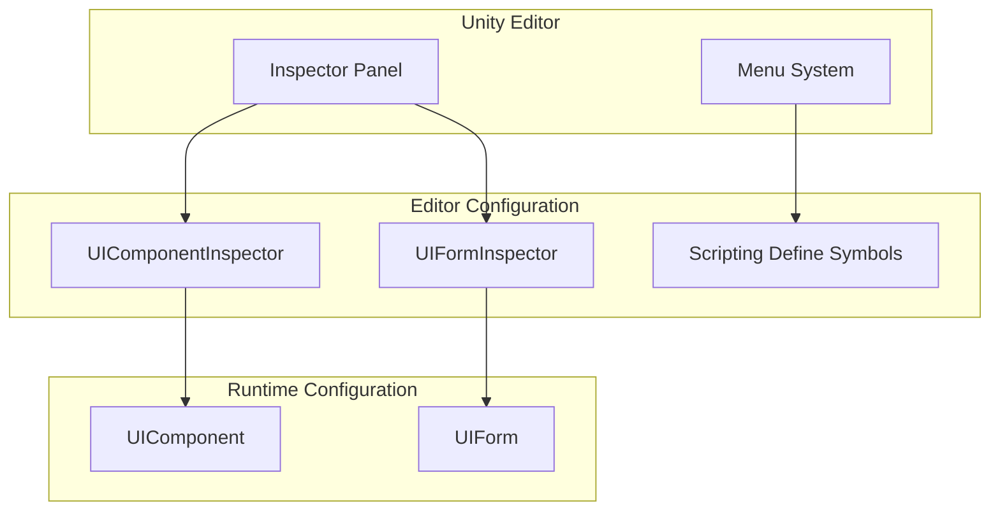
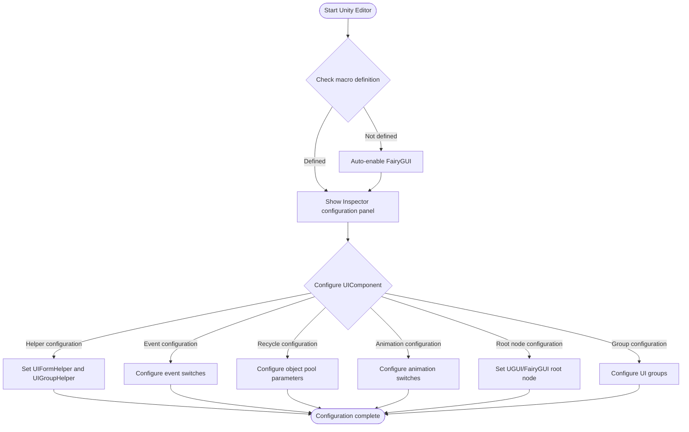

# Editor Configuration

GameFrameX UI system provides a complete set of Unity editor configuration features, allowing developers to flexibly configure various parameters of the UI system through the Inspector panel and menu options.

## Overview

Editor configuration is an important part of the GameFrameX UI system. It provides two main configuration methods:

1. **Inspector Panel Configuration**: Configure UI components and forms directly through Unity editor's Inspector panel
2. **Scripting Define Symbol Switching**: Switch between different UI engines (UGUI or FairyGUI) through menu

This design makes UI system configuration intuitive and convenient, allowing most configuration work to be completed without writing code.

## UI Component Configuration

UIComponent is the core component of the UI system, and its configuration is presented in the Inspector panel through `UIComponentInspector`.

### Configuration Interface Overview

```csharp
[CustomEditor(typeof(UIComponent))]
internal sealed class UIComponentInspector : ComponentTypeComponentInspector
```
> Source: [UIComponentInspector.cs](https://github.com/GameFrameX/com.gameframex.unity.ui/blob/main/Editor/UIComponentInspector.cs#L38-L40)

### Helper Configuration

The following Helper classes can be configured in the Inspector panel:

| Configuration | Type | Description |
|---------------|------|-------------|
| UIForm Helper | UIFormHelperBase | UI form load helper |
| UIGroup Helper | UIGroupHelperBase | UI group helper |

```csharp
private HelperInfo<UIFormHelperBase> m_UIFormHelperInfo = new HelperInfo<UIFormHelperBase>("UIForm");
private HelperInfo<UIGroupHelperBase> m_UIGroupHelperInfo = new HelperInfo<UIGroupHelperBase>("UIGroup");
```
> Source: [UIComponentInspector.cs](https://github.com/GameFrameX/com.gameframex.unity.ui/blob/main/Editor/UIComponentInspector.cs#L62-L63)

**Important Note**: UIForm Helper and UIGroup Helper namespace prefixes must be consistent, otherwise initialization will fail.

## Event System Configuration

UIComponent provides multiple event switches to control whether to subscribe to specific UI events:

| Event Configuration | Default | Description |
|--------------------|---------|-------------|
| EnableOpenUIFormSuccessEvent | true | Enable open form success event |
| EnableOpenUIFormFailureEvent | true | Enable open form failure event |
| EnableCloseUIFormCompleteEvent | true | Enable close form complete event |

```csharp
[SerializeField] private bool m_EnableOpenUIFormSuccessEvent = true;
[SerializeField] private bool m_EnableOpenUIFormFailureEvent = true;
[SerializeField] private bool m_EnableCloseUIFormCompleteEvent = true;
```
> Source: [UIComponent.cs](https://github.com/GameFrameX/com.gameframex.unity.ui/blob/main/Runtime/UIComponent.cs#L62-L86)

### Configuration Description

- **Enable Open Form Success Event**: When enabled, triggers the corresponding event when a form opens successfully
- **Enable Open Form Failure Event**: When enabled, triggers the corresponding event when a form fails to open
- **Enable Close Form Complete Event**: When enabled, triggers the corresponding event when a form closes completely

## Auto-Recycle Configuration

UIComponent provides complete object pool and auto-recycle mechanism configuration:

### Recycle Settings

| Configuration | Type | Default | Description |
|---------------|------|---------|-------------|
| EnableAutoReleaseUIForm | bool | true | Whether to enable auto-recycle form |
| RecycleInterval | int | 60 | Form recycle interval (seconds), range 10-600 |
| InstanceAutoReleaseInterval | float | 60f | Instance auto-release interval (seconds) |
| InstanceCapacity | int | 16 | Instance object pool capacity |
| InstanceExpireTime | float | 60f | Instance expiration time (seconds) |

```csharp
[SerializeField] private bool m_EnableAutoReleaseUIForm = true;
[SerializeField] private float m_InstanceAutoReleaseInterval = 60f;
[SerializeField] private int m_InstanceCapacity = 16;
[SerializeField] private float m_InstanceExpireTime = 60f;
[SerializeField] private int m_RecycleInterval = 60;
```
> Source: [UIComponent.cs](https://github.com/GameFrameX/com.gameframex.unity.ui/blob/main/Runtime/UIComponent.cs#L77-L141)

### Configuration Description

- **EnableAutoReleaseUIForm**: When disabled, resources will not be automatically released when forms are closed; suitable for scenarios requiring cached reuse
- **RecycleInterval**: Sets the time interval for the object pool to automatically recycle recyclable objects, range 10-600 seconds
- **InstanceAutoReleaseInterval**: Interval in seconds for the form instance object pool to auto-release recyclable objects
- **InstanceCapacity**: Form instance object pool capacity; the maximum number of form instances that can be cached in the pool
- **InstanceExpireTime**: Form instance object pool object expiration seconds; forms can be reused within this time after being closed

## Animation Configuration

UIComponent supports animation effects when forms open and close:

| Configuration | Type | Default | Description |
|---------------|------|---------|-------------|
| IsEnableUIShowAnimation | bool | false | Whether to enable form show animation |
| IsEnableUIHideAnimation | bool | false | Whether to enable form hide animation |

```csharp
[SerializeField] private bool m_IsEnableUIShowAnimation = false;
[SerializeField] private bool m_IsEnableUIHideAnimation = false;
```
> Source: [UIComponent.cs](https://github.com/GameFrameX/com.gameframex.unity.ui/blob/main/Runtime/UIComponent.cs#L95-L104)

## UI Root Node Configuration

Based on the different UI engines, corresponding root nodes need to be configured:

### UGUI Root Node

```csharp
[SerializeField] private Transform m_InstanceUGUIRoot = null;
```
> Source: [UIComponent.cs](https://github.com/GameFrameX/com.gameframex.unity.ui/blob/main/Runtime/UIComponent.cs#L152)

### FairyGUI Root Node

```csharp
[SerializeField] private Transform m_InstanceFairyGUIRoot = null;
```
> Source: [UIComponent.cs](https://github.com/GameFrameX/com.gameframex.unity.ui/blob/main/Runtime/UIComponent.cs#L161)

## UI Group Configuration

UIComponent supports configuring multiple UI groups (UIGroup), each group can have independent name and depth:

```csharp
[SerializeField] private UIGroup[] m_UIGroups = new UIGroup[]
{
    new UIGroup(UIGroupConstants.Hidden.Depth, UIGroupConstants.Hidden.Name),
};
```
> Source: [UIComponent.cs](https://github.com/GameFrameX/com.gameframex.unity.ui/blob/main/Runtime/UIComponent.cs#L206-L208)

**Important Notes**:
- At least one UIGroup must be configured
- Strongly recommended not to set the same Depth for multiple UIGroups

## UI Form Configuration

UIForm is the form base class in the UI system, and its configuration is presented in the Inspector panel through `UIFormInspector`:

### Form Basic Properties

| Property | Type | Description |
|----------|------|-------------|
| FullName | string | Form full name |
| SerialId | int | Form serial ID |
| Available | bool | Whether form is available |
| Visible | bool | Whether form is visible |
| IsInit | bool | Whether form is initialized |
| IsDisableRecycling | bool | Whether recycling is disabled |
| IsDisableClosing | bool | Whether closing is disabled |
| DepthInUIGroup | int | Depth within UI group |
| PauseCoveredUIForm | bool | Whether to pause when covered |

```csharp
[CustomEditor(typeof(UIForm), true)]
internal sealed class UIFormInspector : GameFrameworkInspector
```
> Source: [UIFormInspector.cs](https://github.com/GameFrameX/com.gameframex.unity.ui/blob/main/Editor/UIFormInspector.cs#L41-L42)

### Form Animation Properties

| Property | Type | Description |
|----------|------|-------------|
| EnableShowAnimation | bool | Whether to enable show animation |
| ShowAnimationName | string | Show animation name |
| EnableHideAnimation | bool | Whether to enable hide animation |
| HideAnimationName | string | Hide animation name |

## Scripting Define Symbol Configuration

GameFrameX UI system supports two UI engines: UGUI and FairyGUI. Different engines can be switched via scripting define symbols.

### Macro Symbols

| Macro | Description |
|-------|-------------|
| ENABLE_UI_UGUI | Enable UGUI adaptation |
| ENABLE_UI_FAIRYGUI | Enable FairyGUI adaptation |

```csharp
public const string UGUIScriptingDefineSymbol = "ENABLE_UI_UGUI";
public const string FairyGUIScriptingDefineSymbol = "ENABLE_UI_FAIRYGUI";
```
> Source: [UISystemScriptingDefineSymbols.cs](https://github.com/GameFrameX/com.gameframex.unity.ui/blob/main/Editor/UISystemScriptingDefineSymbols.cs#L42-L43)

### Switching UI Engine

In Unity editor, you can switch UI engine through menu:

1. Open menu: **GameFrameX -> Scripting Define Symbols**
2. Select the desired UI system:
   - **Enable UGUI(开启UGUI适配)** - Switch to UGUI
   - **Enable FairyGUI(开启FairyGUI适配)** - Switch to FairyGUI

```csharp
[MenuItem("GameFrameX/Scripting Define Symbols/Enable UGUI(开启UGUI适配)", false, 1000)]
public static void EnableUGUISystem()
{
    ScriptingDefineSymbols.RemoveScriptingDefineSymbol(FairyGUIScriptingDefineSymbol);
    ScriptingDefineSymbols.AddScriptingDefineSymbol(UGUIScriptingDefineSymbol);
}

[MenuItem("GameFrameX/Scripting Define Symbols/Enable FairyGUI(开启FairyGUI适配)", false, 1001)]
public static void EnableFairyGUISystem()
{
    ScriptingDefineSymbols.RemoveScriptingDefineSymbol(UGUIScriptingDefineSymbol);
    ScriptingDefineSymbols.AddScriptingDefineSymbol(FairyGUIScriptingDefineSymbol);
}
```
> Source: [UISystemScriptingDefineSymbols.cs](https://github.com/GameFrameX/com.gameframex.unity.ui/blob/main/Editor/UISystemScriptingDefineSymbols.cs#L48-L63)

### Auto-Detection

The system provides auto-detection mechanism. When the editor loads, it checks whether the UI system macro symbols are defined:

```csharp
[InitializeOnLoadMethod]
static void Run()
{
    var hasUGUIScriptingDefineSymbol = ScriptingDefineSymbols.HasScriptingDefineSymbol(...);
    var hasFairyGUIScriptingDefineSymbol = ScriptingDefineSymbols.HasScriptingDefineSymbol(...);
    
    if (!(hasFairyGUIScriptingDefineSymbol || hasUGUIScriptingDefineSymbol))
    {
        EditorUtility.DisplayDialog("No UI system macro definition detected", "Will automatically enable FairyGUI UI system", "I understand");
        UISystemScriptingDefineSymbols.EnableFairyGUISystem();
    }
}
```
> Source: [UISystemScriptingDefineCheckHandler.cs](https://github.com/GameFrameX/com.gameframex.unity.ui/blob/main/Editor/UISystemScriptingDefineCheckHandler.cs#L15-L47)

If no UI system macro definition is detected, the system automatically enables FairyGUI as the default engine.

## UI Configuration Attribute

`OptionUIConfigAttribute` attribute class is used to mark UI configuration, supporting both FairyGUI and UGUI frameworks:

```csharp
[AttributeUsage(AttributeTargets.Class)]
public sealed class OptionUIConfigAttribute : Attribute
{
    public string PackageName { get; private set; }  // FairyGUI package name
    public string Path { get; private set; }         // UGUI asset path
    public bool IsResource { get; private set; }    // Whether it's a resource path
}
```
> Source: [OptionUIConfigAttribute.cs](https://github.com/GameFrameX/com.gameframex.unity.ui/blob/main/Runtime/Attribute/OptionUIConfigAttribute.cs#L44-L74)

### Usage Examples

```csharp
// FairyGUI configuration
[OptionUIConfigAttribute("MyFairyGUIPackage")]
public class MyUIForm : UIForm { }

// UGUI prefab path configuration
[OptionUIConfigAttribute("Assets/Prefabs/UI/")]
public class MyUIForm : UIForm { }

// UGUI resource path configuration
[OptionUIConfigAttribute(true)]  // isResource = true
public class MyUIForm : UIForm { }
```

## Architecture Diagram



## Configuration Flowchart



## Common Configuration Issues

### 1. Helper Namespace Inconsistency

**Problem**: Initialization fails, Helper setting error prompt

**Solution**: Ensure UIForm Helper and UIGroup Helper namespace prefixes are consistent

### 2. UI Group Depth Duplication

**Problem**: Multiple UI groups set the same depth value

**Solution**: Set different Depth values for each UI group in the Inspector panel

### 3. Root Node Not Set

**Problem**: Runtime prompt about root node setting error

**Solution**: Correctly set UGUI Root or FairyGUI Root in the Inspector panel

## Related Links

- [UI Component](./4-core-concepts.ui-component)
- [UI Form](./4-core-concepts.ui-form)
- [UI Group System](./4-core-concepts.ui-group)
- [Object Pool Management](./4-core-concepts.object-pool)
- [UI Attributes](./8-configuration.attributes)
- [Platform Support](./9-platforms)