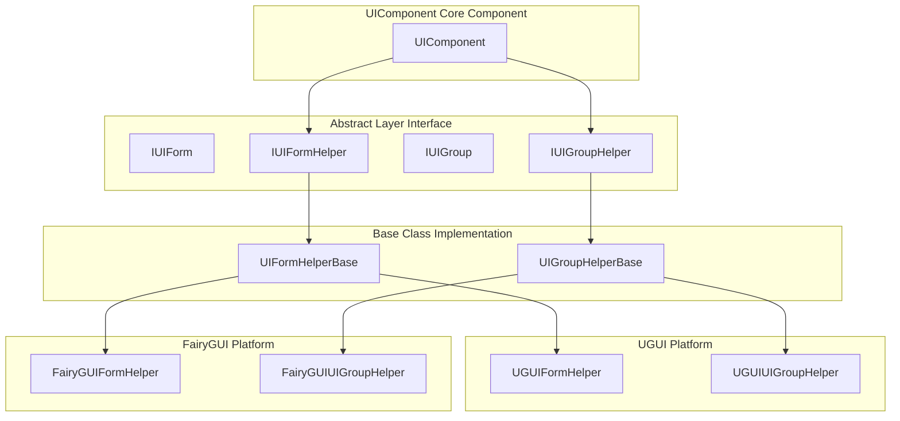
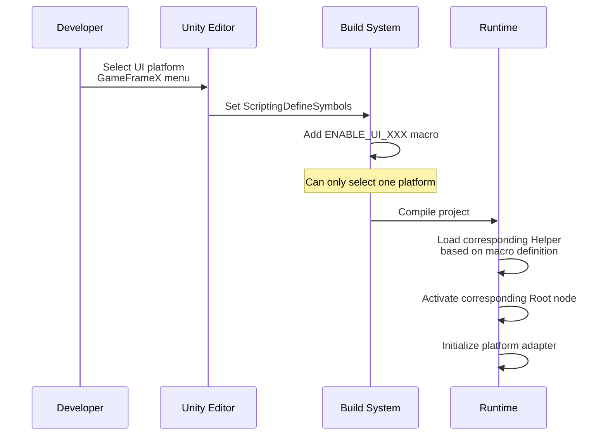

# Platform Support

GameFrameX UI system supports multiple UI rendering platforms, using unified interface abstraction to enable developers to flexibly switch between different UI systems while keeping business code consistent.

## Overview

GameFrameX UI framework uses a platform-independent design philosophy, isolating different UI system implementation differences through an abstraction layer (Helper interface). Currently supports two major UI platforms:

| UI Platform | Macro Symbol | Description |
|-------------|--------------|-------------|
| **UGUI** | `ENABLE_UI_UGUI` | Unity's built-in UI system |
| **FairyGUI** | `ENABLE_UI_FAIRYGUI` | Professional third-party UI solution |

This design allows business logic code to remain unchanged, and only switching the macro definition can migrate between different UI systems, effectively reducing platform switching costs.

## Architecture Design



### Core Component Description

| Component | Responsibility |
|-----------|----------------|
| **UIComponent** | UI core manager, responsible for coordinating Helper work |
| **IUIFormHelper** | UI form helper interface, defines form creation, instantiation, and release |
| **IUIGroupHelper** | UI group helper interface, defines group management and depth control |
| **UIFormHelperBase** | Form helper abstract base class, provides platform-independent unified implementation |
| **UIGroupHelperBase** | Group helper abstract base class, provides platform-independent unified implementation |

## Platform Switching Configuration

### Switching via Scripting Define Symbols

In Unity editor, configure UI platform through menu:

```
GameFrameX -> Scripting Define Symbols -> Enable UGUI(开启UGUI适配)
GameFrameX -> Scripting Define Symbols -> Enable FairyGUI(开启FairyGUI适配)
```

> Source: [UISystemScriptingDefineSymbols.cs](https://github.com/GameFrameX/com.gameframex.unity.ui/blob/main/Editor/UISystemScriptingDefineSymbols.cs#L42-L63)

Macro symbol description:

| Macro | Effect |
|-------|--------|
| `ENABLE_UI_UGUI` | Enable UGUI platform support |
| `ENABLE_UI_FAIRYGUI` | Enable FairyGUI platform support |

Switching principle:
```csharp
public static void EnableUGUISystem()
{
    ScriptingDefineSymbols.RemoveScriptingDefineSymbol(FairyGUIScriptingDefineSymbol);
    ScriptingDefineSymbols.AddScriptingDefineSymbol(UGUIScriptingDefineSymbol);
}

public static void EnableFairyGUISystem()
{
    ScriptingDefineSymbols.RemoveScriptingDefineSymbol(UGUIScriptingDefineSymbol);
    ScriptingDefineSymbols.AddScriptingDefineSymbol(FairyGUIScriptingDefineSymbol);
}
```
> Source: [UISystemScriptingDefineSymbols.cs](https://github.com/GameFrameX/com.gameframex.unity.ui/blob/main/Editor/UISystemScriptingDefineSymbols.cs#L49-L63)

### Runtime Platform Adaptation

UIComponent automatically adapts to the corresponding platform at runtime through conditional compilation:

```csharp
protected override void Awake()
{
    // ...
    var namespaceName = ImplementationComponentType.Namespace;

#if ENABLE_UI_FAIRYGUI
    if (!namespaceName.StartsWithFast("GameFrameX.UI.FairyGUI.Runtime"))
    {
        Debug.LogError("UI component ComponentType setting is incorrect. Please set the component consistent with the UI system.");
        return;
    }

    if (m_InstanceFairyGUIRoot == null)
    {
        Debug.LogError("UI component's FAIRY GUI Root setting is incorrect. Please set.");
        return;
    }

    m_InstanceFairyGUIRoot.gameObject.SetActive(true);
    if (m_InstanceUGUIRoot != null)
    {
        m_InstanceUGUIRoot.gameObject.SetActive(false);
    }

#elif ENABLE_UI_UGUI
    if (!namespaceName.StartsWithFast("GameFrameX.UI.UGUI.Runtime"))
    {
        Debug.LogError("UI component ComponentType setting is incorrect. Please set the component consistent with the UI system.");
        return;
    }

    if (m_InstanceUGUIRoot == null)
    {
        Debug.LogError("UI component's UGUI Root setting is incorrect. Please set.");
        return;
    }

    m_InstanceUGUIRoot.gameObject.SetActive(true);
#endif
}
```
> Source: [UIComponent.cs](https://github.com/GameFrameX/com.gameframex.unity.ui/blob/main/Runtime/UIComponent.cs#L370-L416)

## Root Node Configuration

Each UI platform requires configuring an independent root node (Root Transform) for mounting UI forms created by that platform.

| Property | Type | Description |
|----------|------|-------------|
| `UGUIRoot` | `Transform` | UGUI form root node |
| `FairyGUIRoot` | `Transform` | FairyGUI form root node |

```csharp
/// Gets the UGUI root node transform component.
public Transform UGUIRoot
{
    get { return m_InstanceUGUIRoot; }
}

/// Gets the FairyGUI root node transform component.
public Transform FairyGUIRoot
{
    get { return m_InstanceFairyGUIRoot; }
}
```
> Source: [UIComponent.cs](https://github.com/GameFrameX/com.gameframex.unity.ui/blob/main/Runtime/UIComponent.cs#L235-L249)

### Configuration Example

Configure root nodes in Unity editor:

1. Create empty GameObject named `UGUIRoot`, set Layer to `UI`
2. Create empty GameObject named `FairyGUIRoot`
3. In UIComponent component, assign these two GameObjects to the corresponding properties

```csharp
[SerializeField] private Transform m_InstanceUGUIRoot = null;
[SerializeField] private Transform m_InstanceFairyGUIRoot = null;
```
> Source: [UIComponent.cs](https://github.com/GameFrameX/com.gameframex.unity.ui/blob/main/Runtime/UIComponent.cs#L151-L161)

## Helper Configuration

The UI system implements platform-specific functionality through Helpers (helpers):

### UIFormHelper Configuration

Responsible for UI form instantiation, creation, and release:

| Platform | Default Type Name |
|----------|-------------------|
| FairyGUI | `GameFrameX.UI.FairyGUI.Runtime.FairyGUIFormHelper` |
| UGUI | `GameFrameX.UI.UGUI.Runtime.UGUIFormHelper` |

```csharp
[SerializeField] private string m_UIFormHelperTypeName = "GameFrameX.UI.FairyGUI.Runtime.FairyGUIFormHelper";
[SerializeField] private UIFormHelperBase m_CustomUIFormHelper = null;
```
> Source: [UIComponent.cs](https://github.com/GameFrameX/com.gameframex.unity.ui/blob/main/Runtime/UIComponent.cs#L169-L179)

### UIGroupHelper Configuration

Responsible for UI group management and depth control:

| Platform | Default Type Name |
|----------|-------------------|
| FairyGUI | `GameFrameX.UI.FairyGUI.Runtime.FairyGUIUIGroupHelper` |
| UGUI | `GameFrameX.UI.UGUI.Runtime.UGUIUIGroupHelper` |

```csharp
[SerializeField] private string m_UIGroupHelperTypeName = "GameFrameX.UI.FairyGUI.Runtime.FairyGUIUIGroupHelper";
[SerializeField] private UIGroupHelperBase m_CustomUIGroupHelper = null;
```
> Source: [UIComponent.cs](https://github.com/GameFrameX/com.gameframex.unity.ui/blob/main/Runtime/UIComponent.cs#L187-L197)

## Abstract Base Class Design

### UIFormHelperBase

```csharp
public abstract class UIFormHelperBase : MonoBehaviour, IUIFormHelper
{
    /// Instantiate form
    public abstract object InstantiateUIForm(object uiFormAsset);

    /// Create form
    public abstract IUIForm CreateUIForm(object uiFormInstance, Type uiFormType, object userData);

    /// Release form
    public abstract void ReleaseUIForm(object uiFormAsset, object uiFormInstance, object assetHandle, string uiFormAssetPath, string uiFormAssetName);
}
```
> Source: [UIFormHelperBase.cs](https://github.com/GameFrameX/com.gameframex.unity.ui/blob/main/Runtime/UIFormHelperBase.cs#L42-L81)

### UIGroupHelperBase

```csharp
public abstract class UIGroupHelperBase : MonoBehaviour, IUIGroupHelper
{
    /// Get form group depth
    public abstract int Depth { get; protected set; }

    /// Set form group depth
    public abstract void SetDepth(int depth);

    /// Create form group
    public abstract IUIGroupHelper Handler(Transform root, string groupName, string uiGroupHelperTypeName, IUIGroupHelper customUIGroupHelper, int depth = 0);
}
```
> Source: [UIGroupHelperBase.cs](https://github.com/GameFrameX/com.gameframex.unity.ui/blob/main/Runtime/UIGroupHelperBase.cs#L41-L77)

## Platform Switching Flow



## Custom Helper Development

To implement a custom UI platform, follow these steps:

### 1. Create Custom Helper Class

```csharp
namespace GameFrameX.UI.Custom.Runtime
{
    public class CustomUIFormHelper : UIFormHelperBase
    {
        public override object InstantiateUIForm(object uiFormAsset)
        {
            // Implement instantiation logic
        }

        public override IUIForm CreateUIForm(object uiFormInstance, Type uiFormType, object userData)
        {
            // Implement creation logic
        }

        public override void ReleaseUIForm(object uiFormAsset, object uiFormInstance, object assetHandle, string uiFormAssetPath, string uiFormAssetName)
        {
            // Implement release logic
        }
    }
}
```

### 2. Configure Custom Helper

Set custom Helper in UIComponent component:

- Set `Custom UIForm Helper` property
- Ensure namespace matches ComponentType

### 3. Add Macro Definition

Add custom platform macro definition in `Project Settings -> Player -> Other Settings -> Scripting Define Symbols` (such as `ENABLE_UI_CUSTOM`), and use conditional compilation in code.

## FAQ

### Q1: Error "ComponentType setting is incorrect" after switching platform

**Cause**: ComponentType's namespace does not match the currently enabled macro definition.

**Solution**:
- When using UGUI, ensure ComponentType inherits from `GameFrameX.UI.UGUI.Runtime`
- When using FairyGUI, ensure ComponentType inherits from `GameFrameX.UI.FairyGUI.Runtime`

### Q2: UI form displays but clicks have no response

**Cause**: The corresponding platform's Root node is not correctly set.

**Solution**:
- Check if UGUI Root or FairyGUI Root is correctly assigned
- Ensure root node's Layer is set correctly (UGUI typically uses "UI" layer)

### Q3: How to support both UGUI and FairyGUI simultaneously?

**Current design does not support enabling both platforms simultaneously**. For dual-platform support, recommendations:
- Package different versions of client
- Or dynamically switch at runtime (requires extending framework yourself)

## Related Links

- [UI Component](./4-core-concepts.ui-component) - UI component core concepts
- [UI Form](./4-core-concepts.ui-form) - UI form development guide
- [UI Group System](./4-core-concepts.ui-group) - UI group layer management
- [API Reference - UIComponent](./5-api-reference.ui-component) - UIComponent complete API
- [API Reference - IUIManager](./5-api-reference.iuimanager) - UI manager interface