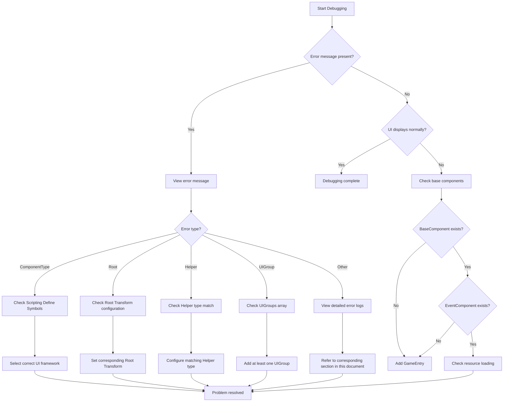

# Troubleshooting

This document lists common error scenarios, cause analysis, and solutions when using the GameFrameX UI framework.

## Overview

GameFrameX UI framework is a modular system that supports both UGUI and FairyGUI UI solutions. Due to the variety of configuration options and platform-specific settings, developers may encounter various configuration errors during integration. This document aims to help developers quickly locate and resolve common problems.

## Common Problem List

### 1. UI Component Type Mismatch

**Error Message:**
```
UI component ComponentType setting is incorrect. Please set the component consistent with the UI system.
```

**Cause Analysis:**
This error occurs when `UIComponent`'s `ComponentType` setting is inconsistent with the project's Scripting Define Symbols. For example, `ENABLE_UI_FAIRYGUI` is enabled in the project, but `ComponentType` is set to a UGUI implementation class.

**Solution:**
1. Confirm the UI framework used in the project (UGUI or FairyGUI)
2. Open the menu `GameFrameX -> Scripting Define Symbols`
3. Select the corresponding UI framework:
   - Select `Enable UGUI(开启UGUI适配)` to use UGUI
   - Select `Enable FairyGUI(开启FairyGUI适配)` to use FairyGUI
4. Ensure `UIComponent`'s `ComponentType` matches the enabled framework

> Source: [Runtime/UIComponent.cs](https://github.com/GameFrameX/com.gameframex.unity.ui/blob/main/Runtime/UIComponent.cs#L378-L400)

---

### 2. Root Transform Not Set

**Error Message:**
```
UI component's FAIRY GUI Root setting is incorrect. Please set.
UI component's UGUI Root setting is incorrect. Please set.
```

**Cause Analysis:**
`UIComponent` requires specifying the Transform of the UI root node. When using FairyGUI, you need to set `FairyGUI Root`; when using UGUI, you need to set `UGUI Root`.

**Solution:**
1. Create an empty GameObject in the scene as the UI root node
2. In the `UIComponent` component's Inspector panel:
   - When using FairyGUI: Set `FairyGUI Root` to the FairyGUI container Transform
   - When using UGUI: Set `UGUI Root` to the Canvas or UI container Transform

```csharp
// Example: Dynamically set Root at runtime (not recommended, for debugging only)
var uiComponent = gameObject.GetComponent<UIComponent>();
// Need to configure Root correctly in the editor
```

> Source: [Runtime/UIComponent.cs](https://github.com/GameFrameX/com.gameframex.unity.ui/blob/main/Runtime/UIComponent.cs#L385-L389)

---

### 3. UI Form Helper Type Mismatch

**Error Message:**
```
UI component's UI Form Helper setting is incorrect. Please set the same as ComponentType.
```

**Cause Analysis:**
The `UI Form Helper` type must match `ComponentType`. If FairyGUI is used but a UGUI Helper is set, this error will occur.

**Solution:**
1. In the `UIComponent`'s Inspector panel
2. Find the `UI Form Helper Type Name` field
3. Select the correct type based on the UI framework used:
   - FairyGUI: `GameFrameX.UI.FairyGUI.Runtime.FairyGUIFormHelper`
   - UGUI: `GameFrameX.UI.UGUI.Runtime.UGUIFormHelper`

> Source: [Runtime/UIComponent.cs](https://github.com/GameFrameX/com.gameframex.unity.ui/blob/main/Runtime/UIComponent.cs#L417-L421)

---

### 4. UI Group Helper Type Mismatch

**Error Message:**
```
UI component's UI Group Helper setting is incorrect. Please set the same as ComponentType.
```

**Cause Analysis:**
Similar to UI Form Helper, `UI Group Helper` must also match `ComponentType`.

**Solution:**
1. In the `UIComponent`'s Inspector panel
2. Find the `UI Group Helper Type Name` field
3. Select the correct type based on the UI framework used:
   - FairyGUI: `GameFrameX.UI.FairyGUI.Runtime.FairyGUIUIGroupHelper`
   - UGUI: `GameFrameX.UI.UGUI.Runtime.UGUIUIGroupHelper`

> Source: [Runtime/UIComponent.cs](https://github.com/GameFrameX/com.gameframex.unity.ui/blob/main/Runtime/UIComponent.cs#L423-L427)

---

### 5. UI Group Not Configured

**Error Message:**
```
At least one UIGroup must be configured.
```

**Cause Analysis:**
`UIComponent` requires at least one UI Group to be configured, otherwise UI form layer and display management will not work correctly.

**Solution:**
1. In the `UIComponent`'s Inspector panel
2. Find the `UIGroups` array
3. Click `+` to add at least one UI Group
4. Set the following for each Group:
   - `GroupName`: Group name (cannot be empty)
   - `Depth`: Display priority (recommended to set different Depth for different groups)

> Source: [Editor/UIComponentInspector.cs](https://github.com/GameFrameX/com.gameframex.unity.ui/blob/main/Editor/UIComponentInspector.cs#L169-L172)

---

### 6. Scripting Define Symbol Not Set

**Error Symptoms:**
UI system does not work at all, no error messages in console or the above configuration errors appear.

**Cause Analysis:**
Neither `ENABLE_UI_UGUI` nor `ENABLE_UI_FAIRYGUI` is enabled in the project, causing the UI system's conditional compilation code to fail to compile correctly.

**Solution:**
1. Open Unity menu `GameFrameX -> Scripting Define Symbols`
2. Select one UI framework:
   - `Enable UGUI(开启UGUI适配)` - Enable UGUI support
   - `Enable FairyGUI(开启FairyGUI适配)` - Enable FairyGUI support
3. Recompile the project

> Source: [Editor/UISystemScriptingDefineSymbols.cs](https://github.com/GameFrameX/com.gameframex.unity.ui/blob/main/Editor/UISystemScriptingDefineSymbols.cs#L42-L63)

---

### 7. Base Component Missing

**Error Message:**
```
Base component is invalid.
Event component is invalid.
```

**Cause Analysis:**
`UIComponent` depends on `BaseComponent` and `EventComponent`. If these components do not exist in the scene, the UI system will not work properly.

**Solution:**
1. Ensure the `GameEntry` object exists in the scene
2. Ensure the following components are attached to `GameEntry`:
   - `BaseComponent` (GameFrameX core component)
   - `EventComponent` (Event system component)

```csharp
// Sample code to check if components exist
var baseComponent = GameEntry.GetComponent<BaseComponent>();
if (baseComponent == null)
{
    Debug.LogError("BaseComponent not found, please ensure GameEntry exists in the scene");
}

var eventComponent = GameEntry.GetComponent<EventComponent>();
if (eventComponent == null)
{
    Debug.LogError("EventComponent not found, please ensure GameEntry exists in the scene");
}
```

> Source: [Runtime/UIComponent.cs](https://github.com/GameFrameX/com.gameframex.unity.ui/blob/main/Runtime/UIComponent.cs#L462-L474)

---

### 8. UI Form Open Failure

**Error Message:**
```
Open UI form failure, asset name '{0}', pause covered UI form '{1}', error message '{2}'.
Can not find UI form '{0}'.
```

**Cause Analysis:**
1. UI Form asset path is incorrect
2. UI Form asset is not under the corresponding path
3. UI Form Helper configuration is incorrect

**Solution:**
1. Check if the UI Form asset path is correct
2. Confirm `OptionUIConfigAttribute` configuration is correct:
   - FairyGUI: Set correct `PackageName`
   - UGUI: Set correct `Path`
3. Check if the asset has been added to the resource management system

```csharp
// Correct UI Form configuration example
[OptionUIConfigAttribute(packageName = "MyFairyGUIPackage")]
public class MyUIForm : UIForm
{
    // ...
}

// Or UGUI version
[OptionUIConfigAttribute(path = "UI/Prefabs/MyForm")]
public class MyUIForm : UIForm
{
    // ...
}
```

> Source: [Runtime/BaseUIManager.Open.cs](https://github.com/GameFrameX/com.gameframex.unity.ui/blob/main/Runtime/BaseUIManager.Open.cs)

---

### 9. OptionUIConfigAttribute Configuration Error

**Error Message:**
```
PackageName or Path is null
```

**Cause Analysis:**
`OptionUIConfigAttribute` requires at least one of `packageName` (FairyGUI) or `path` (UGUI); neither can be empty.

**Solution:**
Ensure the attribute configuration on the UI Form class is correct:

```csharp
// Incorrect example - will throw exception
[OptionUIConfigAttribute()]  // Wrong: both are empty
public class BadUIForm : UIForm { }

// Correct example - FairyGUI
[OptionUIConfigAttribute(packageName = "MainPackage")]
public class FairyGUIForm : UIForm { }

// Correct example - UGUI
[OptionUIConfigAttribute(path = "UI/Forms/MainForm")]
public class UGUIForm : UIForm { }
```

> Source: [Runtime/Attribute/OptionUIConfigAttribute.cs](https://github.com/GameFrameX/com.gameframex.unity.ui/blob/main/Runtime/Attribute/OptionUIConfigAttribute.cs#L86-L93)

---

### 10. UI Group Does Not Exist

**Error Message:**
```
UI group '{0}' is not exist.
```

**Cause Analysis:**
Attempting to open or operate on a UI Group that does not exist.

**Solution:**
1. Pre-configure the required UI Group in `UIComponent`
2. When opening UI Form, use an existing Group name

```csharp
// Correctly use existing UI Group
UIManager.Instance.OpenUIForm<MyForm>("MainGroup", userData: null);
```

> Source: [Runtime/BaseUIManager.UIGroup.cs](https://github.com/GameFrameX/com.gameframex.unity.ui/blob/main/Runtime/BaseUIManager.UIGroup.cs#L159-L162)

---

## Debugging Tips

### Enable Verbose Logging

You can get more detailed runtime information through configuration:

```csharp
// Set more detailed log level at startup
Log.SetLogHelper(new UnityLogHelper());
Log.AddDebuger();
```

### Check UI Component Status

```csharp
// Get UIComponent and check status
var uiComponent = GameEntry.GetComponent<UIComponent>();
if (uiComponent == null)
{
    Debug.LogError("UIComponent not found");
    return;
}

// Check UI Group count
Debug.Log($"UI Group Count: {uiComponent.UIGroupCount}");
```

### Event Subscription Troubleshooting

If UI events are not firing, check if subscribed correctly:

```csharp
// Ensure subscription at the right time
void OnOpenUIFormSuccess(object sender, OpenUIFormSuccessEventArgs e)
{
    Debug.Log($"UI Form opened successfully: {e.UIFormAssetName}");
}

// Subscribe to event
UIManager.Instance.OpenUIFormSuccess += OnOpenUIFormSuccess;
```

---

## Common Error Flowchart



---

## Related Links

- [UI Component](./4-core-concepts.ui-component) - UIComponent core concepts
- [UI Form](./4-core-concepts.ui-form) - UIForm form concepts
- [UI Group System](./4-core-concepts.ui-group) - UI Group layer management
- [Editor Configuration](./8-configuration.editor) - Editor configuration options
- [UI Attributes](./8-configuration.attributes) - UI attribute configuration
- [Platform Support](./9-platforms) - Platform-related configuration