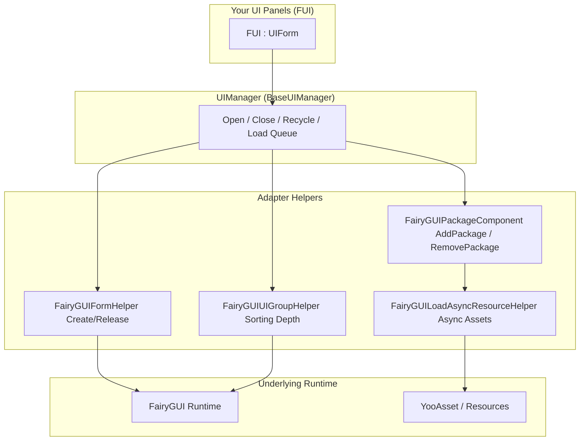

# Overview: What is GameFrameX UI FairyGUI

GameFrameX UI FairyGUI is a Unity UI adaptation layer that wraps the [FairyGUI](https://www.fairygui.com/) framework into the GameFrameX modular game framework, providing you with unified UI lifecycle management (open, close, recycle, animation) as well as YooAsset-based asynchronous asset loading. You only need to have your panel classes inherit from the `FUI` base class to manage FairyGUI interfaces with a single set of APIs, and gain out-of-the-box capabilities such as object pool reuse, singleton deduplication, and load queuing.

## Quick Start

### Step 1: Install the Package

Edit your Unity project's `Packages/manifest.json` to add the `scopedRegistries` and the dependency (current version is 3.4.3):

```json
{
  "scopedRegistries": [
    {
      "name": "GameFrameX",
      "url": "https://gameframex.upm.alianblank.uk",
      "scopes": [
        "com.gameframex"
      ]
    }
  ],
  "dependencies": {
    "com.gameframex.unity.ui.fairygui": "3.4.3"
  }
}
```

`scopes` determines which packages resolve from this registry: only packages whose names start with `com.gameframex` will be fetched from it.

You can also install using any of the following methods instead:

- Write the Git URL directly in the `dependencies` of `manifest.json`: `"com.gameframex.unity.ui.fairygui": "https://github.com/gameframex/com.gameframex.unity.ui.fairygui.git"`
- In Unity **Package Manager**, select **Add package from git URL** and enter `https://github.com/gameframex/com.gameframex.unity.ui.fairygui.git`
- Clone the repository into your Unity project's `Packages` directory, and it will be loaded automatically

Source: [README.md](https://github.com/GameFrameX/com.gameframex.unity.ui.fairygui/blob/main/README.md#L67-L100)

### Step 2: Write Your UI Panel

All FairyGUI panels inherit from the `FUI` base class. Show/hide animations can be configured via C# attributes, with no extra code required:

```csharp
[OptionUIShowAnimation(typeof(FadeInAnimation))]
[OptionUIHideAnimation(typeof(FadeOutAnimation))]
public class AnimatedPanel : FUI { }
```

Source: [README.md](https://github.com/GameFrameX/com.gameframex.unity.ui.fairygui/blob/main/README.md#L101-L111)

`FUI` inherits from `UIForm` and exposes FairyGUI's `GObject` as a property. When showing an interface, the framework passes the `GObject`, animation toggles, and animation name to the show handler:

```csharp
[UnityEngine.Scripting.Preserve]
public class FUI : UIForm
{
    [UnityEngine.Scripting.Preserve]
    public GObject GObject { get; private set; }

    [UnityEngine.Scripting.Preserve]
    public override void Show(IUIFormShowHandler handler, Action complete)
    {
        if (handler != null)
        {
            handler.Handler(GObject, EnableShowAnimation, ShowAnimationName, complete);
        }
        // ...
    }
}
```

Source: [Runtime/FUI.cs](https://github.com/GameFrameX/com.gameframex.unity.ui.fairygui/blob/main/Runtime/FUI.cs#L42-L80)

(Note: the `UnityEngine.Scripture.Preserve` shown on the properties above appears as in the excerpt; the actual usage in the source code is `UnityEngine.Scripting.Preserve`, which prevents IL2CPP stripping.)

### Step 3: Initialize and Use UIManager

`UIManager` is the core manager, which internally obtains `FairyGUIPackageComponent` from `GameEntry` to manage the loading and unloading of FairyGUI packages:

```csharp
[UnityEngine.Scripting.Preserve]
internal sealed partial class UIManager : BaseUIManager
{
    [UnityEngine.Scripting.Preserve]
    private FairyGUIPackageComponent FairyGuiPackage { get; set; }

    [UnityEngine.Scripting.Preserve]
    public override void SetResourceManager(IAssetManager assetManager)
    {
        base.SetResourceManager(assetManager);
        FairyGuiPackage = GameEntry.GetComponent<FairyGUIPackageComponent>();
        GameFrameworkGuard.NotNull(FairyGuiPackage, nameof(FairyGuiPackage));
    }
}
```

Source: [Runtime/UIManager.cs](https://github.com/GameFrameX/com.gameframex.unity.ui.fairygui/blob/main/Runtime/UIManager.cs#L42-L92)

During initialization, if `FairyGUIPackageComponent` is missing from the scene, `GameFrameworkGuard.NotNull` will throw an exception directly — make sure this component is attached before calling `SetResourceManager`.

### Step 4 (Optional): Find a GObject by Path

```csharp
// Get the hierarchical path of a GObject
string path = gObject.GetUIPath();

// Look up a GObject by its path
GObject obj = FairyGUIPathFinderHelper.GetUIFromPath("GRoot/Group/MyButton");
```

Source: [README.md](https://github.com/GameFrameX/com.gameframex.unity.ui.fairygui/blob/main/README.md#L113-L120)

## How It Works at a Glance

The entire package works in layers: `UIManager` centrally orchestrates open/close/recycle and load queuing, dispatches specific work to individual Helpers, and relies on the FairyGUI runtime and YooAsset asset system at the bottom layer:



Overview of each component's responsibilities:

| Component | Type | Description |
|------|------|------|
| `UIManager` | `internal sealed partial class`, inherits `BaseUIManager` | Central UI manager responsible for the interface open, close, and recycle lifecycle, split across multiple partial files: `UIManager.cs` / `UIManager.Open.cs` / `UIManager.Close.cs` |
| `FUI` | `public class`, inherits `UIForm` | Base class for all FairyGUI panels; exposes `GObject` and visibility callbacks; panels inherit from this |
| `FairyGUIPackageComponent` | MonoBehaviour | Manages the loading and unloading of FairyGUI packages |
| `FairyGUIFormHelper` | Helper | Responsible for interface instantiation, creation, and release |
| `FairyGUIUIGroupHelper` | Helper | Manages UI group depth and sorting |
| `FairyGUILoadAsyncResourceHelper` | Helper | Bridges FairyGUI's asset requests to YooAsset asynchronous loading |
| `FairyGUIPathFinderHelper` | Helper | Path-based GObject lookup utility |
| `BindablePropertyExtension` | Extension | MVVM binding support; automatically cleans up `BindableProperty` events |

Source: [Runtime/UIManager.cs](https://github.com/GameFrameX/com.gameframex.unity.ui.fairygui/blob/main/Runtime/UIManager.cs#L34-L92) · [Runtime/FUI.cs](https://github.com/GameFrameX/com.gameframex.unity.ui.fairygui/blob/main/Runtime/FUI.cs#L34-L53) · [README.md](https://github.com/GameFrameX/com.gameframex.unity.ui.fairygui/blob/main/README.md#L40-L65)

Core capabilities at a glance:

- **Complete UI lifecycle** — Unified API for opening, closing, recycling, and animations
- **Asynchronous asset loading** — YooAsset-based asynchronous loading of FairyGUI packages and assets
- **Object pool reuse** — UI interface instances are pooled for reuse, reducing GC allocations
- **Singleton deduplication** — Automatically prevents duplicate creation of the same interface
- **Load queuing** — Merges concurrent open requests for the same interface
- **Attribute-driven configuration** — Use C# attributes to control UI groups and show/hide animations
- **MVVM binding support** — `BindablePropertyExtension` automatically cleans up binding events
- **Dual asset channels** — Supports both `Resources.Load` and YooAsset AssetBundle
- **IL2CPP safe** — `Preserve` attributes prevent code stripping

## What's Next

- Full installation instructions and more usage examples: [README.md](https://github.com/GameFrameX/com.gameframex.unity.ui.fairygui/blob/main/README.md)
- Official documentation (with detailed descriptions of each module): https://gameframex.doc.alianblank.com
- Version history: `CHANGELOG.md` in the repository root
- Community groups: QQ 467608841 / 233840761