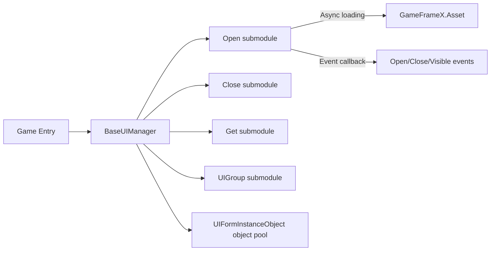

# Framework Overview

GameFrameX.UI is the UI submodule of the GameFrameX game development framework. It provides a unified interface management API, supports both UGUI and FairyGUI UI solutions, and comes with common capabilities such as UI grouping, object pooling, and lifecycle events, making it suitable as the foundational UI layer for Unity commercial projects.

## Quick Start

Complete the following three steps to enable the UI module in your Unity project.

1. Add the package via the Package Manager: In Unity, select **Window → Package Manager → + → Add package from git URL**, and enter:
   ```
   https://github.com/gameframex/com.gameframex.unity.ui.git
   ```
   Or append the same URL to the `dependencies` in the project's `Packages/manifest.json`.
2. Create a manager class that inherits from `BaseUIManager` (or directly use the framework's built-in `UIManager`), and complete module registration at the game's startup entry point; the framework will automatically initialize the UI subsystem.
3. Write an `IUIForm` implementation script for each UI Prefab, annotate the group, show/hide animations, and multi-instance policies via attributes such as `[OptionUIGroup]`, then call `OpenUIForm` to open the UI.

## How It Works at a Glance

The core entry point is `BaseUIManager`, which aggregates four major sub-capabilities—loading, recycling, grouping, and events—corresponding to four partial class files:
[BaseUIManager.cs](https://github.com/GameFrameX/com.gameframex.unity.ui/blob/main/Runtime/BaseUIManager.cs#L39-L80) defines the manager skeleton;
[BaseUIManager.Open.cs](https://github.com/GameFrameX/com.gameframex.unity.ui/blob/main/Runtime/BaseUIManager.Open.cs#L36-L60) provides the events and methods for opening UIs;
`BaseUIManager.Close.cs` handles closing;
`BaseUIManager.Get.cs` is responsible for retrieving UIs by serial number;
`BaseUIManager.UIGroup.cs` manages UI group root nodes.



UI instances maintain an object pool via [BaseUIManager.UIFormInstanceObject.cs](https://github.com/GameFrameX/com.gameframex.unity.ui/blob/main/Runtime/BaseUIManager.UIFormInstanceObject.cs); idle instances are automatically recycled according to `m_RecycleInterval` (60 seconds by default); instances being loaded are tracked by the `m_UIFormsBeingLoaded` dictionary.

## Key Features

| Feature | Description | Key File |
|------|------|----------|
| Unified UI Interface | A single `IUIManager` supports both UGUI and FairyGUI | [BaseUIManager.cs](https://github.com/GameFrameX/com.gameframex.unity.ui/blob/main/Runtime/BaseUIManager.cs#L39-L80) |
| Group Management | Declare the UI's group via attributes; the corresponding root node is created automatically | [Runtime/Attribute/OptionUIGroupAttribute.cs](https://github.com/GameFrameX/com.gameframex.unity.ui/blob/main/Runtime/Attribute/OptionUIGroupAttribute.cs) |
| Object Pool | Automatically reuses idle instances, reducing the overhead of frequently opening and closing UIs | [BaseUIManager.UIFormInstanceObject.cs](https://github.com/GameFrameX/com.gameframex.unity.ui/blob/main/Runtime/BaseUIManager.UIFormInstanceObject.cs) |
| Show/Hide Animations | Configure open/close animations via attributes | [OptionUIShowAnimationAttribute.cs](https://github.com/GameFrameX/com.gameframex.unity.ui/blob/main/Runtime/Attribute/OptionUIShowAnimationAttribute.cs),[OptionUIHideAnimationAttribute.cs](https://github.com/GameFrameX/com.gameframex.unity.ui/blob/main/Runtime/Attribute/OptionUIHideAnimationAttribute.cs) |
| Multi-Instance Control | Declare whether the same UI allows multiple coexisting instances via attributes | [OptionUIAllowMultiInstanceAttribute.cs](https://github.com/GameFrameX/com.gameframex.unity.ui/blob/main/Runtime/Attribute/OptionUIAllowMultiInstanceAttribute.cs) |
| Comprehensive Events | Provides events such as open success/failure, close, and visibility changes | [EventArgs/OpenUIFormSuccessEventArgs.cs](https://github.com/GameFrameX/com.gameframex.unity.ui/blob/main/Runtime/EventArgs/OpenUIFormSuccessEventArgs.cs), etc. |

## Editor Extensions

The module includes Unity Editor checks that automatically inject scripting define symbols, preventing errors when components are missing at runtime. See [Editor/UISystemScriptingDefineSymbols.cs](https://github.com/GameFrameX/com.gameframex.unity.ui/blob/main/Editor/UISystemScriptingDefineSymbols.cs) and [Editor/UISystemScriptingDefineCheckHandler.cs](https://github.com/GameFrameX/com.gameframex.unity.ui/blob/main/Editor/UISystemScriptingDefineCheckHandler.cs) for details.
The custom inspector for UI Prefabs is in [Editor/UIFormInspector.cs](https://github.com/GameFrameX/com.gameframex.unity.ui/blob/main/Editor/UIFormInspector.cs); for the UIComponent inspector, see [Editor/UIComponentInspector.cs](https://github.com/GameFrameX/com.gameframex.unity.ui/blob/main/Editor/UIComponentInspector.cs).

## Version

For the latest version and change history, see [CHANGELOG.md](https://github.com/GameFrameX/com.gameframex.unity.ui/blob/main/CHANGELOG.md).

## Related Links

- For details on UI group configuration, see "UI Groups"
- For UI opening and lifecycle, see "Open/Close UI Forms"
- For event subscription examples, see "UI Events"
- Official documentation site: https://gameframex.doc.alianblank.com/