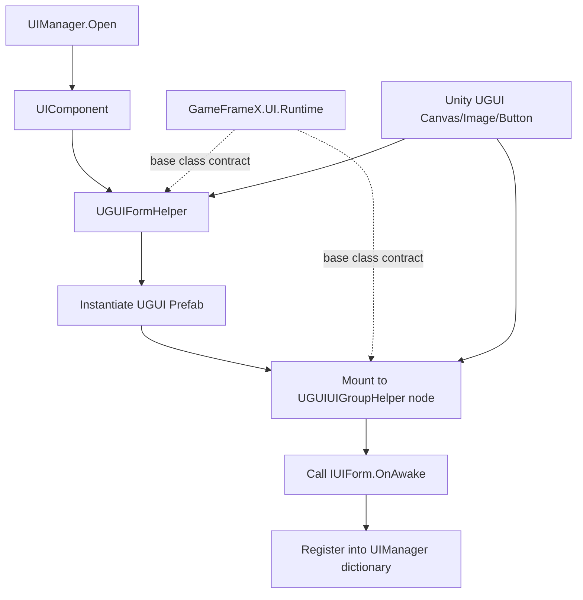

# How It Works: The Adaptation Between UGUI and the GameFrameX UI System

This package is the official adaptation layer for GameFrameX UI Runtime on the Unity UGUI backend: by implementing abstract base classes such as `UIFormHelperBase` and `UIGroupHelperBase`, it plugs UGUI's `GameObject` / `Canvas` / `RectTransform` into the framework's `UIComponent` / `UIManager` lifecycle, allowing different UI backends to be swapped in or coexist without modifying game business code.

## Adaptation Layer Overview

| Adaptation Class | Inherited Base Class | Responsibility |
|--------|------------|------|
| `UGUIFormHelper` | `UIFormHelperBase` | Instantiates, creates, and releases UI forms; handles UI group mounting and animation toggles |
| `UGUIUIGroupHelper` | `UIGroupHelperBase` | Manages UI group depth (`z = depth * 1000`) and node hierarchy |
| `UGUICodeGenerator` (Editor) | — | One-click generation of UI code bound to Prefab fields |
| `UGUIComponentInspector` (Editor) | — | Visual binding of component references in the Inspector |
| `UGUIButtonExtension` / `UGUIImageExtension` / `RectTransformExtension` | — | Extension methods for native UGUI components |
| `UIImage` | `Image` | Adds async loading and replacement capabilities on top of the UGUI `Image` |
| `UIManager` / `UGUI` | — | Framework-side runtime entry point and abstract UI base class |

## How It Works at a Glance



Throughout the entire chain, the framework side only sees the two abstractions `IUIForm` and `IUIGroup`; the UGUI adaptation layer is responsible for translating Unity native types into these abstractions. Conversely, business scripts only need to inherit from the abstract base class `UGUI` to receive backend-agnostic callbacks such as OnAwake / OnShow / OnHide.

## Key Adaptation Points

### 1. UI Form Instantiation

`UGUIFormHelper.InstantiateUIForm` returns the asset object as-is; the actual GameObject is loaded asynchronously by the upper-level asset pipeline and passed in. `CreateUIForm` casts `uiFormInstance as GameObject` into a UGUI node and attaches the business script via `GetOrAddComponent`.

```csharp
// Source: Runtime/UGUIFormHelper.cs#L74-L78
[UnityEngine.Scripting.Preserve]
public override object InstantiateUIForm(object uiFormAsset)
{
    return (UnityEngine.Object)uiFormAsset;
}
```

### 2. UI Form Mounting and Group Assignment

`CreateUIForm` reads the `OptionUIGroupAttribute`, `OptionUIShowAnimationAttribute`, and `OptionUIHideAnimationAttribute` on the type; if none are present, the global toggles from `UIComponent` are used. Finally, it parents the node with `Transform.SetParent(helper.transform)` to the corresponding UI group and normalizes `localScale`.

```csharp
// Source: Runtime/UGUIFormHelper.cs#L91-L163
[UnityEngine.Scripting.Preserve]
public override IUIForm CreateUIForm(object uiFormInstance, Type uiFormType, object userData)
{
    var uiGameObject = uiFormInstance as GameObject;
    if (uiGameObject == null)
    {
        Log.Error($"UI form instance type {uiFormType} is invalid.");
        return null;
    }

    var componentType = uiGameObject.GetOrAddComponent(uiFormType);
    if (!(componentType is IUIForm uiForm))
    {
        Log.Error($"UI form instance type {uiFormType} is invalid.");
        return null;
    }

    if (uiForm.IsAwake == false)
    {
        uiForm.OnAwake();
    }
    // ... Group mounting and animation configuration omitted ...
    uiTransform.SetParent(helper.transform);
    uiTransform.localScale = Vector3.one;
    return uiForm;
}
```

### 3. UI Group Depth Control

UGUI controls front-to-back layering through the `Canvas` render order or node Z values; the adaptation layer adopts the most direct approach: setting `localPosition.z = depth * 1000`, so each group is spaced 1000 units apart, ensuring that different groups never occlude one another.

```csharp
// Source: Runtime/UGUIUIGroupHelper.cs#L65-L70
[UnityEngine.Scripting.Preserve]
public override void SetDepth(int depth)
{
    Depth = depth;
    transform.localPosition = new Vector3(0, 0, depth * 1000);
}
```

### 4. Abstract UI Base Class

After inheriting from `UGUI`, business scripts bind to UGUI controls on the Prefab via `UGUIComponent` / `UGUIElementPropertyAttribute`; the framework completes field injection during the `OnAwake` stage and invokes lifecycle methods such as `OnShow`, `OnHide`, and `OnClose` at runtime.

## Next Steps

- To learn how to mount and open your first UI, see "Quick Start"
- To generate Prefab-synced UI code in one click from the editor, see "How to: Use the UGUI Code Generator"
- To customize a UI backend (e.g., FairyGUI / UI Toolkit), simply reuse `UIFormHelperBase` / `UIGroupHelperBase`