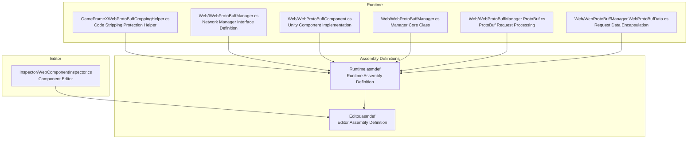
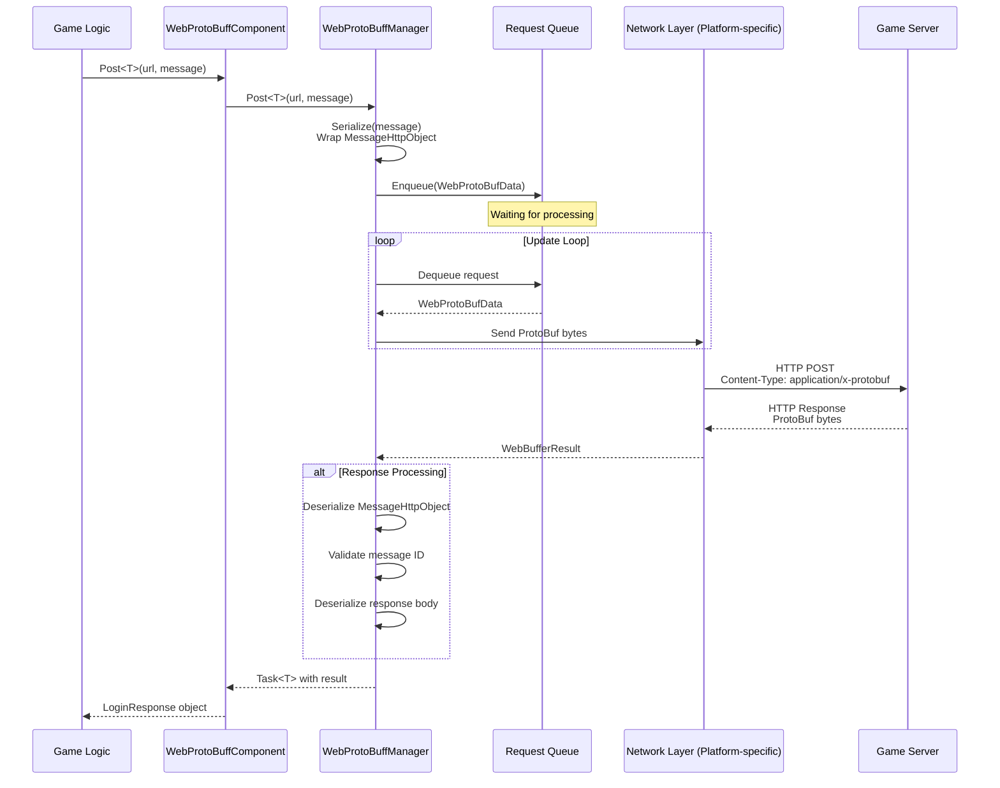
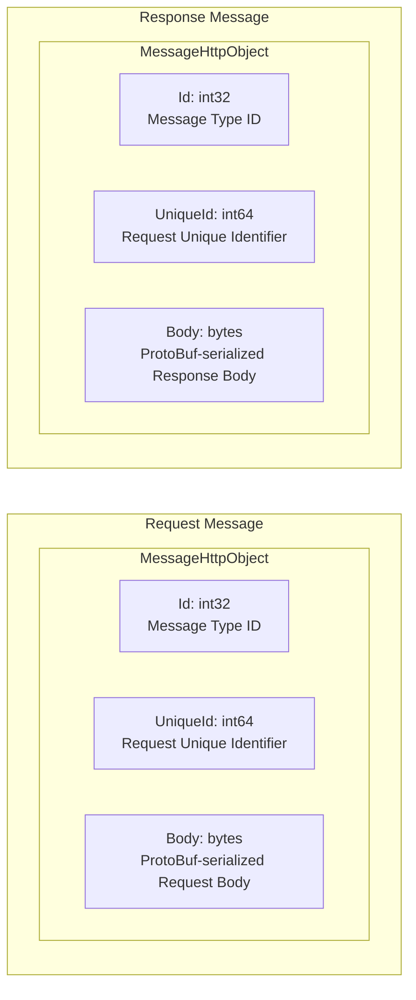

# Plugin Introduction

The GameFrameX Web ProtoBuff plugin is a network request component specifically designed for Unity games. Based on Protocol Buffer (ProtoBuf), it provides efficient, type-safe HTTP communication functionality.

## Overview

The Web ProtoBuff component (WebProtoBuffComponent) is one of the core network modules of the GameFrameX game framework, dedicated to handling Protocol Buffer format network requests. In modern game development, ProtoBuf is widely used for client-server communication due to its efficient serialization capability and compact data transmission format.

The main responsibilities of this plugin include:

- **ProtoBuf message serialization/deserialization**: Automatically serialize C# objects to ProtoBuf byte streams, and deserialize response data into corresponding message objects
- **Asynchronous network requests**: Task<T>-based async API supporting async/await pattern, seamlessly integrated with Unity's coroutine system
- **Request queue management**: Internal queue mechanism for managing pending requests, supporting connection limits and request priority
- **Cross-platform support**: Provides corresponding network implementations for different platforms (WebGL, Standalone, mobile)
- **Timeout control**: Configurable timeout duration ensuring requests won't wait indefinitely

### Core Value

1. **Type Safety**: Through generic mechanisms, request and response type correctness is ensured at compile time
2. **Efficient Transmission**: ProtoBuf's binary format is more compact than JSON, with faster serialization/deserialization
3. **Easy to Use**: Concise API design, allowing developers to focus on business logic without dealing with underlying network details
4. **Framework Integration**: Deeply integrated into the GameFrameX framework, following the framework's design specifications and lifecycle management

## Architecture

### Component Architecture

The Web ProtoBuff component's architecture in the GameFrameX framework is as follows:

```mermaid
flowchart TD
    subgraph Client["Client Layer"]
        GameLogic[Game Logic Code]
    end

    subgraph Component["Component Layer"]
        WebProtoBuffComponent[WebProtoBuffComponent]
    end

    subgraph Module["Module Layer"]
        IWebProtoBuffManager[IWebProtoBuffManager Interface]
        WebProtoBuffManager[WebProtoBuffManager Implementation]
    end

    subgraph Framework["Framework Layer"]
        GameFrameworkEntry[GameFrameworkEntry]
        GameFrameworkModule[GameFrameworkModule Base Class]
    end

    subgraph Network["Network Layer"]
        WebGL[UnityWebRequest<br/>WebGL Platform]
        HttpClient[HttpWebRequest<br/>Other Platforms]
    end

    subgraph Data["Data Layer"]
        Serializer[SerializerHelper<br/>ProtoBuf Serialization]
        ProtoHandler[ProtoMessageIdHandler<br/>Message ID Handler]
    end

    GameLogic --> WebProtoBuffComponent
    WebProtoBuffComponent --> IWebProtoBuffManager
    IWebProtoBuffManager <|.. WebProtoBuffManager
    WebProtoBuffManager --> GameFrameworkEntry
    WebProtoBuffManager --> GameFrameworkModule
    WebProtoBuffManager --> WebGL
    WebProtoBuffManager --> HttpClient
    WebProtoBuffManager --> Serializer
    WebProtoBuffManager --> ProtoHandler
```

**Architecture Description:**

1. **Client Layer**: Game business logic code calls WebProtoBuffComponent to initiate network requests
2. **Component Layer**: WebProtoBuffComponent serves as the Unity component, providing business-oriented API, the entry point for developers to interact with
3. **Module Layer**: IWebProtoBuffManager defines interface specifications, WebProtoBuffManager implements specific network request logic
4. **Framework Layer**: GameFrameworkEntry is responsible for module creation and initialization, GameFrameworkModule provides base functionality for modules
5. **Network Layer**: Selects appropriate network implementation based on the running platform (UnityWebRequest for WebGL, HttpWebRequest for other platforms)
6. **Data Layer**: Responsible for ProtoBuf message serialization/deserialization and message type ID mapping

### File Structure

The source code organization structure of the plugin is as follows:



### Core Class Description

| Class Name | Responsibility | Access Level |
|------------|-----------------|---------------|
| WebProtoBuffComponent | Unity component, provides external network request API | public sealed |
| WebProtoBuffManager | Specific implementation of network requests, manages request queue and processing logic | public partial |
| WebProtoBufData | Encapsulates single request data (URL, data, Task) | private sealed |
| IWebProtoBuffManager | Defines network manager interface specifications | public interface |

## Core Flow

### Request Processing Flow

When game code calls the `Post<T>` method to send a ProtoBuf request, the complete processing flow is as follows:



### Message Encapsulation Format

The plugin uses a unified message encapsulation format for communication:



1. **Id**: Message type identifier, used for routing to the correct parser
2. **UniqueId**: Unique identifier for the request, used to correlate requests and responses
3. **Body**: Actual business data, serialized by ProtoBuf

## Features

### 1. Native Protocol Buffer Support

The plugin natively supports Protocol Buffer message format using the protobuf-net library for serialization:

- Message classes must inherit from `MessageObject` base class
- Use `[ProtoContract]` and `[ProtoMember]` attributes for marking
- Support complex nested types and collection types

### 2. Asynchronous Programming Model

Task<T>-based async API design:

- Using async/await syntax for concise, readable code
- Supports cancellation (CancellationToken)
- Perfect integration with Unity's lifecycle

### 3. Timeout Control

Configurable timeout mechanism:

- Default timeout: 5 seconds
- Can be dynamically set through component properties or code
- Supports setting different timeouts for different requests

### 4. Request Queue Management

Efficient request queue system:

- Waiting queue (WaitingQueue): Stores pending requests
- Sending list (SendingList): Requests being processed
- Connection limit: Default maximum 8 concurrent connections per server

### 5. Cross-platform Compatibility

Provides optimal implementations for different platforms:

| Platform | Network Implementation | Features |
|----------|------------------------|----------|
| WebGL | UnityWebRequest | Browser compatibility, async callbacks required |
| Standalone | HttpWebRequest | .NET standard implementation, sync/async support |
| iOS | HttpWebRequest | .NET standard implementation |
| Android | HttpWebRequest | .NET standard implementation |

## Use Cases

The Web ProtoBuff component is suitable for the following scenarios:

1. **Login authentication**: Send username/password requests to obtain authentication tokens
2. **Data synchronization**: Synchronize game configuration, player data from server
3. **Leaderboards**: Get and submit player leaderboard data
4. **Multiplayer gaming**: Request matchmaking, submit game results
5. **In-app purchase verification**: Verify in-app purchase receipts
6. **Social features**: Get friend lists, send messages

## Platform Requirements

According to `package.json` configuration:

- **Unity Version**: 2019.4 and above
- **.NET Standard**: 2.1
- **Dependencies**:
  - com.gameframex.unity (1.1.1+)
  - com.gameframex.unity.web (1.0.0+)
  - com.gameframex.unity.network (1.0.0+)
  - com.gameframex.unity.google.protobuf (1.0.0+)

## Related Links

- [Features](./1-overview.features) - Detailed feature description
- [Installation](./2-installation.install-methods) - Plugin installation tutorial
- [Requirements](./2-installation.requirements) - Development environment configuration
- [Quick Start](./3-getting-started.quick-start) - Get started quickly
- [Basic Example](./3-getting-started.basic-example) - Code examples
- [Architecture](./4-core-concepts.architecture) - Architecture design details
- [Message Definition](./4-core-concepts.message-definition) - ProtoBuf message definition guide
- [API Reference](./5-api-reference.webprotobuffcomponent) - Complete API documentation
- [Component Config](./6-configuration.component-config) - Configuration options
- [Compile Defines](./6-configuration.compile-defines) - Conditional compilation configuration
- [Platform Info](./7-platforms.platform-info) - Platform-specific features
- [Troubleshooting](./8-troubleshooting.faq) - FAQ