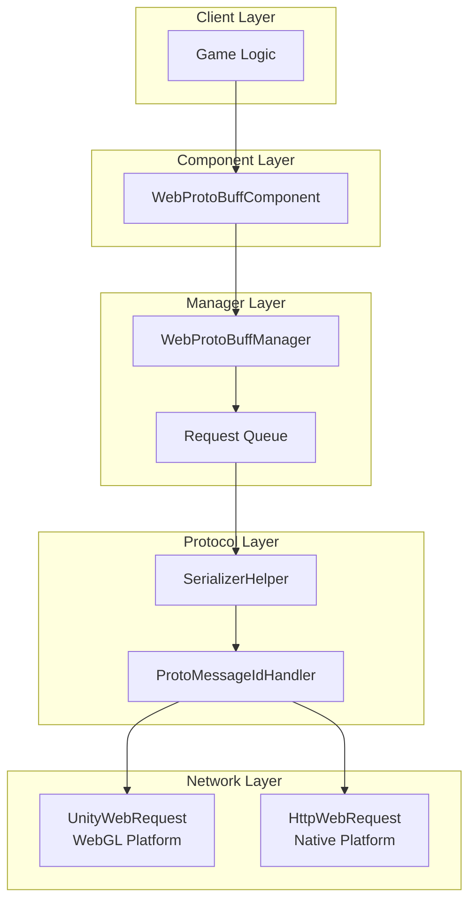
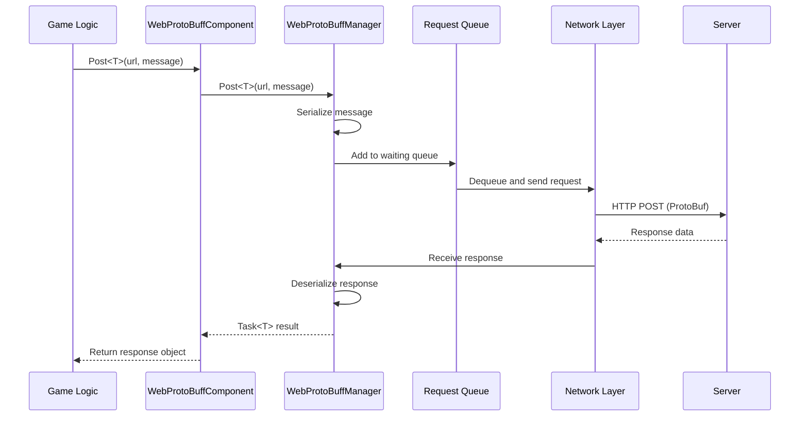

# Quick Start

The Web ProtoBuff component is the network module of the GameFrameX framework, specifically designed for handling Protocol Buffer-based HTTP POST requests. It provides asynchronous message sending and receiving functionality, supporting ProtoBuf message serialization and deserialization.

## Overview

WebProtoBuffComponent is a network request component for Unity game frameworks, encapsulating the network transmission capability of Protocol Buffer format data. When your game needs to exchange data efficiently with the server, especially when using ProtoBuf as the serialization format, this component can greatly simplify the implementation of network requests.

### Core Features

- **ProtoBuf Support**: Natively supports Protocol Buffer message format serialization and deserialization
- **Async API**: Task<T>-based async programming model using async/await pattern
- **Timeout Control**: Configurable request timeout duration
- **Cross-platform**: Compatible with Unity WebGL and native platforms (PC/iOS/Android)
- **Queue Management**: Built-in request queue and concurrency control

### Use Cases

WebProtoBuffComponent is suitable for the following scenarios:

1. **Communication with ProtoBuf servers**: Server uses Protocol Buffer as data exchange format
2. **High-performance network requests**: ProtoBuf is more compact than JSON, higher transmission efficiency
3. **Async data fetching**: Game logic that needs to wait for server responses
4. **Cross-platform deployment**: Same code supports both WebGL and native platforms

## Architecture

WebProtoBuffComponent uses a layered architecture design with clear responsibilities for each layer:



### Component Description

| Component | Description |
|-----------|-------------|
| WebProtoBuffComponent | Unity component, mounted on GameObject for use |
| WebProtoBuffManager | Core manager, handles request queue and concurrency control |
| WebProtoBufData | Request data encapsulation, contains URL, serialized data, TaskCompletionSource |
| SerializerHelper | Serialization/deserialization utility |
| ProtoMessageIdHandler | Message ID processor |

## Workflow

The component's request processing flow is as follows:



### Flow Description

1. **Request Initiation**: Game logic calls the component's Post<T> method
2. **Message Encapsulation**: Serialize MessageObject to ProtoBuf byte array, wrapped in MessageHttpObject
3. **Queue Management**: Request joins the waiting queue, waiting to be sent
4. **Concurrency Control**: Maximum simultaneous sending of MaxConnectionPerServer (default 8) requests
5. **Network Sending**: Select UnityWebRequest (WebGL) or HttpWebRequest (native) based on platform
6. **Response Processing**: Receive server response, deserialize into corresponding MessageObject

## Prerequisites

### 1. Install Dependencies

Ensure your Unity project has the following dependencies installed:

- `com.gameframex.unity` (1.1.1+)
- `com.gameframex.unity.web` (1.0.0+)
- `com.gameframex.unity.network` (1.0.0+)
- `com.gameframex.unity.google.protobuf` (1.0.0+)

### 2. Enable Compile Defines

In Unity Editor, open **Edit > Project Settings > Player**, add to **Scripting Define Symbols**:

```
ENABLE_GAME_FRAME_X_WEB_PROTOBUF_NETWORK
```

> **Note**: Without this define, the Post<T> method will not be available.

### 3. Add Component

Create an empty GameObject in Unity scene, then add the **Web ProtoBuff** component:

```csharp
// Or add via code
var gameObject = new GameObject("WebProtoBuff");
var webComponent = gameObject.AddComponent<WebProtoBuffComponent>();
```

The component automatically depends on GameFrameXWebProtoBuffCroppingHelper to prevent type stripping during IL2CPP compilation.

## Message Definition

Before using the component, you need to define request and response message types. Message classes must inherit from MessageObject, and response classes also need to implement the IResponseMessage interface:

```csharp
using ProtoBuf;
using GameFrameX.Network.Runtime;

[ProtoContract]
public class LoginRequest : MessageObject
{
    [ProtoMember(1)]
    public string Username { get; set; }

    [ProtoMember(2)]
    public string Password { get; set; }
}

[ProtoContract]
public class LoginResponse : MessageObject, IResponseMessage
{
    [ProtoMember(1)]
    public bool Success { get; set; }

    [ProtoMember(2)]
    public string Token { get; set; }
}
```

> Source: [README.md](https://github.com/GameFrameX/com.gameframex.unity.web.protobuff/blob/main/README.md#L60-L88)

## Sending Requests

After getting the component instance, you can send ProtoBuf requests:

```csharp
using UnityEngine;
using GameFrameX.Web.ProtoBuff.Runtime;

public class LoginController : MonoBehaviour
{
    public WebProtoBuffComponent WebComponent;

    private async void Start()
    {
        var request = new LoginRequest
        {
            Username = "user",
            Password = "password"
        };

        string url = "http://api.example.com/login";

        try
        {
            LoginResponse response = await WebComponent.Post<LoginResponse>(url, request);

            if (response != null)
            {
                Debug.Log($"Login Result: {response.Success}, Token: {response.Token}");
            }
        }
        catch (System.Exception e)
        {
            Debug.LogError($"Request Failed: {e.Message}");
        }
    }
}
```

> Source: [README.md](https://github.com/GameFrameX/com.gameframex.unity.web.protobuff/blob/main/README.md#L94-L128)

## Configuration Options

WebProtoBuffComponent provides the following configurable properties:

| Property | Type | Default | Description |
|----------|------|---------|-------------|
| Timeout | float | 5.0 | Request timeout (seconds) |

Can be configured via Inspector panel or code:

```csharp
// Configure timeout via code
webComponent.Timeout = 10f;
```

## Platform Differences

The component automatically selects the appropriate network implementation based on the target platform:

| Platform | Network Implementation | Description |
|----------|------------------------|-------------|
| WebGL | UnityWebRequest | Unity native WebGL support |
| Other platforms | HttpWebRequest | .NET standard HTTP requests |

Both implementations use the same API interface and message format, no code changes required.

## Related Links

- [Basic Example](./3-getting-started.basic-example) - Complete code examples
- [Architecture](./4-core-concepts.architecture) - Deep dive into architecture design
- [API Reference](./5-api-reference.webprotobuffcomponent) - Complete API documentation
- [Compile Defines](./6-configuration.compile-defines) - Define configuration details
- [Platform Info](./7-platforms.platform-info) - Platform support details