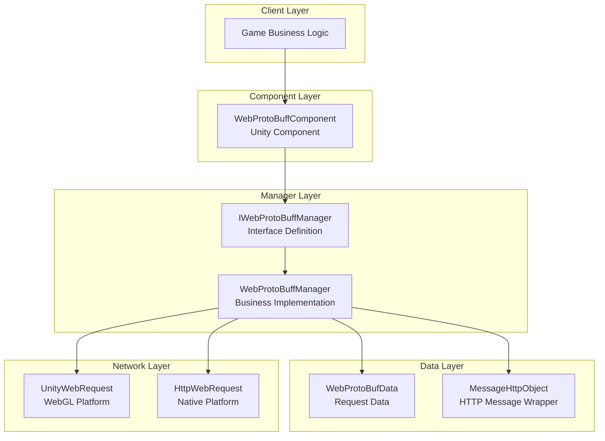
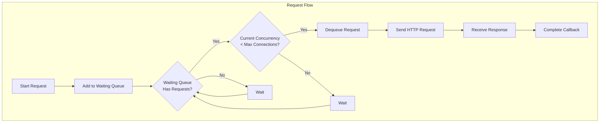
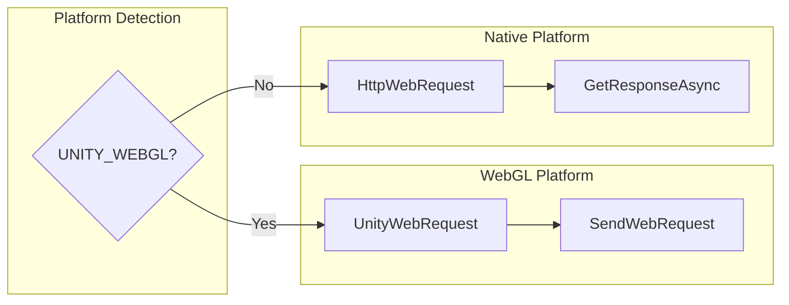

# Features

The GameFrameX Web ProtoBuff component provides HTTP network request functionality based on Protocol Buffer, supporting asynchronous sending and receiving of ProtoBuf messages. It is a lightweight solution for Unity games communicating with backend servers.

## Overview

The Web ProtoBuff component is a network module extension of the GameFrameX game framework, specifically designed for handling Protocol Buffer format network communication. Compared to traditional JSON/XML, Protocol Buffer offers higher serialization efficiency and smaller data volume, making it very suitable for network communication in mobile game scenarios.

This component provides complete request management functionality, including request queue, timeout control, async response processing, and other features. It also supports Unity WebGL platform and native platforms (PC/Android/iOS) network request calls.

## Architecture Design

The component uses a layered architecture design, separating the Unity component layer, business logic layer, and network request layer to ensure clear code structure and easy maintenance.



### Core Components Description

| Component | Responsibility | File Location |
|-----------|----------------|---------------|
| WebProtoBuffComponent | Unity component layer, provides Inspector configuration and external API | Runtime/Web/WebProtoBuffComponent.cs |
| IWebProtoBuffManager | Defines network manager interface specifications | Runtime/Web/IWebProtoBuffManager.cs |
| WebProtoBuffManager | Implements specific ProtoBuf request processing logic | Runtime/Web/WebProtoBuffManager.cs |
| WebProtoBufData | Encapsulates request data and related state | Runtime/Web/WebProtoBuffManager.WebProtoBufData.cs |

## Core Features

### 1. Protocol Buffer Message Support

The component natively supports Protocol Buffer message format serialization and deserialization. Both request and response messages use ProtoBuf format for transmission, saving 30%-70% bandwidth compared to JSON.

Message structure uses `MessageObject` base class, with automatic serialization implemented through `[ProtoContract]` and `[ProtoMember]` attribute markers:

```csharp
[ProtoContract]
public class LoginRequest : MessageObject
{
    [ProtoMember(1)]
    public string Username { get; set; }

    [ProtoMember(2)]
    public string Password { get; set; }
}

[ProtoContract]
public class LoginResponse : MessageObject, IResponseMessage
{
    [ProtoMember(1)]
    public bool Success { get; set; }

    [ProtoMember(2)]
    public string Token { get; set; }
}
```
> Source: [WebProtoBuffManager.ProtoBuf.cs](https://github.com/GameFrameX/com.gameframex.unity.web.protobuff/blob/main/Runtime/Web/WebProtoBuffManager.ProtoBuf.cs#L178-L201)

The component uses the dedicated `application/x-protobuf` Content-Type for requests, ensuring the server can correctly identify ProtoBuf format data:

```csharp
private const string ProtoBufContentType = "application/x-protobuf";
```
> Source: [WebProtoBuffManager.ProtoBuf.cs](https://github.com/GameFrameX/com.gameframex.unity.web.protobuff/blob/main/Runtime/Web/WebProtoBuffManager.ProtoBuf.cs#L32)

### 2. Async Request Processing

The component uses a `Task<T>`-based async programming model, supporting `async/await` syntax for concise and readable network request code:

```csharp
public async void Login()
{
    var request = new LoginRequest
    {
        Username = "user",
        Password = "password"
    };

    string url = "http://api.example.com/login";

    try
    {
        LoginResponse response = await WebComponent.Post<LoginResponse>(url, request);

        if (response != null)
        {
            Debug.Log($"Login Result: {response.Success}, Token: {response.Token}");
        }
    }
    catch (System.Exception e)
    {
        Debug.LogError($"Request Failed: {e.Message}");
    }
}
```
> Source: [WebProtoBuffComponent.cs](https://github.com/GameFrameX/com.gameframex.unity.web.protobuff/blob/main/Runtime/Web/WebProtoBuffComponent.cs#L105-L108)

### 3. Request Queue Management

The component internally maintains a request queue, supporting concurrency control and request priority management to ensure orderly network requests:



Core queue management logic:

```csharp
private readonly Queue<WebProtoBufData> m_WaitingProtoBufQueue = new Queue<WebProtoBufData>(256);
private readonly List<WebProtoBufData> m_SendingProtoBufList = new List<WebProtoBufData>(16);
```
> Source: [WebProtoBuffManager.ProtoBuf.cs](https://github.com/GameFrameX/com.gameframex.unity.web.protobuff/blob/main/Runtime/Web/WebProtoBuffManager.ProtoBuf.cs#L22-L27)

Default maximum concurrent connections is 8:

```csharp
public WebProtoBuffManager()
{
    MaxConnectionPerServer = 8;
    m_MemoryStream = new MemoryStream();
    Timeout = 5f;
}
```
> Source: [WebProtoBuffManager.cs](https://github.com/GameFrameX/com.gameframex.unity.web.protobuff/blob/main/Runtime/Web/WebProtoBuffManager.cs#L31-L36)

### 4. Timeout Control

The component provides a flexible timeout configuration mechanism, supporting dynamic timeout setting via Inspector panel or code:

```csharp
[SerializeField] [Tooltip("Timeout in seconds")]
private float m_Timeout = 5f;

public float Timeout
{
    get { return m_WebProtoBuffManager.Timeout; }
    set { m_WebProtoBuffManager.Timeout = m_Timeout = value; }
}
```
> Source: [WebProtoBuffComponent.cs](https://github.com/GameFrameX/com.gameframex.unity.web.protobuff/blob/main/Runtime/Web/WebProtoBuffComponent.cs#L60-L71)

Inspector panel supports 0-120 second timeout slider setting:

```csharp
float timeout = EditorGUILayout.Slider("Timeout", m_Timeout.floatValue, 0f, 120f);
```
> Source: [WebComponentInspector.cs](https://github.com/GameFrameX/com.gameframex.unity.web.protobuff/blob/main/Editor/Inspector/WebComponentInspector.cs#L23)

### 5. Debug Logging

The component provides optional debug logging functionality to help developers trace network request sending and receiving process:

```csharp
private void DebugSendLog(MessageObject messageObject)
{
#if ENABLE_GAMEFRAMEX_WEB_SEND_LOG
    var messageId = ProtoMessageIdHandler.GetReqMessageIdByType(messageObject.GetType());
    Log.Debug($"Sending message ID:[{messageId},{messageObject.UniqueId},{messageObject.GetType().Name}] Content:{GameFrameX.Runtime.Utility.Json.ToJson(messageObject)}");
#endif
}

private void DebugReceiveLog(MessageObject messageObject)
{
#if ENABLE_GAMEFRAMEX_WEB_RECEIVE_LOG
    var messageId = ProtoMessageIdHandler.GetReqMessageIdByType(messageObject.GetType());
    Log.Debug($"Receiving message ID:[{messageId},{messageObject.UniqueId},{messageObject.GetType().Name}] Content:{GameFrameX.Runtime.Utility.Json.ToJson(messageObject)}");
#endif
}
```
> Source: [WebProtoBuffManager.ProtoBuf.cs](https://github.com/GameFrameX/com.gameframex.unity.web.protobuff/blob/main/Runtime/Web/WebProtoBuffManager.ProtoBuf.cs#L227-L241)

To enable logging, add compile defines in Unity Player Settings:
- `ENABLE_GAMEFRAMEX_WEB_SEND_LOG` - Enable send logging
- `ENABLE_GAMEFRAMEX_WEB_RECEIVE_LOG` - Enable receive logging

### 6. Cross-platform Support

The component provides differentiated network implementations for different Unity platforms:



WebGL platform uses Unity's built-in `UnityWebRequest`:

```csharp
#if UNITY_WEBGL
UnityEngine.Networking.UnityWebRequest unityWebRequest;
if (webData.IsGet)
{
    unityWebRequest = UnityEngine.Networking.UnityWebRequest.Get(webData.URL);
}
else
{
    unityWebRequest = UnityEngine.Networking.UnityWebRequest.Post(webData.URL, string.Empty);
}

unityWebRequest.timeout = (int)RequestTimeout.TotalSeconds;
unityWebRequest.SetRequestHeader("Content-Type", ProtoBufContentType);
byte[] postData = webData.SendData;
unityWebRequest.uploadHandler = new UnityEngine.Networking.UploadHandlerRaw(postData);
```
> Source: [WebProtoBuffManager.ProtoBuf.cs](https://github.com/GameFrameX/com.gameframex.unity.web.protobuff/blob/main/Runtime/Web/WebProtoBuffManager.ProtoBuf.cs#L87-L103)

Native platforms use .NET's `HttpWebRequest`:

```csharp
#else
try
{
    HttpWebRequest request = WebRequest.CreateHttp(webData.URL);
    request.Method = webData.IsGet ? WebRequestMethods.Http.Get : WebRequestMethods.Http.Post;
    request.Timeout = (int)RequestTimeout.TotalMilliseconds;
    request.ContentType = ProtoBufContentType;
    // ... send and receive logic
}
```
> Source: [WebProtoBuffManager.ProtoBuf.cs](https://github.com/GameFrameX/com.gameframex.unity.web.protobuff/blob/main/Runtime/Web/WebProtoBuffManager.ProtoBuf.cs#L118-L130)

### 7. Message ID Mapping

The component implements message type to ID mapping through `ProtoMessageIdHandler`, ensuring the client and server use unified protocol identifiers:

```csharp
var id = ProtoMessageIdHandler.GetReqMessageIdByType(message.GetType());
MessageHttpObject messageHttpObject = new MessageHttpObject
{
    Id = id,
    UniqueId = message.UniqueId,
    Body = SerializerHelper.Serialize(message),
};
```
> Source: [WebProtoBuffManager.ProtoBuf.cs](https://github.com/GameFrameX/com.gameframex.unity.web.protobuff/blob/main/Runtime/Web/WebProtoBuffManager.ProtoBuf.cs#L214-L221)

## Message Encapsulation Format

The component uses `MessageHttpObject` to encapsulate ProtoBuf messages, containing message ID, unique identifier, and message body:

```csharp
MessageHttpObject messageHttpObject = new MessageHttpObject
{
    Id = id,
    UniqueId = message.UniqueId,
    Body = SerializerHelper.Serialize(message),
};
var sendData = SerializerHelper.Serialize(messageHttpObject);
```
> Source: [WebProtoBuffManager.ProtoBuf.cs](https://github.com/GameFrameX/com.gameframex.unity.web.protobuff/blob/main/Runtime/Web/WebProtoBuffManager.ProtoBuf.cs#L215-L221)

This encapsulation format facilitates server-side routing and message distribution, while supporting unique request positioning (UniqueId).

## Usage Limitations

The component's ProtoBuf functionality needs to be enabled via compile defines. The following define needs to be added in Unity Player Settings:

```
ENABLE_GAME_FRAME_X_WEB_PROTOBUF_NETWORK
```

When this define is not defined, the `Post<T>` method will be disabled, ensuring accidentally calling unconfigured functionality in production environments.

```csharp
#if ENABLE_GAME_FRAME_X_WEB_PROTOBUF_NETWORK
public Task<T> Post<T>(string url, GameFrameX.Network.Runtime.MessageObject message) where T : GameFrameX.Network.Runtime.MessageObject, GameFrameX.Network.Runtime.IResponseMessage
{
    return m_WebProtoBuffManager.Post<T>(url, message);
}
#endif
```
> Source: [WebProtoBuffComponent.cs](https://github.com/GameFrameX/com.gameframex.unity.web.protobuff/blob/main/Runtime/Web/WebProtoBuffComponent.cs#L92-L109)

## Resource Cleanup

The component automatically cleans up all request resources during shutdown to prevent memory leaks:

```csharp
protected override void Shutdown()
{
    ShutdownProtoBuf();
    m_MemoryStream.Dispose();
}

private void ShutdownProtoBuf()
{
    while (m_WaitingProtoBufQueue.Count > 0)
    {
        var webData = m_WaitingProtoBufQueue.Dequeue();
        webData.Dispose();
    }
    // ... clean up in-progress requests
}
```
> Source: [WebProtoBuffManager.cs](https://github.com/GameFrameX/com.gameframex.unity.web.protobuff/blob/main/Runtime/Web/WebProtoBuffManager.cs#L75-L79) and [WebProtoBuffManager.ProtoBuf.cs](https://github.com/GameFrameX/com.gameframex.unity.web.protobuff/blob/main/Runtime/Web/WebProtoBuffManager.ProtoBuf.cs#L60-L79)

## Related Links

- [Introduction](./1-overview.introduction) - Learn about plugin basic information
- [Quick Start](./3-getting-started.quick-start) - Start using the component
- [Basic Example](./3-getting-started.basic-example) - View complete code examples
- [Architecture](./4-core-concepts.architecture) - Deep dive into architecture design
- [API Reference](./5-api-reference.webprotobuffcomponent) - Complete API documentation
- [Component Config](./6-configuration.component-config) - Configuration options details
- [Compile Defines](./6-configuration.compile-defines) - Compile define usage
- [Platform Info](./7-platforms.platform-info) - Platform compatibility