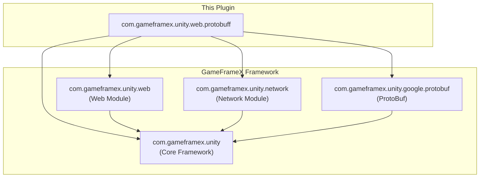
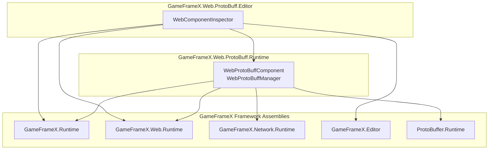
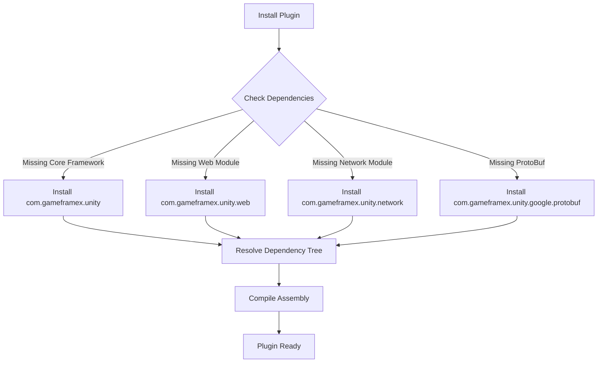

# Dependencies

This document describes the dependencies of the GameFrameX Web ProtoBuff plugin, including runtime dependencies, development dependencies, and assembly reference relationships.

## Overview

The Web ProtoBuff plugin is part of the GameFrameX framework ecosystem. It depends on other core modules of the framework to implement Protocol Buffer-based HTTP network request functionality. Understanding these dependencies is crucial for proper installation, configuration, and troubleshooting.

## Runtime Dependencies

The plugin's runtime dependencies are defined in the `package.json` file and are automatically resolved and installed by Unity Package Manager.

```json
{
  "dependencies": {
    "com.gameframex.unity": "1.1.1",
    "com.gameframex.unity.web": "1.0.0",
    "com.gameframex.unity.network": "1.0.0",
    "com.gameframex.unity.google.protobuf": "1.0.0"
  }
}
```

> Source: [package.json](https://github.com/GameFrameX/com.gameframex.unity.web.protobuff/blob/main/package.json#L23-L28)

### Dependency Description

| Dependency Package | Version | Description |
|-------------------|---------|-------------|
| `com.gameframex.unity` | 1.1.1 | GameFrameX core framework, provides base component system and module management functionality |
| `com.gameframex.unity.web` | 1.0.0 | Web network foundation module, provides low-level HTTP request implementation |
| `com.gameframex.unity.network` | 1.0.0 | Network message module, provides `MessageObject` base class and message serialization support |
| `com.gameframex.unity.google.protobuf` | 1.0.0 | Google Protocol Buffers support, provides ProtoBuf message serialization and deserialization functionality |

### Dependency Relationship Diagram



**Design Intent**: The plugin uses a layered architecture where lower layers depend on the core framework and upper layers depend on Web and Network modules to implement specific network request functionality. This dependency design ensures code modularity and reusability.

## Assembly References

In addition to package dependencies managed by Unity Package Manager, the plugin also defines assembly-level reference relationships through Assembly Definition files.

### Runtime Assembly

The `Runtime/GameFrameX.Web.ProtoBuff.Runtime.asmdef` file defines runtime assembly references:

```json
{
  "name": "GameFrameX.Web.ProtoBuff.Runtime",
  "references": [
    "GameFrameX.Runtime",
    "GameFrameX.Web.Runtime",
    "GameFrameX.Network.Runtime",
    "ProtoBuffer.Runtime"
  ],
  "versionDefines": [
    {
      "name": "com.gameframex.unity.network",
      "define": "ENABLE_GAME_FRAME_X_WEB_PROTOBUF_NETWORK"
    }
  ]
}
```

> Source: [Runtime/GameFrameX.Web.ProtoBuff.Runtime.asmdef](https://github.com/GameFrameX/com.gameframex.unity.web.protobuff/blob/main/Runtime/GameFrameX.Web.ProtoBuff.Runtime.asmdef#L1-L25)

### Editor Assembly

The `Editor/GameFrameX.Web.ProtoBuff.Editor.asmdef` file defines editor assembly references:

```json
{
  "name": "GameFrameX.Web.ProtoBuff.Editor",
  "references": [
    "GameFrameX.Web.Runtime",
    "GameFrameX.Web.ProtoBuff.Runtime",
    "GameFrameX.Editor",
    "GameFrameX.Runtime"
  ],
  "includePlatforms": ["Editor"]
}
```

> Source: [Editor/GameFrameX.Web.ProtoBuff.Editor.asmdef](https://github.com/GameFrameX/com.gameframex.unity.web.protobuff/blob/main/Editor/GameFrameX.Web.ProtoBuff.Editor.asmdef#L1-L11)

### Assembly Reference Relationship



## Compile Defines

The plugin uses conditional compilation to control ProtoBuf network functionality. The following define controls the availability of the plugin's features:

| Define | Controlling Package | Description |
|--------|---------------------|-------------|
| `ENABLE_GAME_FRAME_X_WEB_PROTOBUF_NETWORK` | com.gameframex.unity.network | Enable ProtoBuf network request functionality |

### Define Configuration Method

Steps to configure compile defines in Unity:

1. Open Unity Editor
2. Navigate to **Edit** → **Project Settings** → **Player**
3. In the **Player Settings** window, select **Other Settings** tab
4. Find **Scripting Define Symbols** option
5. Add the define: `ENABLE_GAME_FRAME_X_WEB_PROTOBUF_NETWORK`

> **Note**: Without this define, the `Post<T>` method of `WebProtoBuffComponent` will not be available.

```csharp
#if ENABLE_GAME_FRAME_X_WEB_PROTOBUF_NETWORK
/// <summary>
/// Send Post request for sending and receiving Protocol Buffer messages.
/// This method is only available when ENABLE_GAME_FRAME_X_WEB_PROTOBUF_NETWORK define is enabled.
/// </summary>
public Task<T> Post<T>(string url, GameFrameX.Network.Runtime.MessageObject message)
    where T : GameFrameX.Network.Runtime.MessageObject, GameFrameX.Network.Runtime.IResponseMessage
{
    return m_WebProtoBuffManager.Post<T>(url, message);
}
#endif
```

> Source: [Runtime/Web/WebProtoBuffComponent.cs](https://github.com/GameFrameX/com.gameframex.unity.web.protobuff/blob/main/Runtime/Web/WebProtoBuffComponent.cs#L92-L109)

## Dependency Installation Flow

When you install the Web ProtoBuff plugin in your project, Unity Package Manager automatically resolves and installs all necessary dependencies:



## Dependency Version Compatibility

Plugin dependency version requirements are as follows:

| Dependency | Minimum Version | Recommended Version | Compatible Unity Version |
|------------|-----------------|---------------------|--------------------------|
| com.gameframex.unity | 1.1.0 | 1.1.1 | 2019.4+ |
| com.gameframex.unity.web | 1.0.0 | 1.0.0 | 2019.4+ |
| com.gameframex.unity.network | 1.0.0 | 1.0.0 | 2019.4+ |
| com.gameframex.unity.google.protobuf | 1.0.0 | 1.0.0 | 2019.4+ |

> **Tip**: It is recommended to use the versions specified in `package.json` to ensure the best compatibility.

## Common Dependency Issues

### Issue: GameFrameX.Runtime not found

**Symptom**: Compilation error indicating `GameFrameX.Runtime` namespace cannot be found

**Solution**: Ensure `com.gameframex.unity` core package is correctly installed

### Issue: Post method unavailable

**Symptom**: `WebProtoBuffComponent.Post<T>` method appears grayed out or cannot be called

**Solution**:
1. Confirm `ENABLE_GAME_FRAME_X_WEB_PROTOBUF_NETWORK` define is added in Player Settings
2. Confirm `com.gameframex.unity.network` package is installed

### Issue: ProtoBuf serialization failure

**Symptom**: Request or response data cannot be correctly serialized/deserialized

**Solution**:
1. Confirm `com.gameframex.unity.google.protobuf` package is installed
2. Check if message class correctly uses `[ProtoContract]` and `[ProtoMember]` attributes

## Related Links

- [Installation](./2-installation.install-methods) - Learn different plugin installation methods
- [Requirements](./2-installation.requirements) - View Unity version and other environment requirements
- [Features](./1-overview.features) - Learn more about plugin features
- [Architecture](./4-core-concepts.architecture) - Understand component internal architecture