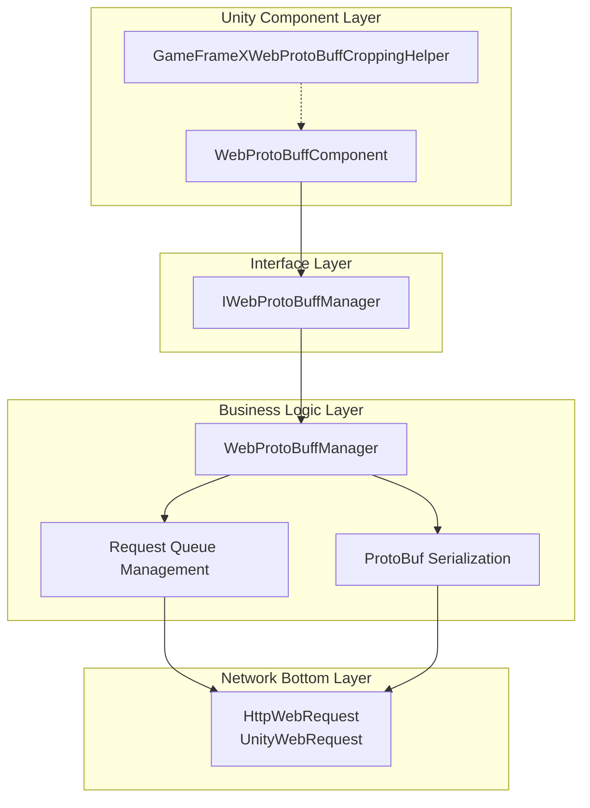
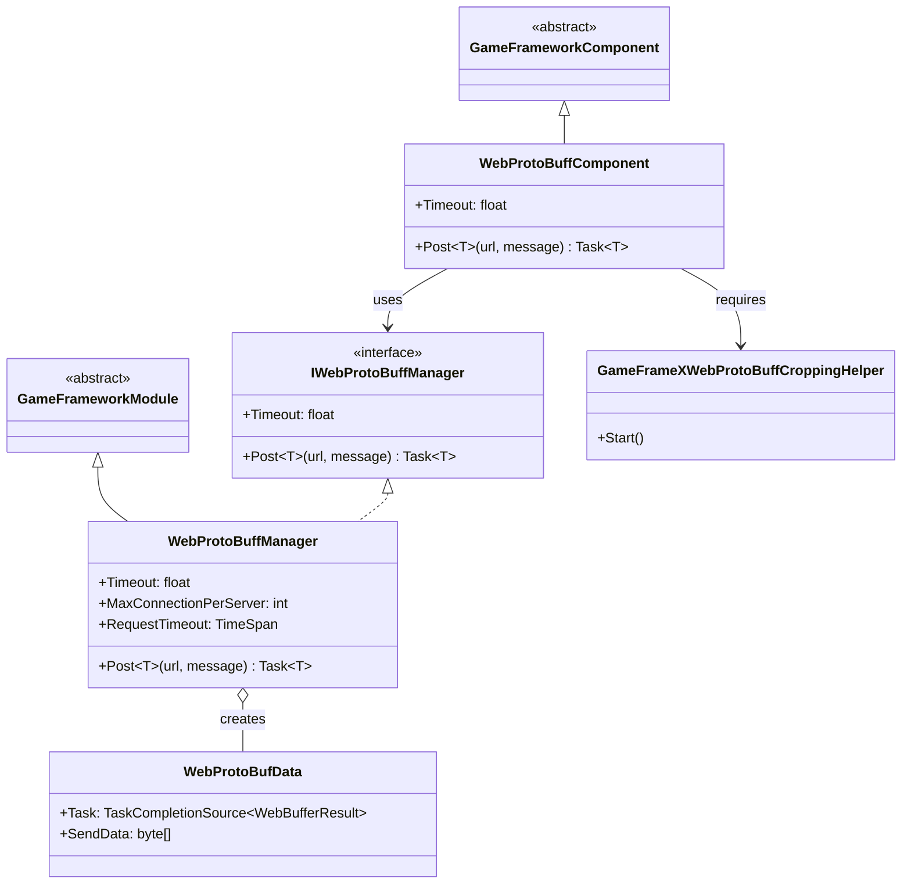
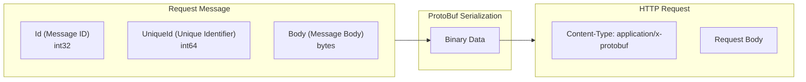
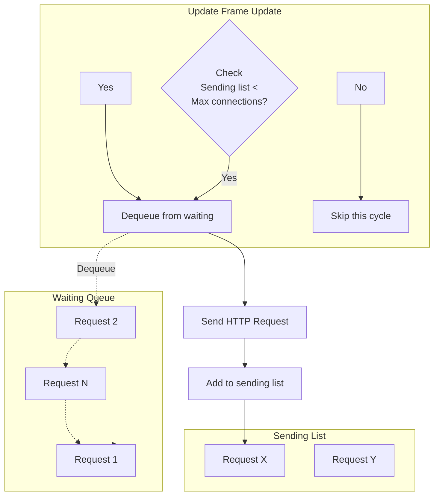

# Component Architecture

The Web ProtoBuff component is the core module in the GameFrameX framework specifically designed for handling HTTP requests and Protocol Buffer message serialization. This component provides efficient, easy-to-use network communication functionality, supporting data interaction with backend servers that support ProtoBuf protocol in Unity projects.

## Overview

The GameFrameX Web ProtoBuff component uses a layered architecture design, separating the Unity component layer, business logic layer, and network bottom-layer implementation to achieve better maintainability and extensibility.

The core functionality of this component includes:

- **Protocol Buffer message serialization/deserialization**: Efficient binary data processing using ProtoBuf library
- **HTTP POST requests**: Support for sending ProtoBuf format request messages to servers
- **Async processing**: Task-based async mode to avoid blocking the main thread
- **Queue management**: Request queue mechanism supporting high concurrency scenarios
- **Platform adaptation**: Support for WebGL platform and other Unity platforms

## Architecture Design

The component uses a typical three-layer architecture design with clear responsibilities for each layer:



### Core Component Description

| Component | Type | Responsibility |
|-----------|------|----------------|
| WebProtoBuffComponent | Unity Component | As Unity GameObject component, provides external API entry |
| IWebProtoBuffManager | Interface | Defines abstract interface for web request manager |
| WebProtoBuffManager | Module Class | Implements core business logic including request queue, ProtoBuf processing |
| WebProtoBufData | Internal Class | Encapsulates single request data (URL, data, Task) |
| GameFrameXWebProtoBuffCroppingHelper | Helper Class | IL2CPP/AOT code stripping support |

## Class Diagram



## Request Processing Flow

When the client sends a ProtoBuf request, the component processes it as follows:

```mermaid
sequenceDiagram
    participant Client as Caller
    participant Component as WebProtoBuffComponent
    participant Manager as WebProtoBuffManager
    participant Queue as Request Queue
    participant Network as Network Layer
    participant Server as Server

    Client->>Component: Post&lt;T&gt;(url, message)
    Component->>Manager: Post&lt;T&gt;(url, message)

    Note over Manager: 1. Serialize message

    Manager->>Manager: SerializerHelper.Serialize(message)

    Note over Manager: 2. Build HTTP wrapper object

    Manager->>Manager: Create MessageHttpObject<br/>(Id + UniqueId + Body)

    Note over Manager: 3. Serialize again

    Manager->>Manager: SerializerHelper.Serialize(messageHttpObject)

    Note over Manager: 4. Add to request queue

    Manager->>Queue: Enqueue(WebProtoBufData)
    Queue-->>Manager: Added to queue

    Manager->>Network: Send request asynchronously

    Note over Network: 5. HTTP request processing

    Network->>Server: POST /url<br/>Content-Type: application/x-protobuf
    Server-->>Network: HTTP Response (ProtoBuf)
    Network-->>Manager: WebBufferResult

    Note over Manager: 6. Deserialize response

    Manager->>Manager: Deserialize&lt;MessageHttpObject&gt;()
    Manager->>Manager: Deserialize&lt;T&gt;(Body)

    Manager-->>Component: Task&lt;T&gt; Result
    Component-->>Client: Response Object
```

### Message Encapsulation Format

The component uses `MessageHttpObject` for secondary encapsulation of ProtoBuf messages:



## Request Queue Management

The component uses a dual-queue model to manage network requests:



**Queue Management Rules:**

- **Waiting queue (m_WaitingProtoBufQueue)**: Stores all pending requests, processed in FIFO order
- **Sending list (m_SendingProtoBufList)**: Stores requests being processed
- **Max concurrent count (MaxConnectionPerServer)**: Default 8 concurrent connections

## Platform Adaptation

The component uses different network implementations for different platforms:

| Platform | Network Implementation | Description |
|----------|------------------------|-------------|
| WebGL | UnityWebRequest | Unity native WebGL network library |
| Other platforms | HttpWebRequest | .NET standard network library |

```csharp
#if UNITY_WEBGL
        // WebGL platform: use UnityWebRequest
        unityWebRequest = UnityEngine.Networking.UnityWebRequest.Post(url, string.Empty);
#else
        // Other platforms: use HttpWebRequest
        var request = WebRequest.CreateHttp(url);
#endif
```
> Source: [WebProtoBuffManager.ProtoBuf.cs](https://github.com/GameFrameX/com.gameframex.unity.web.protobuff/blob/main/Runtime/Web/WebProtoBuffManager.ProtoBuf.cs#L87-L120)

## Compile Defines

Component functionality is controlled by the following compile defines:

| Define | Function |
|--------|----------|
| ENABLE_GAME_FRAME_X_WEB_PROTOBUF_NETWORK | Enable ProtoBuf network functionality |
| ENABLE_GAMEFRAMEX_WEB_SEND_LOG | Enable send logging |
| ENABLE_GAMEFRAMEX_WEB_RECEIVE_LOG | Enable receive logging |

## Usage Example

### Basic Usage

After adding WebProtoBuffComponent to a Unity scene, you can send requests as follows:

```csharp
// Get component
var webComponent = UnityEngine.SceneManagement.SceneManager
    .GetActiveScene()
    .GetRootGameObjects()
    .SelectMany(go => go.GetComponentsInChildren<WebProtoBuffComponent>())
    .FirstOrDefault();

// Send ProtoBuf request
var request = new LoginRequest { Username = "test", Password = "123456" };
var response = await webComponent.Post<LoginResponse>("http://localhost:8080/api/login", request);
```
> Source: [WebProtoBuffComponent.cs](https://github.com/GameFrameX/com.gameframex.unity.web.protobuff/blob/main/Runtime/Web/WebProtoBuffComponent.cs#L105-L108)

### Component Initialization

The component completes initialization in the Awake phase:

```csharp
protected override void Awake()
{
    // Set implementation class type
    ImplementationComponentType = Utility.Assembly.GetType(componentType);
    InterfaceComponentType = typeof(IWebProtoBuffManager);

    base.Awake();

    // Get manager instance
    m_WebProtoBuffManager = GameFrameworkEntry.GetModule<IWebProtoBuffManager>();

    // Set timeout
    m_WebProtoBuffManager.Timeout = m_Timeout;
}
```
> Source: [WebProtoBuffComponent.cs](https://github.com/GameFrameX/com.gameframex.unity.web.protobuff/blob/main/Runtime/Web/WebProtoBuffComponent.cs#L77-L90)

## Configuration Options

| Config Item | Type | Default | Description |
|-------------|------|---------|-------------|
| Timeout | float | 5.0 | Request timeout (seconds) |
| MaxConnectionPerServer | int | 8 | Max concurrent connections per server |

## Related Links

- [Introduction](../1-overview.introduction)
- [Features](../1-overview.features)
- [WebProtoBuffComponent API Reference](../5-api-reference.webprotobuffcomponent)
- [IWebProtoBuffManager API Reference](../5-api-reference.iwebprotobuffmanager)
- [Message Definition](./4-core-concepts.message-definition)
- [Component Config](./6-configuration.component-config)
- [Compile Defines](./6-configuration.compile-defines)