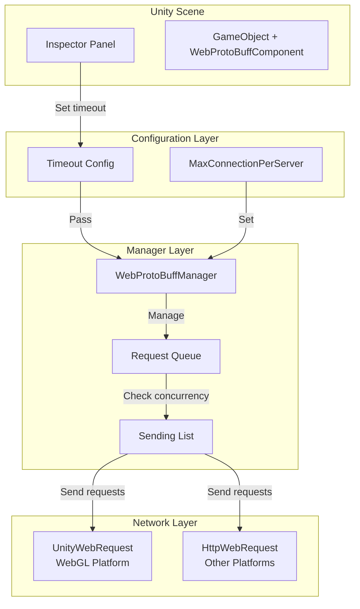

# Component Configuration

This document provides detailed description of all configuration items for the WebProtoBuffComponent and how to use them.

## Overview

WebProtoBuffComponent is the core component in the GameFrameX framework responsible for handling web requests. It supports HTTP POST requests and uses Protocol Buffer for message serialization. This component inherits from GameFrameworkComponent and can be added to a scene as a Unity component. It implements specific network request logic through WebProtoBuffManager.

Component configuration is divided into two categories:
1. **Runtime Configuration** - Set at runtime through code
2. **Editor Configuration** - Configure through Unity Inspector panel in the editor

## Configuration Options

### Timeout

| Property | Description |
|----------|-------------|
| Type | float |
| Default | 5 seconds |
| Valid Range | 0 - 120 seconds |
| Configuration Location | Inspector panel / Code |

**Function Description:**
Timeout configuration is used to set the timeout duration for network requests. When a request exceeds the specified time without completion, the system automatically terminates that request and returns a timeout error. This is crucial for preventing network requests from waiting indefinitely.

**Configuration in Inspector:**

```csharp
// Configuration UI in WebComponentInspector.cs
float timeout = EditorGUILayout.Slider("Timeout", m_Timeout.floatValue, 0f, 120f);
```
> Source: [WebComponentInspector.cs](https://github.com/GameFrameX/com.gameframex.unity.web.protobuff/blob/main/Editor/Inspector/WebComponentInspector.cs#L23)

**Configuration via Code:**

```csharp
// Set timeout via component property
var webComponent = gameObject.GetComponent<WebProtoBuffComponent>();
webComponent.Timeout = 10f; // Set to 10 seconds
```
> Source: [WebProtoBuffComponent.cs](https://github.com/GameFrameX/com.gameframex.unity.web.protobuff/blob/main/Runtime/Web/WebProtoBuffComponent.cs#L67-L71)

**Internal Implementation:**

```csharp
// Timeout setting in WebProtoBuffManager.cs
public float Timeout
{
    get { return m_Timeout; }
    set
    {
        m_Timeout = value;
        RequestTimeout = TimeSpan.FromSeconds(value);
    }
}
```
> Source: [WebProtoBuffManager.cs](https://github.com/GameFrameX/com.gameframex.unity.web.protobuff/blob/main/Runtime/Web/WebProtoBuffManager.cs#L41-L49)

### MaxConnectionPerServer

| Property | Description |
|----------|-------------|
| Type | int |
| Default | 8 |
| Configuration Location | Code |

**Function Description:**
MaxConnectionPerServer is used to control the maximum concurrent connections to a single server. This configuration affects request queue processing strategy. New requests are only dequeued from the waiting queue when the existing connection count is less than this value.

**Internal Implementation:**

```csharp
// Set default value in constructor
public WebProtoBuffManager()
{
    MaxConnectionPerServer = 8;
    m_MemoryStream = new MemoryStream();
    Timeout = 5f;
}
```
> Source: [WebProtoBuffManager.cs](https://github.com/GameFrameX/com.gameframex.unity.web.protobuff/blob/main/Runtime/Web/WebProtoBuffManager.cs#L30-L36)

**Queue Processing Logic:**

```csharp
// Update processing of ProtoBuf request queue
void UpdateProtoBuf(float elapseSeconds, float realElapseSeconds)
{
    lock (m_StringBuilder)
    {
        if (m_SendingProtoBufList.Count < MaxConnectionPerServer)
        {
            if (m_WaitingProtoBufQueue.Count > 0)
            {
                var webProtoBufData = m_WaitingProtoBufQueue.Dequeue();
                MakeProtoBufBytesRequest(webProtoBufData);
                m_SendingProtoBufList.Add(webProtoBufData);
            }
        }
    }
}
```
> Source: [WebProtoBuffManager.ProtoBuf.cs](https://github.com/GameFrameX/com.gameframex.unity.web.protobuff/blob/main/Runtime/Web/WebProtoBuffManager.ProtoBuf.cs#L39-L55)

### Content-Type

| Property | Description |
|----------|-------------|
| Type | string |
| Value | application/x-protobuf |
| Configuration Location | Code (fixed) |

**Function Description:**
The component uses a fixed content type `application/x-protobuf` for ProtoBuf message transmission. This is the standard content type for ProtoBuf, used to inform the server that the request body uses Protocol Buffer format.

**Internal Implementation:**

```csharp
// ProtoBuf content type constant
private const string ProtoBufContentType = "application/x-protobuf";
```
> Source: [WebProtoBuffManager.ProtoBuf.cs](https://github.com/GameFrameX/com.gameframex.unity.web.protobuff/blob/main/Runtime/Web/WebProtoBuffManager.ProtoBuf.cs#L32)

## Configuration Architecture



## Configuration in Unity Editor

### Add Component

1. Create an empty GameObject in Unity scene or select an existing GameObject
2. Click **Add Component** button in Inspector panel
3. Search for "Web ProtoBuff" and select to add
4. The component will automatically add the dependent GameFrameXWebProtoBuffCroppingHelper

### Configure Timeout

After adding the component, you can see the Timeout slider in the Inspector panel:

```csharp
// Component definition
[DisallowMultipleComponent]
[AddComponentMenu("GameFrameX/Web ProtoBuff")]
[UnityEngine.Scripting.Preserve]
[RequireComponent(typeof(GameFrameXWebProtoBuffCroppingHelper))]
public sealed class WebProtoBuffComponent : GameFrameworkComponent
```
> Source: [WebProtoBuffComponent.cs](https://github.com/GameFrameX/com.gameframex.unity.web.protobuff/blob/main/Runtime/Web/WebProtoBuffComponent.cs#L46-L49)

The configuration interface in Inspector allows dynamic modification of timeout at runtime:

```csharp
public override void OnInspectorGUI()
{
    base.OnInspectorGUI();
    serializedObject.Update();

    WebProtoBuffComponent t = (WebProtoBuffComponent)target;
    float timeout = EditorGUILayout.Slider("Timeout", m_Timeout.floatValue, 0f, 120f);
    if (timeout != m_Timeout.floatValue)
    {
        if (EditorApplication.isPlaying)
        {
            t.Timeout = timeout;  // Dynamic modification at runtime
        }
        else
        {
            m_Timeout.floatValue = timeout;  // Modify in editor
        }
    }
    // ...
}
```
> Source: [WebComponentInspector.cs](https://github.com/GameFrameX/com.gameframex.unity.web.protobuff/blob/main/Editor/Inspector/WebComponentInspector.cs#L17-L37)

## Runtime Configuration Examples

### Set Timeout via Code

```csharp
using GameFrameX.Web.ProtoBuff.Runtime;

// Get component instance
var webComponent = gameObject.GetComponent<WebProtoBuffComponent>();

// Set timeout (seconds)
webComponent.Timeout = 15f;

// Get current timeout config
float currentTimeout = webComponent.Timeout;
Debug.Log($"Current timeout: {currentTimeout} seconds");
```
> Source: [WebProtoBuffComponent.cs](https://github.com/GameFrameX/com.gameframex.unity.web.protobuff/blob/main/Runtime/Web/WebProtoBuffComponent.cs#L67-L71)

### Configure Directly via Manager

```csharp
using GameFrameX.Web.ProtoBuff.Runtime;

// Get manager through framework
var manager = GameFrameworkEntry.GetModule<IWebProtoBuffManager>();

// Set timeout
manager.Timeout = 30f;

// Get manager instance
var webManager = manager as WebProtoBuffManager;

// Set max connections
webManager.MaxConnectionPerServer = 16;
```
> Source: [WebProtoBuffManager.cs](https://github.com/GameFrameX/com.gameframex.unity.web.protobuff/blob/main/Runtime/Web/WebProtoBuffManager.cs#L41-L54)

## Configuration Default Values Summary

| Config Item | Type | Default | Description |
|-------------|------|---------|-------------|
| Timeout | float | 5f | Request timeout (seconds) |
| MaxConnectionPerServer | int | 8 | Max concurrent connections per server |
| RequestTimeout | TimeSpan | 5 seconds | Internal timeout object |
| ContentType | string | application/x-protobuf | Request content type |

## Configuration Best Practices

### 1. Timeout Selection

- **Short timeout (1-5 seconds)**: Suitable for game operation requests requiring high real-time performance
- **Medium timeout (5-15 seconds)**: Suitable for regular game data synchronization
- **Long timeout (15-30 seconds)**: Suitable for large file downloads or complex data requests

### 2. Concurrent Connection Settings

- **Low concurrency (4-8)**: Suitable for mobile devices or unstable network environments
- **Medium concurrency (8-16)**: Suitable for most scenarios
- **High concurrency (16+)**: Requires server support, suitable for high-speed network environments

### 3. Dynamic Adjustment

The component supports dynamic adjustment of timeout at runtime:

```csharp
public class NetworkConfigManager
{
    private WebProtoBuffComponent _webComponent;

    // Dynamically adjust timeout based on network condition
    public void AdjustTimeoutForNetworkCondition(bool isPoorNetwork)
    {
        if (_webComponent == null) return;

        // Increase timeout when network is poor
        _webComponent.Timeout = isPoorNetwork ? 30f : 10f;
    }
}
```

## Related Links

- [Quick Start](../3-getting-started.quick-start)
- [Basic Example](../3-getting-started.basic-example)
- [Architecture](../4-core-concepts.architecture)
- [API Reference - WebProtoBuffComponent](../5-api-reference.webprotobuffcomponent)
- [API Reference - IWebProtoBuffManager](../5-api-reference.iwebprotobuffmanager)
- [Compile Defines](./6-configuration.compile-defines)