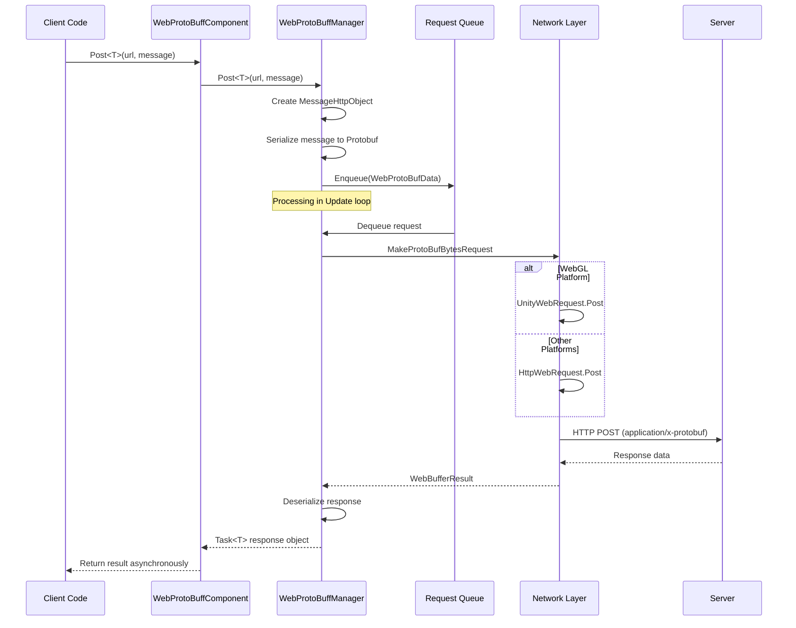

# IWebProtoBuffManager

The WebProtoBuffManager interface defines Protobuf network communication functionality for web requests, providing support for sending and receiving HTTP POST requests.

## Overview

`IWebProtoBuffManager` is the core interface of the GameFrameX Web ProtoBuff module, responsible for handling Protocol Buffer serialization format-based HTTP network requests. This interface inherits from the GameFramework module system, providing a unified network request abstraction.

**Design Intent**: This interface encapsulates the complexity of underlying network requests, providing concise generic methods for sending Protobuf messages and receiving responses of specified types. Through the queue management mechanism, it implements batch processing of requests while supporting differentiated implementations for WebGL and other platforms.

## Architecture

```mermaid
graph TD
    subgraph Client["Client Layer"]
        WebProtoBuffComponent["WebProtoBuffComponent<br/>Component Wrapper"]
    end

    subgraph Manager["Manager Layer"]
        IWebProtoBuffManager["IWebProtoBuffManager<br/>Interface Definition"]
        WebProtoBuffManager["WebProtoBuffManager<br/>Implementation Class"]
    end

    subgraph Data["Data Layer"]
        MessageObject["MessageObject<br/>Message Base Class"]
        MessageHttpObject["MessageHttpObject<br/>HTTP Message Wrapper"]
        WebProtoBufData["WebProtoBufData<br/>Request Data"]
    end

    subgraph Network["Network Layer"]
        Queue["Request Queue<br/>m_WaitingProtoBufQueue"]
        SendingList["Sending List<br/>m_SendingProtoBufList"]
        UnityWebRequest["UnityWebRequest<br/>WebGL Platform"]
        HttpWebRequest["HttpWebRequest<br/>Other Platforms"]
    end

    WebProtoBuffComponent -->|Call| IWebProtoBuffManager
    IWebProtoBuffManager <|--|Implements| WebProtoBuffManager
    WebProtoBuffManager -->|Serialize/Deserialize| MessageObject
    WebProtoBuffManager -->|Manage| WebProtoBufData
    WebProtoBuffManager -->|Enqueue| Queue
    WebProtoBuffManager -->|Send| SendingList
    WebProtoBuffManager -->|Platform check| UnityWebRequest
    WebProtoBuffManager -->|Platform check| HttpWebRequest
```

### Component Description

| Component | Role | Description |
|-----------|------|-------------|
| WebProtoBuffComponent | Component Wrapper | Unity component that encapsulates IWebProtoBuffManager access |
| IWebProtoBuffManager | Interface Definition | Defines core API for Protobuf network requests |
| WebProtoBuffManager | Implementation Class | Contains specific implementation including queue management and platform adaptation |
| MessageObject | Message Base Class | Base type for all Protobuf messages |
| MessageHttpObject | HTTP Wrapper | Wrapper containing message ID, UniqueId, and Body |

## Core Flow



### Request Processing Flow

1. **Request Creation**: Client calls `Post<T>` method, passing URL and message object
2. **Message Encapsulation**: Wrap user message in `MessageHttpObject`, containing message ID and serialized Body
3. **Queue Management**: Request enters waiting queue, processed by Update loop according to concurrency limits
4. **Network Sending**: Select `UnityWebRequest` (WebGL) or `HttpWebRequest` (other platforms) based on platform
5. **Response Processing**: After receiving server response, deserialize to corresponding Protobuf object and return

## Interface Definition

### `Post<T>(string url, MessageObject message): Task<T>`

Sends a Protobuf message POST request and receives a response of the specified type.

**Note**: This method is only available when the `ENABLE_GAME_FRAME_X_WEB_PROTOBUF_NETWORK` define is defined.

**Parameters:**
- `url` (string): URL address of the target server
- `message` (MessageObject): Protobuf message object to send, must inherit from MessageObject

**Generic Parameters:**
- `T`: Return data type, must inherit from MessageObject and implement IResponseMessage interface

**Return:** `Task<T>` - Async task, containing response data received from server upon completion

**Implementation Code Example:**

```csharp
// From Runtime/Web/WebProtoBuffManager.ProtoBuf.cs#L178-L201
public async Task<T> Post<T>(string url, MessageObject message) where T : MessageObject, IResponseMessage
{
    DebugSendLog(message);
    var webBufferResult = await PostInner(url, message);
    if (webBufferResult.IsNotNull())
    {
        var messageObjectHttp = SerializerHelper.Deserialize<MessageHttpObject>(webBufferResult.Result);
        if (messageObjectHttp.IsNotNull() && messageObjectHttp.Id != default)
        {
            var messageType = ProtoMessageIdHandler.GetRespTypeById(messageObjectHttp.Id);
            if (messageType != typeof(T))
            {
                Log.Error($"Response message type is invalid. Expected '{typeof(T).FullName}', actual '{messageType.FullName}'.");
                return default;
            }

            var messageObject = SerializerHelper.Deserialize<T>(messageObjectHttp.Body);
            DebugReceiveLog(messageObject);
            return messageObject;
        }
    }

    return default;
}
```
> Source: [WebProtoBuffManager.ProtoBuf.cs](https://github.com/GameFrameX/com.gameframex.unity.web.protobuff/blob/main/Runtime/Web/WebProtoBuffManager.ProtoBuf.cs#L178-L201)

### `Timeout: float`

Gets or sets the timeout duration for POST requests (in seconds).

**Property Type:** `float`

**Default Value:** `5f` (5 seconds)

**Description:** After setting the request timeout, the actual `RequestTimeout` property is synchronized to the corresponding `TimeSpan` value.

**Implementation Code Example:**

```csharp
// From Runtime/Web/WebProtoBuffManager.cs#L41-L49
public float Timeout
{
    get { return m_Timeout; }
    set
    {
        m_Timeout = value;
        RequestTimeout = TimeSpan.FromSeconds(value);
    }
}
```
> Source: [WebProtoBuffManager.cs](https://github.com/GameFrameX/com.gameframex.unity.web.protobuff/blob/main/Runtime/Web/WebProtoBuffManager.cs#L41-L49)

## Property Reference

| Property | Type | Default | Description |
|----------|------|---------|-------------|
| Timeout | float | 5f | Request timeout (seconds) |
| MaxConnectionPerServer | int | 8 | Max concurrent connections per server |
| RequestTimeout | TimeSpan | 5 seconds | Actual request timeout object |

## Usage Examples

### Basic Usage

Send Protobuf requests through WebProtoBuffComponent:

```csharp
// Define request message
public class LoginRequest : MessageObject
{
    public string Username { get; set; }
    public string Password { get; set; }
}

// Define response message
public class LoginResponse : MessageObject, IResponseMessage
{
    public int ErrorCode { get; set; }
    public string Token { get; set; }
}

// Send request
var webComponent = UnityEngine.GameObject.FindObjectOfType<WebProtoBuffComponent>();
var request = new LoginRequest { Username = "user", Password = "pass" };
LoginResponse response = await webComponent.Post<LoginResponse>("http://example.com/api/login", request);
```
> Source: [WebProtoBuffComponent.cs](https://github.com/GameFrameX/com.gameframex.unity.web.protobuff/blob/main/Runtime/Web/WebProtoBuffComponent.cs#L105-L108)

### Timeout Settings

```csharp
// Set timeout to 10 seconds
var webComponent = UnityEngine.GameObject.FindObjectOfType<WebProtoBuffComponent>();
webComponent.Timeout = 10f;
```

### Concurrency Control

WebProtoBuffManager uses queue to manage requests, default max concurrency is 8:

```csharp
// Set max connections through manager
var manager = GameFrameworkEntry.GetModule<IWebProtoBuffManager>();
// MaxConnectionPerServer property is visible in implementation class
if (manager is WebProtoBuffManager webManager)
{
    webManager.MaxConnectionPerServer = 16;
}
```

## Platform Differences

### WebGL Platform

On WebGL platform, use Unity's `UnityWebRequest` for network requests:

```csharp
// From Runtime/Web/WebProtoBuffManager.ProtoBuf.cs#L87-L116
UnityEngine.Networking.UnityWebRequest unityWebRequest;
if (webData.IsGet)
{
    unityWebRequest = UnityEngine.Networking.UnityWebRequest.Get(webData.URL);
}
else
{
    unityWebRequest = UnityEngine.Networking.UnityWebRequest.Post(webData.URL, string.Empty);
}

unityWebRequest.timeout = (int)RequestTimeout.TotalSeconds;
unityWebRequest.SetRequestHeader("Content-Type", ProtoBufContentType);
byte[] postData = webData.SendData;
unityWebRequest.uploadHandler = new UnityEngine.Networking.UploadHandlerRaw(postData);
```
> Source: [WebProtoBuffManager.ProtoBuf.cs](https://github.com/GameFrameX/com.gameframex.unity.web.protobuff/blob/main/Runtime/Web/WebProtoBuffManager.ProtoBuf.cs#L87-L116)

### Other Platforms

On non-WebGL platforms, use .NET's `HttpWebRequest`:

```csharp
// From Runtime/Web/WebProtoBuffManager.ProtoBuf.cs#L118-L164
HttpWebRequest request = WebRequest.CreateHttp(webData.URL);
request.Method = webData.IsGet ? WebRequestMethods.Http.Get : WebRequestMethods.Http.Post;
request.Timeout = (int)RequestTimeout.TotalMilliseconds;
request.ContentType = ProtoBufContentType;
byte[] postData = webData.SendData;
request.ContentLength = postData.Length;
using (Stream requestStream = request.GetRequestStream())
{
    await requestStream.WriteAsync(postData, 0, postData.Length);
}
```
> Source: [WebProtoBuffManager.ProtoBuf.cs](https://github.com/GameFrameX/com.gameframex.unity.web.protobuff/blob/main/Runtime/Web/WebProtoBuffManager.ProtoBuf.cs#L118-L164)

## Compile Defines

Using `Post<T>` method requires defining the following compile define:

| Define | Description |
|--------|-------------|
| ENABLE_GAME_FRAME_X_WEB_PROTOBUF_NETWORK | Enable Protobuf network functionality |

Add this define in Unity's **Player Settings** → **Scripting Define Symbols** to use the complete Protobuf network functionality.

## Related Links

- [WebProtoBuffComponent](./5-api-reference.webprotobuffcomponent) - Unity component wrapper
- [Component Config](./6-configuration.component-config) - Configuration options
- [Compile Defines](./6-configuration.compile-defines) - Detailed define description
- [Quick Start](./3-getting-started.quick-start) - Quick start guide