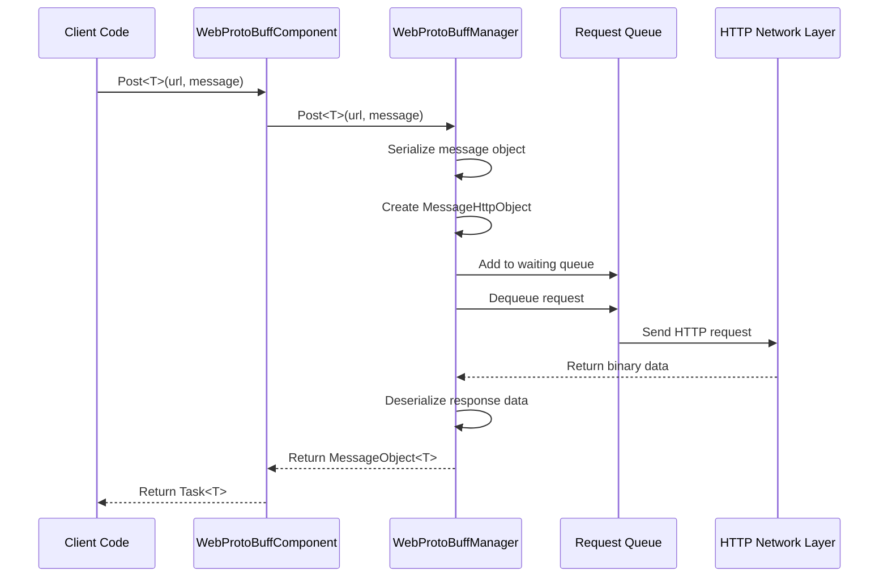
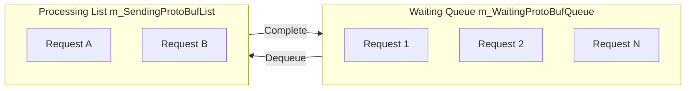

# WebProtoBuffComponent

WebProtoBuffComponent is the network request component of the GameFrameX framework, specifically designed for handling HTTP POST requests based on Protocol Buffer (ProtoBuf). It provides complete ProtoBuf message serialization and deserialization functionality, supporting async request processing and timeout control.

## Overview

WebProtoBuffComponent inherits from GameFrameworkComponent and is the core component for handling ProtoBuf network communication in Unity Game Framework. This component encapsulates the underlying HTTP request implementation, providing a concise `Post<T>` method for sending ProtoBuf format requests and receiving responses.

**Main Responsibilities:**
- Manage the lifecycle of ProtoBuf network requests
- Handle request message serialization and response message deserialization
- Provide async request processing capability
- Control request timeout

**Use Cases:**
- Data exchange with backend server using ProtoBuf format
- Network communication requiring efficient serialization/deserialization
- Network requests on Unity WebGL platform

## Architecture

```mermaid
flowchart TD
    subgraph Client["Client Layer"]
        GameObject[Unity GameObject]
    end

    subgraph Component["Component Layer"]
        WebProtoBuff[WebProtoBuffComponent]
    end

    subgraph Manager["Manager Layer"]
        IWebProtoBuff[IWebProtoBuffManager]
        WebProtoBuffMgr[WebProtoBuffManager]
    end

    subgraph Data["Data Layer"]
        MessageObject[MessageObject]
        IResponse[IResponseMessage]
        WebProtoBufData[WebProtoBufData]
    end

    subgraph Network["Network Layer"]
        UnityWeb[UnityWebRequest<br/>WebGL Platform]
        HttpWeb[HttpWebRequest<br/>Other Platforms]
    end

    GameObject --> WebProtoBuff
    WebProtoBuff --> IWebProtoBuff
    IWebProtoBuff <|.. WebProtoBuffMgr
    WebProtoBuffMgr --> MessageObject
    WebProtoBuffMgr --> IResponse
    WebProtoBuffMgr --> WebProtoBufData
    WebProtoBufData --> UnityWeb
    WebProtoBufData --> HttpWeb
```

**Architecture Description:**
- **Component Layer (WebProtoBuffComponent)**: Unity component, responsible for initializing manager and exposing public API
- **Manager Layer (IWebProtoBuffManager/WebProtoBuffManager)**: Implements request queue management, serialization/deserialization processing
- **Data Layer**: Defines request and response data structures
- **Network Layer**: Selects different HTTP request implementations based on platform (UnityWebRequest for WebGL, HttpWebRequest for other platforms)

## Core Flow



**Flow Description:**
1. Client calls `Post<T>` method to initiate request
2. Component passes request to manager
3. Manager serializes message object to ProtoBuf format
4. Create HTTP wrapper object and add to request queue
5. Update loop dequeues requests and sends them
6. After receiving response, deserialize
7. Return generic type message object

## API Reference

### Properties

#### `Timeout`

```csharp
public float Timeout { get; set; }
```

Gets or sets request timeout (in seconds). Request is automatically terminated when exceeded.

**Default:** 5f

**Example:**
```csharp
var component = gameObject.GetComponent<WebProtoBuffComponent>();
component.Timeout = 10f; // Set 10 second timeout
```

> Source: [WebProtoBuffComponent.cs](https://github.com/GameFrameX/com.gameframex.unity.web.protobuff/blob/main/Runtime/Web/WebProtoBuffComponent.cs#L67-L71)

---

### Methods

#### `Post<T>`

```csharp
public Task<T> Post<T>(string url, GameFrameX.Network.Runtime.MessageObject message)
    where T : GameFrameX.Network.Runtime.MessageObject, GameFrameX.Network.Runtime.IResponseMessage
```

Sends POST request for sending and receiving Protocol Buffer messages.

**Parameters:**
- `url` (string): URL address of target server
- `message` (MessageObject): Protocol Buffer message object to send, must inherit from MessageObject

**Return:** `Task<T>` - Async task, containing ProtoBuf response data received from server upon completion

**Type Parameters:**
- `T`: Return data type, must inherit from MessageObject and implement IResponseMessage interface

**Usage Condition:** Only available when `ENABLE_GAME_FRAME_X_WEB_PROTOBUF_NETWORK` define is enabled

**Example:**
```csharp
// Define request message
[ProtoContract]
public class LoginRequest : MessageObject
{
    [ProtoMember(1)]
    public string Username { get; set; }

    [ProtoMember(2)]
    public string Password { get; set; }
}

// Define response message
[ProtoContract]
public class LoginResponse : MessageObject, IResponseMessage
{
    [ProtoMember(1)]
    public bool Success { get; set; }

    [ProtoMember(2)]
    public string Token { get; set; }
}

// Send request
var request = new LoginRequest
{
    Username = "user",
    Password = "password"
};

var response = await webComponent.Post<LoginResponse>("http://api.example.com/login", request);
if (response?.Success == true)
{
    Debug.Log($"Login succeeded, Token: {response.Token}");
}
```

> Source: [WebProtoBuffComponent.cs](https://github.com/GameFrameX/com.gameframex.unity.web.protobuff/blob/main/Runtime/Web/WebProtoBuffComponent.cs#L105-L108)

---

### Internal Methods

#### `Awake`

```csharp
protected override void Awake()
```

Component initialization method. Called when game object loads, used to initialize Web manager and set timeout.

> Source: [WebProtoBuffComponent.cs](https://github.com/GameFrameX/com.gameframex.unity.web.protobuff/blob/main/Runtime/Web/WebProtoBuffComponent.cs#L77-L90)

---

## Internal Implementation Details

### Request Queue Management

WebProtoBuffManager uses two queues to manage requests:



- **m_WaitingProtoBufQueue**: Stores pending requests (initial capacity 256)
- **m_SendingProtoBufList**: Stores requests being processed (initial capacity 16)

**Processing Logic:**
```csharp
// When processing count is less than max connections, dequeue from waiting queue
if (m_SendingProtoBufList.Count < MaxConnectionPerServer)
{
    if (m_WaitingProtoBufQueue.Count > 0)
    {
        var webProtoBufData = m_WaitingProtoBufQueue.Dequeue();
        MakeProtoBufBytesRequest(webProtoBufData);
        m_SendingProtoBufList.Add(webProtoBufData);
    }
}
```

> Source: [WebProtoBuffManager.ProtoBuf.cs](https://github.com/GameFrameX/com.gameframex.unity.web.protobuff/blob/main/Runtime/Web/WebProtoBuffManager.ProtoBuf.cs#L39-L55)

### Platform-specific Processing

The component uses different HTTP implementations for different platforms:

| Platform | HTTP Implementation | Features |
|----------|---------------------|----------|
| WebGL | UnityWebRequest | Browser security restrictions, using Unity's async API |
| Other platforms | HttpWebRequest | Complete .NET HttpWebRequest support |

**WebGL Implementation:**
```csharp
#if UNITY_WEBGL
UnityEngine.Networking.UnityWebRequest unityWebRequest = UnityEngine.Networking.UnityWebRequest.Post(url, string.Empty);
unityWebRequest.timeout = (int)RequestTimeout.TotalSeconds;
unityWebRequest.SetRequestHeader("Content-Type", ProtoBufContentType);
byte[] postData = webData.SendData;
unityWebRequest.uploadHandler = new UnityEngine.Networking.UploadHandlerRaw(postData);
```

> Source: [WebProtoBuffManager.ProtoBuf.cs](https://github.com/GameFrameX/com.gameframex.unity.web.protobuff/blob/main/Runtime/Web/WebProtoBuffManager.ProtoBuf.cs#L87-L116)

### ProtoBuf Serialization Flow

1. Client passes MessageObject
2. Get message ID through ProtoMessageIdHandler
3. Create MessageHttpObject wrapper object (containing ID, UniqueId, Body)
4. Serialize entire object to byte array using SerializerHelper
5. Send HTTP request

**Response Processing:**
1. Receive binary data returned by server
2. Deserialize to MessageHttpObject
3. Validate message ID matches expected type
4. Deserialize Body to target type T

> Source: [WebProtoBuffManager.ProtoBuf.cs](https://github.com/GameFrameX/com.gameframex.unity.web.protobuff/blob/main/Runtime/Web/WebProtoBuffManager.ProtoBuf.cs#L178-L201)

---

## Related Links

- [IWebProtoBuffManager](./5-api-reference.iwebprotobuffmanager) - Web ProtoBuff manager interface
- [Component Config](./6-configuration.component-config) - WebProtoBuffComponent configuration
- [Compile Defines](./6-configuration.compile-defines) - ENABLE_GAME_FRAME_X_WEB_PROTOBUF_NETWORK define
- [Platform Info](./7-platforms.platform-info) - Platform support
- [Quick Start](./3-getting-started.quick-start) - Quick start