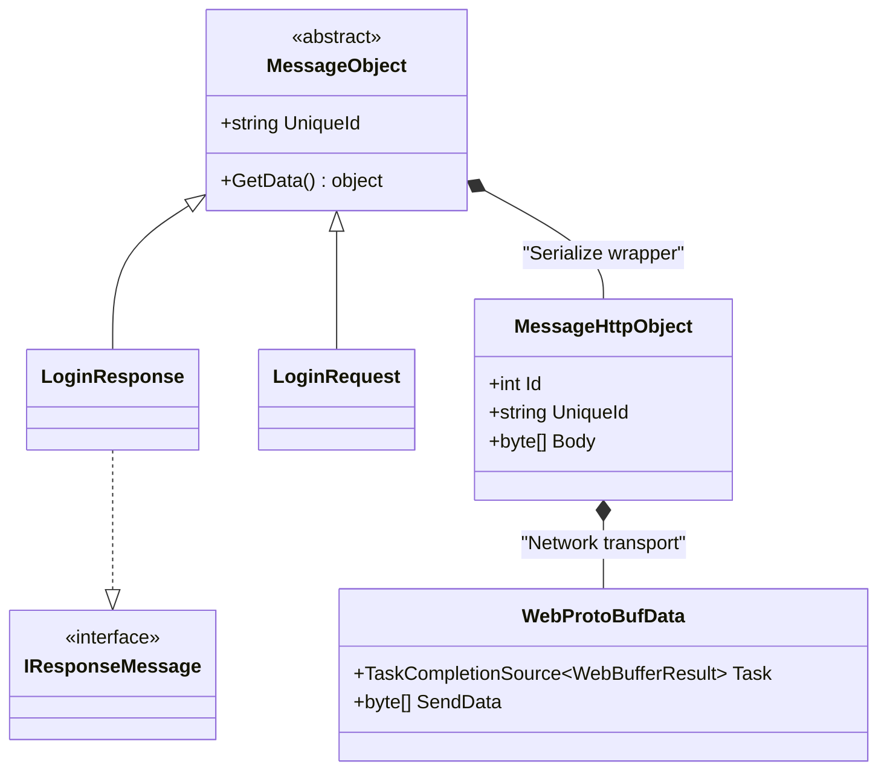
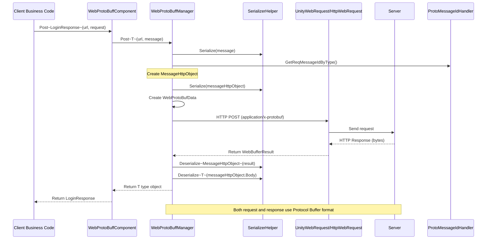

# Message Definition

This document describes the message definition mechanism in the GameFrameX Web ProtoBuff plugin, including message base class, HTTP message wrapper, and Protocol Buffer message structure definition.

## Overview

The Web ProtoBuff plugin implements Protocol Buffer message serialization and deserialization based on the **protobuf-net** library. The message system uses a layered design:

- **Base Layer**: `MessageObject` - Base class for all messages
- **Transport Layer**: `MessageHttpObject` - HTTP transport message wrapper
- **Application Layer**: User-defined business message classes

This design achieves decoupling between business logic and network transmission, allowing developers to focus on business message definitions without dealing with underlying network communication details.

## Message Architecture



### Core Component Description

| Component | Namespace | Description |
|-----------|-----------|-------------|
| `MessageObject` | GameFrameX.Network.Runtime | Abstract base class for all ProtoBuf messages |
| `IResponseMessage` | GameFrameX.Network.Runtime | Response message interface, marks message type as response |
| `MessageHttpObject` | GameFrameX.Network.Runtime | HTTP transport wrapper, contains message ID and body |
| `WebProtoBufData` | GameFrameX.Web.ProtoBuff.Runtime | Internal request data class, manages request queue |

## Message Serialization Flow



### Flow Description

1. **Message Creation**: Client creates request message object inheriting from `MessageObject`
2. **Message Wrapping**: Serialize business message to byte array and wrap in `MessageHttpObject`
3. **Message ID**: Get unique ID for message type through `ProtoMessageIdHandler`
4. **Network Transmission**: Use HTTP POST method, Content-Type set to `application/x-protobuf`
5. **Response Processing**: Server returns data first deserializes to `MessageHttpObject`, then extract business response message

## Message Definition Examples

### Define Request Message

Request messages need to inherit from `MessageObject` base class and use `ProtoContract` and `ProtoMember` attributes:

```csharp
using ProtoBuf;
using GameFrameX.Network.Runtime;

[ProtoContract]
public class LoginRequest : MessageObject
{
    [ProtoMember(1)]
    public string Username { get; set; }

    [ProtoMember(2)]
    public string Password { get; set; }

    [ProtoMember(3)]
    public string DeviceId { get; set; }
}
```
> Source: [README.md](https://github.com/GameFrameX/com.gameframex.unity.web.protobuff/blob/main/README.md#L66-L77)

### Define Response Message

Response messages, in addition to inheriting `MessageObject`, need to implement `IResponseMessage` interface:

```csharp
using ProtoBuf;
using GameFrameX.Network.Runtime;

[ProtoContract]
public class LoginResponse : MessageObject, IResponseMessage
{
    [ProtoMember(1)]
    public bool Success { get; set; }

    [ProtoMember(2)]
    public string Token { get; set; }

    [ProtoMember(3)]
    public string Message { get; set; }
}
```
> Source: [README.md](https://github.com/GameFrameX/com.gameframex.unity.web.protobuff/blob/main/README.md#L79-L88)

### Complete Usage Example

```csharp
using UnityEngine;
using GameFrameX.Web.ProtoBuff.Runtime;

public class LoginController : MonoBehaviour
{
    public WebProtoBuffComponent WebComponent;

    private async void Start()
    {
        var request = new LoginRequest
        {
            Username = "user",
            Password = "password"
        };

        string url = "http://api.example.com/login";

        try
        {
            // Send request and wait for result
            LoginResponse response = await WebComponent.Post<LoginResponse>(url, request);

            if (response != null)
            {
                Debug.Log($"Login Result: {response.Success}, Token: {response.Token}");
            }
        }
        catch (System.Exception e)
        {
            Debug.LogError($"Request Failed: {e.Message}");
        }
    }
}
```
> Source: [README.md](https://github.com/GameFrameX/com.gameframex.unity.web.protobuff/blob/main/README.md#L98-L127)

## ProtoBuf Attribute Description

### Common Attributes

| Attribute | Function | Notes |
|-----------|----------|-------|
| `[ProtoContract]` | Mark class as ProtoBuf serialization target | Must be added above class declaration |
| `[ProtoMember(n)]` | Mark property as serialization member, n is field number | Number must be unique within class, recommended to start from 1 and be continuous |
| `[ProtoIgnore]` | Mark property not participating in serialization | For properties not needing network transmission |

### Message Design Principles

1. **Field Number Uniqueness**: Each `[ProtoMember]` number must be unique within the class
2. **Number Continuity**: Recommended to use continuous numbers starting from 1 for easier extension
3. **Type Compatibility**: Field type changes need to maintain backward compatibility
4. **Naming Convention**: Use PascalCase for property naming, ProtoBuf will auto-convert

## HTTP Message Wrapper

`MessageHttpObject` is the message wrapper class for HTTP transport, its structure is:

```csharp
public class MessageHttpObject
{
    /// <summary>
    /// Message type ID, used to identify message type
    /// </summary>
    public int Id { get; set; }

    /// <summary>
    /// Message unique identifier, used for request/response pairing
    /// </summary>
    public string UniqueId { get; set; }

    /// <summary>
    /// Message body byte array, containing actual business data
    /// </summary>
    public byte[] Body { get; set; }
}
```

When sending a request, the plugin performs the following serialization steps:

```csharp
// From WebProtoBuffManager.ProtoBuf.cs
var id = ProtoMessageIdHandler.GetReqMessageIdByType(message.GetType());
MessageHttpObject messageHttpObject = new MessageHttpObject
{
    Id = id,
    UniqueId = message.UniqueId,
    Body = SerializerHelper.Serialize(message),
};
var sendData = SerializerHelper.Serialize(messageHttpObject);
```
> Source: [Runtime/Web/WebProtoBuffManager.ProtoBuf.cs#L214-L221](https://github.com/GameFrameX/com.gameframex.unity.web.protobuff/blob/main/Runtime/Web/WebProtoBuffManager.ProtoBuf.cs#L214-L221)

## Related Links

- [Architecture](./4-core-concepts.architecture) - Understand WebProtoBuffComponent architecture design
- [Quick Start](./3-getting-started.quick-start) - Start using Web ProtoBuff component
- [API Reference - WebProtoBuffComponent](./5-api-reference.webprotobuffcomponent) - Component complete API documentation
- [API Reference - IWebProtoBuffManager](./5-api-reference.iwebprotobuffmanager) - Manager interface documentation
- [Compile Defines](./6-configuration.compile-defines) - How to enable ProtoBuf network functionality