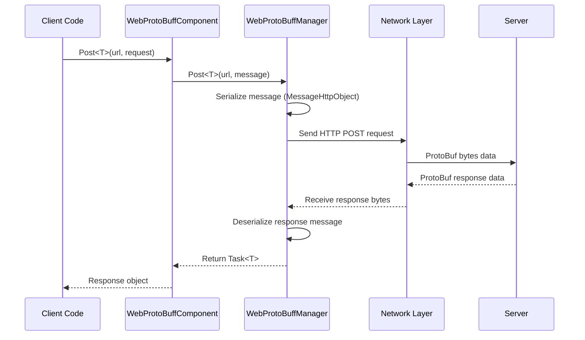

# Basic Example

This section provides basic usage examples for the Web ProtoBuff plugin to help developers quickly get started and understand core usage.

## Overview

The Web ProtoBuff component is a network request module based on the GameFrameX framework, specifically designed for handling HTTP POST requests based on Protocol Buffer format. This component provides the following core features:

- **ProtoBuf Serialization**: Automatically serialize message objects to byte data for sending
- **Async Requests**: Task<T>-based async API supporting async/await pattern
- **Cross-platform Support**: Compatible with Unity WebGL and native platforms
- **Timeout Control**: Configurable request timeout

## Quick Flow

The following flowchart shows the basic flow of sending a request using WebProtoBuffComponent:



## Message Definition Example

Before using Web ProtoBuff, you need to define ProtoBuf message types for requests and responses.

### Define Request Message

```csharp
using ProtoBuf;
using GameFrameX.Network.Runtime;

[ProtoContract]
public class LoginRequest : MessageObject
{
    [ProtoMember(1)]
    public string Username { get; set; }

    [ProtoMember(2)]
    public string Password { get; set; }
}
```
> Source: [README.md](https://github.com/GameFrameX/com.gameframex.unity.web.protobuff/blob/main/README.md#L65-L77)

### Define Response Message

```csharp
using ProtoBuf;
using GameFrameX.Network.Runtime;

[ProtoContract]
public class LoginResponse : MessageObject, IResponseMessage
{
    [ProtoMember(1)]
    public bool Success { get; set; }

    [ProtoMember(2)]
    public string Token { get; set; }
}
```
> Source: [README.md](https://github.com/GameFrameX/com.gameframex.unity.web.protobuff/blob/main/README.md#L79-L88)

**Key Points:**
- Use `[ProtoContract]` attribute to mark class as ProtoBuf contract
- Use `[ProtoMember(N)]` attribute to mark properties for serialization
- Request messages only need to inherit `MessageObject`
- Response messages need to inherit `MessageObject` and implement `IResponseMessage` interface

## Send Request Example

### Complete Usage Example

The following is a complete example of sending a login request using WebProtoBuffComponent in a Unity script:

```csharp
using UnityEngine;
using GameFrameX.Web.ProtoBuff.Runtime;

public class LoginController : MonoBehaviour
{
    public WebProtoBuffComponent WebComponent;

    private async void Start()
    {
        var request = new LoginRequest
        {
            Username = "user",
            Password = "password"
        };

        string url = "http://api.example.com/login";

        try
        {
            // Send request and wait for result
            LoginResponse response = await WebComponent.Post<LoginResponse>(url, request);

            if (response != null)
            {
                Debug.Log($"Login Result: {response.Success}, Token: {response.Token}");
            }
        }
        catch (System.Exception e)
        {
            Debug.LogError($"Request Failed: {e.Message}");
        }
    }
}
```
> Source: [README.md](https://github.com/GameFrameX/com.gameframex.unity.web.protobuff/blob/main/README.md#L94-L128)

### Get Component Instance

In Unity scenes, WebProtoBuffComponent is used as a game framework component. Usually obtained in the following ways:

```csharp
// Method 1: Through scene component reference (needs Inspector configuration)
public WebProtoBuffComponent webProtoBuffComponent;

// Method 2: Through framework
var webComponent = UnityGameFramework.Runtime.GameEntry.GetComponent<WebProtoBuffComponent>();
```

### Timeout Settings

You can set request timeout through the component's Timeout property (in seconds):

```csharp
// Set timeout to 10 seconds
webProtoBuffComponent.Timeout = 10f;
```
> Source: [WebProtoBuffComponent.cs](https://github.com/GameFrameX/com.gameframex.unity.web.protobuff/blob/main/Runtime/Web/WebProtoBuffComponent.cs#L67-L71)

## Enable Features

### Compile Defines

Using ProtoBuff network features requires enabling compile defines in Unity. Open **Edit > Project Settings > Player**, add to **Scripting Define Symbols**:

```
ENABLE_GAME_FRAME_X_WEB_PROTOBUF_NETWORK
```

> **Note**: This define is optional. If not added, the Post<T> method will be disabled and the component only retains basic functionality.

This define can also be automatically defined through assembly definition file, and is automatically enabled when the project depends on `com.gameframex.unity.network` package.

## Data Format Description

### Request Data Format

The sent request data uses `MessageHttpObject` wrapper format:

```csharp
MessageHttpObject messageHttpObject = new MessageHttpObject
{
    Id = messageId,           // Message type identifier
    UniqueId = uniqueId,      // Unique request identifier
    Body = serializedBody    // Serialized message body
};
```
> Source: [WebProtoBuffManager.ProtoBuf.cs](https://github.com/GameFrameX/com.gameframex.unity.web.protobuff/blob/main/Runtime/Web/WebProtoBuffManager.ProtoBuf.cs#L214-L221)

### HTTP Request Headers

- **Content-Type**: `application/x-protobuf`
- **Request Method**: POST
- **Timeout Control**: Set through RequestTimeout property

## Error Handling

In practical applications, you should handle the following common errors:

```csharp
try
{
    var response = await WebComponent.Post<LoginResponse>(url, request);

    if (response == null)
    {
        Debug.LogWarning("Response is null - server may be unreachable");
        return;
    }

    // Process business logic
}
catch (TimeoutException e)
{
    Debug.LogError($"Request timeout: {e.Message}");
}
catch (WebException e)
{
    Debug.LogError($"Network error: {e.Status} - {e.Message}");
}
catch (System.Exception e)
{
    Debug.LogError($"Unexpected error: {e.Message}");
}
```

## Debug Logging

The plugin supports debug logging for sending and receiving messages for development debugging:

- **Send Logging**: Enable `ENABLE_GAMEFRAMEX_WEB_SEND_LOG` define
- **Receive Logging**: Enable `ENABLE_GAMEFRAMEX_WEB_RECEIVE_LOG` define

Log output example:
```
Sending message ID:[1001,uuid123,LoginRequest] Content:{...}
Receiving message ID:[1001,uuid123,LoginResponse] Content:{...}
```
> Source: [WebProtoBuffManager.ProtoBuf.cs](https://github.com/GameFrameX/com.gameframex.unity.web.protobuff/blob/main/Runtime/Web/WebProtoBuffManager.ProtoBuf.cs#L227-L241)

## Related Links

- [Quick Start](./3-getting-started.quick-start) - Understand quick start steps
- [Architecture](./4-core-concepts.architecture) - Deep dive into architecture design
- [Message Definition](./4-core-concepts.message-definition) - ProtoBuf message details
- [API Reference - WebProtoBuffComponent](./5-api-reference.webprotobuffcomponent) - Complete API documentation
- [Compile Defines](./6-configuration.compile-defines) - Configure compilation options