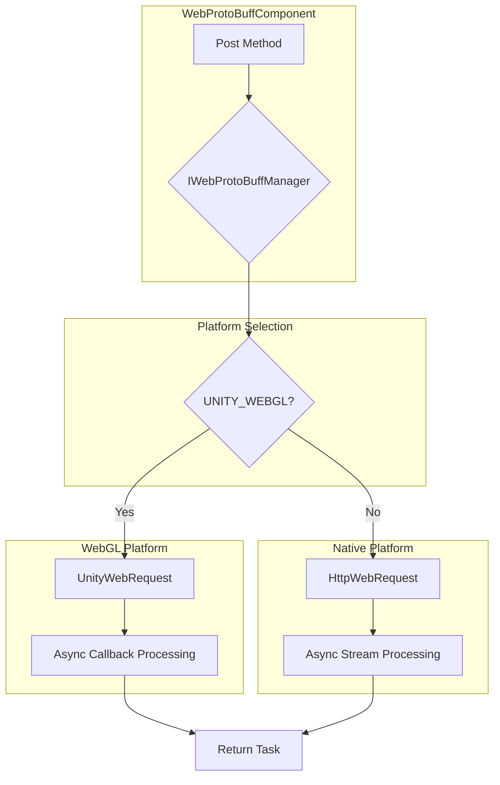

# Platform Info

This document provides detailed description of the GameFrameX Web ProtoBuff component's support status on different Unity platforms, platform-specific implementation differences, and configuration requirements for each platform.

## Overview

The GameFrameX Web ProtoBuff component is a cross-platform HTTP network request component specifically designed for handling Protocol Buffer format network communication. This component is designed to run seamlessly across multiple Unity platforms, automatically selecting the most suitable network request implementation based on the target platform.

The core design philosophy of this component is to provide a unified API interface while leveraging each platform's native network capabilities for optimal performance and compatibility.

## Supported Platforms

This component supports the following Unity platforms:

| Platform | Support Status | Network Implementation | Description |
|----------|----------------|------------------------|-------------|
| **WebGL** | Full support | UnityWebRequest | Browser environment dedicated implementation |
| **Windows** | Full support | HttpWebRequest | .NET standard HTTP client |
| **macOS** | Full support | HttpWebRequest | .NET standard HTTP client |
| **Linux** | Full support | HttpWebRequest | .NET standard HTTP client |
| **Android** | Full support | HttpWebRequest | .NET standard HTTP client |
| **iOS** | Full support | HttpWebRequest | .NET standard HTTP client |
| **Switch** | Full support | HttpWebRequest | .NET standard HTTP client |
| **PS4/PS5** | Full support | HttpWebRequest | .NET standard HTTP client |
| **Xbox** | Full support | HttpWebRequest | .NET standard HTTP client |

## Platform Architecture

The component uses conditional compilation to achieve cross-platform support, distinguishing WebGL platform from other platforms by detecting the `UNITY_WEBGL` macro.



### Platform Selection Logic Description

The component selects the appropriate network implementation through compile-time conditional compilation directives:

- **WebGL Platform**: Uses `UnityEngine.Networking.UnityWebRequest`, which is Unity's official WebGL environment network request API
- **All Other Platforms**: Uses `System.Net.HttpWebRequest`, which is the .NET standard HTTP request implementation

## Platform-specific Implementation Differences

### WebGL Platform Implementation

The WebGL platform implementation is located in lines 87-116 of `Runtime/Web/WebProtoBuffManager.ProtoBuf.cs`. This implementation uses Unity's `UnityWebRequest` class, which is the only available HTTP request method on WebGL platforms.

```csharp
#if UNITY_WEBGL
    UnityEngine.Networking.UnityWebRequest unityWebRequest;
    if (webData.IsGet)
    {
        unityWebRequest = UnityEngine.Networking.UnityWebRequest.Get(webData.URL);
    }
    else
    {
        unityWebRequest = UnityEngine.Networking.UnityWebRequest.Post(webData.URL, string.Empty);
    }

    unityWebRequest.timeout = (int)RequestTimeout.TotalSeconds;
    {
        unityWebRequest.SetRequestHeader("Content-Type", ProtoBufContentType);
        byte[] postData = webData.SendData;
        unityWebRequest.uploadHandler = new UnityEngine.Networking.UploadHandlerRaw(postData);
    }

    var asyncOperation = unityWebRequest.SendWebRequest();
    asyncOperation.completed += (asyncOperation2) =>
    {
        m_SendingProtoBufList.Remove(webData);
        if (unityWebRequest.isNetworkError || unityWebRequest.isHttpError || unityWebRequest.error != null)
        {
            webData.Task.TrySetException(new Exception(unityWebRequest.error));
            return;
        }

        webData.Task.SetResult(new WebBufferResult(webData.UserData, unityWebRequest.downloadHandler.data));
    };
#endif
```
> Source: [WebProtoBuffManager.ProtoBuf.cs](https://github.com/GameFrameX/com.gameframex.unity.web.protobuff/blob/main/Runtime/Web/WebProtoBuffManager.ProtoBuf.cs#L87-L116)

**WebGL Implementation Features:**
- Uses callback functions to handle async completion events
- Sends requests through `SendWebRequest()` method
- Error detection uses `isNetworkError`, `isHttpError`, and `error` properties
- Content type set to `application/x-protobuf`

### Native Platform Implementation

The native platform implementation is located in lines 117-165 of the same file, using .NET's `HttpWebRequest` class:

```csharp
#else
    try
    {
        HttpWebRequest request = WebRequest.CreateHttp(webData.URL);
        request.Method = webData.IsGet ? WebRequestMethods.Http.Get : WebRequestMethods.Http.Post;
        request.Timeout = (int)RequestTimeout.TotalMilliseconds;
        request.ContentType = ProtoBufContentType;
        byte[] postData = webData.SendData;
        request.ContentLength = postData.Length;
        using (Stream requestStream = request.GetRequestStream())
        {
            await requestStream.WriteAsync(postData, 0, postData.Length);
        }

        using (HttpWebResponse response = (HttpWebResponse)await request.GetResponseAsync())
        {
            using (Stream responseStream = response.GetResponseStream())
            {
                m_MemoryStream.SetLength(response.ContentLength);
                m_MemoryStream.Position = 0;
                await responseStream.CopyToAsync(m_MemoryStream);
                webData.Task.SetResult(new WebBufferResult(webData.UserData, m_MemoryStream.ToArray()));
            }
        }
    }
    catch (WebException e)
    {
        if (e.Status == WebExceptionStatus.Timeout)
        {
            webData.Task.SetException(new TimeoutException(e.Message));
            return;
        }
        webData.Task.SetException(e);
    }
    // ... more exception handling
#endif
```
> Source: [WebProtoBuffManager.ProtoBuf.cs](https://github.com/GameFrameX/com.gameframex.unity.web.protobuff/blob/main/Runtime/Web/WebProtoBuffManager.ProtoBuf.cs#L117-L165)

**Native Platform Implementation Features:**
- Uses async/await pattern for async operations
- Supports complete .NET exception handling mechanism
- Includes special handling for timeout exceptions (TimeoutException)
- Uses memory stream for response data processing

## Content Type

Regardless of which platform the component runs on, it uses the same content type `application/x-protobuf`:

```csharp
private const string ProtoBufContentType = "application/x-protobuf";
```
> Source: [WebProtoBuffManager.ProtoBuf.cs](https://github.com/GameFrameX/com.gameframex.unity.web.protobuff/blob/main/Runtime/Web/WebProtoBuffManager.ProtoBuf.cs#L32)

This content type is the standard HTTP transmission type for Protocol Buffer, ensuring the server can correctly identify and process ProtoBuf format request and response data.

## Compile Defines

The component automatically manages compile defines through `versionDefines`:

```json
{
  "versionDefines": [
    {
      "name": "com.gameframex.unity.network",
      "expression": "",
      "define": "ENABLE_GAME_FRAME_X_WEB_PROTOBUF_NETWORK"
    }
  ]
}
```
> Source: [GameFrameX.Web.ProtoBuff.Runtime.asmdef](https://github.com/GameFrameX/com.gameframex.unity.web.protobuff/blob/main/Runtime/GameFrameX.Web.ProtoBuff.Runtime.asmdef#L17-L23)

When the project installs the `com.gameframex.unity.network` package, the system automatically defines `ENABLE_GAME_FRAME_X_WEB_PROTOBUF_NETWORK`, enabling ProtoBuff network functionality.

## Platform-specific Notes

### WebGL Platform

1. **Browser Restrictions**: WebGL runs in browser environment and is subject to browser's same-origin policy
2. **Async Mode**: WebGL does not support multithreading, the component uses callback function pattern for async completion events
3. **Timeout Behavior**: UnityWebRequest's timeout settings may be limited by browser implementation on WebGL platforms
4. **HTTPS Support**: WebGL fully supports HTTPS protocol, but requires server to configure valid SSL certificates

### Native Platforms

1. **Thread Safety**: Native platforms support complete multithreading operations, using async/await pattern
2. **Timeout Handling**: Supports more precise timeout control, including connection timeout and read timeout
3. **Proxy Support**: Supports network requests through system proxy
4. **SSL/TLS**: Supports complete SSL/TLS protocol stack

## Dependencies

All platforms share the following core dependencies:

| Dependency Package | Version | Description |
|-------------------|---------|-------------|
| com.gameframex.unity | 1.1.1 | Core framework |
| com.gameframex.unity.web | 1.0.0 | Web foundation component |
| com.gameframex.unity.network | 1.0.0 | Network module (enables ProtoBuff functionality) |
| com.gameframex.unity.google.protobuf | 1.0.0 | Google Protobuf serialization library |

> See [Dependencies](./2-installation.dependencies) for detailed dependency information.

## Platform Selection Recommendations

Select appropriate target platform based on project requirements:

| Scenario | Recommended Platform | Reason |
|----------|---------------------|--------|
| **Web Browser Games** | WebGL | Runs directly in browser, no plugins needed |
| **Mobile Games** | Android/iOS | Best performance, complete network functionality |
| **PC Clients** | Windows/macOS/Linux | Easy for development and debugging |
| **Console Games** | PS4/PS5/Xbox/Switch | Commercial console platform support |

## Related Links

- [Component Config](./6-configuration.component-config)
- [Compile Defines](./6-configuration.compile-defines)
- [Quick Start](./3-getting-started.quick-start)
- [API Reference - WebProtoBuffComponent](./5-api-reference.webprotobuffcomponent)
- [API Reference - IWebProtoBuffManager](./5-api-reference.iwebprotobuffmanager)
- [GitHub Repository](https://github.com/GameFrameX/com.gameframex.unity.web.protobuff.git)