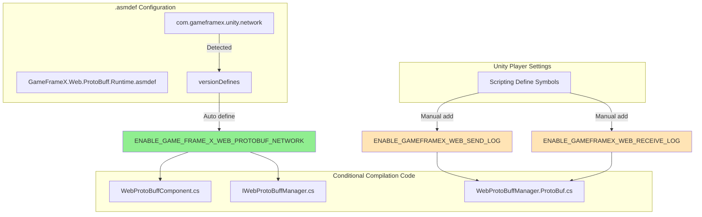

# Compile Defines

Compile defines are important mechanisms for controlling code compilation behavior through preprocessor directives. This document provides detailed description of all compile defines used in the Web ProtoBuff component and their configuration methods.

## Overview

The Web ProtoBuff component uses compile defines to control the enabling and disabling of functionality modules. This design has the following advantages:

- **Conditional Compilation**: Enable or disable specific functions based on different compilation environments
- **Dependency Management**: Automatically manage functionality dependencies through versionDefines
- **Debug Support**: Provide independent debug log switches that do not affect release builds

## Compile Defines Details

### ENABLE_GAME_FRAME_X_WEB_PROTOBUF_NETWORK

**Function Description**

This is the core compile define of the Web ProtoBuff component, used to control the availability of Protocol Buffer network request functionality. When this define is enabled, the component exposes the `Post<T>` method, allowing developers to send and receive Protocol Buffer format messages.

> This define is automatically managed through versionDefines in the `Runtime/GameFrameX.Web.ProtoBuff.Runtime.asmdef` file:
> Source: [GameFrameX.Web.ProtoBuff.Runtime.asmdef](https://github.com/GameFrameX/com.gameframex.unity.web.protobuff/blob/main/Runtime/GameFrameX.Web.ProtoBuff.Runtime.asmdef#L17-L22)

**Dependency Condition**

This define's enabling depends on the existence of the `com.gameframex.unity.network` package. When the project references the GameFrameX Network runtime package, the asmdef automatically defines this macro:

```json
"versionDefines": [
    {
      "name": "com.gameframex.unity.network",
      "expression": "",
      "define": "ENABLE_GAME_FRAME_X_WEB_PROTOBUF_NETWORK"
    }
]
```

**Affected Code**

The following code snippet shows how conditional compilation is used:

```csharp
// WebProtoBuffComponent.cs
#if ENABLE_GAME_FRAME_X_WEB_PROTOBUF_NETWORK
        /// <summary>
        /// Send Post request for sending and receiving Protocol Buffer messages.
        /// This method is only available when ENABLE_GAME_FRAME_X_WEB_PROTOBUF_NETWORK is defined.
        /// </summary>
        public Task<T> Post<T>(string url, GameFrameX.Network.Runtime.MessageObject message)
            where T : GameFrameX.Network.Runtime.MessageObject, GameFrameX.Network.Runtime.IResponseMessage
        {
            return m_WebProtoBuffManager.Post<T>(url, message);
        }
#endif
```
> Source: [WebProtoBuffComponent.cs](https://github.com/GameFrameX/com.gameframex.unity.web.protobuff/blob/main/Runtime/Web/WebProtoBuffComponent.cs#L92-L109)

```csharp
// IWebProtoBuffManager.cs
#if ENABLE_GAME_FRAME_X_WEB_PROTOBUF_NETWORK
        /// <summary>
        /// Send Protobuf message Post request and receive specified type response
        /// </summary>
        Task<T> Post<T>(string url, GameFrameX.Network.Runtime.MessageObject message)
            where T : GameFrameX.Network.Runtime.MessageObject, GameFrameX.Network.Runtime.IResponseMessage;
#endif
```
> Source: [IWebProtoBuffManager.cs](https://github.com/GameFrameX/com.gameframex.unity.web.protobuff/blob/main/Runtime/Web/IWebProtoBuffManager.cs#L11-L24)

### ENABLE_GAMEFRAMEX_WEB_RECEIVE_LOG

**Function Description**

Debug log macro, used to output received Protocol Buffer message logs at runtime. When enabled, the component automatically logs message ID, unique identifier, type name, and message content when receiving server responses.

**Usage Method**

Add this define in Unity's **Player Settings** → **Scripting Define Symbols** to enable receive logging:

```
ENABLE_GAMEFRAMEX_WEB_RECEIVE_LOG
```

**Code Implementation**

```csharp
private void DebugReceiveLog(MessageObject messageObject)
{
#if ENABLE_GAMEFRAMEX_WEB_RECEIVE_LOG
            var messageId = ProtoMessageIdHandler.GetReqMessageIdByType(messageObject.GetType());
            Log.Debug($"Receiving message ID:[{messageId},{messageObject.UniqueId},{messageObject.GetType().Name}] Content:{GameFrameX.Runtime.Utility.Json.ToJson(messageObject)}");
#endif
}
```
> Source: [WebProtoBuffManager.ProtoBuf.cs](https://github.com/GameFrameX/com.gameframex.unity.web.protobuff/blob/main/Runtime/Web/WebProtoBuffManager.ProtoBuf.cs#L227-L233)

### ENABLE_GAMEFRAMEX_WEB_SEND_LOG

**Function Description**

Debug log macro, used to output sent Protocol Buffer message logs at runtime. When enabled, the component automatically logs message ID, unique identifier, type name, and message content when sending requests.

**Usage Method**

Add this define in Unity's **Player Settings** → **Scripting Define Symbols** to enable send logging:

```
ENABLE_GAMEFRAMEX_WEB_SEND_LOG
```

**Code Implementation**

```csharp
private void DebugSendLog(MessageObject messageObject)
{
#if ENABLE_GAMEFRAMEX_WEB_SEND_LOG
            var messageId = ProtoMessageIdHandler.GetReqMessageIdByType(messageObject.GetType());
            Log.Debug($"Sending message ID:[{messageId},{messageObject.UniqueId},{messageObject.GetType().Name}] Content:{GameFrameX.Runtime.Utility.Json.ToJson(messageObject)}");
#endif
}
```
> Source: [WebProtoBuffManager.ProtoBuf.cs](https://github.com/GameFrameX/com.gameframex.unity.web.protobuff/blob/main/Runtime/Web/WebProtoBuffManager.ProtoBuf.cs#L235-L241)

## Compile Defines Architecture

The following Mermaid diagram shows the relationship between compile defines and code modules:



## Configuration Guide

### Auto-managed Defines

The core functionality define `ENABLE_GAME_FRAME_X_WEB_PROTOBUF_NETWORK` is automatically managed by asmdef. You only need to ensure the `com.gameframex.unity.network` package is correctly installed in the project.

Installation steps:
1. Add to `dependencies` in `manifest.json`:
   ```json
   "com.gameframex.unity.network": "https://github.com/GameFrameX/com.gameframex.unity.network.git"
   ```
2. Wait for Unity Package Manager to complete installation
3. Build project, the define takes effect automatically

### Manual Add Defines

For debug log defines, manual configuration in Unity is required:

1. Open Unity Editor
2. Menu bar select **Edit** → **Project Settings** → **Player**
3. In **Player Settings** window, select **Other Settings** tab
4. Find **Scripting Define Symbols** field
5. Add desired defines (multiple defines separated by semicolons)

```text
ENABLE_GAMEFRAMEX_WEB_SEND_LOG;ENABLE_GAMEFRAMEX_WEB_RECEIVE_LOG
```

### Recommended Define Configurations

| Build Type | Recommended Defines |
|------------|---------------------|
| Development Debug | `ENABLE_GAMEFRAMEX_WEB_SEND_LOG;ENABLE_GAMEFRAMEX_WEB_RECEIVE_LOG` |
| Test Release | (Core defines only, auto-managed by asmdef) |
| Production Release | (No additional defines) |

## Compile Defines Summary Table

| Define Name | Scope | Management Method | Purpose |
|-------------|-------|-------------------|---------|
| `ENABLE_GAME_FRAME_X_WEB_PROTOBUF_NETWORK` | Core functionality | asmdef auto-management | Enable Protocol Buffer network request functionality |
| `ENABLE_GAMEFRAMEX_WEB_SEND_LOG` | Debug functionality | Manual configuration | Enable send message logs |
| `ENABLE_GAMEFRAMEX_WEB_RECEIVE_LOG` | Debug functionality | Manual configuration | Enable receive message logs |
| `UNITY_WEBGL` | Platform-specific | Unity auto-definition | WebGL platform-specific code |

## Frequently Asked Questions

### Q: Code not taking effect after adding define?

**Solution**:
1. Ensure defines are added under the correct platform (Platform)
2. After adding, need to recompile project (menu: **Build Settings** → **Build** or **Compile**)
3. Check for nested `#if` conditions that may be blocked by outer conditions

### Q: Debug logs not outputting?

**Solution**:
1. Confirm `ENABLE_GAMEFRAMEX_WEB_SEND_LOG` or `ENABLE_GAMEFRAMEX_WEB_RECEIVE_LOG` are correctly added in Player Settings
2. Check Unity log level settings to ensure Debug logs are visible
3. Confirm network requests are actually being sent/received

### Q: `Post<T>` method unavailable?

**Solution**:
1. Confirm `com.gameframex.unity.network` package is correctly installed
2. Check if `ENABLE_GAME_FRAME_X_WEB_PROTOBUF_NETWORK` define is enabled
3. Ensure WebProtoBuffComponent is correctly added to scene

## Related Links

- [Component Config](./6-configuration.component-config)
- [Platform Info](./7-platforms.platform-info)
- [Introduction](./1-overview.introduction)
- [Quick Start](./3-getting-started.quick-start)