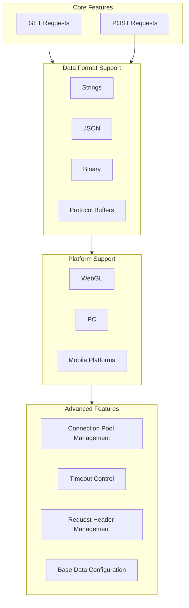
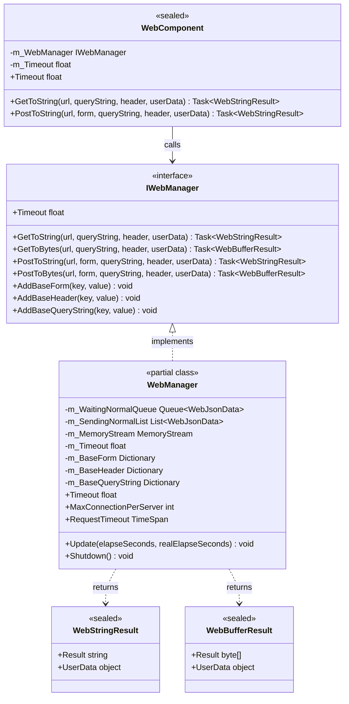
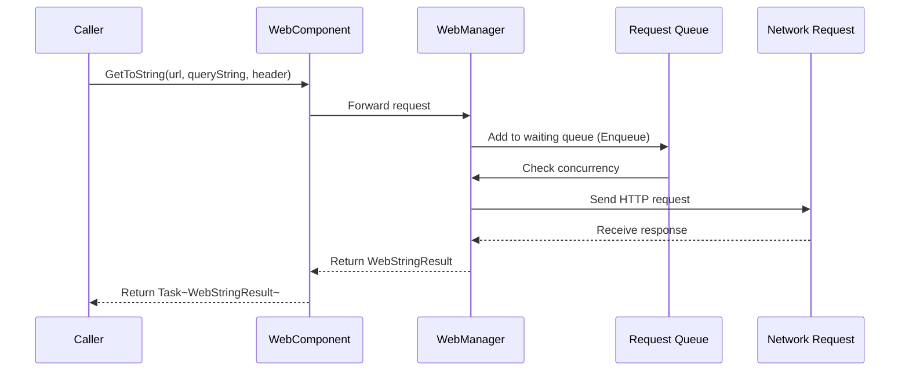

# Plugin Introduction

The GameFrameX Web component is a high-performance Unity HTTP network request library that provides concise and easy-to-use APIs for handling various network request scenarios. It supports GET and POST requests and can handle multiple formats including strings, JSON, and binary data.

## Overview

GameFrameX Web is the network function module in the GameFrameX game framework ecosystem, designed for Unity game developers. This plugin provides a complete HTTP client solution to help developers quickly implement client-server communication requirements.

As one of the core components of the GameFrameX framework, the Web component works closely with other modules (such as Network, Data, Procedure, etc.) to build a complete game backend communication system. Whether it's simple data fetching or complex binary file uploads, the Web component provides stable and efficient network request services.

### Design Goals

The GameFrameX Web component follows these core design principles:

1. **Simple and Easy to Use**: Provides clear API interfaces, developers don't need to care about underlying implementation details
2. **High Performance**: Based on C# Task async pattern, fully utilizing multi-threading advantages
3. **Cross-platform**: Unified interface adapting to different runtime platforms (WebGL, PC, mobile)
4. **Extensible**: Modular design, supports custom data serialization and request processing

## Core Features

The GameFrameX Web component provides rich functionality to meet various network request scenarios:



### Async Processing

Based on modern C# async programming pattern (async/await), developers can write clean and concise async code, avoiding traditional callback hell issues:

```csharp
// Async fetch string data
string result = await webManager.GetToString("https://api.example.com/data");
Debug.Log("Response: " + result);
```

> Source: [README.md](https://github.com/GameFrameX/com.gameframex.unity.web/blob/main/README.md#L66-L68)

### Multi Data Format Support

Supports request and response processing for multiple data formats:

- **String Format**: Suitable for simple text data exchange
- **JSON Format**: Widely used for frontend-backend data interaction, auto serialization/deserialization
- **Binary Format**: Suitable for file downloads, image loading, etc.
- **Protocol Buffers**: Efficient binary serialization, suitable for high-performance scenarios

### Connection Pool Management

Built-in intelligent connection reuse mechanism, through `MaxConnectionPerServer` property to control the maximum concurrent connections per server, avoiding server pressure or performance issues from too many connections. Default is 8 concurrent connections.

## Architecture Design

The GameFrameX Web component uses layered architecture design to ensure code modularity and maintainability:



### Core Component Description

| Component | Type | Responsibility |
|-----------|------|----------------|
| **IWebManager** | Interface | Defines abstract interface for Web requests, unified management of all HTTP request operations |
| **WebManager** | Class | Core implementation class, inherits `GameFrameworkModule`, implements complete request logic |
| **WebComponent** | Unity Component | Unity component wrapper for `IWebManager`, convenient for use on scene objects |
| **WebStringResult** | Result Class | Encapsulates string type request result |
| **WebBufferResult** | Result Class | Encapsulates byte array type request result |

### Request Processing Flow



## Platform Support

The GameFrameX Web component provides differentiated implementations for different Unity platforms to ensure normal operation in various runtime environments:

| Platform | Implementation | Special Notes |
|----------|----------------|--------------|
| **WebGL** | UnityWebRequest | No multi-threading support, all requests processed on main thread |
| **PC** | HttpWebRequest | Uses .NET native network library |
| **Android** | HttpWebRequest | Uses .NET native network library |
| **iOS** | HttpWebRequest | Uses .NET native network library |

### Platform Difference Handling

The component internally uses conditional compilation `#if UNITY_WEBGL` to automatically select the appropriate network implementation:

```csharp
#if UNITY_WEBGL
using UnityEngine.Networking;
// WebGL platform uses UnityWebRequest
UnityWebRequest unityWebRequest = UnityWebRequest.Get(webJsonData.URL);
#else
// Other platforms use HttpWebRequest
HttpWebRequest request = WebRequest.CreateHttp(webJsonData.URL);
#endif
```

> Source: [WebManager.cs](https://github.com/GameFrameX/com.gameframex.unity.web/blob/main/Runtime/Web/WebManager.cs#L213-L260)

## Quick Start

### Installation

Install via Git URL (recommended):

1. Open Package Manager in Unity Editor
2. Click "+" button and select "Add package from git URL"
3. Enter the following URL:
   ```
   https://github.com/gameframex/com.gameframex.unity.web.git
   ```

### Basic Usage

```csharp
using GameFrameX.Web.Runtime;
using System.Threading.Tasks;
using System.Collections.Generic;

public class WebExample : MonoBehaviour
{
    private IWebManager webManager;

    private async void Start()
    {
        // Get Web manager instance
        webManager = GameFrameworkEntry.GetModule<IWebManager>();

        // Send GET request to get string
        string result = await webManager.GetToString("https://api.example.com/data");
        Debug.Log("GET Response: " + result);

        // Send POST request with form data
        var formData = new Dictionary<string, string>
        {
            { "username", "testuser" },
            { "password", "testpass" }
        };

        string postResult = await webManager.PostToString("https://api.example.com/login", formData);
        Debug.Log("POST Response: " + postResult);
    }
}
```

> Source: [README.md](https://github.com/GameFrameX/com.gameframex.unity.web/blob/main/README.md#L52-L81)

### Using WebComponent

Using `WebComponent` is recommended, it's a Unity component that can be directly added to game objects:

```csharp
using GameFrameX.Web.Runtime;
using System.Threading.Tasks;
using System.Collections.Generic;

public class MyWebService : MonoBehaviour
{
    private WebComponent webComponent;

    private void Awake()
    {
        // Get or add WebComponent
        webComponent = gameObject.GetOrOrAddComponent<WebComponent>();
    }

    public async Task<string> GetUserDataAsync(string userId)
    {
        var queryParams = new Dictionary<string, string>
        {
            { "userId", userId }
        };

        var headers = new Dictionary<string, string>
        {
            { "Authorization", "Bearer your-token-here" }
        };

        return await webComponent.GetToString(
            "https://api.example.com/users",
            queryParams,
            headers
        );
    }
}
```

> Source: [README.md](https://github.com/GameFrameX/com.gameframex.unity.web/blob/main/README.md#L90-L123)

## Configuration Options

The GameFrameX Web component provides multiple configuration options:

| Config Item | Type | Default | Description |
|-------------|------|---------|-------------|
| `Timeout` | float | 5.0 seconds | Request timeout |
| `MaxConnectionPerServer` | int | 8 | Max concurrent connections per server |
| `RequestTimeout` | TimeSpan | 5 seconds | Request timeout (TimeSpan type) |

### Code Configuration Example

```csharp
private void ConfigureWebManager()
{
    var webManager = GameFrameworkEntry.GetModule<IWebManager>();

    // Set request timeout to 60 seconds
    webManager.Timeout = 60f;

    // Set max concurrent connections to 16
    webManager.MaxConnectionPerServer = 16;
}
```

> Source: [README.md](https://github.com/GameFrameX/com.gameframex.unity.web/blob/main/README.md#L292-L306)

## Version Info

- **Current Version**: 1.3.3
- **Unity Version Required**: 2019.4+
- **License**: MIT / Apache License 2.0 dual license

## Related Links

- [Installation](./02.installation)
- [Getting Started](./03.getting-started)
- [Using WebComponent](./08.web-component)
- [WebManager Architecture](./05.web-manager)
- [Result Types](./06.result-types)
- [IWebManager Interface](./04.iwebmanager-interface)
- [WebComponent](./08.web-component)
- [Timeout Settings](./10.timeout-settings)
- [Base Data](./07.base-data)
- [Platform Differences](./09.platform-differences)
- [Troubleshooting](./11.troubleshooting)