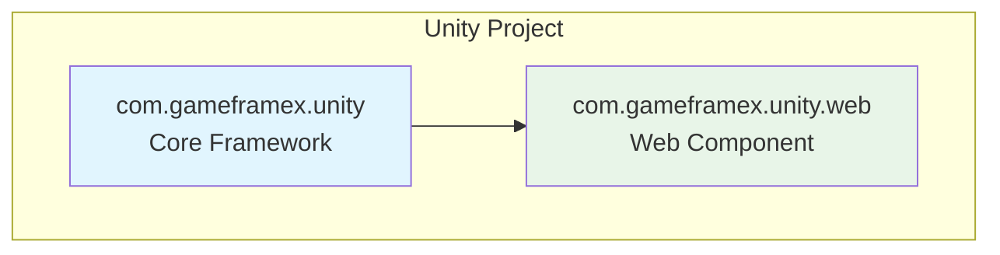
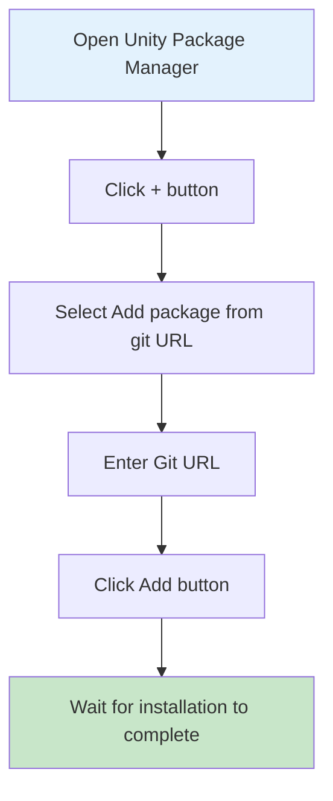
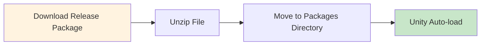

# Installation Methods

The GameFrameX Web component supports multiple installation methods to accommodate different project requirements and workflows. This document provides detailed introduction to three recommended installation methods.

## Overview

GameFrameX Web is a high-performance Unity HTTP network request library built on C# Task async pattern, supporting GET and POST requests, and can handle multiple formats including strings, JSON, and binary data. This component depends on the GameFrameX core framework (com.gameframex.unity), so ensure the project is correctly configured with the core framework during installation.



## Pre-installation Preparation

Before installing the GameFrameX Web component, ensure your development environment meets the following requirements:

| Requirement | Minimum Version | Description |
|-------------|-----------------|-------------|
| Unity Editor | 2019.4+ | LTS version recommended |
| .NET Standard | 2.0+ | Script Runtime Version |
| Git | Any version | Used for cloning or adding Git URL |

> **Tip**: Using Unity 2020.3 LTS or higher is recommended for best compatibility.

## Installation Methods

### Method 1: Install via Git URL (Recommended)

This is the most recommended installation method, making it easy to get the latest version and updates.

**Steps:**

1. Open **Package Manager** window in Unity Editor
2. Click the **"+"** button in the top left corner
3. Select **"Add package from git URL..."** from the dropdown menu
4. Paste the following URL in the input field:
   ```
   https://github.com/gameframex/com.gameframex.unity.web.git
   ```
5. Click **"Add"** button and wait for installation to complete



> **Source**: [README.md](https://github.com/GameFrameX/com.gameframex.unity.web/blob/main/README.md#L20-L27)

**Advantages:**
- Auto-tracking upstream updates
- Simple and quick, one-click installation
- Convenient for version management

### Method 2: Install via manifest.json

Suitable for scenarios requiring precise control over dependency versions or needing to install multiple GameFrameX components simultaneously.

**Steps:**

1. Find and open the `Packages/manifest.json` file in your project
2. Add the following content under the `dependencies` node:

```json
{
  "dependencies": {
    "com.gameframex.unity.web": "https://github.com/gameframex/com.gameframex.unity.web.git",
    "com.gameframex.unity": "https://github.com/gameframex/com.gameframex.unity.git"
  }
}
```

> **Source**: [README.md](https://github.com/GameFrameX/com.gameframex.unity.web/blob/main/README.md#L29-L40)

**Note:**
- Must add `com.gameframex.unity` as a core dependency at the same time
- You can specify a specific version number, for example: `"com.gameframex.unity.web": "1.3.0"`
- After modifying manifest.json, Unity will automatically resolve and install dependencies

**Version Format Description:**

| Version Format | Example | Description |
|---------------|---------|-------------|
| Latest major version | `1.3.3` | Exact version |
| Git URL | `https://github.com/...git` | Always get latest |
| Branch | `#develop` | Get specified branch |

### Method 3: Manual Installation

Suitable for scenarios where network access is unavailable or offline use is required.

**Steps:**

1. Access GitHub releases page to download the latest version release package:
   - [Releases page](https://github.com/GameFrameX/com.gameframex.unity.web/releases)
2. Unzip the downloaded release package
3. Move the unzipped folder to the `Packages` directory of your project
4. Unity will automatically recognize and load the package



> **Source**: [README.md](https://github.com/GameFrameX/com.gameframex.unity.web/blob/main/README.md#L42-L46)

**Notes:**
- Manually installed packages will not receive automatic updates
- Need to manually download new version and replace
- Ensure folder name matches package name (com.gameframex.unity.web)

## Post-Installation Verification

After installation, you can verify success through the following methods:

### Check Package Manager

Open **Window > Package Manager** in Unity, confirm `GameFrameX Web` appears in the list with status **"In Project"**.

### Check Assembly References

Create a simple test script to confirm namespace can be referenced normally:

```csharp
using GameFrameX.Web.Runtime;

public class VerifyInstall : MonoBehaviour
{
    private IWebManager webManager;

    void Start()
    {
        // Try to get Web manager instance
        webManager = GameFrameworkEntry.GetModule<IWebManager>();

        if (webManager != null)
        {
            Debug.Log("GameFrameX Web installed successfully!");
        }
    }
}
```

### Check Dependencies

Confirm the following dependencies are correctly installed:

| Dependency Package | Required | Description |
|-------------------|----------|-------------|
| com.gameframex.unity | Required | Core framework |
| GameFrameX.Network.Runtime | Required | Network foundation library |
| ProtoBuffer.Runtime | Required | Protobuf support |

## Uninstallation Methods

To uninstall the GameFrameX Web component, choose the corresponding uninstallation method based on your installation method:

### Uninstall via Package Manager

1. Open **Window > Package Manager**
2. Find **Game Frame X Web** in the list
3. Click the **"Remove"** button on the right

### Uninstall via manifest.json

Remove the corresponding line from `dependencies` in `Packages/manifest.json`:

```json
{
  "dependencies": {
    "com.gameframex.unity.web": "https://github.com/gameframex/com.gameframex.unity.web.git"
    // Remove the line above
  }
}
```

### Manual Uninstall

Simply delete the `Packages/com.gameframex.unity.web` folder.

## Common Issues

### Q1: What to do if dependencies are missing after installation?

This is because the core framework is not correctly installed. Please install `com.gameframex.unity` first:

```
https://github.com/gameframex/com.gameframex.unity.git
```

### Q2: How to solve Git URL installation failure?

1. Check if network connection is normal
2. Try using proxy or VPN
3. Confirm Git is correctly installed and in system PATH

### Q3: How to install a specific version?

Specify version number in manifest.json:

```json
{
  "dependencies": {
    "com.gameframex.unity.web": "1.3.3"
  }
}
```

## Related Links

- [Introduction](./01.overview)
- [Getting Started - Basic Usage](./03.getting-started)
- [Getting Started - Using WebComponent](./08.web-component)
- [GitHub Repository](https://github.com/GameFrameX/com.gameframex.unity.web.git)
- [Official Documentation](https://gameframex.doc.alianblank.com)
- [Issue Feedback](https://github.com/GameFrameX/com.gameframex.unity.web/issues)