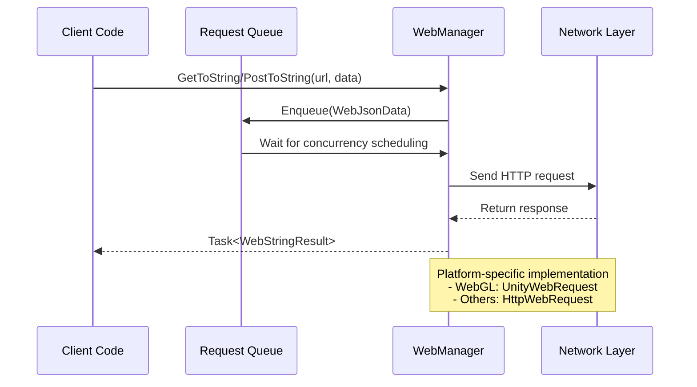

# Getting Started

This document introduces the basic usage of the GameFrameX Web component to help developers quickly get started with HTTP network request development.

## Overview

The GameFrameX Web component provides simple and easy-to-use HTTP request functionality, supporting GET and POST requests, and can handle multiple formats including strings, JSON, and binary data. The component is developed based on C# Task async pattern, supports async/await syntax, and provides high-performance non-blocking request processing.

Before getting started, ensure the Web component is correctly installed and configured. For details, see [Installation](./02.installation).

## Getting WebManager Instance

The first step in using the Web component is to get an `IWebManager` instance. There are two main ways to get it:

### Method 1: Get via GameFrameworkEntry (Recommended)

Get the Web manager instance through the GameFramework framework entry point, which is the most common method:

```csharp
using GameFrameX.Web.Runtime;
using GameFrameX.Runtime;
using System.Threading.Tasks;

public class WebExample : MonoBehaviour
{
    private IWebManager webManager;

    private async void Start()
    {
        // Get Web manager instance
        webManager = GameFrameworkEntry.GetModule<IWebManager>();

        // Send GET request
        var result = await webManager.GetToString("https://api.example.com/data");
        Debug.Log("Response: " + result.Result);
    }
}
```

> Source: [README.md](https://github.com/GameFrameX/com.gameframex.unity.web/blob/main/README.md#L52-L81)

### Method 2: Get via WebComponent

Create a WebComponent in Unity scene, use through component:

```csharp
using GameFrameX.Web.Runtime;
using System.Threading.Tasks;
using System.Collections.Generic;

public class MyWebService : MonoBehaviour
{
    private WebComponent webComponent;

    private void Awake()
    {
        // Get or add WebComponent
        webComponent = gameObject.GetOrAddComponent<WebComponent>();
    }

    public async Task<string> GetUserDataAsync(string userId)
    {
        var queryParams = new Dictionary<string, string>
        {
            { "userId", userId }
        };

        var headers = new Dictionary<string, string>
        {
            { "Authorization", "Bearer your-token-here" }
        };

        var result = await webComponent.GetToString(
            "https://api.example.com/users",
            queryParams,
            headers
        );

        return result.Result;
    }
}
```

> Source: [README.md](https://github.com/GameFrameX/com.gameframex.unity.web/blob/main/README.md#L83-L123)

## Sending GET Requests

GET requests are used to fetch data from the server. WebManager provides multiple overload methods to meet different scenario needs.

### Simple GET Request

The most basic GET request, only need to provide URL:

```csharp
// Get string response
var stringResult = await webManager.GetToString("https://api.example.com/data");
Debug.Log("Response: " + stringResult.Result);

// Get byte array response (suitable for downloading images, files, and other binary data)
var bufferResult = await webManager.GetToBytes("https://api.example.com/image.png");
byte[] imageData = bufferResult.Result;
```

> Source: [IWebManager.cs](https://github.com/GameFrameX/com.gameframex.unity.web/blob/main/Runtime/Web/IWebManager.cs#L18-L26)

### GET Request with Query Parameters

Pass URL query parameters through Dictionary:

```csharp
var queryParams = new Dictionary<string, string>
{
    { "page", "1" },
    { "pageSize", "20" },
    { "category", "book" }
};

var result = await webManager.GetToString(
    "https://api.example.com/products",
    queryParams
);
```

> Source: [IWebManager.cs](https://github.com/GameFrameX/com.gameframex.unity.web/blob/main/Runtime/Web/IWebManager.cs#L35-L45)

### GET Request with Headers

Used when authentication or special header information is required:

```csharp
var queryParams = new Dictionary<string, string>
{
    { "id", "12345" }
};

var headers = new Dictionary<string, string>
{
    { "Authorization", "Bearer your-access-token" },
    { "Accept", "application/json" },
    { "Language", "en-US" }
};

var result = await webManager.GetToString(
    "https://api.example.com/user/profile",
    queryParams,
    headers
);
```

> Source: [IWebManager.cs](https://github.com/GameFrameX/com.gameframex.unity.web/blob/main/Runtime/Web/IWebManager.cs#L56-L67)

## Sending POST Requests

POST requests are used to submit data to the server, supporting form data and JSON format.

### Simple POST Request

The most basic POST form request:

```csharp
var formData = new Dictionary<string, object>
{
    { "username", "testuser" },
    { "password", "testpass" }
};

var result = await webManager.PostToString(
    "https://api.example.com/login",
    formData
);

Debug.Log("Login result: " + result.Result);
```

> Source: [IWebManager.cs](https://github.com/GameFrameX/com.gameframex.unity.web/blob/main/Runtime/Web/IWebManager.cs#L77-L87)

### POST Request with Query Parameters

Use URL query parameters and form data simultaneously:

```csharp
var formData = new Dictionary<string, object>
{
    { "title", "My Article" },
    { "content", "Article content here..." },
    { "author", "John Doe" }
};

var queryParams = new Dictionary<string, string>
{
    { "draft", "true" }  // URL query parameter
};

var result = await webManager.PostToString(
    "https://api.example.com/articles",
    formData,
    queryParams
);
```

> Source: [IWebManager.cs](https://github.com/GameFrameX/com.gameframex.unity.web/blob/main/Runtime/Web/IWebManager.cs#L87-L97)

### POST Request with Headers

Send POST request with complete header information:

```csharp
var formData = new Dictionary<string, object>
{
    { "data", "some value" }
};

var queryParams = new Dictionary<string, string>
{
    { "action", "update" }
};

var headers = new Dictionary<string, string>
{
    { "Authorization", "Bearer your-token" },
    { "Content-Type", "application/json" },
    { "X-Request-ID", Guid.NewGuid().ToString() }
};

var result = await webManager.PostToString(
    "https://api.example.com/data",
    formData,
    queryParams,
    headers
);
```

> Source: [IWebManager.cs](https://github.com/GameFrameX/com.gameframex.unity.web/blob/main/Runtime/Web/IWebManager.cs#L98)

### Binary Data Upload

Upload byte array (such as files, binary streams):

```csharp
public async Task UploadBinaryDataAsync(byte[] fileData, string fileName)
{
    var queryParams = new Dictionary<string, string>
    {
        { "fileName", fileName }
    };

    var headers = new Dictionary<string, string>
    {
        { "Content-Type", "application/octet-stream" },
        { "Authorization", "Bearer your-token" }
    };

    var result = await webManager.PostToBytes(
        "https://api.example.com/upload",
        fileData,
        queryParams,
        headers
    );

    if (result.Result != null && result.Result.Length > 0)
    {
        Debug.Log("Upload successful!");
    }
}
```

> Source: [README.md](https://github.com/GameFrameX/com.gameframex.unity.web/blob/main/README.md#L188-L217)

## Handling Request Results

WebManager's request methods return two result types: `WebStringResult` and `WebBufferResult`.

### WebStringResult (String Result)

Used for processing text responses, such as JSON strings, HTML, etc.:

```csharp
var result = await webManager.GetToString("https://api.example.com/data");

// Get response content
string responseText = result.Result;

// Get custom data passed during request
object userData = result.UserData;

// Output result
Debug.Log($"Response: {result}");
```

> Source: [WebStringResult.cs](https://github.com/GameFrameX/com.gameframex.unity.web/blob/main/Runtime/Web/WebStringResult.cs#L15-L38)

### WebBufferResult (Byte Array Result)

Used for processing binary responses, such as images, audio, files, etc.:

```csharp
var result = await webManager.GetToBytes("https://api.example.com/image.png");

// Get binary data
byte[] data = result.Result;

// Get custom data passed during request
object userData = result.UserData;

// Check if data exists
if (data != null && data.Length > 0)
{
    Debug.Log($"Downloaded {data.Length} bytes");
}
```

> Source: [WebBufferResult.cs](https://github.com/GameFrameX/com.gameframex.unity.web/blob/main/Runtime/Web/WebBufferResult.cs#L1-L21)

### Using UserData to Pass Context

Pass custom data when initiating request, can be retrieved in result to identify request source or pass context:

```csharp
// Pass context data when initiating request
var requestContext = new { requestId = Guid.NewGuid(), source = "ProfileScreen" };

var result = await webManager.GetToString(
    "https://api.example.com/user/123",
    requestContext  // Pass custom data
);

// Get context in result handling
Debug.Log($"Request ID: {result.UserData}");
```

## Error Handling

Complete error handling is an important part of network request development. WebManager throws different exception types to indicate error types.

### Basic Error Handling

```csharp
public async Task<string> SafeWebRequestAsync(string url)
{
    try
    {
        var result = await webManager.GetToString(url);
        return result.Result;
    }
    catch (Exception ex)
    {
        Debug.LogError($"Request failed: {ex.Message}");
        return null;
    }
}
```

### Handling Specific Exception Types

```csharp
public async Task<string> HandleErrorsAsync(string url)
{
    try
    {
        return await webManager.GetToString(url);
    }
    catch (TimeoutException ex)
    {
        // Request timeout
        Debug.LogError($"Request timeout: {ex.Message}");
        return null;
    }
    catch (WebException ex)
    {
        switch (ex.Status)
        {
            case WebExceptionStatus.Timeout:
                Debug.LogError("Request timeout");
                break;
            case WebExceptionStatus.ConnectFailure:
                Debug.LogError("Connection failed");
                break;
            case WebExceptionStatus.ProtocolError:
                Debug.LogError($"Protocol error: {ex.Message}");
                break;
            default:
                Debug.LogError($"Network error: {ex.Message}");
                break;
        }
        return null;
    }
    catch (IOException ex)
    {
        Debug.LogError($"IO error: {ex.Message}");
        return null;
    }
    catch (Exception ex)
    {
        Debug.LogError($"Unknown error: {ex.Message}");
        return null;
    }
}
```

> Source: [WebManager.cs](https://github.com/GameFrameX/com.gameframex.unity.web/blob/main/Runtime/Web/WebManager.cs#L298-L324)

### Using UnityWebRequest Errors (WebGL Platform)

On WebGL platform, errors are returned through UnityWebRequest:

```csharp
// WebGL platform error handling example
// UnityWebRequest returns isNetworkError or isHttpError
```

> Source: [WebManager.cs](https://github.com/GameFrameX/com.gameframex.unity.web/blob/main/Runtime/Web/WebManager.cs#L246-L252)

## Base Data Management

WebManager supports setting base data (Base Data), which is automatically added to all requests, suitable for scenarios requiring unified authentication information, version numbers, etc.

### Adding Base Form Data

```csharp
// Add base form data, all POST requests will automatically carry this data
webManager.AddBaseForm("appVersion", "1.0.0");
webManager.AddBaseForm("platform", "iOS");

// When sending request, base form data is automatically merged
var formData = new Dictionary<string, object>
{
    { "username", "testuser" }
};

// Actual sent form will be: { "appVersion": "1.0.0", "platform": "iOS", "username": "testuser" }
var result = await webManager.PostToString("https://api.example.com/login", formData);
```

> Source: [WebManager.cs](https://github.com/GameFrameX/com.gameframex.unity.web/blob/main/Runtime/Web/WebManager.cs#L591-L594)

### Adding Base Headers

```csharp
// Add base headers
webManager.AddBaseHeader("Authorization", "Bearer your-default-token");
webManager.AddBaseHeader("X-App-ID", "com.example.myapp");
webManager.AddBaseHeader("Accept", "application/json");

// When sending request, base headers are automatically merged into all requests
var result = await webManager.GetToString("https://api.example.com/data");
```

> Source: [WebManager.cs](https://github.com/GameFrameX/com.gameframex.unity.web/blob/main/Runtime/Web/WebManager.cs#L621-L624)

### Adding Base Query Parameters

```csharp
// Add base query parameters
webManager.AddBaseQueryString("lang", "en-US");
webManager.AddBaseQueryString("v", "1.0.0");

// When sending request, base query parameters are automatically appended to URL
var result = await webManager.GetToString("https://api.example.com/products");

// Actual request URL will be: https://api.example.com/products?lang=en-US&v=1.0.0
```

> Source: [WebManager.cs](https://github.com/GameFrameX/com.gameframex.unity.web/blob/main/Runtime/Web/WebManager.cs#L651-L654)

### Managing Base Data

```csharp
// Remove specified base data
webManager.RemoveBaseForm("appVersion");
webManager.RemoveBaseHeader("Authorization");
webManager.RemoveBaseQueryString("lang");

// Clear all base data
webManager.ClearBaseForm();
webManager.ClearBaseHeader();
webManager.ClearBaseQueryString();
```

> Source: [WebManager.cs](https://github.com/GameFrameX/com.gameframex.unity.web/blob/main/Runtime/Web/WebManager.cs#L600-L674)

## Request Flow Overview

WebManager internally uses queue mechanism to manage requests, supporting concurrency control. The following is the basic flow for request processing:



## Related Links

- [Introduction](./01.overview) - Understand Web component overall architecture and features
- [Installation](./02.installation) - Detailed installation steps
- [Using WebComponent](./08.web-component) - Deep dive into WebComponent component
- [WebManager Architecture](./05.web-manager) - Deep understanding of WebManager internal architecture
- [Result Types](./06.result-types) - Detailed result type definitions
- [IWebManager Interface](./04.iwebmanager-interface) - Complete API interface documentation
- [WebComponent](./08.web-component) - WebComponent component detailed documentation
- [Timeout Settings](./10.timeout-settings) - Configure request timeout
- [Base Data](./07.base-data) - Base data management details
- [Platform Differences](./09.platform-differences) - Different platform differences
- [Troubleshooting](./11.troubleshooting) - Common problem solutions