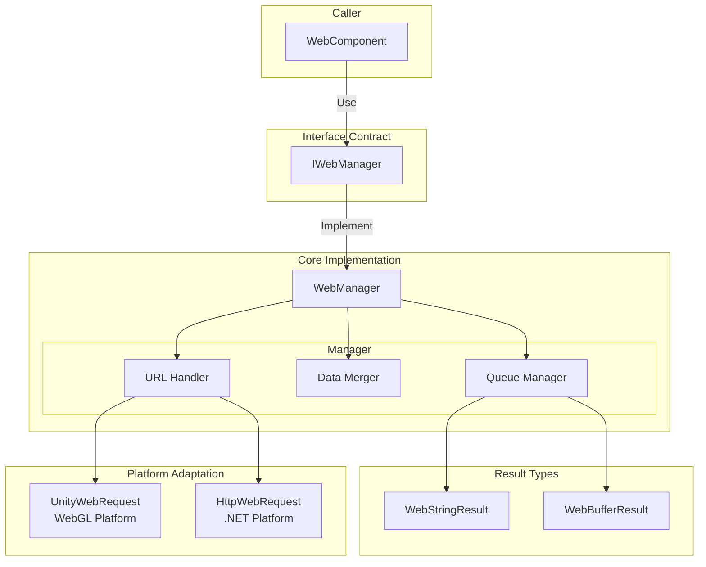
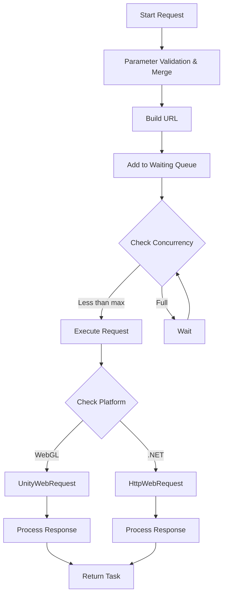

# IWebManager Interface

The IWebManager interface is the core interface of the GameFrameX Web plugin, providing unified HTTP GET and POST request functionality. This interface encapsulates the underlying network request implementation details, supports various request parameter combinations, and provides base data management functionality.

## Overview

The IWebManager interface defines the contract specification for the Web request manager, mainly responsible for:

1. **HTTP Request Handling**: Provides async request support for GET and POST HTTP methods
2. **Response Type Support**: Supports string and byte array response formats
3. **Request Parameter Management**: Supports flexible combinations of query parameters, HTTP headers, and form data
4. **Base Data Reuse**: Provides global base data configuration, automatically merging base data with each request
5. **Timeout Control**: Provides configurable timeout settings

The default implementation of this interface is the `WebManager` class, which inherits from `GameFrameworkModule` and is one of the core modules of the GameFrameX framework.

> **Design Intent**: IWebManager uses a queue-based request management mechanism, implementing request buffering and concurrency control through waiting queues and sending lists. Default max concurrency is 8 connections, adjustable based on server capacity.

## Architecture Design

### Core Component Relationships



### Request Processing Flow



## API Reference

### Request Methods

#### GET Requests

##### `GetToString(url: string, userData?: object): Task<WebStringResult>`

Sends a simple GET request, returns string format response result.

**Parameters:**
- `url` (string): Target URL address
- `userData` (object, optional): User custom data, will be returned as-is in the response result

**Return:** `Task<WebStringResult>` - Async task containing string result

**Example:**
```csharp
var webManager = GameFrameworkEntry.GetModule<IWebManager>();
var result = await webManager.GetToString("https://api.example.com/data");
Debug.Log(result.Result);
```
> Source: [IWebManager.cs](https://github.com/GameFrameX/com.gameframex.unity.web/blob/main/Runtime/Web/IWebManager.cs#L18)

---

##### `GetToString(url: string, queryString: Dictionary<string, string>, userData?: object): Task<WebStringResult>`

Sends GET request with query parameters, returns string format response result.

**Parameters:**
- `url` (string): Target URL address
- `queryString` (Dictionary<string, string>): URL query parameter dictionary
- `userData` (object, optional): User custom data

**Return:** `Task<WebStringResult>`

---

##### `GetToString(url: string, queryString: Dictionary<string, string>, header: Dictionary<string, string>, userData?: object): Task<WebStringResult>`

Sends GET request with query parameters and request headers, returns string format response result.

**Parameters:**
- `url` (string): Target URL address
- `queryString` (Dictionary<string, string>): URL query parameter dictionary
- `header` (Dictionary<string, string>): HTTP header dictionary
- `userData` (object, optional): User custom data

**Return:** `Task<WebStringResult>`

---

##### `GetToBytes(url: string, userData?: object): Task<WebBufferResult>`

Sends simple GET request, returns byte array format response result. Suitable for downloading binary data like images, audio, etc.

**Parameters:**
- `url` (string): Target URL address
- `userData` (object, optional): User custom data

**Return:** `Task<WebBufferResult>` - Async task containing byte array

**Example:**
```csharp
var webManager = GameFrameworkEntry.GetModule<IWebManager>();
var result = await webManager.GetToBytes("https://api.example.com/image.png");
byte[] imageData = result.Result;
```
> Source: [IWebManager.cs](https://github.com/GameFrameX/com.gameframex.unity.web/blob/main/Runtime/Web/IWebManager.cs#L26)

---

##### `GetToBytes(url: string, queryString: Dictionary<string, string>, userData?: object): Task<WebBufferResult>`

Sends GET request with query parameters, returns byte array format response result.

---

##### `GetToBytes(url: string, queryString: Dictionary<string, string>, header: Dictionary<string, string>, userData?: object): Task<WebBufferResult>`

Sends GET request with query parameters and request headers, returns byte array format response result.

---

#### POST Requests

##### `PostToString(url: string, from?: Dictionary<string, object>, userData?: object): Task<WebStringResult>`

Sends simple POST request, returns string format response result. Form data is sent in JSON format.

**Parameters:**
- `url` (string): Target URL address
- `from` (Dictionary<string, object>, optional): Form data dictionary
- `userData` (object, optional): User custom data

**Return:** `Task<WebStringResult>`

**Example:**
```csharp
var webManager = GameFrameworkEntry.GetModule<IWebManager>();
var formData = new Dictionary<string, object>
{
    { "username", "testuser" },
    { "password", "password123" }
};
var result = await webManager.PostToString("https://api.example.com/login", formData);
```
> Source: [IWebManager.cs](https://github.com/GameFrameX/com.gameframex.unity.web/blob/main/Runtime/Web/IWebManager.cs#L77)

---

##### `PostToString(url: string, from: Dictionary<string, object>, queryString: Dictionary<string, string>, userData?: object): Task<WebStringResult>`

Sends POST request with query parameters, returns string format response result.

---

##### `PostToString(url: string, from: Dictionary<string, object>, queryString: Dictionary<string, string>, header: Dictionary<string, string>, userData?: object): Task<WebStringResult>`

Sends POST request with query parameters and request headers, returns string format response result. This is the most complete POST string request overload.

**Parameters:**
- `url` (string): Target URL address
- `from` (Dictionary<string, object>): Form data dictionary
- `queryString` (Dictionary<string, string>): URL query parameter dictionary
- `header` (Dictionary<string, string>): HTTP header dictionary
- `userData` (object, optional): User custom data

**Return:** `Task<WebStringResult>`

---

##### `PostToBytes(url: string, from: Dictionary<string, object>, userData?: object): Task<WebBufferResult>`

Sends simple POST request, returns byte array format response result. Suitable for handling binary data upload/download scenarios.

**Parameters:**
- `url` (string): Target URL address
- `from` (Dictionary<string, object>): Form data dictionary
- `userData` (object, optional): User custom data

**Return:** `Task<WebBufferResult>`

---

##### `PostToBytes(url: string, from: Dictionary<string, object>, queryString: Dictionary<string, string>, userData?: object): Task<WebBufferResult>`

Sends POST request with query parameters, returns byte array format response result.

---

##### `PostToBytes(url: string, from: Dictionary<string, object>, queryString: Dictionary<string, string>, header: Dictionary<string, string>, userData?: object): Task<WebBufferResult>`

Sends POST request with query parameters and request headers, returns byte array format response result.

---

##### `PostToBytes(url: string, from: byte[], queryString: Dictionary<string, string>, header: Dictionary<string, string>, userData?: object): Task<WebBufferResult>`

Sends raw byte array POST request, returns byte array format response result. Suitable for ProtoBuf and other binary protocol communication.

**Parameters:**
- `url` (string): Target URL address
- `from` (byte[]): Raw byte array data to send
- `queryString` (Dictionary<string, string>): URL query parameter dictionary
- `header` (Dictionary<string, string>): HTTP header dictionary
- `userData` (object, optional): User custom data

**Return:** `Task<WebBufferResult>`

> **Design Intent**: This method is specifically designed for sending binary data requests, such as ProtoBuf serialized request bodies, with Content-Type set to `application/octet-stream`.

---

### Configuration Properties

#### `Timeout: float`

Gets or sets request timeout (in seconds).

**Type:** `float`

**Default:** `5.0`

**Example:**
```csharp
var webManager = GameFrameworkEntry.GetModule<IWebManager>();
webManager.Timeout = 10f; // Set timeout to 10 seconds
```
> Source: [IWebManager.cs](https://github.com/GameFrameX/com.gameframex.unity.web/blob/main/Runtime/Web/IWebManager.cs#L144)

---

### Base Data Management

Base data management allows configuring global form data, request headers, and query parameters that are automatically merged with each request. This is very useful for scenarios requiring common data such as authentication tokens and device information.

#### Form Data Management

##### `AddBaseForm(key: string, value: object): void`

Adds base form data, which is automatically merged into the request body for every POST request.

**Parameters:**
- `key` (string): Form key name
- `value` (object): Form value

**Example:**
```csharp
var webManager = GameFrameworkEntry.GetModule<IWebManager>();
// Add global app info
webManager.AddBaseForm("app_version", "1.0.0");
webManager.AddBaseForm("device_id", "ABC123");
```
> Source: [IWebManager.cs](https://github.com/GameFrameX/com.gameframex.unity.web/blob/main/Runtime/Web/IWebManager.cs#L151)

---

##### `RemoveBaseForm(key: string): void`

Removes specified base form data.

---

##### `ClearBaseForm(): void`

Clears all base form data.

---

#### Header Management

##### `AddBaseHeader(key: string, value: string): void`

Adds base header data, which is automatically merged into request headers for every HTTP request.

**Parameters:**
- `key` (string): Header key name
- `value` (string): Header value

**Example:**
```csharp
var webManager = GameFrameworkEntry.GetModule<IWebManager>();
webManager.AddBaseHeader("Authorization", "Bearer token123");
webManager.AddBaseHeader("Accept-Language", "en-US");
```
> Source: [IWebManager.cs](https://github.com/GameFrameX/com.gameframex.unity.web/blob/main/Runtime/Web/IWebManager.cs#L169)

---

##### `RemoveBaseHeader(key: string): void`

Removes specified base header data.

---

##### `ClearBaseHeader(): void`

Clears all base header data.

---

#### Query Parameter Management

##### `AddBaseQueryString(key: string, value: string): void`

Adds base query parameter data, which is automatically appended to each request's URL.

**Parameters:**
- `key` (string): Query parameter key name
- `value` (string): Query parameter value

**Example:**
```csharp
var webManager = GameFrameworkEntry.GetModule<IWebManager>();
webManager.AddBaseQueryString("platform", "android");
webManager.AddBaseQueryString("channel", "official");
```
> Source: [IWebManager.cs](https://github.com/GameFrameX/com.gameframex.unity.web/blob/main/Runtime/Web/IWebManager.cs#L187)

---

##### `RemoveBaseQueryString(key: string): void`

Removes specified base query parameter data.

---

##### `ClearBaseQueryString(): void`

Clears all base query parameter data.

---

## Response Result Types

### WebStringResult

String response result type, used as return value for GetToString and PostToString methods.

**Properties:**
| Property | Type | Description |
|----------|------|-------------|
| Result | string | String content returned from server |
| UserData | object | User custom data passed during request, returned as-is |

**Example:**
```csharp
var result = await webManager.GetToString("https://api.example.com/data");
// Access response content
string content = result.Result;
// Access custom data passed during request
object userData = result.UserData;
```
> Source: [WebStringResult.cs](https://github.com/GameFrameX/com.gameframex.unity.web/blob/main/Runtime/Web/WebStringResult.cs#L1-L39)

---

### WebBufferResult

Byte array response result type, used as return value for GetToBytes and PostToBytes methods.

**Properties:**
| Property | Type | Description |
|----------|------|-------------|
| Result | byte[] | Byte array content returned from server |
| UserData | object | User custom data passed during request |

**Example:**
```csharp
var result = await webManager.GetToBytes("https://api.example.com/file");
// Access response byte array
byte[] data = result.Result;
```
> Source: [WebBufferResult.cs](https://github.com/GameFrameX/com.gameframex.unity.web/blob/main/Runtime/Web/WebBufferResult.cs#L1-L21)

---

## Error Handling

WebManager may throw the following exceptions during requests:

| Exception Type | Trigger Condition |
|---------------|-------------------|
| TimeoutException | Request timeout (WebExceptionStatus.Timeout) |
| WebException | Network error or HTTP error |
| IOException | I/O operation error |
| Exception | Other unknown errors |

**Example - Error Handling:**
```csharp
try
{
    var result = await webManager.GetToString("https://api.example.com/data");
    Debug.Log(result.Result);
}
catch (TimeoutException ex)
{
    Debug.LogError($"Request timeout: {ex.Message}");
}
catch (WebException ex)
{
    Debug.LogError($"Network error: {ex.Message}");
}
catch (Exception ex)
{
    Debug.LogError($"Unknown error: {ex.Message}");
}
```
> Source: [WebManager.cs](https://github.com/GameFrameX/com.gameframex.unity.web/blob/main/Runtime/Web/WebManager.cs#L298-L324)

---

## Platform Differences

The IWebManager interface has different underlying implementations on different platforms:

| Platform | Underlying Implementation | Certificate Handling |
|----------|---------------------------|---------------------|
| WebGL | UnityWebRequest | Default skip certificate verification (DefaultBypassCertificate) |
| Other platforms (.NET) | HttpWebRequest | Uses system default certificate |

> **Note**: On WebGL platform, certificate verification is skipped by default for development and debugging convenience. For production environments requiring certificate verification, please refer to [Platform Differences](./09.platform-differences) documentation.

---

## Related Links

- [WebComponent](./08.web-component) - Unity component wrapper
- [WebManager Architecture](./05.web-manager) - Core architecture details
- [Result Types](./06.result-types) - Result types details
- [Timeout Settings](./10.timeout-settings) - Timeout configuration details
- [Base Data](./07.base-data) - Base data configuration details
- [Platform Differences](./09.platform-differences) - Platform differences details