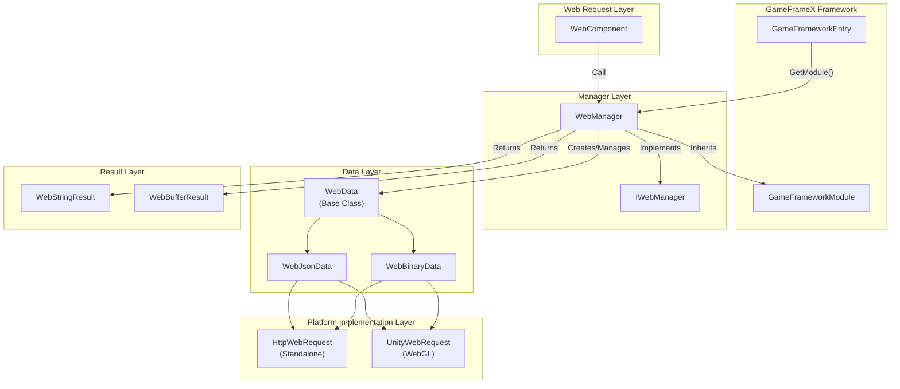
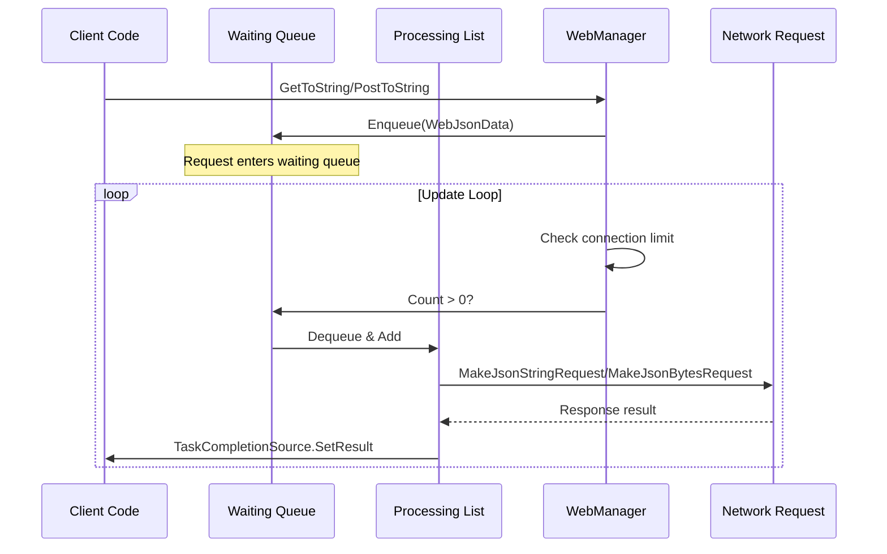
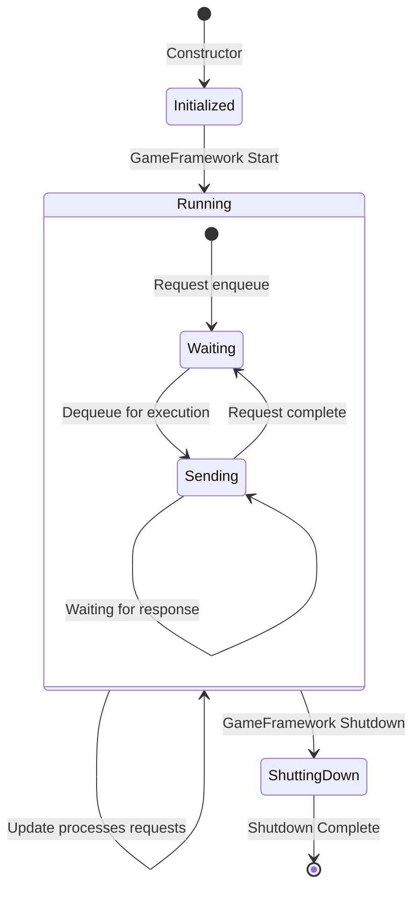
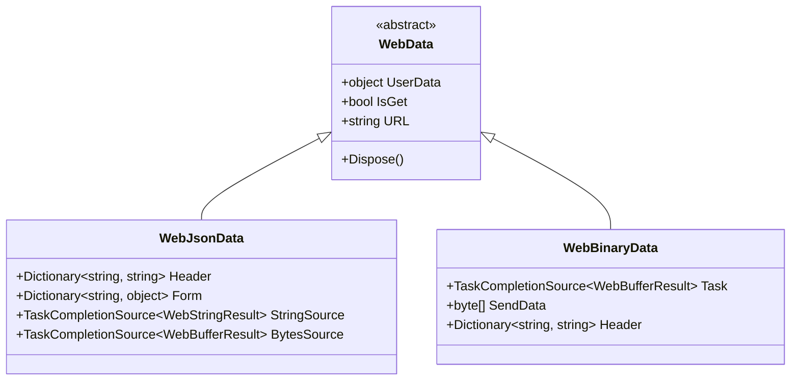

# WebManager Architecture

WebManager is the Web request management module in the GameFrameX framework, responsible for handling all HTTP GET and POST requests. It uses a queue-based request processing mechanism, supports connection limits, and provides cross-platform support (Standalone and WebGL).

## Overview

WebManager, as one of the core modules of the GameFrameX framework, encapsulates the underlying HTTP request implementation and provides a unified network request entry point for game applications. Its design goals include:

- **Unified Interface**: Provides consistent GET/POST request methods
- **Asynchronous Processing**: Based on Task asynchronous programming model
- **Connection Management**: Supports maximum connection limit per server
- **Cross-platform**: Compatible with Standalone and WebGL platforms
- **Base Data**: Supports global request headers, query parameters, and form data

WebManager inherits from `GameFrameworkModule` and is part of the GameFrameX framework lifecycle management, automatically created during game initialization and automatically cleaning up resources during game shutdown.

## Architecture Design

### Overall Architecture Diagram



### Core Components

#### IWebManager Interface

The `IWebManager` interface defines all public methods of the Web request manager, serving as the abstract contract for WebManager. The interface provides multiple overload methods supporting different request scenarios:

> For detailed interface definition, see [IWebManager Interface](./04.iwebmanager-interface)

#### WebManager Implementation Class

`WebManager` is the concrete implementation of the `IWebManager` interface, inheriting from `GameFrameworkModule`. It uses partial class approach to organize code, splitting different functional modules into multiple files:

| File | Responsibility |
|------|----------------|
| WebManager.cs | Main implementation: queue management, request processing, base data merging |
| WebManager.WebData.cs | WebData base class definition |
| WebManager.WebJsonData.cs | JSON request data class |
| WebManager.WebBinary.cs | Binary/ProtoBuf request processing |

```csharp
public partial class WebManager : GameFrameworkModule, IWebManager
{
    // Normal request queue waiting for processing
    private readonly Queue<WebJsonData> m_WaitingNormalQueue = new Queue<WebJsonData>(256);

    // Normal request list currently being processed
    private readonly List<WebJsonData> m_SendingNormalList = new List<WebJsonData>(16);

    // Maximum connections per server
    public int MaxConnectionPerServer { get; set; }
}
```
> Source: [WebManager.cs](https://github.com/GameFrameX/com.gameframex.unity.web/blob/main/Runtime/Web/WebManager.cs#L20-L29)

#### WebComponent

`WebComponent` is a Unity component wrapper that provides the same method signatures as `IWebManager`, but exposes them through a Unity component approach for the game logic layer. It acquires the `WebManager` instance during the `Awake` phase:

```csharp
protected override void Awake()
{
    ImplementationComponentType = Utility.Assembly.GetType(componentType);
    InterfaceComponentType = typeof(IWebManager);
    base.Awake();
    m_WebManager = GameFrameworkEntry.GetModule<IWebManager>();
}
```
> Source: [WebComponent.cs](https://github.com/GameFrameX/com.gameframex.unity.web/blob/main/Runtime/Web/WebComponent.cs#L76-L89)

## Request Processing Flow

### Request Queue Mechanism

WebManager uses a producer-consumer pattern to process requests:



### Request Processing Update Loop

WebManager checks and processes waiting requests in the `Update` method of each frame:

```csharp
protected override void Update(float elapseSeconds, float realElapseSeconds)
{
    lock (m_StringBuilder)
    {
        // Check if maximum connections reached
        if (m_SendingNormalList.Count < MaxConnectionPerServer)
        {
            // Dequeue request from waiting queue
            if (m_WaitingNormalQueue.Count > 0)
            {
                var webJsonData = m_WaitingNormalQueue.Dequeue();

                // Select processing method based on return type
                if (webJsonData.UniTaskCompletionStringSource != null)
                {
                    MakeJsonStringRequest(webJsonData);
                }
                else
                {
                    MakeJsonBytesRequest(webJsonData);
                }

                // Move to processing list
                m_SendingNormalList.Add(webJsonData);
            }
        }

        // Process Binary requests simultaneously
        UpdateBinary(elapseSeconds, realElapseSeconds);
    }
}
```
> Source: [WebManager.cs](https://github.com/GameFrameX/com.gameframex.unity.web/blob/main/Runtime/Web/WebManager.cs#L81-L107)

### Connection Limit Mechanism

The `MaxConnectionPerServer` property controls the number of concurrent requests sent to the same server:

- **Default value**: 8 connections
- **Design purpose**: Prevent server overload or client resource exhaustion from too many requests
- **Working mechanism**: New requests are only dequeued from the waiting queue when `m_SendingNormalList.Count < MaxConnectionPerServer`

### Data Merging Mechanism

WebManager provides Base Data functionality, allowing setting of global request parameters:

```csharp
// Base form data - all requests will carry
private readonly Dictionary<string, object> m_BaseForm = new Dictionary<string, object>(64);

// Base request headers - all requests will carry
private readonly Dictionary<string, string> m_BaseHeader = new Dictionary<string, string>(64);

// Base query parameters - all requests will carry
private readonly Dictionary<string, string> m_BaseQueryString = new Dictionary<string, string>(64);
```

When initiating requests, base data and request-specific data are automatically merged:

```csharp
private Dictionary<string, object> MergeForm(Dictionary<string, object> form)
{
    if (m_BaseForm.Count == 0)
    {
        return form;
    }

    // Copy base data
    var result = new Dictionary<string, object>(m_BaseForm);

    // Override/add external data
    if (form != null)
    {
        foreach (var kv in form)
        {
            result[kv.Key] = kv.Value;
        }
    }

    return result;
}
```
> Source: [WebManager.cs](https://github.com/GameFrameX/com.gameframex.unity.web/blob/main/Runtime/Web/WebManager.cs#L685-L705)

## Platform Differences

### WebGL Platform

On WebGL platform, WebManager uses Unity's `UnityWebRequest` API:

```csharp
#if UNITY_WEBGL
using UnityEngine.Networking;

UnityWebRequest unityWebRequest;
if (webJsonData.IsGet)
{
    unityWebRequest = UnityWebRequest.Get(webJsonData.URL);
}
else
{
    unityWebRequest = UnityWebRequest.Post(webJsonData.URL, string.Empty);
}

unityWebRequest.certificateHandler = new DefaultBypassCertificate();
unityWebRequest.timeout = (int)RequestTimeout.TotalSeconds;
```

### Standalone Platform

On Standalone platform, use .NET's `HttpWebRequest` API:

```csharp
HttpWebRequest request = WebRequest.CreateHttp(webJsonData.URL);
request.Method = webJsonData.IsGet ? WebRequestMethods.Http.Get : WebRequestMethods.Http.Post;
request.Timeout = (int)RequestTimeout.TotalMilliseconds;
```

### SSL Certificate Handling

WebGL platform uses `DefaultBypassCertificate` class to bypass SSL certificate verification:

```csharp
public sealed class DefaultBypassCertificate : CertificateHandler
{
    protected override bool ValidateCertificate(byte[] certificateData)
    {
        return true;
    }
}
```
> Source: [DefaultBypassCertificate.cs](https://github.com/GameFrameX/com.gameframex.unity.web/blob/main/Runtime/Web/DefaultBypassCertificate.cs#L39-L45)

> **Warning**: Be careful when handling SSL verification in production environments using self-signed certificates.

## Resource Management

### Lifecycle

WebManager's resource management has three phases:



### Resource Cleanup

In the `Shutdown` method, the system cleans up all waiting and in-progress requests:

```csharp
protected override void Shutdown()
{
    // Clean up waiting queue
    while (m_WaitingNormalQueue.Count > 0)
    {
        var webData = m_WaitingNormalQueue.Dequeue();
        webData.Dispose();
    }

    // Clean up in-progress list
    while (m_SendingNormalList.Count > 0)
    {
        var webData = m_SendingNormalList[0];
        m_SendingNormalList.RemoveAt(0);
        webData.Dispose();
    }

    // Clean up memory stream
    m_MemoryStream.Dispose();
}
```
> Source: [WebManager.cs](https://github.com/GameFrameX/com.gameframex.unity.web/blob/main/Runtime/Web/WebManager.cs#L112-L131)

## Request Data Types

WebManager uses a layered data class structure to encapsulate request information:



- **WebData**: Base class containing common properties (UserData, IsGet, URL)
- **WebJsonData**: JSON format request containing form data and request headers
- **WebBinaryData**: Binary/ProtoBuf format request

## Related Links

- [IWebManager Interface](./04.iwebmanager-interface)
- [WebComponent](./08.web-component)
- [Result Types](./06.result-types)
- [Timeout Settings](./10.timeout-settings)
- [Base Data](./07.base-data)
- [Platform Differences](./09.platform-differences)