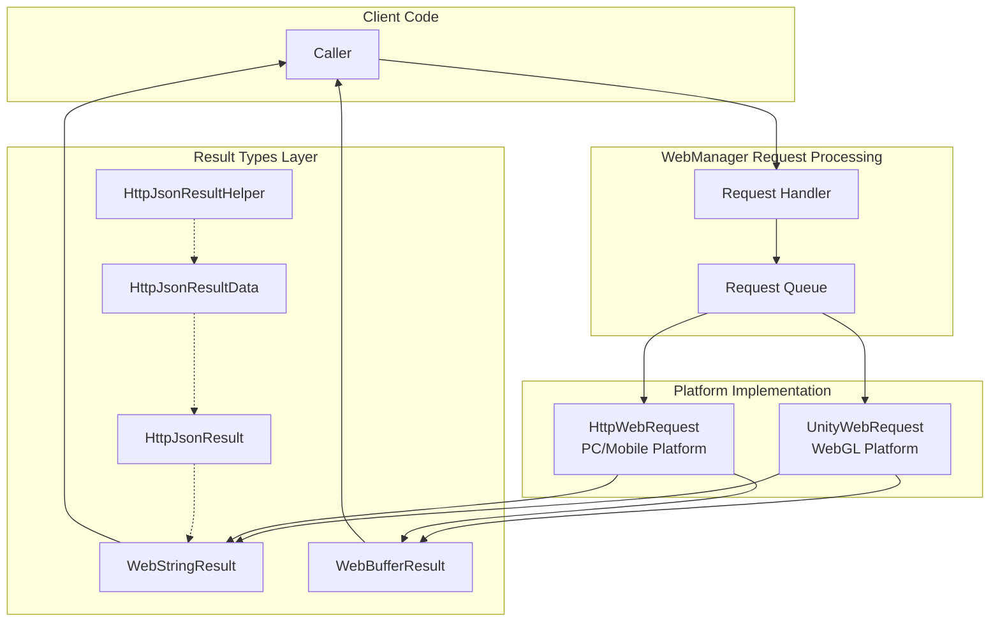

# Request Result Types

GameFrameX Web component provides multiple request result types for encapsulating HTTP response data in different formats. These result types are designed to be simple, following a unified API design pattern, making it convenient for developers to choose the appropriate return type based on business needs.

## Overview

In the GameFrameX Web component, all HTTP request methods return specific result types. Depending on the request method and data format, developers can choose to get string results, byte array results, or parsed JSON data structures.

Request result type design follows these principles:
- **Single Responsibility**: Each result type only encapsulates one specific format of data
- **User Data Passing**: Supports passing context data between request and response through the `UserData` property
- **Exception Handling**: Request failures are communicated through exception mechanisms rather than error codes

## Architecture Design

Request result types play the role of the data encapsulation layer in the overall architecture, responsible for converting low-level HTTP responses into objects directly usable by the business layer.



### Component Responsibilities

| Component | Responsibility |
|-----------|----------------|
| **WebStringResult** | Encapsulates string format response data |
| **WebBufferResult** | Encapsulates binary byte array response data |
| **HttpJsonResult** | Defines standard JSON response structure (Code/Message/Data) |
| **`HttpJsonResultData<T>`** | Generic result wrapper with success flag |
| **HttpJsonResultHelper** | Provides conversion methods from JSON string to result object |

## Core Result Types

### WebStringResult - String Result

`WebStringResult` is used to encapsulate HTTP responses returning string content, suitable for handling plain text, HTML, or unstructured text data scenarios.

```csharp
namespace GameFrameX.Web.Runtime
{
    [UnityEngine.Scripting.Preserve]
    public sealed class WebStringResult
    {
        [UnityEngine.Scripting.Preserve]
        public WebStringResult(object userData, string result)
        {
            UserData = userData;
            Result = result;
        }

        /// <summary>
        /// Gets the string result returned by the request
        /// </summary>
        public string Result { get; }

        /// <summary>
        /// Gets user-defined data; data passed during request is returned as-is
        /// </summary>
        public object UserData { get; }

        public override string ToString()
        {
            return $"[Result]:{Result}";
        }
    }
}
```

> Source: [WebStringResult.cs](https://github.com/GameFrameX/com.gameframex.unity.web/blob/main/Runtime/Web/WebStringResult.cs#L1-L40)

**Property Description:**

| Property | Type | Description |
|----------|------|-------------|
| `Result` | string | String content returned by the HTTP response |
| `UserData` | object | Custom data passed during the request, used to identify request context in callbacks |

### WebBufferResult - Binary Result

`WebBufferResult` is used to encapsulate HTTP responses returning byte arrays, suitable for handling binary data such as images, files, Protocol Buffers, etc.

```csharp
namespace GameFrameX.Web.Runtime
{
    public sealed class WebBufferResult
    {
        public WebBufferResult(object userData, byte[] result)
        {
            UserData = userData;
            Result = result;
        }

        /// <summary>
        /// Request result
        /// </summary>
        public byte[] Result { get; }

        /// <summary>
        /// User-defined data
        /// </summary>
        public object UserData { get; }
    }
}
```

> Source: [WebBufferResult.cs](https://github.com/GameFrameX/com.gameframex.unity.web/blob/main/Runtime/Web/WebBufferResult.cs#L1-L21)

**Property Description:**

| Property | Type | Description |
|----------|------|-------------|
| `Result` | byte[] | Byte array content returned by the HTTP response, can be used for file downloads, image loading, etc. |
| `UserData` | object | Custom data passed during the request |

### HttpJsonResult - JSON Response Structure

`HttpJsonResult` defines a standard JSON response structure, suitable for scenarios requiring parsing of unified server return formats. Many backend APIs return a unified JSON format like `{ "code": 0, "message": "success", "data": {...} }`.

```csharp
using Newtonsoft.Json;

namespace GameFrameX.Web.Runtime
{
    [UnityEngine.Scripting.Preserve]
    public sealed class HttpJsonResult
    {
        /// <summary>
        /// Response code; 0 means success
        /// </summary>
        [JsonProperty(PropertyName = "code")]
        public int Code { get; set; }

        /// <summary>
        /// Response message
        /// </summary>
        [JsonProperty(PropertyName = "message")]
        public string Message { get; set; }

        /// <summary>
        /// Response data.
        /// </summary>
        [JsonProperty(PropertyName = "data")]
        public string Data { get; set; }

        public override string ToString()
        {
            return JsonConvert.SerializeObject(this);
        }
    }
}
```

> Source: [HttpJsonResult.cs](https://github.com/GameFrameX/com.gameframex.unity.web/blob/main/Runtime/Extensions/HttpJsonResult.cs#L1-L34)

**Property Description:**

| Property | Type | JSON Field | Description |
|----------|------|------------|-------------|
| `Code` | int | code | Response status code; 0 indicates success, other values indicate different errors |
| `Message` | string | message | Response description, usually used for error prompts |
| `Data` | string | data | Response data content, in JSON string format |

### `HttpJsonResultData<T>` - Generic Result Wrapper

`HttpJsonResultData<T>` is a generic result type that adds a success flag and typed data property on top of `HttpJsonResult`, making it convenient to get strongly-typed result data directly.

```csharp
namespace GameFrameX.Web.Runtime
{
    public sealed class HttpJsonResultData<T>
    {
        /// <summary>
        /// Whether successful
        /// Indicates whether the request was successfully executed; true means success, false means failure.
        /// </summary>
        public bool IsSuccess { get; set; } = false;

        /// <summary>
        /// Response code
        /// Represents the request processing result; 0 means success, other values represent different error types.
        /// </summary>
        public int Code { get; set; }

        /// <summary>
        /// Data object
        /// Contains data returned when the request succeeds, of type T.
        /// May be default value or null if the request fails.
        /// </summary>
        public T Data { get; set; }
    }
}
```

> Source: [HttpJsonResultData.cs](https://github.com/GameFrameX/com.gameframex.unity.web/blob/main/Runtime/Extensions/HttpJsonResultData.cs#L1-L29)

**Property Description:**

| Property | Type | Description |
|----------|------|-------------|
| `IsSuccess` | bool | Flag indicating whether the request completed successfully |
| `Code` | int | Response status code, consistent with HttpJsonResult.Code |
| `Data` | T | Generic data object, already JSON deserialized |

### HttpJsonResultHelper - JSON Parsing Helper

`HttpJsonResultHelper` provides extension methods to convert JSON strings to strongly-typed `HttpJsonResultData<T>` objects, simplifying the conversion process from raw response to business objects.

```csharp
using System;
using GameFrameX.Runtime;
using Newtonsoft.Json;

namespace GameFrameX.Web.Runtime
{
    public static class HttpJsonResultHelper
    {
        /// <summary>
        /// Converts a JSON string to an HttpJsonResultData&lt;T&gt; object.
        /// This method attempts to deserialize the given JSON string and sets the IsSuccess property based on the HTTP response status code.
        /// If the response is successful, the Data property will contain the deserialized data object; otherwise, Data will be the default value.
        /// </summary>
        /// <typeparam name="T">The type of object to deserialize to; must be a class with a parameterless constructor.</typeparam>
        /// <param name="jsonResult">The JSON string containing the HTTP response.</param>
        /// <returns>An HttpJsonResultData&lt;T&gt; object representing the deserialization result.</returns>
        public static HttpJsonResultData<T> ToHttpJsonResultData<T>(this string jsonResult) where T : class, new()
        {
            HttpJsonResultData<T> resultData = new HttpJsonResultData<T>
            {
                IsSuccess = false,
            };
            try
            {
                var httpJsonResult = JsonConvert.DeserializeObject<HttpJsonResult>(jsonResult);
                if (httpJsonResult.Code != 0)
                {
                    resultData.Code = httpJsonResult.Code;
                    return resultData;
                }

                resultData.IsSuccess = true;
                resultData.Data = string.IsNullOrEmpty(httpJsonResult.Data) ? new T() : JsonConvert.DeserializeObject<T>(httpJsonResult.Data);
            }
            catch (Exception e)
            {
                Log.Error(e);
            }

            return resultData;
        }
    }
}
```

> Source: [HttpJsonResultHelper.cs](https://github.com/GameFrameX/com.gameframex.unity.web/blob/main/Runtime/Extensions/HttpJsonResultHelper.cs#L1-L50)

## Request Flow and Result Processing

When calling IWebManager's request methods, the complete flow from request to result is as follows:

```mermaid
sequenceDiagram
    participant Client as Client Code
    participant QM as WebManager
    participant Queue as Request Queue
    participant Platform as Platform Layer<br/>(UnityWebRequest/HttpWebRequest)
    participant Result as Result Type

    Client->>QM: GetToString(url, userData)
    QM->>Queue: Enqueue(WebJsonData)
    Queue->>Platform: Process Request

    alt Request Success
        Platform->>Result: new WebStringResult(userData, content)
        Result-->>Client: Task&lt;WebStringResult&gt; Complete
    else Request Failed
        Platform->>Client: SetException(Exception)
    end
```

### Result Type Selection Guide

| Scenario | Recommended Result Type | Description |
|----------|------------------------|-------------|
| Get plain text response | `Task<WebStringResult>` | Suitable for HTML, plain text, and other unstructured data |
| Download files/images | `Task<WebBufferResult>` | Suitable for binary data processing |
| Unified JSON API | `WebStringResult` + `HttpJsonResultHelper` | Suitable for standard JSON response formats |
| Strongly-typed JSON data | `WebStringResult` + `HttpJsonResultData<T>` | Suitable for scenarios requiring type safety |

## Usage Examples

### Basic String Request

```csharp
using GameFrameX.Web.Runtime;
using GameFrameX.Runtime;
using System.Threading.Tasks;

public async Task<string> GetStringResult()
{
    IWebManager webManager = GameFrameworkEntry.GetModule<IWebManager>();

    // Send GET request
    var result = await webManager.GetToString("https://api.example.com/text");

    // Get string result
    string content = result.Result;

    // Get custom data passed during request
    object userData = result.UserData;

    return content;
}
```

> Source: [WebManager.cs](https://github.com/GameFrameX/com.gameframex.unity.web/blob/main/Runtime/Web/WebManager.cs#L140-L143)

### Binary Data Request

```csharp
using GameFrameX.Web.Runtime;
using GameFrameX.Runtime;
using System.Threading.Tasks;

public async Task<byte[]> DownloadFile()
{
    IWebManager webManager = GameFrameworkEntry.GetModule<IWebManager>();

    // Send GET request to get byte array
    var result = await webManager.GetToBytes("https://api.example.com/file/image.png");

    // Get binary data
    byte[] data = result.Result;

    return data;
}
```

> Source: [WebManager.cs](https://github.com/GameFrameX/com.gameframex.unity.web/blob/main/Runtime/Web/WebManager.cs#L152-L155)

### JSON Response Parsing

```csharp
using GameFrameX.Web.Runtime;
using GameFrameX.Runtime;
using Newtonsoft.Json;
using System.Threading.Tasks;

// Define response data type
public class UserInfo
{
    [JsonProperty("id")]
    public int Id { get; set; }

    [JsonProperty("name")]
    public string Name { get; set; }

    [JsonProperty("email")]
    public string Email { get; set; }
}

public async Task<UserInfo> GetUserInfo()
{
    IWebManager webManager = GameFrameworkEntry.GetModule<IWebManager>();

    // Get raw JSON string
    var result = await webManager.GetToString("https://api.example.com/user/1");
    string jsonResponse = result.Result;

    // Use helper class to convert to strongly-typed result
    var jsonResult = jsonResponse.ToHttpJsonResultData<UserInfo>();

    // Check if request was successful
    if (jsonResult.IsSuccess)
    {
        return jsonResult.Data;
    }
    else
    {
        Log.Error($"Request failed, error code: {jsonResult.Code}");
        return null;
    }
}
```

> Source: [HttpJsonResultHelper.cs](https://github.com/GameFrameX/com.gameframex.unity.web/blob/main/Runtime/Extensions/HttpJsonResultHelper.cs#L20-L48)

### Request Tracking with UserData

```csharp
using GameFrameX.Web.Runtime;
using GameFrameX.Runtime;
using System.Threading.Tasks;
using System.Collections.Generic;

public class RequestContext
{
    public string RequestId { get; set; }
    public string RequestType { get; set; }
}

public async Task TrackRequestWithUserData()
{
    IWebManager webManager = GameFrameworkEntry.GetModule<IWebManager>();

    // Create request context
    var context = new RequestContext
    {
        RequestId = System.Guid.NewGuid().ToString(),
        RequestType = "UserInfo"
    };

    // Pass context as userData
    var result = await webManager.GetToString(
        "https://api.example.com/user/1",
        context  // Pass custom data
    );

    // Get context info in callback
    var returnedContext = result.UserData as RequestContext;
    if (returnedContext != null)
    {
        Log.Info($"Request {returnedContext.RequestId} completed");
    }
}
```

### Error Handling

When a request fails, exceptions are propagated through the Task exception mechanism. Try-catch handling is needed at the call site:

```csharp
using GameFrameX.Web.Runtime;
using GameFrameX.Runtime;
using System;
using System.IO;
using System.Net;
using System.Threading.Tasks;

public async Task<string> SafeRequest(string url)
{
    IWebManager webManager = GameFrameworkEntry.GetModule<IWebManager>();

    try
    {
        var result = await webManager.GetToString(url);
        return result.Result;
    }
    catch (WebException ex) when (ex.Status == WebExceptionStatus.Timeout)
    {
        Log.Error($"Request timeout: {url} - {ex.Message}");
        throw;
    }
    catch (IOException ex)
    {
        Log.Error($"Network IO error: {url} - {ex.Message}");
        throw;
    }
    catch (Exception ex)
    {
        Log.Error($"Request failed: {url} - {ex.Message}");
        throw;
    }
}
```

> Source: [WebManager.cs](https://github.com/GameFrameX/com.gameframex.unity.web/blob/main/Runtime/Web/WebManager.cs#L298-L324)

## API Reference

### WebStringResult

```csharp
namespace GameFrameX.Web.Runtime
{
    public sealed class WebStringResult
    {
        public WebStringResult(object userData, string result);

        // Properties
        public string Result { get; }
        public object UserData { get; }

        public override string ToString();
    }
}
```

### WebBufferResult

```csharp
namespace GameFrameX.Web.Runtime
{
    public sealed class WebBufferResult
    {
        public WebBufferResult(object userData, byte[] result);

        // Properties
        public byte[] Result { get; }
        public object UserData { get; }
    }
}
```

### HttpJsonResult

```csharp
namespace GameFrameX.Web.Runtime
{
    public sealed class HttpJsonResult
    {
        [JsonProperty("code")]
        public int Code { get; set; }

        [JsonProperty("message")]
        public string Message { get; set; }

        [JsonProperty("data")]
        public string Data { get; set; }
    }
}
```

### `HttpJsonResultData<T>`

```csharp
namespace GameFrameX.Web.Runtime
{
    public sealed class HttpJsonResultData<T>
    {
        public bool IsSuccess { get; set; }
        public int Code { get; set; }
        public T Data { get; set; }
    }
}
```

### HttpJsonResultHelper

```csharp
namespace GameFrameX.Web.Runtime
{
    public static class HttpJsonResultHelper
    {
        public static HttpJsonResultData<T> ToHttpJsonResultData<T>(
            this string jsonResult
        ) where T : class, new();
    }
}
```

## Related Links

- [WebManager Architecture](./05.web-manager) - Learn about WebManager's complete architecture and request processing flow
- [IWebManager Interface](./04.iwebmanager-interface) - View detailed API for all HTTP request methods
- [WebComponent](./08.web-component) - Use WebComponent's convenient wrapper
- [Timeout Settings](./10.timeout-settings) - Configure request timeout
- [Base Data](./07.base-data) - Configure global request parameters