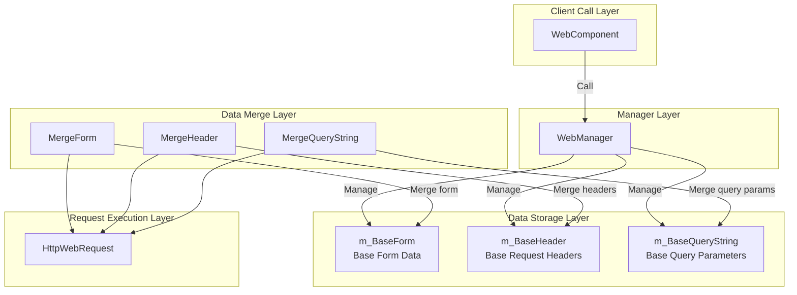
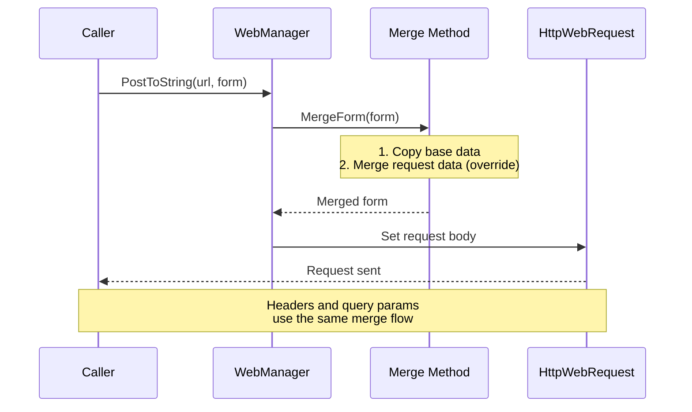
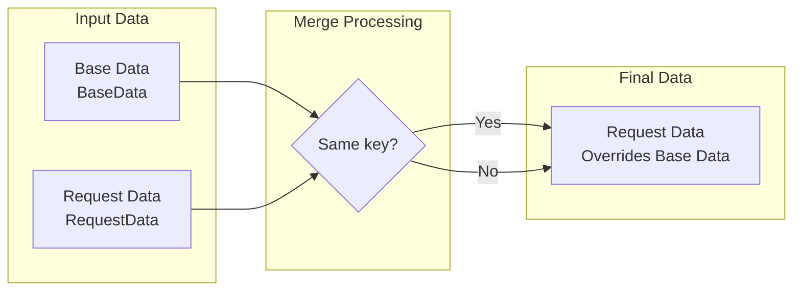

# Base Data Configuration

Base data configuration allows developers to set globally common request parameters, which are automatically appended to all HTTP requests without the need to set them repeatedly for each request.

## Overview

When using WebComponent for HTTP requests, many scenarios require adding common parameters to all requests, such as:

- **Authentication**: API Token, user session ID
- **Application Information**: App version, device platform, channel identifier
- **Common Parameters**: Language settings, region codes

Base data configuration is designed to solve this need. By pre-configuring base data, developers can set these common parameters once, and all subsequent requests will automatically include this data, greatly simplifying code and reducing repetitive work.

### Design Principle

Base data uses a "merge rather than replace" strategy:

1. **Base data** is set once at initialization and lasts throughout the application lifecycle
2. **Request data** is specified separately each time a request is initiated
3. **During merge**: If request data contains keys that are the same as base data, request data will **override** base data
4. This design ensures the convenience of base data while preserving flexibility for individual requests

## Architecture

Base data configuration is one of the core features of WebManager, closely integrated with the request processing flow.



### Component Responsibilities

| Component | Responsibility |
|-----------|----------------|
| WebComponent | Provides Unity component interface, proxies IWebManager calls |
| WebManager | Implements base data management and request merge logic |
| m_BaseForm | Stores global form data dictionary |
| m_BaseHeader | Stores global request headers dictionary |
| m_BaseQueryString | Stores global query parameters dictionary |
| Merge* methods | Execute merging of base data and request data |

## Core Features

WebManager provides three types of base data management:

### 1. Base Form Data

Base form data is added to the POST request body, suitable for common business parameters that need to be sent with requests.

```csharp
// Add base form data
webComponent.AddBaseForm("app_version", "1.0.0");
webComponent.AddBaseForm("platform", "iOS");
webComponent.AddBaseForm("device_id", "ABC123");
```

> Source: [WebManager.cs](https://github.com/GameFrameX/com.gameframex.unity.web/blob/main/Runtime/Web/WebManager.cs#L591-L594)

### 2. Base Request Header Data

Base request header data is added to all HTTP request headers, commonly used for authentication and content negotiation.

```csharp
// Add base request header data
webComponent.AddBaseHeader("Authorization", "Bearer token123");
webComponent.AddBaseHeader("Accept", "application/json");
webComponent.AddBaseHeader("X-Request-ID", Guid.NewGuid().ToString());
```

> Source: [WebManager.cs](https://github.com/GameFrameX/com.gameframex.unity.web/blob/main/Runtime/Web/WebManager.cs#L621-L624)

### 3. Base Query String Data

Base query parameters are appended to the request URL, suitable for common parameters such as API version and language settings.

```csharp
// Add base query string data
webComponent.AddBaseQueryString("v", "2");
webComponent.AddBaseQueryString("lang", "zh-CN");
webComponent.AddBaseQueryString("timestamp", DateTimeOffset.Now.ToUnixTimeSeconds().ToString());
```

> Source: [WebManager.cs](https://github.com/GameFrameX/com.gameframex.unity.web/blob/main/Runtime/Web/WebManager.cs#L651-L654)

### Data Management Methods

Each type of base data provides three management methods:

| Method | Function | Description |
|--------|----------|-------------|
| Add* | Add data | Overwrites if key exists, adds if key does not exist |
| Remove* | Remove data | Silently ignores if the specified key does not exist |
| Clear* | Clear data | Clears all base data of that type at once |

```csharp
// Remove single base data item
webComponent.RemoveBaseForm("device_id");

// Clear all base form data
webComponent.ClearBaseForm();

// Clear all base headers
webComponent.ClearBaseHeader();

// Clear all base query parameters
webComponent.ClearBaseQueryString();
```

> Source: [IWebManager.cs](https://github.com/GameFrameX/com.gameframex.unity.web/blob/main/Runtime/Web/IWebManager.cs#L147-L198)

## Data Merge Flow

When initiating HTTP requests, base data is automatically merged with request parameters. Understanding the merge mechanism helps use this feature better.



### Merge Priority



**Merge Rules**:
- If the request data contains a certain key, its value will **override** the value of the same key in base data
- If the request data does not contain a certain key, the value from base data will be used
- Base data itself is not modified

### Merge Implementation Example

```csharp
/// <summary>
/// Merge form data
/// </summary>
private Dictionary<string, object> MergeForm(Dictionary<string, object> form)
{
    if (m_BaseForm.Count == 0)
    {
        return form;
    }

    // Copy base data
    var result = new Dictionary<string, object>(m_BaseForm);

    // Override/add external data
    if (form != null)
    {
        foreach (var kv in form)
        {
            result[kv.Key] = kv.Value;
        }
    }

    return result;
}
```

> Source: [WebManager.cs](https://github.com/GameFrameX/com.gameframex.unity.web/blob/main/Runtime/Web/WebManager.cs#L685-L705)

## Usage Scenario Examples

### Scenario 1: Initialize Base Data at Application Start

Configure global parameters when starting a game or application:

```csharp
public class GameLauncher : MonoBehaviour
{
    private WebComponent _webComponent;

    private void Start()
    {
        _webComponent = GetComponent<WebComponent>();

        // Configure base query parameters
        _webComponent.AddBaseQueryString("v", "2.0.0");
        _webComponent.AddBaseQueryString("platform", Application.platform.ToString());

        // Configure base headers
        _webComponent.AddBaseHeader("Authorization", $"Bearer {GetAuthToken()}");

        // Configure base form data
        _webComponent.AddBaseForm("app_id", GetAppId());
    }

    private string GetAuthToken() { /* Get Token */ return "token"; }
    private string GetAppId() { /* Get AppID */ return "app123"; }
}
```

### Scenario 2: API Requests Automatically Carry Base Data

After configuration, subsequent requests do not need to manually add these parameters:

```csharp
// Subsequent requests will automatically carry previously set base data
// Final request: POST /api/user/info?v=2.0.0&platform=iOS
//               Header: Authorization: Bearer token123
//               Body: {app_id: "app123", name: "test"}
var result = await _webComponent.PostToString(
    "https://api.example.com/api/user/info",
    new Dictionary<string, object> { { "name", "test" } }
);
```

### Scenario 3: Temporarily Override Base Data

When some requests need different values, simply specify them in the request:

```csharp
// Even though base data sets v=2.0.0, this request uses v=3.0.0
var result = await _webComponent.PostToString(
    "https://api.example.com/api/v3/feature",
    new Dictionary<string, object> { { "name", "test" } },
    new Dictionary<string, string> { { "v", "3.0.0" } } // Override base query parameter
);
```

### Scenario 4: Update Token After User Login

Update authentication information after successful user login:

```csharp
public async Task OnUserLogin(string newToken)
{
    // Remove old Token
    _webComponent.RemoveBaseHeader("Authorization");

    // Add new Token
    _webComponent.AddBaseHeader("Authorization", $"Bearer {newToken}");
}
```

### Scenario 5: Switch API Environment

When switching between development/production environments:

```csharp
public void SwitchEnvironment(bool isProduction)
{
    string baseUrl = isProduction
        ? "https://api.production.com"
        : "https://api.dev.com";

    // Clear and reset base query parameters
    _webComponent.ClearBaseQueryString();
    _webComponent.AddBaseQueryString("env", isProduction ? "prod" : "dev");
    _webComponent.AddBaseQueryString("debug", isProduction ? "false" : "true");
}
```

## API Reference

### IWebManager Interface Methods

The following methods are defined in the `IWebManager` interface, implemented by the `WebManager` class:

#### Form Data Management

| Method | Description |
|--------|-------------|
| `AddBaseForm(string key, object value)` | Add base form data |
| `RemoveBaseForm(string key)` | Remove specified base form data |
| `ClearBaseForm()` | Clear all base form data |

#### Header Management

| Method | Description |
|--------|-------------|
| `AddBaseHeader(string key, string value)` | Add base request header data |
| `RemoveBaseHeader(string key)` | Remove specified base request header data |
| `ClearBaseHeader()` | Clear all base request header data |

#### Query Parameter Management

| Method | Description |
|--------|-------------|
| `AddBaseQueryString(string key, string value)` | Add base query parameter data |
| `RemoveBaseQueryString(string key)` | Remove specified base query parameter data |
| `ClearBaseQueryString()` | Clear all base query parameter data |

> For complete IWebManager interface definition, see [API Reference - IWebManager Interface](./04.iwebmanager-interface).

### WebComponent Proxy Methods

`WebComponent` inherits from `GameFrameworkComponent`, internally holds an `IWebManager` instance, and proxies all base data management method calls. Usage is exactly the same as calling `IWebManager` directly.

> For complete WebComponent documentation, see [API Reference - WebComponent](./08.web-component).

## Related Links

- [Timeout Settings](./10.timeout-settings) - Configure request timeout
- [IWebManager Interface](./04.iwebmanager-interface) - Complete interface definition for Web manager
- [WebComponent](./08.web-component) - Unity component usage instructions
- [Result Types](./06.result-types) - Learn about request return result types