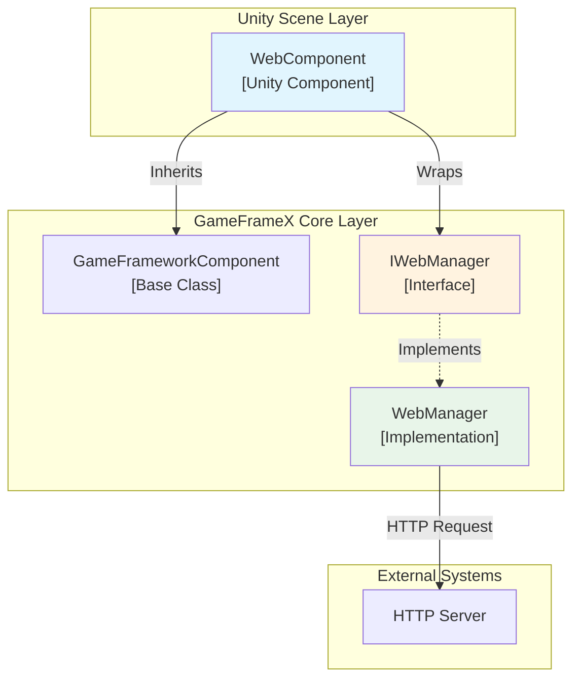
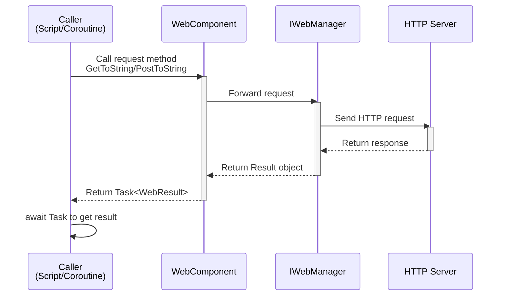
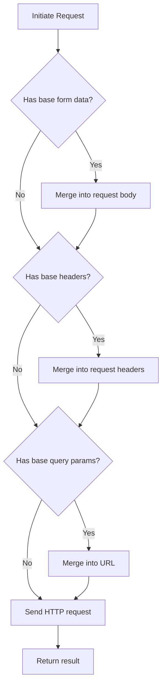

# WebComponent

WebComponent is a Unity component provided by the GameFrameX framework, used to simplify HTTP network request operations in Unity games. This component encapsulates the IWebManager interface and provides Unity-friendly async request methods.

## Overview

WebComponent is a Unity component that inherits from GameFrameworkComponent, designed to provide HTTP network request functionality in Unity scenes. Through this component, developers can easily send GET and POST requests and get string or byte array format response results.

**Main Features:**
- Supports GET and POST requests
- Supports returning string and byte array response formats
- Supports configuring query parameters, request headers, and form data
- Provides timeout control mechanism
- Supports base data configuration, allowing adding common parameters to all requests

## Architecture



**Architecture Description:**
- **WebComponent**: Unity component at scene level, attached to GameObject for use, provides simple API
- **IWebManager**: Interface defining network request functionality
- **WebManager**: Concrete implementation of IWebManager, handles actual HTTP communication

## Core Features

### HTTP Request Methods

WebComponent provides rich HTTP request methods covering GET and POST request types:

#### GET Requests

```csharp
// Basic GET request - returns string
Task<WebStringResult> GetToString(string url, object userData = null)

// GET request with query parameters - returns string
Task<WebStringResult> GetToString(string url, Dictionary<string, string> queryString, object userData = null)

// GET request with query parameters and headers - returns string
Task<WebStringResult> GetToString(string url, Dictionary<string, string> queryString, Dictionary<string, string> header, object userData = null)

// Basic GET request - returns byte array
Task<WebBufferResult> GetToBytes(string url, object userData = null)

// GET request with query parameters - returns byte array
Task<WebBufferResult> GetToBytes(string url, Dictionary<string, string> queryString, object userData = null)

// GET request with query parameters and headers - returns byte array
Task<WebBufferResult> GetToBytes(string url, Dictionary<string, string> queryString, Dictionary<string, string> header, object userData = null)
```

#### POST Requests

```csharp
// Basic POST request - returns string
Task<WebStringResult> PostToString(string url, Dictionary<string, object> from = null, object userData = null)

// POST request with query parameters - returns string
Task<WebStringResult> PostToString(string url, Dictionary<string, object> from, Dictionary<string, string> queryString, object userData = null)

// POST request with query parameters and headers - returns string
Task<WebStringResult> PostToString(string url, Dictionary<string, object> from, Dictionary<string, string> queryString, Dictionary<string, string> header, object userData = null)

// Basic POST request - returns byte array
Task<WebBufferResult> PostToBytes(string url, Dictionary<string, object> from, object userData = null)

// POST request with query parameters - returns byte array
Task<WebBufferResult> PostToBytes(string url, Dictionary<string, object> from, Dictionary<string, string> queryString, object userData = null)

// POST request with query parameters and headers - returns byte array
Task<WebBufferResult> PostToBytes(string url, Dictionary<string, object> from, Dictionary<string, string> queryString, Dictionary<string, string> header, object userData = null)

// POST request sending byte array data - returns byte array
Task<WebBufferResult> PostToBytes(string url, byte[] fromData, Dictionary<string, string> queryString, Dictionary<string, string> header, object userData = null)
```

### Base Data Configuration

WebComponent supports configuring base data, which is automatically added to all requests, suitable for scenarios requiring unified authentication information, version numbers, etc.:

```csharp
// Form data management
void AddBaseForm(string key, object value)
void RemoveBaseForm(string key)
void ClearBaseForm()

// Header management
void AddBaseHeader(string key, string value)
void RemoveBaseHeader(string key)
void ClearBaseHeader()

// Query parameter management
void AddBaseQueryString(string key, string value)
void RemoveBaseQueryString(string key)
void ClearBaseQueryString()
```

### Timeout Configuration

```csharp
// Get or set timeout
public float Timeout
{
    get { return m_WebManager.Timeout; }
    set { m_WebManager.Timeout = m_Timeout = value; }
}
```

> Source: [WebComponent.cs](https://github.com/GameFrameX/com.gameframex.unity.web/blob/main/Runtime/Web/WebComponent.cs#L59-L70)

## Core Flow

### Request Processing Flow



### Base Data Application Flow



## Usage Examples

### Basic GET Request

```csharp
using UnityEngine;
using GameFrameX.Web.Runtime;

public class ExampleScript : MonoBehaviour
{
    private WebComponent webComponent;

    private void Start()
    {
        // Get WebComponent
        webComponent = GetComponent<WebComponent>();

        // Send simple GET request
        _ = GetExample();
    }

    private async void GetExample()
    {
        var result = await webComponent.GetToString("https://api.example.com/data");
        if (!string.IsNullOrEmpty(result.Result))
        {
            Debug.Log($"GET request successful: {result.Result}");
        }
    }
}
```

> Source: [WebComponent.cs](https://github.com/GameFrameX/com.gameframex.unity.web/blob/main/Runtime/Web/WebComponent.cs#L98-L101)

### GET Request with Parameters

```csharp
// GET request with query parameters
private async void GetWithQueryParams()
{
    var queryParams = new Dictionary<string, string>
    {
        { "page", "1" },
        { "limit", "10" }
    };

    var result = await webComponent.GetToString(
        "https://api.example.com/users",
        queryParams
    );
}

// GET request with query parameters and custom headers
private async void GetWithHeaders()
{
    var queryParams = new Dictionary<string, string> { { "id", "123" } };
    var headers = new Dictionary<string, string>
    {
        { "Authorization", "Bearer token123" },
        { "Accept", "application/json" }
    };

    var result = await webComponent.GetToString(
        "https://api.example.com/protected",
        queryParams,
        headers
    );
}
```

> Source: [WebComponent.cs](https://github.com/GameFrameX/com.gameframex.unity.web/blob/main/Runtime/Web/WebComponent.cs#L110-L126)

### POST Request Example

```csharp
// Send POST request with form data
private async void PostExample()
{
    var formData = new Dictionary<string, object>
    {
        { "username", "testuser" },
        { "password", "password123" }
    };

    var result = await webComponent.PostToString(
        "https://api.example.com/login",
        formData
    );

    Debug.Log($"POST response: {result.Result}");
}

// POST request with full parameters
private async void PostWithFullParams()
{
    var formData = new Dictionary<string, object>
    {
        { "title", "Hello World" },
        { "content", "This is a post content" }
    };

    var queryParams = new Dictionary<string, string>
    {
        { "format", "json" }
    };

    var headers = new Dictionary<string, string>
    {
        { "Content-Type", "application/x-www-form-urlencoded" }
    };

    var result = await webComponent.PostToString(
        "https://api.example.com/posts",
        formData,
        queryParams,
        headers
    );
}
```

> Source: [WebComponent.cs](https://github.com/GameFrameX/com.gameframex.unity.web/blob/main/Runtime/Web/WebComponent.cs#L175-L205)

### Using Base Data Configuration

```csharp
// Configure base data in Start
private void Start()
{
    // Add base headers (such as authentication info)
    webComponent.AddBaseHeader("Authorization", "Bearer your-token");
    webComponent.AddBaseHeader("App-Version", "1.0.0");

    // Add base query parameters
    webComponent.AddBaseQueryString("platform", "android");
    webComponent.AddBaseQueryString("language", "zh-CN");
}

// Subsequent requests will automatically carry this base data
private void MakeRequest()
{
    // This request will automatically include:
    // - Authorization: Bearer your-token
    // - App-Version: 1.0.0
    // - platform: android
    // - language: zh-CN
    webComponent.GetToString("https://api.example.com/data");
}

// Clean up base data
private void OnDestroy()
{
    webComponent.ClearBaseHeader();
    webComponent.ClearBaseQueryString();
}
```

> Source: [WebComponent.cs](https://github.com/GameFrameX/com.gameframex.unity.web/blob/main/Runtime/Web/WebComponent.cs#L262-L341)

### Download Binary Data

```csharp
// Download images or other binary data
private async void DownloadImage()
{
    var result = await webComponent.GetToBytes("https://example.com/image.png");

    if (result.Result != null && result.Result.Length > 0)
    {
        // Create Texture2D
        Texture2D texture = new Texture2D(2, 2);
        texture.LoadImage(result.Result);

        // Apply to Sprite
        Sprite sprite = Sprite.Create(
            texture,
            new Rect(0, 0, texture.width, texture.height),
            Vector2.one * 0.5f
        );

        Debug.Log($"Image download successful: {texture.width}x{texture.height}");
    }
}
```

> Source: [WebComponent.cs](https://github.com/GameFrameX/com.gameframex.unity.web/blob/main/Runtime/Web/WebComponent.cs#L136-L139)

## Component Configuration

### Adding in Unity Editor

1. Create an empty GameObject in Unity scene or select a GameObject that needs network functionality
2. Select **Component -> GameFrameX -> Web** menu item
3. WebComponent will be added to the selected GameObject

### Inspector Configuration

The following properties can be configured in the Inspector panel:

| Property | Type | Default | Description |
|----------|------|---------|-------------|
| Timeout | float | 5.0 | Request timeout in seconds |

```csharp
// Timeout setting range in Inspector is 0-120 seconds
// Modify at runtime
webComponent.Timeout = 10f;
```

> Source: [WebComponentInspector.cs](https://github.com/GameFrameX/com.gameframex.unity.web/blob/main/Editor/Inspector/WebComponentInspector.cs#L23-L34)

## API Reference

### Properties

#### `Timeout`

```csharp
public float Timeout { get; set; }
```

Gets or sets the request timeout. When a request exceeds this time without completing, it is automatically terminated.

**Default:** 5.0 seconds

**Range:** 0 - 120 seconds

### Methods

#### GET Request Methods

##### `GetToString(url, userData)`

```csharp
Task<WebStringResult> GetToString(string url, object userData = null)
```

Sends GET request, returns string result.

**Parameters:**
- `url` (string): Request address
- `userData` (object, optional): User-defined data, returned as-is in the result

**Returns:** `Task<WebStringResult>` - Async task containing string result

---

##### `GetToString(url, queryString, userData)`

```csharp
Task<WebStringResult> GetToString(string url, Dictionary<string, string> queryString, object userData = null)
```

Sends GET request with query parameters, returns string result.

**Parameters:**
- `url` (string): Request address
- `queryString` (Dictionary<string, string>): URL query parameter dictionary
- `userData` (object, optional): User-defined data

**Returns:** `Task<WebStringResult>` - Async task containing string result

---

##### `GetToString(url, queryString, header, userData)`

```csharp
Task<WebStringResult> GetToString(string url, Dictionary<string, string> queryString, Dictionary<string, string> header, object userData = null)
```

Sends GET request with query parameters and headers, returns string result.

**Parameters:**
- `url` (string): Request address
- `queryString` (Dictionary<string, string>): URL query parameter dictionary
- `header` (Dictionary<string, string>): HTTP request header dictionary
- `userData` (object, optional): User-defined data

**Returns:** `Task<WebStringResult>` - Async task containing string result

---

##### `GetToBytes(url, userData)`

```csharp
Task<WebBufferResult> GetToBytes(string url, object userData = null)
```

Sends GET request, returns byte array result. Suitable for downloading binary data.

**Parameters:**
- `url` (string): Request address
- `userData` (object, optional): User-defined data

**Returns:** `Task<WebBufferResult>` - Async task containing byte array

---

#### POST Request Methods

##### `PostToString(url, from, userData)`

```csharp
Task<WebStringResult> PostToString(string url, Dictionary<string, object> from = null, object userData = null)
```

Sends POST request, returns string result.

**Parameters:**
- `url` (string): Request address
- `from` (Dictionary<string, object>, optional): Form data dictionary
- `userData` (object, optional): User-defined data

**Returns:** `Task<WebStringResult>` - Async task containing string result

---

##### `PostToString(url, from, queryString, header, userData)`

```csharp
Task<WebStringResult> PostToString(string url, Dictionary<string, object> from, Dictionary<string, string> queryString, Dictionary<string, string> header, object userData = null)
```

Sends POST request with query parameters and headers, returns string result.

**Parameters:**
- `url` (string): Request address
- `from` (Dictionary<string, object>): Form data dictionary
- `queryString` (Dictionary<string, string>): URL query parameter dictionary
- `header` (Dictionary<string, string>): HTTP request header dictionary
- `userData` (object, optional): User-defined data

**Returns:** `Task<WebStringResult>` - Async task containing string result

---

##### `PostToBytes(url, from, userData)`

```csharp
Task<WebBufferResult> PostToBytes(string url, Dictionary<string, object> from, object userData = null)
```

Sends POST request, returns byte array result.

**Parameters:**
- `url` (string): Request address
- `from` (Dictionary<string, object>): Form data dictionary
- `userData` (object, optional): User-defined data

**Returns:** `Task<WebBufferResult>` - Async task containing byte array

---

##### `PostToBytes(url, fromData, queryString, header, userData)`

```csharp
Task<WebBufferResult> PostToBytes(string url, byte[] fromData, Dictionary<string, string> queryString, Dictionary<string, string> header, object userData = null)
```

Sends byte array POST request, returns byte array result. Suitable for file upload scenarios.

**Parameters:**
- `url` (string): Request address
- `fromData` (byte[]): Byte array data to send
- `queryString` (Dictionary<string, string>): URL query parameter dictionary
- `header` (Dictionary<string, string>): HTTP request header dictionary
- `userData` (object, optional): User-defined data

**Returns:** `Task<WebBufferResult>` - Async task containing byte array

---

#### Base Data Management Methods

##### `AddBaseForm(key, value)`

```csharp
void AddBaseForm(string key, object value)
```

Adds base form data, which is added to all POST request forms.

**Parameters:**
- `key` (string): Form key
- `value` (object): Form value

---

##### `RemoveBaseForm(key)`

```csharp
void RemoveBaseForm(string key)
```

Removes specified base form data.

**Parameters:**
- `key` (string): Form key

---

##### `ClearBaseForm()`

```csharp
void ClearBaseForm()
```

Clears all base form data.

---

##### `AddBaseHeader(key, value)`

```csharp
void AddBaseHeader(string key, string value)
```

Adds base request header, which is added to all requests.

**Parameters:**
- `key` (string): Header key
- `value` (string): Header value

---

##### `RemoveBaseHeader(key)`

```csharp
void RemoveBaseHeader(string key)
```

Removes specified base request header.

**Parameters:**
- `key` (string): Header key

---

##### `ClearBaseHeader()`

```csharp
void ClearBaseHeader()
```

Clears all base request headers.

---

##### `AddBaseQueryString(key, value)`

```csharp
void AddBaseQueryString(string key, string value)
```

Adds base query parameter, which is appended to all request URLs.

**Parameters:**
- `key` (string): Query parameter key
- `value` (string): Query parameter value

---

##### `RemoveBaseQueryString(key)`

```csharp
void RemoveBaseQueryString(string key)
```

Removes specified base query parameter.

**Parameters:**
- `key` (string): Query parameter key

---

##### `ClearBaseQueryString()`

```csharp
void ClearBaseQueryString()
```

Clears all base query parameters.

---

## Request Result Types

### WebStringResult

Used to encapsulate string data returned by HTTP requests.

```csharp
public sealed class WebStringResult
{
    // String result returned by the request
    public string Result { get; }

    // User-defined data; data passed during request is returned as-is
    public object UserData { get; }
}
```

> Source: [WebStringResult.cs](https://github.com/GameFrameX/com.gameframex.unity.web/blob/main/Runtime/Web/WebStringResult.cs#L1-L40)

### WebBufferResult

Used to encapsulate byte array data returned by HTTP requests, suitable for binary data such as images and files.

```csharp
public sealed class WebBufferResult
{
    // Request result (byte array)
    public byte[] Result { get; }

    // User-defined data
    public object UserData { get; }
}
```

> Source: [WebBufferResult.cs](https://github.com/GameFrameX/com.gameframex.unity.web/blob/main/Runtime/Web/WebBufferResult.cs#L1-L21)

## Common Questions

### 1. How to handle request timeout?

You can adjust the timeout by setting the `Timeout` property:

```csharp
webComponent.Timeout = 30f; // Set 30 second timeout
```

### 2. How to pass custom data?

All request methods support the `userData` parameter, which is returned as-is in the result, suitable for identifying requests in async callbacks:

```csharp
var result = await webComponent.GetToString(url, "myRequest");
Debug.Log(result.UserData); // Output: myRequest
```

### 3. How to add authentication info?

You can use the base header feature:

```csharp
webComponent.AddBaseHeader("Authorization", "Bearer your-token");
```

## Related Links

- [IWebManager Interface](./04.iwebmanager-interface) - Interface definition for network request manager
- [WebManager Architecture](./05.web-manager) - WebManager internal architecture description
- [Result Types](./06.result-types) - Detailed result type description
- [Timeout Settings](./10.timeout-settings) - Detailed timeout configuration
- [Base Data](./07.base-data) - Base data configuration description