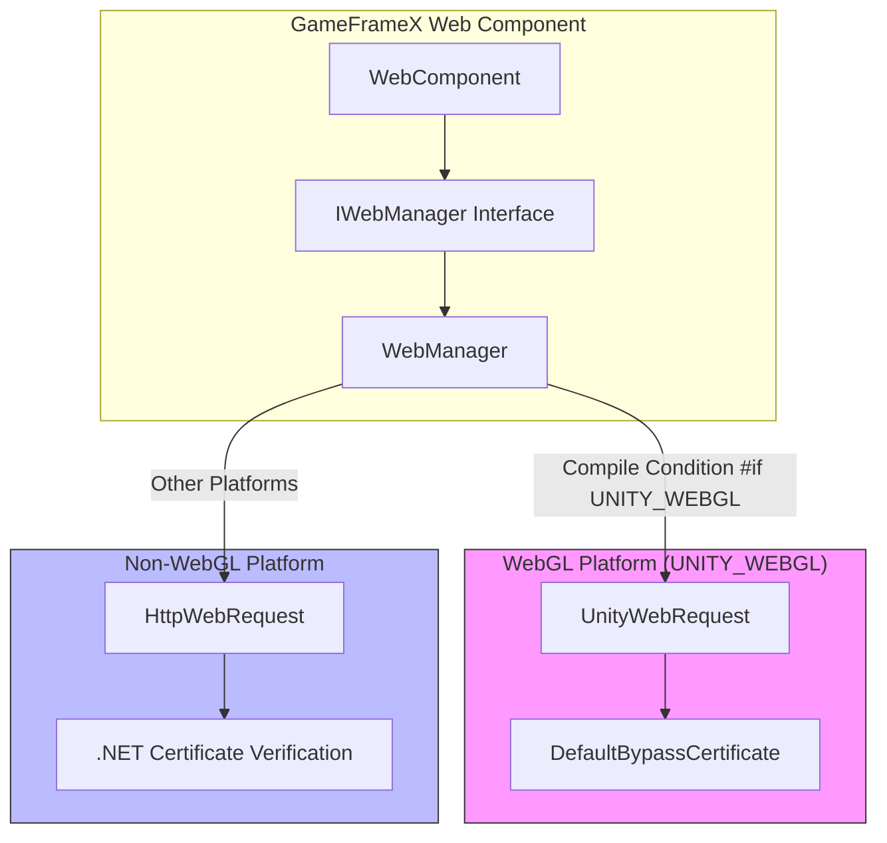
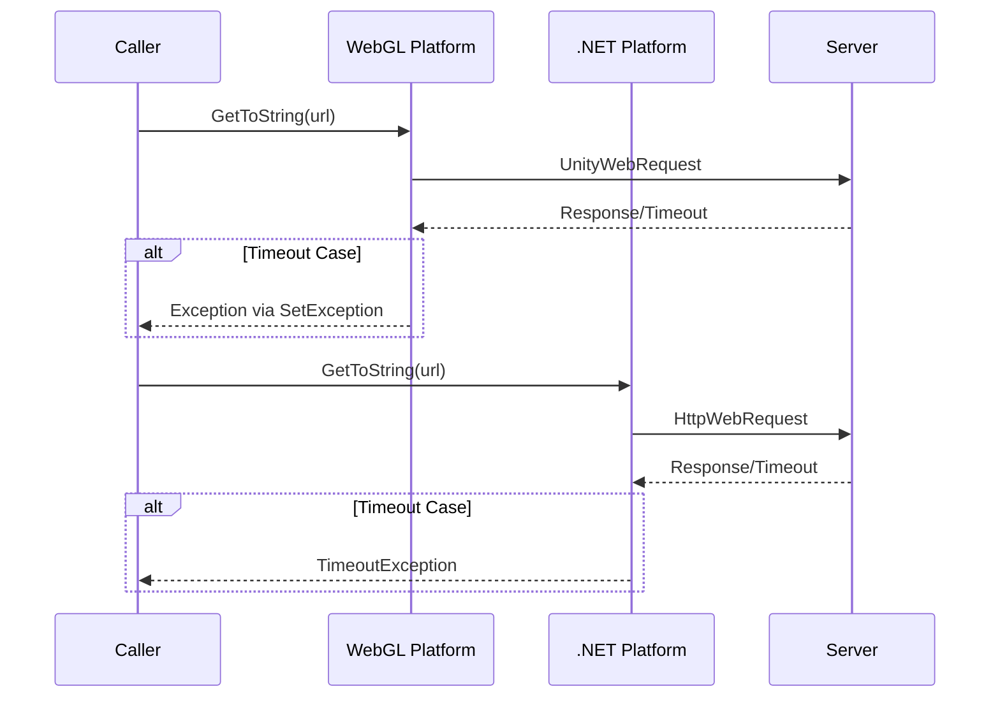

# Platform Differences

This document details the implementation differences of the GameFrameX Web component across different Unity platforms, helping developers understand platform characteristics and use the component correctly.

## Overview

The GameFrameX Web component supports three main platform categories:

- **WebGL Platform**: Suitable for WebGL builds published for browser environments
- **Non-WebGL Platforms**: Including PC (Windows, Mac, Linux), iOS, Android, and other native platforms

These two platform types have fundamental differences in network request implementation mechanisms, mainly in:

| Feature | WebGL Platform | Non-WebGL Platform |
|---------|---------------|-------------------|
| Network Library | UnityWebRequest | System.Net.HttpWebRequest |
| Async Pattern | Callback-based | Async/await |
| Multi-threading Support | Not supported | Supported |
| Certificate Handling | Custom CertificateHandler | .NET standard certificate verification |

## Architecture Differences



### Design Intent

The plugin uses conditional compilation (`#if UNITY_WEBGL`) to implement platform differences. This design brings the following advantages:

1. **Unified Interface**: Upper-layer calling code does not need to care about underlying implementation details
2. **Performance Optimization**: Each platform can use the most suitable network library
3. **Feature Consistency**: Despite different implementations, the exposed APIs are completely consistent

## Core Implementation Differences

### Request Sending Method

**WebGL Platform Implementation:**

On WebGL platform, requests are sent through `UnityWebRequest` using event callbacks for completion notifications.

```csharp
// Source: Runtime/Web/WebManager.cs#L213-L258
#if UNITY_WEBGL
UnityWebRequest unityWebRequest;
if (webJsonData.IsGet)
{
    unityWebRequest = UnityWebRequest.Get(webJsonData.URL);
}
else
{
    unityWebRequest = UnityWebRequest.Post(webJsonData.URL, string.Empty);
}

unityWebRequest.certificateHandler = new DefaultBypassCertificate();
unityWebRequest.timeout = (int)RequestTimeout.TotalSeconds;
// ... Set request headers and body

var asyncOperation = unityWebRequest.SendWebRequest();
asyncOperation.completed += (asyncOperation2) =>
{
    m_SendingNormalList.Remove(webJsonData);
    if (unityWebRequest.isNetworkError || unityWebRequest.isHttpError || unityWebRequest.error != null)
    {
        webJsonData.UniTaskCompletionStringSource.TrySetException(new Exception(unityWebRequest.error));
        return;
    }
    webJsonData.UniTaskCompletionStringSource.SetResult(new WebStringResult(webJsonData.UserData, unityWebRequest.downloadHandler.text));
};
#endif
```

**Non-WebGL Platform Implementation:**

On non-WebGL platforms, requests are sent through `HttpWebRequest`, supporting true async waiting.

```csharp
// Source: Runtime/Web/WebManager.cs#L260-L328
#else
try
{
    HttpWebRequest request = WebRequest.CreateHttp(webJsonData.URL);
    request.Method = webJsonData.IsGet ? WebRequestMethods.Http.Get : WebRequestMethods.Http.Post;
    request.Timeout = (int)RequestTimeout.TotalMilliseconds;
    // ... Set request headers and body

    using (HttpWebResponse response = (HttpWebResponse)await request.GetResponseAsync())
    {
        using (StreamReader reader = new StreamReader(response.GetResponseStream()))
        {
            string content = await reader.ReadToEndAsync();
            webJsonData.UniTaskCompletionStringSource.SetResult(new WebStringResult(webJsonData.UserData, content));
        }
    }
}
catch (WebException e)
{
    if (e.Status == WebExceptionStatus.Timeout)
    {
        webJsonData.UniTaskCompletionStringSource.SetException(new TimeoutException(e.Message));
        return;
    }
    webJsonData.UniTaskCompletionStringSource.SetException(e);
}
finally
{
    m_SendingNormalList.Remove(webJsonData);
}
#endif
```

### Certificate Handling Differences

**WebGL Platform:**

WebGL platform uses a custom certificate handler to bypass certificate verification, which is very useful for development debugging and self-signed certificate environments.

```csharp
// Source: Runtime/Web/DefaultBypassCertificate.cs
public sealed class DefaultBypassCertificate : CertificateHandler
{
    protected override bool ValidateCertificate(byte[] certificateData)
    {
        return true;
    }
}
```

> Source: [DefaultBypassCertificate.cs](https://github.com/GameFrameX/com.gameframex.unity.web/blob/main/Runtime/Web/DefaultBypassCertificate.cs#L41-L44)

WebGL platform applies this certificate handler when creating requests:

```csharp
// Source: Runtime/Web/WebManager.cs#L224
unityWebRequest.certificateHandler = new DefaultBypassCertificate();
```

**Non-WebGL Platform:**

Non-WebGL platforms use .NET standard certificate verification mechanism, providing more secure HTTPS protection in production environments.

### Timeout Handling Differences



The two platforms handle timeout exceptions slightly differently:

- **WebGL**: Detects timeout and other errors by checking `unityWebRequest.error`
- **Non-WebGL**: Catches `WebExceptionStatus.Timeout` exception and converts it to `TimeoutException`

## Usage Notes for Each Platform

### WebGL Platform

1. **Single-threaded limitation**: WebGL does not support multi-threading; all network requests are processed through callbacks on the main thread
2. **Cross-origin requests (CORS)**: Browser environments enforce same-origin policy; ensure server correctly configures CORS headers
3. **HTTPS Certificate**: Uses default certificate bypass handler; consider replacement for production environments
4. **Async Pattern**: Although the interface returns `Task`, the internal implementation is callback-based

### Non-WebGL Platforms (PC/iOS/Android)

1. **True async support**: Uses .NET's `async/await` pattern, truly non-blocking
2. **Standard certificate verification**: Uses system default certificate verification mechanism, more secure and reliable
3. **Timeout precision**: Uses millisecond-level timeout control
4. **Connection pool management**: Controls concurrent connection count through `MaxConnectionPerServer` configuration

## Platform Detection and Conditional Compilation

During development, if you need to execute different logic based on platform, you can use the following:

```csharp
#if UNITY_WEBGL
    // WebGL platform specific code
    Debug.Log("Running on WebGL platform");
#else
    // Other platform code
    Debug.Log("Running on native platform");
#endif
```

### Scripting Define Symbols

The plugin provides two scripting define symbols for debugging:

| Symbol | Description |
|--------|-------------|
| `ENABLE_GAMEFRAMEX_WEB_SEND_LOG` | Enable request sending logs |
| `ENABLE_GAMEFRAMEX_WEB_RECEIVE_LOG` | Enable response receiving logs |

> Source: [WebLogScriptingDefineSymbols.cs](https://github.com/GameFrameX/com.gameframex.unity.web/blob/main/Editor/WebLogScriptingDefineSymbols.cs#L42-L43)

These logs can be quickly toggled via Unity menu `GameFrameX/Scripting Define Symbols`.

## Common Platform Issues

### WebGL Platform CORS Error

**Problem**: Browser console shows "Access to fetch ... has been blocked by CORS policy"

**Solution**:
1. Ensure server correctly sets CORS response headers:
   ```
   Access-Control-Allow-Origin: *
   Access-Control-Allow-Methods: GET, POST, OPTIONS
   Access-Control-Allow-Headers: Content-Type, Authorization
   ```
2. Server needs to handle OPTIONS preflight requests

### Timeout Setting Not Taking Effect

**Problem**: Set timeout seems invalid on WebGL platform

**Cause Analysis**:
- WebGL platform's `UnityWebRequest.timeout` property sets integer seconds
- Non-WebGL platforms use millisecond precision

**Recommendation**: Use longer timeout on WebGL platform (recommend 10+ seconds)

### HTTPS Certificate Warning

**Problem**: Certificate warning when requesting HTTPS address on WebGL platform

**Cause**: Default certificate bypass handler is used

**Solution**: For production environments, implement custom `CertificateHandler` for actual certificate verification

## Related Links

- [Plugin Introduction](./01.overview)
- [Getting Started](./03.getting-started)
- [WebComponent](./08.web-component)
- [IWebManager Interface](./04.iwebmanager-interface)
- [Timeout Settings](./10.timeout-settings)
- [Troubleshooting](./11.troubleshooting)