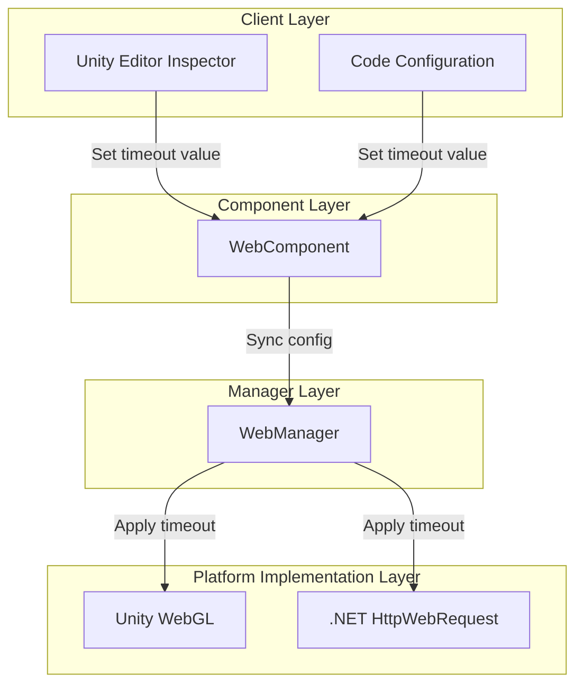
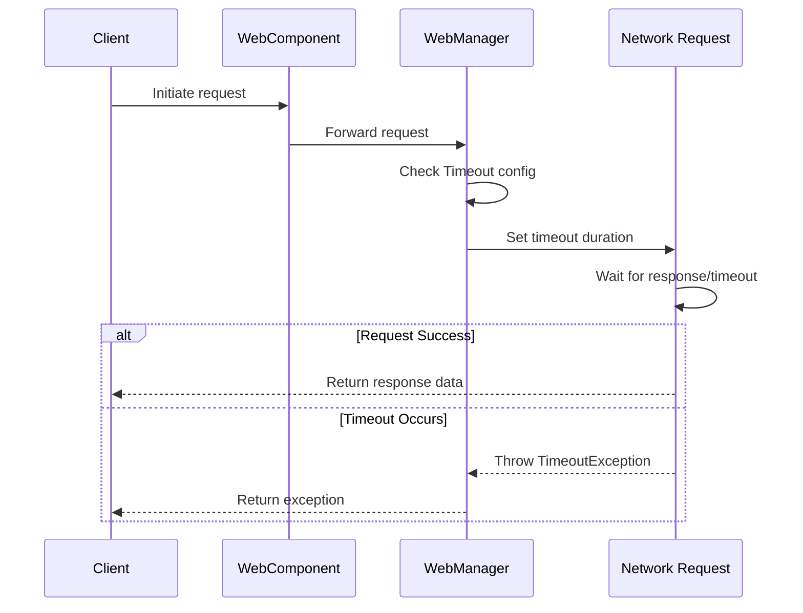

# Timeout Settings

Configure the timeout duration for HTTP requests, controlling the maximum waiting time for network requests.

## Overview

Timeout configuration is an important part of the Web request module, used to prevent network requests from waiting indefinitely. When a request does not complete within the specified time, the system automatically terminates the request and throws a `TimeoutException`.

Timeout configuration uses unified time units (seconds), automatically converted to the appropriate format for different platforms:
- Unity WebGL: Converted to integer seconds
- .NET Platform: Converted to integer milliseconds

### Core Functions of Timeout Configuration

1. **Prevent infinite waiting**: Avoid client from being permanently blocked when server is unresponsive
2. **Improve user experience**: Fast failure mechanism allows users to perform other operations
3. **Resource protection**: Timely release of network connections and other resources

## Architecture Design



### Layer Responsibilities

| Layer | Component | Responsibility |
|-------|-----------|----------------|
| Client Layer | Inspector / Code | Provides UI and code interface for timeout configuration |
| Component Layer | WebComponent | Exposes Timeout property, syncs config to manager |
| Manager Layer | WebManager | Stores timeout value, calculates RequestTimeout |
| Platform Implementation Layer | UnityWebRequest / HttpWebRequest | Actually applies timeout to network requests |

## Configuration Methods

### Configure via Unity Inspector

After adding WebComponent to a Unity scene, you can set the timeout through a slider in the Inspector panel.

> Source: [WebComponentInspector.cs](https://github.com/GameFrameX/com.gameframex.unity.web/blob/main/Editor/Inspector/WebComponentInspector.cs#L22-L34)

```csharp
float timeout = EditorGUILayout.Slider("Timeout", m_Timeout.floatValue, 0f, 120f);
if (timeout != m_Timeout.floatValue)
{
    if (EditorApplication.isPlaying)
    {
        t.Timeout = timeout;
    }
    else
    {
        m_Timeout.floatValue = timeout;
    }
}
```

Inspector configuration features:
- Range: 0 to 120 seconds
- Supports dynamic modification at runtime
- Changes in preview mode are saved to serialized fields

### Configure via Code

#### Configure on WebComponent

> Source: [WebComponent.cs](https://github.com/GameFrameX/com.gameframex.unity.web/blob/main/Runtime/Web/WebComponent.cs#L59-L70)

```csharp
[SerializeField] [Tooltip("Timeout. Unit: seconds")]
private float m_Timeout = 5f;

public float Timeout
{
    get { return m_WebManager.Timeout; }
    set { m_WebManager.Timeout = m_Timeout = value; }
}
```

Usage example:

```csharp
// Get WebComponent
var webComponent = GetComponent<WebComponent>();
// Set timeout to 10 seconds
webComponent.Timeout = 10f;
```

#### Configure directly on WebManager

> Source: [WebManager.cs](https://github.com/GameFrameX/com.gameframex.unity.web/blob/main/Runtime/Web/WebManager.cs#L55-L66)

```csharp
public float Timeout
{
    get { return m_Timeout; }
    set
    {
        m_Timeout = value;
        RequestTimeout = TimeSpan.FromSeconds(value);
    }
}
```

Usage example:

```csharp
// Get WebManager via GameFrameworkEntry
var webManager = GameFrameworkEntry.GetModule<IWebManager>();
// Set timeout to 10 seconds
webManager.Timeout = 10f;
```

## Timeout Processing Mechanism

### Request Processing Flow



### Timeout Exception Handling

#### .NET Platform

> Source: [WebManager.cs](https://github.com/GameFrameX/com.gameframex.unity.web/blob/main/Runtime/Web/WebManager.cs#L298-L305)

```csharp
catch (WebException e)
{
    // Catch timeout exception
    if (e.Status == WebExceptionStatus.Timeout)
    {
        webJsonData.UniTaskCompletionStringSource.SetException(new TimeoutException(e.Message));
        return;
    }
    // Handle other exceptions...
}
```

#### Unity WebGL Platform

Unity WebGL platform determines timeout via `UnityWebRequest.isNetworkError` property:

```csharp
if (unityWebRequest.isNetworkError || unityWebRequest.isHttpError || unityWebRequest.error != null)
{
    // Timeout is also classified as network error
    webJsonData.UniTaskCompletionStringSource.TrySetException(new Exception(unityWebRequest.error));
    return;
}
```

### Timeout Exception Capture Example

```csharp
try
{
    var result = await webComponent.GetToString("https://api.example.com/data");
    Debug.Log($"Request successful: {result.Text}");
}
catch (TimeoutException ex)
{
    Debug.LogError($"Request timeout: {ex.Message}");
    // Retry logic can be implemented here
}
catch (Exception ex)
{
    Debug.LogError($"Request failed: {ex.Message}");
}
```

## Configuration Options

| Option | Type | Default | Description |
|--------|------|---------|-------------|
| `Timeout` | float | 5f | Timeout in seconds. Set to 0 for no timeout (uses system default) |
| `RequestTimeout` | TimeSpan | 00:00:05 | TimeSpan format timeout used internally |

### Timeout Recommendations

| Scenario | Recommended Timeout | Description |
|----------|--------------------|-------------|
| Regular REST API | 10-30 seconds | Consider network latency and server processing time |
| File upload/download | 60-120 seconds | Large files need more time |
| Real-time communication | 5-10 seconds | Needs fast response |
| Local debugging | 5 seconds | Fast failure, fast retry |

### Impact of Different Timeout Values

```mermaid
flowchart TD
    Start[Set Timeout Value] --> Check{Timeout too short?}

    Check -->|Short (<3s)| TooShort[May cause:<br/>- Normal requests terminated<br/>- High failure rate on mobile]
    Check -->|Appropriate (5-30s)| Optimal[Best balance:<br/>- Sufficient response time<br/>- No excessive waiting]
    Check -->|Long (>60s)| TooLong[May cause:<br/>- Poor user experience<br/>- Increased resource usage<br/>- Difficult to identify problems]

    TooShort --> End1[Recommended adjustment]
    Optimal --> End2[Recommended for use]
    TooLong --> End3[Recommended adjustment]
```

## Platform Differences

### Unity WebGL

```csharp
// Timeout set to integer seconds
unityWebRequest.timeout = (int)RequestTimeout.TotalSeconds;
```

Characteristics:
- Timeout value must be integer
- Minimum value is 1 second
- Value 0 means using Unity default timeout

### .NET Platform

```csharp
// Timeout set to integer milliseconds
request.Timeout = (int)RequestTimeout.TotalMilliseconds;
```

Characteristics:
- Timeout value is in milliseconds
- Minimum is 1 millisecond, but recommend not lower than 500 milliseconds

## Best Practices

### 1. Set Reasonable Timeout

Set appropriate timeout based on actual business scenarios and network environment:

```csharp
// Adjust timeout based on environment
#if UNITY_ANDROID
// Mobile network environment, slightly longer timeout
webComponent.Timeout = 30f;
#else
// WiFi environment, can use shorter timeout
webComponent.Timeout = 10f;
#endif
```

### 2. Implement Retry Mechanism

Implement request retry with timeout:

```csharp
private async Task<WebStringResult> RequestWithRetry(string url, int maxRetries = 3)
{
    for (int i = 0; i < maxRetries; i++)
    {
        try
        {
            return await webComponent.GetToString(url);
        }
        catch (TimeoutException)
        {
            if (i == maxRetries - 1) throw;
            Debug.LogWarning($"Request timeout, retrying ({i + 1}/{maxRetries})...");
            await Task.Delay(1000 * (i + 1)); // Exponential backoff
        }
    }
    throw new Exception("Retry attempts exhausted");
}
```

### 3. Dynamic Adjustment at Runtime

You can adjust timeout at runtime as needed:

```csharp
// Adjust timeout for specific request
var originalTimeout = webComponent.Timeout;
try
{
    // Large file download needs longer timeout
    webComponent.Timeout = 120f;
    var result = await webComponent.GetToBytes("https://example.com/largefile.zip");
}
finally
{
    // Restore original timeout
    webComponent.Timeout = originalTimeout;
}
```

## Related Links

- [WebComponent](./08.web-component)
- [IWebManager Interface](./04.iwebmanager-interface)
- [WebManager Architecture](./05.web-manager)
- [Base Data](./07.base-data)
- [Platform Differences](./09.platform-differences)