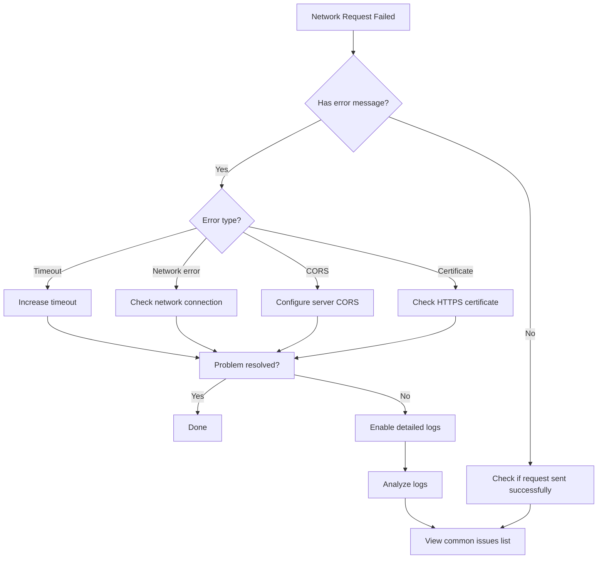

# Troubleshooting

This document summarizes common issues, cause analysis, and corresponding solutions encountered during use of the GameFrameX Unity Web plugin.

## Overview

GameFrameX Web component is a high-performance Unity HTTP network request library supporting GET and POST requests, capable of handling strings, JSON, binary data and other formats. In actual use, developers often encounter some problems; this document will help you quickly locate and resolve these issues.

## Common Issues List

### 1. WebGL Platform Request Failure

**Problem Description**:
When sending network requests on WebGL platform, requests have no response or report errors directly.

**Possible Causes**:
- WebGL platform has cross-origin restrictions
- Server not correctly configured with CORS headers
- WebGL does not support multi-threading; all requests are processed on main thread

**Solutions**:

1. **Ensure server configures CORS**
   Server needs to return the following CORS response headers:
   ```http
   Access-Control-Allow-Origin: *
   Access-Control-Allow-Methods: GET, POST, OPTIONS
   Access-Control-Allow-Headers: Content-Type, Authorization
   ```

2. **Handle OPTIONS preflight requests**
   For non-simple requests (with custom headers or Content-Type not application/x-www-form-urlencoded), server must support OPTIONS preflight requests.

3. **Use async await instead of blocking calls**
   WebGL does not support multi-threading; recommended to use `await` async waiting instead of `.Wait()` or `.Result` blocking calls:

   ```csharp
   // Recommended: async wait
   private async void Start()
   {
       var webManager = GameFrameworkEntry.GetModule<IWebManager>();
       var result = await webManager.GetToString("https://api.example.com/data");
       Debug.Log(result.Result);
   }

   // Avoid: blocking calls (will deadlock on WebGL)
   private void Start()
   {
       var webManager = GameFrameworkEntry.GetModule<IWebManager>();
       var result = webManager.GetToString("https://api.example.com/data").Result; // Causes deadlock
   }
   ```

---

### 2. Request Timeout

**Problem Description**:
Network request has no response for a long time, eventually throws timeout exception.

**Possible Causes**:
- Network connection unstable or unreachable
- Server response is slow
- Timeout setting is too short

**Solutions**:

1. **Adjust timeout**

   ```csharp
   // Method 1: Set timeout via WebComponent
   var webComponent = gameObject.GetOrAddComponent<WebComponent>();
   webComponent.Timeout = 60f; // Set to 60 seconds

   // Method 2: Set timeout via IWebManager interface
   var webManager = GameFrameworkEntry.GetModule<IWebManager>();
   webManager.Timeout = 60f; // Set to 60 seconds
   ```

   > Source: [WebComponent.cs](https://github.com/GameFrameX/com.gameframex.unity.web/blob/main/Runtime/Web/WebComponent.cs#L66-L70)

2. **Implement retry mechanism**

   ```csharp
   public async Task<T> RetryRequest<T>(Func<Task<T>> requestFunc, int maxRetries = 3)
   {
       for (int i = 0; i < maxRetries; i++)
       {
           try
           {
               return await requestFunc();
           }
           catch (TimeoutException)
           {
               if (i == maxRetries - 1) throw;
               await Task.Delay(1000 * (i + 1)); // Exponential backoff
           }
       }
       throw new Exception("Retry attempts exhausted");
   }
   ```

3. **Enable detailed logs for troubleshooting**
   Enabling logs helps locate timeout causes:

   - Select **GameFrameX -> Scripting Define Symbols -> Enable Web Send Logs** in Unity menu to enable send logs
   - Select **GameFrameX -> Scripting Define Symbols -> Enable Web Receive Logs** to enable receive logs

---

### 3. HTTPS Certificate Verification Failure

**Problem Description**:
When sending HTTPS requests on mobile devices, certificate verification failure error occurs.

**Possible Causes**:
- Device time is incorrect
- Server certificate expired or invalid
- Self-signed certificate
- Incomplete certificate chain

**Solutions**:

1. **Use default certificate bypass (for development/testing only)**

   Plugin has built-in `DefaultBypassCertificate` class to bypass certificate verification:

   ```csharp
   // Plugin automatically handles this; no manual configuration needed unless necessary
   unityWebRequest.certificateHandler = new DefaultBypassCertificate();
   ```

   > Source: [WebManager.cs](https://github.com/GameFrameX/com.gameframex.unity.web/blob/main/Runtime/Web/WebManager.cs#L224)

2. **Production environment recommendations**
   - Ensure server uses valid certificate issued by trusted CA
   - Mobile device time settings are correct
   - Remove certificate bypass code when officially releasing

---

### 4. Request Queue Blocked

**Problem Description**:
After sending multiple requests, some requests are stuck in waiting state with no response for a long time.

**Possible Causes**:
- Concurrent connection limit (`MaxConnectionPerServer` default is 8)
- Request queue is full
- Previous requests are blocked

**Solutions**:

1. **Adjust concurrent connection count**

   ```csharp
   var webManager = GameFrameworkEntry.GetModule<IWebManager>();
   // Set to 16 concurrent connections
   ((WebManager)webManager).MaxConnectionPerServer = 16;
   ```

   > Source: [WebManager.cs](https://github.com/GameFrameX/com.gameframex.unity.web/blob/main/Runtime/Web/WebManager.cs#L71)

2. **Design requests reasonably**
   - Distinguish high-priority and low-priority requests
   - Large file downloads use separate connections
   - Batch requests sent in batches

---

### 5. Base Data Not Taking Effect

**Problem Description**:
Base data set via `AddBaseForm`, `AddBaseHeader` and other methods is not included in actual requests.

**Possible Causes**:
- Base data not correctly added before request is sent
- Added then cleared
- Merge logic issue

**Solutions**:

1. **Ensure base data is added before request**

   ```csharp
   var webManager = GameFrameworkEntry.GetModule<IWebManager>();

   // Add base headers (automatically included with each request)
   webManager.AddBaseHeader("Authorization", "Bearer your-token");
   webManager.AddBaseHeader("X-App-Version", "1.0.0");

   // Add base form data
   webManager.AddBaseForm("platform", "android");
   webManager.AddBaseForm("deviceId", SystemInfo.deviceUniqueIdentifier);

   // Add base query parameters
   webManager.AddBaseQueryString("lang", "zh-CN");

   // Send request
   var result = await webManager.GetToString("https://api.example.com/data");
   ```

   > Source: [IWebManager.cs](https://github.com/GameFrameX/com.gameframex.unity.web/blob/main/Runtime/Web/IWebManager.cs#L147-L198)

2. **Check if data was accidentally cleared**

   Ensure the following methods are not called:
   - `ClearBaseForm()` - Clear base form
   - `ClearBaseHeader()` - Clear base headers
   - `ClearBaseQueryString()` - Clear base query parameters

---

### 6. Return Result Parsing Error

**Problem Description**:
Request returns successfully, but exception occurs when parsing response data.

**Possible Causes**:
- Response data format does not match expectation
- JSON serialization/deserialization failed
- Data is empty or null

**Solutions**:

1. **Handle return results correctly**

   ```csharp
   var webManager = GameFrameworkEntry.GetModule<IWebManager>();
   var result = await webManager.GetToString("https://api.example.com/data");

   // Check for errors
   if (result != null && !string.IsNullOrEmpty(result.Result))
   {
       try
       {
           var data = JsonUtility.FromJson<MyDataClass>(result.Result);
           Debug.Log($"Parse successful: {data.name}");
       }
       catch (Exception e)
       {
           Debug.LogError($"JSON parse failed: {e.Message}");
       }
   }
   else
   {
       Debug.LogWarning("Response data is empty");
   }
   ```

   > Source: [WebStringResult.cs](https://github.com/GameFrameX/com.gameframex.unity.web/blob/main/Runtime/Web/WebStringResult.cs#L15-L38)

2. **Use byte array to receive binary data**

   ```csharp
   var bufferResult = await webManager.GetToBytes("https://api.example.com/file");
   if (bufferResult != null && bufferResult.Result != null)
   {
       byte[] data = bufferResult.Result;
       Debug.Log($"Received data size: {data.Length} bytes");
   }
   ```

   > Source: [WebBufferResult.cs](https://github.com/GameFrameX/com.gameframex.unity.web/blob/main/Runtime/Web/WebBufferResult.cs#L1-L20)

---

### 7. Platform Differences Causing Inconsistent Behavior

**Problem Description**:
Same request works fine on Editor/PC but fails on WebGL or mobile platforms.

**Possible Causes**:
- Different platforms use different network libraries
- WebGL uses `UnityWebRequest`, other platforms use `HttpWebRequest`
- Platform-specific feature limitations

**Solutions**:

1. **Understand platform differences**

   ```csharp
   // WebGL platform uses UnityWebRequest
   #if UNITY_WEBGL
       UnityWebRequest unityWebRequest;
       // WebGL specific implementation
   #else
       // Other platforms use HttpWebRequest
       HttpWebRequest request = WebRequest.CreateHttp(url);
   #endif
   ```

   > Source: [WebManager.cs](https://github.com/GameFrameX/com.gameframex.unity.web/blob/main/Runtime/Web/WebManager.cs#L213-L329)

2. **Use conditional compilation for platform-specific code**

   ```csharp
   public async Task<string> GetDataAsync(string url)
   {
       try
       {
           return await webManager.GetToString(url);
       }
       catch (Exception e)
       {
   #if UNITY_WEBGL
           // WebGL specific error handling
           Debug.LogError($"WebGL error: {e.Message}");
   #else
           // Other platform error handling
           Debug.LogError($"Network error: {e.Message}");
   #endif
           throw;
       }
   }
   ```

---

### 8. Debugging Tips

**Problem Description**:
Need to troubleshoot network request issues but don't know how to get detailed information.

**Solutions**:

1. **Enable detailed logs**

   In Unity editor:
   - Menu: **GameFrameX -> Scripting Define Symbols -> Enable Web Send Logs**
   - Menu: **GameFrameX -> Scripting Define Symbols -> Enable Web Receive Logs**

   Log macros:
   ```csharp
   // Send logs
   #if ENABLE_GAMEFRAMEX_WEB_SEND_LOG
       Log.Debug($"Web Request: {webJsonData.URL} \n Header: {...}");
   #endif

   // Receive logs
   #if ENABLE_GAMEFRAMEX_WEB_RECEIVE_LOG
       Log.Debug($"Web Response: {webJsonData.URL} \n Content: {...}");
   #endif
   ```

   > Source: [WebLogScriptingDefineSymbols.cs](https://github.com/GameFrameX/com.gameframex.unity.web/blob/main/Editor/WebLogScriptingDefineSymbols.cs#L42-L79)

2. **Enable debugging in Player Settings**
   - Open **Edit -> Project Settings -> Player**
   - Check **Development Build**
   - Check **Script Debugging**

3. **Use Unity Profiler to monitor network**
   - Open **Window -> Analysis -> Profiler**
   - Add **Network** panel to monitor network requests

---

### 9. Request Returns Exception Types

**Problem Description**:
Not sure which exception types are thrown when request fails.

**Solutions**:

The plugin throws the following exceptions based on different error conditions:

| Exception Type | Trigger Condition | Handling Recommendation |
|---------------|-------------------|------------------------|
| `TimeoutException` | Request timeout | Increase timeout or check network |
| `WebException` | Network error | Check network connection and server status |
| `IOException` | IO error | Check data read/write issues |
| `Exception` | Other errors | View specific error information |

```csharp
try
{
    var result = await webManager.GetToString(url);
}
catch (TimeoutException ex)
{
    Debug.LogError($"Request timeout: {ex.Message}");
}
catch (WebException ex)
{
    Debug.LogError($"Network error: {ex.Message}, status: {ex.Status}");
}
catch (IOException ex)
{
    Debug.LogError($"IO error: {ex.Message}");
}
catch (Exception ex)
{
    Debug.LogError($"Unknown error: {ex.Message}");
}
```
> Source: [WebManager.cs](https://github.com/GameFrameX/com.gameframex.unity.web/blob/main/Runtime/Web/WebManager.cs#L298-L324)

---

## Diagnostic Flowchart



---

## Related Links

- [Plugin Introduction](./01.overview)
- [Installation](./02.installation)
- [Getting Started](./03.getting-started)
- [Using WebComponent](./08.web-component)
- [WebManager Architecture](./05.web-manager)
- [Result Types](./06.result-types)
- [IWebManager Interface](./04.iwebmanager-interface)
- [WebComponent](./08.web-component)
- [Timeout Settings](./10.timeout-settings)
- [Base Data](./07.base-data)
- [Platform Differences](./09.platform-differences)